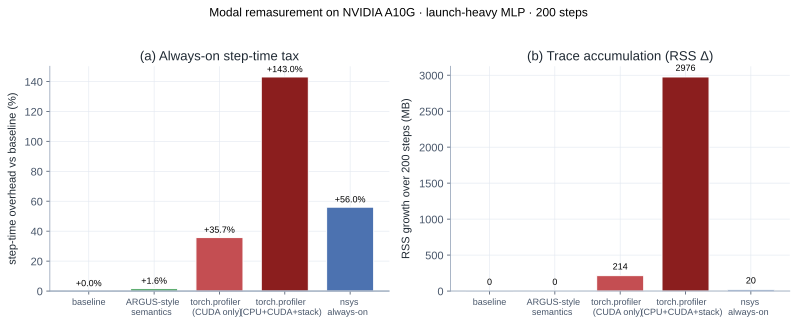
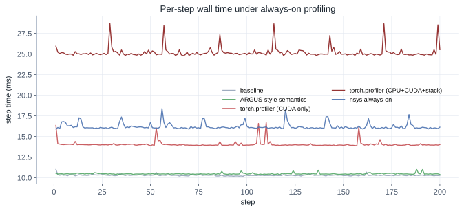
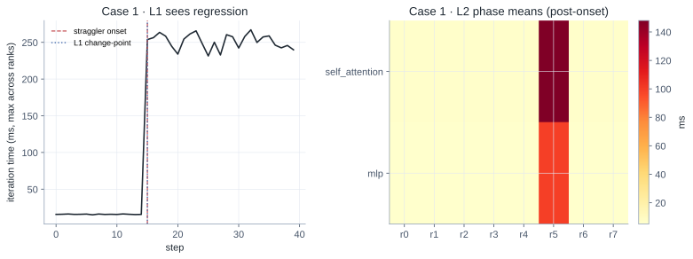
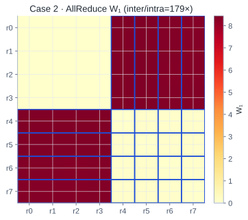
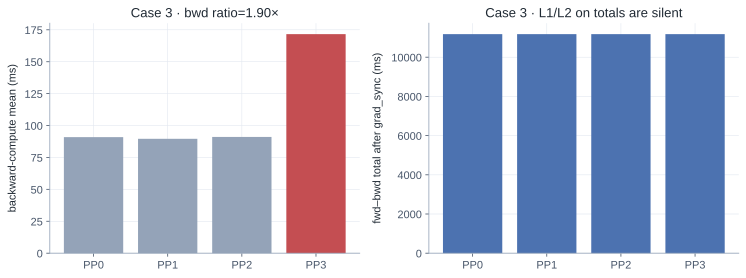
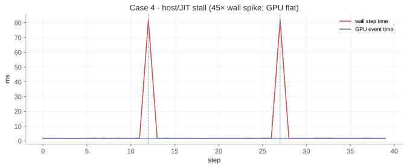

# Paper Reading: ARGUS — Always-On Tracing at 10,000+ GPU Scale

What Tencent built to catch fail-slow training jobs on 10k+ GPU clusters with under 2% overhead — plus Modal remasurements of always-on `torch.profiler` / `nsys` overhead and a tiny demo of the KDE + W₁ detection math.

**Paper:** [ARGUS: Production-Scale Tracing and Performance Diagnosis for over 10,000-GPU Clusters](https://arxiv.org/abs/2606.20374) (Zhou et al., Tencent, arXiv 2606.20374, submitted to ATC 2026)

## TL;DR

Large LLM training jobs are synchronous: one slow rank, link, or host-side stall can waste thousands of GPU-hours without triggering a hard failure. Existing tools split into two camps:

- **Always-on, coarse monitors** — cheap continuous checks on iteration time, heartbeats, or link/machine health. Good at “something is wrong on node X,” weak at “which kernel and why.”
- **Fine-grained profilers** — `torch.profiler`, Nsight Systems, and research tracers that can name kernels, but typically cost **5–30%+** overhead and emit trace volumes that cannot stay always-on at 10k GPUs.

(The ARGUS paper’s Table 1 puts recent cluster systems into these two buckets: Greyhound / Holmes / C4 / Minder on the coarse always-on side; MegaScale / EROICA / FLARE on the finer but harder-to-keep-on side. See [References](#references).)

**ARGUS** tries to occupy the missing middle: **fine-grained, always-on, real-time** diagnosis at production scale. The recipe:

1. **Split observation by training hierarchy** — CPU stacks (py-spy), framework semantics (CUDA Events on phases), GPU kernels (CUPTI Activity API).
2. **Tier the data** — hot metrics to Prometheus/Grafana; full Perfetto traces to object storage; kernel events compressed online by ~3,700× via KDE clustering.
3. **Diagnose progressively** — L1 iteration spikes → L2 straggler rank + phase → L3 degraded kernel → L4/L5 manual Perfetto + CPU stacks.

Deployed on a **10,000+ GPU** production cluster for six months; combined overhead **< 2%**. The paper’s five case studies are the best part: they show failures that coarse monitoring misses and profilers cannot keep running.


## Why This Paper Matters

If you have read [Profiling a PyTorch Training Job End to End](/posts/profiling-pytorch-training-end-to-end/), you already know the local workflow: classify the bottleneck, then zoom in with the right tool. ARGUS is the production-scale answer to a harder question:

> How do you run that workflow **continuously** on every rank of a 10k-GPU job, without paying 20% training tax or drowning in trace data?

The motivating number from the paper is stark: in one **4096-GPU** job, iteration-time spikes above 2× baseline wasted roughly **23,758 GPU-hours (~7% of total compute)**. Fail-slow is not rare noise; at scale it is a tax on every long run.

The design tension is familiar:

| Requirement | Why it is hard |
|---|---|
| Low overhead | GPU time is expensive; profilers perturb behavior (observer effect) |
| Fine granularity | Need kernel-level truth, not just “rank 42 is slow” |
| Always-on | Fail-slow is intermittent; triggered profiling misses windows |
| Real-time | Waiting hours for offline analysis wastes more compute |
| Cross-rank | 10k ranks × 10⁴–10⁵ kernel events/min → hundreds of GB/min raw |

ARGUS does not pick one sacrifice. It **decomposes** the problem.

## System Overview


### Three observation channels (§4)

Modern training spans three layers (Figure 2 in the paper):

1. **Python / host** — scheduling, dataloader, GC, GIL.
2. **Framework semantics** — forward, backward, optimizer, NCCL collectives as named phases.
3. **GPU runtime** — individual kernel launches, streams, durations.

ARGUS instruments each layer with a **different tool**, not one mega-profiler:

| Signal | Mechanism | Overhead (paper) |
|---|---|---|
| CPU call stacks | py-spy external sampling, streaming snapshots | negligible |
| Framework semantics | CUDA Events at phase boundaries; correct NCCL stream selection | negligible |
| Kernel activity | CUPTI Activity API via `libcupti_injector.so` + env injection | ~1–2% |

**Semantics detail worth remembering:** communication phases must record events on the **actual NCCL stream**, not the default compute stream. Putting events on the wrong stream makes AllReduce look instant while the GPU was still busy elsewhere.

**CUPTI detail:** three decoupled paths — control, lightweight callback enqueue, async parse/export — plus selective injection (skip launcher/compile workers), pre-allocated buffer pools, and bounded queues with backpressure.

### Data pipeline (§5)

Raw traces fan out through **Vector**:

- **Metrics path** → Prometheus remote write → Grafana dashboards + alerts.
- **Trace path** → per-host **Processor** (Go) → Perfetto files to object storage + compressed kernel summaries to the metrics store.

Per rank per training step (Table 4):

| Stage | Volume |
|---|---|
| Raw collection | ~10.6 MB |
| Perfetto on disk | ~443 KB |
| Metrics upload | **~18.7 KB** (kernels alone: 10 MB → **2.7 KB** after KDE) |

At 10k GPUs × ~15 steps/min, online upload is ~**2.7 GB/min** — large but tractable for a TSDB. nsys / `torch.profiler` at the same scale would be **hundreds of GB per step**.

### Progressive diagnosis (§6)

Five levels, three automated:

| Level | Input | Output | Latency |
|---|---|---|---|
| **L1** | Per-rank iteration time | Anomaly windows (jitter / regression) | seconds |
| **L2** | Semantic phase durations | Straggler rank + bottleneck phase | seconds |
| **L3** | Compressed kernel stats | Which kernel diverged | minutes |
| **L4** | Perfetto trace | Timeline / critical path (manual) | on demand |
| **L5** | CPU stacks | Host-side stall (manual) | on demand |

**L1** combines sliding-window spike detection with change-point search for step regressions.

**L2** is parallelism-aware: compare ranks only within the correct DP/TP/PP/EP group. High CV on `self_attention` implicates compute; high CV on `dp-allreduce` may be waiting on a slow peer.

**L3** is the paper’s algorithmic centerpiece — see below.

## Kernel Compression and Straggler Detection

This is the piece that makes 10k-rank **online** kernel comparison possible.

### Step 1: KDE valley clustering (§5.2)

Within each time window, group events by `(kernel, stream, rank)`. Durations are **multimodal**: same kernel name at different positions or streams can differ by orders of magnitude (e.g. small vs large AllGather).

ARGUS:

1. Log-transform durations.
2. Estimate KDE with Scott’s bandwidth rule.
3. Split at **density valleys** (local minima), with filters for minimum samples per side and minimum log-gap between boundaries.
4. Emit per-cluster **`(count, p50, p99)`**.

Lossy, but preserves what L3 needs: typical time, tail latency, and frequency.

### Step 2: Cross-rank comparison via Wasserstein distance (§6.2)

For each `(kernel, stream)`:

1. Reconstruct a mixture CDF from compressed stats (log-normal components weighted by `count`).
2. Compute **W₁ (Earth Mover’s Distance)** between every rank pair.
3. Score each rank by mean W₁ to all others; flag outliers with **IQR fences** (robust to existing stragglers).

Why W₁ over KS or KL? Metric properties, sensitivity to both shift and tail inflation, and stability when supports differ slightly — all matter for fail-slow, which often shows up as tail growth before median moves.

## Evaluation Highlights (§8)

On HunYuan-V3 Preview MoE training (8× and 32× GPU nodes), the paper reports:

- **ARGUS all-on:** < **2%** iteration-time overhead, **flat RSS** (streaming, no trace pile-up).
- **`torch.profiler` always-on:** **20–44%** slowdown, RSS grows until **OOM**.
- **nsys always-on:** training **breaks** (NaN at iter 10 on 8 GPU; hang on 32 GPU AllToAll).

The comparison is intentionally harsh — always-on nsys/profiler is not their intended mode — but that is exactly the production gap ARGUS fills.

### Our remasurement on Modal A10G

Paper numbers are on HunYuan MoE multi-GPU jobs. To check whether the *always-on tax* is real on a workload we can reproduce, we ran a **launch-heavy** eager MLP (48× `Linear(512)` + GELU, BF16, 200 steps) under five configs on Modal **A10G**:

Code: [`playground/argus_overhead_modal.py`](https://github.com/duoan/duoan.github.io/blob/main/playground/argus_overhead_modal.py)

```bash
uv run modal run playground/argus_overhead_modal.py
```

| Config | Median step | Overhead | RSS Δ (200 steps) |
|---|---:|---:|---:|
| baseline | 10.29 ms | — | ~0 MB |
| ARGUS-style semantics (CUDA Events on fwd/bwd/opt) | 10.46 ms | **+1.6%** | ~0 MB |
| `torch.profiler` CUDA only | 13.96 ms | **+35.7%** | **+214 MB** |
| `torch.profiler` CPU+CUDA+shapes+stacks | 25.00 ms | **+143%** | **+2.98 GB** |
| `nsys profile` always-on (`cuda,nvtx,osrt`) | 16.05 ms | **+56.0%** | +20 MB (+21 MB `.nsys-rep`) |

Raw results: [argus_overhead_results.json](./argus_overhead_results.json)





What this remasurement supports:

1. **Semantics-only always-on is cheap** (~1.6%), in the same ballpark as ARGUS’s claimed phase instrumentation cost.
2. **`torch.profiler` is not always-on-safe** once you ask for useful fidelity — CUDA-only already costs ~36% here and grows RSS; full CPU+stack mode more than doubles step time and piles up ~3 GB in 200 steps.
3. **`nsys` always-on is also expensive** (~56% step-time tax on this single-GPU loop). We did **not** reproduce the paper’s multi-GPU hang/NaN — that failure mode is about distributed NCCL/AllToAll under nsys, which this microbench does not exercise.

Caveat: this is **not** a full ARGUS CUPTI injector + streaming Processor. We only remasured the *competitor* always-on tax and an ARGUS-**style** semantics probe. The paper’s <2% combined figure still includes their engineered CUPTI path (pre-allocated buffers, async export, selective injection), which we do not reimplement.

## Case Studies — What Actually Breaks at Scale

These five stories are more valuable than the microbenchmarks. We remasured Cases **1–4** at small scale; each subsection has a **Reproduce** recipe you can run on Modal.

| Paper case | Failure mode | Small-scale? | Our demo |
|---|---|---|---|
| 1 Compute straggler | Local GPU compute slow | **Yes** | L1 change-point + L2 CV |
| 2 Silent link degradation | Comm kernels slow, step time flat | **Yes** (synthetic NCCL timings) | L1 silent, L3 W₁ blocks |
| 3 PP bubble masking | Slow PP stage aligned by `grad_sync` | **Yes** (4-stage toy PP) | Totals silent, bwd catches |
| 4 FlashAttention JIT | Intermittent host compile stall | **Yes** (host sleep on A10G) | L1 jitter, GPU flat |
| 5 Misleading network alert | Compute straggler → late collective | Partial | Skipped; composable from 1+2 |

All four demos live in [`playground/argus_cases_modal.py`](https://github.com/duoan/duoan.github.io/blob/main/playground/argus_cases_modal.py). Run everything, or one case at a time:

```bash
# all cases → playground/argus_cases_results.json
uv run modal run playground/argus_cases_modal.py

# single case → playground/argus_cases_case{N}_results.json
uv run modal run playground/argus_cases_modal.py --case 1
uv run modal run playground/argus_cases_modal.py --case 2
uv run modal run playground/argus_cases_modal.py --case 3
uv run modal run playground/argus_cases_modal.py --case 4

# regenerate figures into this post bundle
uv run python playground/argus_demo_figures.py \
  --cases playground/argus_cases_results.json \
  --out content/posts/argus-tracing-at-10000-gpu-scale
```

Committed results: [argus_cases_results.json](./argus_cases_results.json).

### Case 1: Compute Straggler Localization

**Paper (4096-GPU VLM):** L1 regression + L2 CV on compute-only phases isolated DP replicas 656–657 with **150×** slower compute kernels.

**Reproduce**

1. Fault injection (`case1_compute_straggler`): 8 DP ranks × 40 steps; from step 15, rank 5’s `self_attention` / `mlp` are scaled ×25 / ×20 (local compute only).
2. Detection: L1 change-point on job iteration time (`max` across ranks); L2 CV + z-score on post-onset phase means.
3. Run:

```bash
uv run modal run playground/argus_cases_modal.py --case 1
```

4. Expect stdout like `Case1 L1=True L2=True flagged=[5]`, and JSON fields `l1_change_point.t ≈ 15`, `l2.flagged_ranks == [5]`.

**Our remasurement:** iteration time jumps ~16× at onset; L1 change-point at t=15; L2 flags only rank 5.



### Case 2: Communication Link Degradation

**Paper (512-GPU audio):** iteration time *stable* so L1/L2 silent; L3 W₁ revealed one EDP group with PCIe faults.

**Reproduce**

1. Fault injection (`case2_link_degradation`): ranks `{4,5,6,7}` get slower synthetic `AllReduce` / `AllGather` / `ReduceScatter` durations (×8 / ×12 / ×20); iteration time is a flat elevated series (steady degraded regime).
2. Detection: confirm L1 is silent; build per-kernel W₁ matrices + primary-cluster p50; flag ranks whose p50 ≥ 3× the healthy-half median. (Plain IQR-on-mean-W₁ fails when half the ranks are slow — groups are symmetric.)
3. Run:

```bash
uv run modal run playground/argus_cases_modal.py --case 2
```

4. Expect `Case2 L1_silent=True L3=True flagged=[4, 5, 6, 7] W1 inter/intra≈179x`.

**Our remasurement:** L1 silent; AllReduce W₁ **inter/intra ≈ 179×**; p50 gating recovers the degraded EDP group.



### Case 3: Pipeline Bubble Amplification

**Paper (PP=4):** last stage ~1.9× slower backward-compute, but `finish_grad_sync` aligns totals so L1–L3 stay quiet.

**Reproduce**

1. Fault injection (`case3_pp_bubble_masking`): 4 PP stages; stage 3 backward-compute ×1.9; upstream stages get larger bubbles (idle wait); `finish_grad_sync` forces identical fwd–bwd totals across stages.
2. Detection: L1/L2 on aligned totals should be silent (CV ≈ 0); inspect backward-compute means / peer-median ratio (≥1.5×) to recover stage 3.
3. Run:

```bash
uv run modal run playground/argus_cases_modal.py --case 3
```

4. Expect `Case3 totals_silent=True bwd_detected=True ratio≈1.90`.

**Our remasurement:** totals CV = **0**; bwd ratio **1.90×** catches stage 3. Upstream bubbles larger; straggler bubbles tighter (compute-packed).



### Case 4: FlashAttention JIT Compilation

**Paper:** occasional **40×** backward spikes from CuTe DSL JIT; L1 catches jitter; L2/L3 dilute rare events.

**Reproduce**

1. Fault injection (`case4_jit_stall_gpu`): real A10G training step; on steps `{12, 27}` insert an 80 ms **host** `sleep` before the step (FlashAttention CuTe JIT stand-in). Record wall time vs CUDA-event GPU time.
2. Detection: L1 sliding-window max/min ratio (≥2×) should fire; GPU time stays flat (host-bound); a window-mean L2/L3 view dilutes two rare spikes.
3. Run:

```bash
uv run modal run playground/argus_cases_modal.py --case 4
```

4. Expect `Case4 L1=True spike_ratio≈45x stall_steps=[12, 27]`, with `gpu_median_ms ≈ normal wall` and spike walls ≈ 80 ms + step.

**Our remasurement:** wall spike **~45×**; GPU event time ~1.8 ms throughout; L1 jitter fires.



### Case 5: Compute Straggler with Misleading Out-of-band Metrics

**Paper (12,960-GPU MoE):** out-of-band “port down” looked like network; ARGUS showed pure-compute `mlp` degradation, with *shorter* ReduceScatter from late collective entry.

**Reproduce (manual composition, no dedicated flag yet)**

1. Take Case 1’s slow-compute ranks.
2. Measure collective duration as `finish − max(arrive_i)` among participants: stragglers arrive late → the *measured* ReduceScatter window looks shorter for that EP group (secondary symptom), while compute-only phases stay long.
3. Contrast with an out-of-band “link down” story: if only compute phases regress, remediation is node replace, not NIC repair.

We did not wire a full EP=32 schedule on one Modal GPU — the detection insight is already covered by Cases 1+2.

**Meta-lesson:** no single diagnostic level wins. ARGUS wins by **composition**.

## Mini Experiment: KDE + W₁ on a Simulated Straggler

The full ARGUS stack needs CUPTI injection, Vector, Grafana, and thousands of ranks. We can still reproduce the **statistical core** in a few hundred lines.

Code: [`playground/argus_demo_modal.py`](https://github.com/duoan/duoan.github.io/blob/main/playground/argus_demo_modal.py)

```bash
# GPU collection on Modal:
uv run modal run playground/argus_demo_modal.py

# Local fallback if Modal is unavailable (synthetic timings, same algorithms):
uv run python playground/argus_demo_modal.py
```

The demo:

1. Collects repeated CUDA Event timings for a tiny MLP-like loop on Modal (`gemm_fc1`, `gelu`, `gemm_fc2`, `layernorm`).
2. Simulates **8 DP ranks**, injecting a **2.8× slowdown** on GEMM kernels for rank 5.
3. Runs KDE clustering + `(count, p50, p99)` compression.
4. Runs L3-style **W₁ + IQR** detection on `gemm_fc1` (with a relative-elevation gate so tiny timing jitter on healthy ranks does not false-positive at N=8).

Results below are from a Modal **A10G** run ([argus_demo_results.json](./argus_demo_results.json)):

| Metric | Value |
|---|---|
| Device | NVIDIA A10G (Modal) |
| Events per rank | 480 |
| Mean compression ratio | **~58×** (demo scale; paper reports ~3,700× at full CUPTI volume) |
| True straggler rank | 5 |
| L3 flagged ranks | **[5]** |
| Rank 5 mean W₁ deviation score | **2.32** vs ~**0.36** for healthy ranks |


Figures regenerate with:

```bash
uv run python playground/argus_demo_figures.py \
  --results playground/argus_demo_results.json \
  --out content/posts/argus-tracing-at-10000-gpu-scale
```

**Caveats:** the KDE/W₁ demo validates the **detection math**, not ARGUS end-to-end overhead — see the Modal remasurement above for profiler taxes. Real traces are noisier, multimodal clustering is load-bearing, and parallelism-group routing in L2 is doing real work the toy script skips.

## Comparison With Tools You May Already Use

| Tool / system | Always-on? | Kernel-level cross-rank? | Typical overhead |
|---|---|---|---|
| Grafana / DCGM-style metrics | yes | no | very low |
| Cluster fail-slow monitors ([Greyhound](#references), [Holmes](#references), [C4](#references), …) | yes | no (machine / link / phase) | low |
| Training-job tracers ([MegaScale](#references), [EROICA](#references), …) | triggered / partial | partial | medium–high when deep |
| nsys / `torch.profiler` | manual / short windows | yes (single job) | **our A10G:** nsys ~56%, profiler CUDA ~36% / full ~143% |
| **ARGUS** | **yes** | **yes (via compressed stats)** | paper **< 2%**; our semantics probe **~1.6%** |

For a single-machine workflow, stay with the [end-to-end profiling post](/posts/profiling-pytorch-training-end-to-end/). ARGUS is the answer when **every minute of a month-long 10k-GPU run** needs a watchdog that can still name the kernel.

## Discussion and Open Directions

The authors note two forward paths:

1. **LLM agents** on top of L1–L3 outputs + topology context — early reports of tens of minutes → minutes for triage.
2. **Generalization** beyond pre-training (already used on RL; inference serving planned).

What the paper does **not** fully open-source (as of this writing) is the injector, Processor, and diagnosis service — so practitioners will treat this as an architectural reference rather than a drop-in library.

## Takeaways

1. **Decompose before monolith profilers.** Match the tool to the layer: py-spy for host, CUDA Events for semantics, CUPTI for kernels.
2. **Compression is part of observability design**, not a post-processing afterthought — KDE + sufficient statistics enables online 10k-rank comparison.
3. **Diagnose in stages** with parallel automated levels; reserve Perfetto and CPU stacks for the last mile.
4. **Fail-slow has many faces** — silent link decay, PP bubble transfer, JIT spikes, and compute stragglers faking network symptoms all need different levels to surface.
5. **Always-on changes the question** from “can we profile this job?” to “can we afford *not* to?”

## References

- Zhou et al., [ARGUS (arXiv:2606.20374)](https://arxiv.org/abs/2606.20374)
- Wu et al., **Greyhound** — fail-slow hunting via iteration-time / hybrid-parallel signals (USENIX ATC 2025)
- Yao et al., **Holmes** — localizing training irregularities on mega-scale GPU clusters (NSDI 2025)
- Dong et al., **C4** — real-time anomaly detection and communication optimization for large-scale training (HPCA 2025)
- Deng et al., **Minder** — faulty-machine detection for distributed training (NSDI 2025)
- Jiang et al., **MegaScale** — LLM training production stack at 10k+ GPUs, with phase-level tracing (NSDI 2024)
- Guan et al., **EROICA** — online performance troubleshooting; deep kernel profiling on trigger (NSDI 2026)
- Cui et al., **FLARE** — anomaly diagnostics for divergent LLM training at thousand-GPU scale (NSDI 2026)
- Related local writeup: [Profiling a PyTorch Training Job End to End](/posts/profiling-pytorch-training-end-to-end/)
