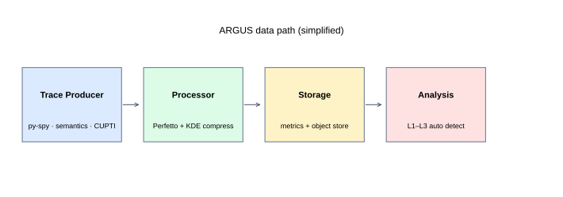
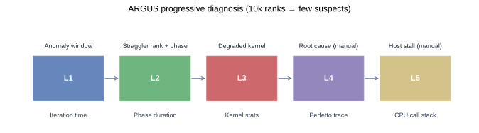
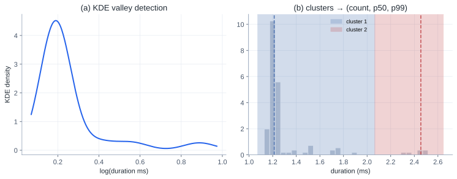
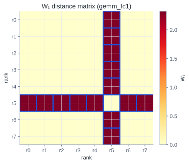

# Paper Reading: ARGUS — Always-On Tracing at 10,000+ GPU Scale

What Tencent built to catch fail-slow training jobs on 10k+ GPU clusters with under 2% overhead — and a tiny Modal demo of the core compression + straggler detection idea.

**Paper:** [ARGUS: Production-Scale Tracing and Performance Diagnosis for over 10,000-GPU Clusters](https://arxiv.org/abs/2606.20374) (Zhou et al., Tencent, arXiv 2606.20374, submitted to ATC 2026)

## TL;DR

Large LLM training jobs are synchronous: one slow rank, link, or host-side stall can waste thousands of GPU-hours without triggering a hard failure. Existing tools split into two camps:

- **Always-on monitors** (Greyhound, Holmes, C4, Minder) — cheap, but stop at machine/link/operator level.
- **Fine-grained profilers** (MegaScale, EROICA, nsys, `torch.profiler`) — useful for root cause, but 5–30%+ overhead and trace volumes that do not scale to 10k GPUs always-on.

**ARGUS** tries to occupy the missing middle: **fine-grained, always-on, real-time** diagnosis at production scale. The recipe:

1. **Split observation by training hierarchy** — CPU stacks (py-spy), framework semantics (CUDA Events on phases), GPU kernels (CUPTI Activity API).
2. **Tier the data** — hot metrics to Prometheus/Grafana; full Perfetto traces to object storage; kernel events compressed online by ~3,700× via KDE clustering.
3. **Diagnose progressively** — L1 iteration spikes → L2 straggler rank + phase → L3 degraded kernel → L4/L5 manual Perfetto + CPU stacks.

Deployed on a **10,000+ GPU** production cluster for six months; combined overhead **< 2%**. The paper’s five case studies are the best part: they show failures that coarse monitoring misses and profilers cannot keep running.



## Why This Paper Matters

If you have read [Profiling a PyTorch Training Job End to End](/posts/profiling-pytorch-training-end-to-end/), you already know the local workflow: classify the bottleneck, then zoom in with the right tool. ARGUS is the production-scale answer to a harder question:

> How do you run that workflow **continuously** on every rank of a 10k-GPU job, without paying 20% training tax or drowning in trace data?

The motivating number from the paper is stark: in one **4096-GPU** job, iteration-time spikes above 2× baseline wasted roughly **23,758 GPU-hours (~7% of total compute)**. Fail-slow is not rare noise; at scale it is a tax on every long run.

The design tension is familiar:

| Requirement | Why it is hard |
|---|---|
| Low overhead | GPU time is expensive; profilers perturb behavior (observer effect) |
| Fine granularity | Need kernel-level truth, not just “rank 42 is slow” |
| Always-on | Fail-slow is intermittent; triggered profiling misses windows |
| Real-time | Waiting hours for offline analysis wastes more compute |
| Cross-rank | 10k ranks × 10⁴–10⁵ kernel events/min → hundreds of GB/min raw |

ARGUS does not pick one sacrifice. It **decomposes** the problem.

## System Overview



### Three observation channels (§4)

Modern training spans three layers (Figure 2 in the paper):

1. **Python / host** — scheduling, dataloader, GC, GIL.
2. **Framework semantics** — forward, backward, optimizer, NCCL collectives as named phases.
3. **GPU runtime** — individual kernel launches, streams, durations.

ARGUS instruments each layer with a **different tool**, not one mega-profiler:

| Signal | Mechanism | Overhead (paper) |
|---|---|---|
| CPU call stacks | py-spy external sampling, streaming snapshots | negligible |
| Framework semantics | CUDA Events at phase boundaries; correct NCCL stream selection | negligible |
| Kernel activity | CUPTI Activity API via `libcupti_injector.so` + env injection | ~1–2% |

**Semantics detail worth remembering:** communication phases must record events on the **actual NCCL stream**, not the default compute stream. Putting events on the wrong stream makes AllReduce look instant while the GPU was still busy elsewhere.

**CUPTI detail:** three decoupled paths — control, lightweight callback enqueue, async parse/export — plus selective injection (skip launcher/compile workers), pre-allocated buffer pools, and bounded queues with backpressure.

### Data pipeline (§5)

Raw traces fan out through **Vector**:

- **Metrics path** → Prometheus remote write → Grafana dashboards + alerts.
- **Trace path** → per-host **Processor** (Go) → Perfetto files to object storage + compressed kernel summaries to the metrics store.

Per rank per training step (Table 4):

| Stage | Volume |
|---|---|
| Raw collection | ~10.6 MB |
| Perfetto on disk | ~443 KB |
| Metrics upload | **~18.7 KB** (kernels alone: 10 MB → **2.7 KB** after KDE) |

At 10k GPUs × ~15 steps/min, online upload is ~**2.7 GB/min** — large but tractable for a TSDB. nsys / `torch.profiler` at the same scale would be **hundreds of GB per step**.

### Progressive diagnosis (§6)

Five levels, three automated:

| Level | Input | Output | Latency |
|---|---|---|---|
| **L1** | Per-rank iteration time | Anomaly windows (jitter / regression) | seconds |
| **L2** | Semantic phase durations | Straggler rank + bottleneck phase | seconds |
| **L3** | Compressed kernel stats | Which kernel diverged | minutes |
| **L4** | Perfetto trace | Timeline / critical path (manual) | on demand |
| **L5** | CPU stacks | Host-side stall (manual) | on demand |

**L1** combines sliding-window spike detection with change-point search for step regressions.

**L2** is parallelism-aware: compare ranks only within the correct DP/TP/PP/EP group. High CV on `self_attention` implicates compute; high CV on `dp-allreduce` may be waiting on a slow peer.

**L3** is the paper’s algorithmic centerpiece — see below.

## Kernel Compression and Straggler Detection

This is the piece that makes 10k-rank **online** kernel comparison possible.

### Step 1: KDE valley clustering (§5.2)

Within each time window, group events by `(kernel, stream, rank)`. Durations are **multimodal**: same kernel name at different positions or streams can differ by orders of magnitude (e.g. small vs large AllGather).

ARGUS:

1. Log-transform durations.
2. Estimate KDE with Scott’s bandwidth rule.
3. Split at **density valleys** (local minima), with filters for minimum samples per side and minimum log-gap between boundaries.
4. Emit per-cluster **`(count, p50, p99)`**.

Lossy, but preserves what L3 needs: typical time, tail latency, and frequency.

### Step 2: Cross-rank comparison via Wasserstein distance (§6.2)

For each `(kernel, stream)`:

1. Reconstruct a mixture CDF from compressed stats (log-normal components weighted by `count`).
2. Compute **W₁ (Earth Mover’s Distance)** between every rank pair.
3. Score each rank by mean W₁ to all others; flag outliers with **IQR fences** (robust to existing stragglers).

Why W₁ over KS or KL? Metric properties, sensitivity to both shift and tail inflation, and stability when supports differ slightly — all matter for fail-slow, which often shows up as tail growth before median moves.

## Evaluation Highlights (§8)

On HunYuan-V3 Preview MoE training (8× and 32× GPU nodes):

- **ARGUS all-on:** < **2%** iteration-time overhead, **flat RSS** (streaming, no trace pile-up).
- **`torch.profiler` always-on:** **20–44%** slowdown, RSS grows until **OOM**.
- **nsys always-on:** training **breaks** (NaN at iter 10 on 8 GPU; hang on 32 GPU AllToAll).

The comparison is intentionally harsh — always-on nsys/profiler is not their intended mode — but that is exactly the production gap ARGUS fills.

## Case Studies — What Actually Breaks at Scale

These five stories are more valuable than the microbenchmarks.

### Case 1: Compute straggler (4096 GPU VLM)

L1 regression + L2 CV on compute-only phases (`self_attention`, `mlp`) isolated **DP replicas 656–657** with **150×** slower compute kernels. No communication involved → local GPU/hardware issue, not NCCL.

### Case 2: Silent link degradation (512 GPU audio)

Iteration time looked **stable**; L1/L2 silent. **L3 W₁** on AllReduce / AllGather / ReduceScatter showed one **EDP group** with orders-of-magnitude larger inter-group distances. L4 Perfetto confirmed slow **intra-group** collectives without wait time → **PCIe fault on two nodes**, not a slow peer. Greyhound-style heartbeat monitors never fire because there is no spike.

### Case 3: Pipeline bubble masking (4096 GPU VLM, PP=4)

Rank 3760’s backward compute ~**1.9×** slower, but **grad_sync** aligns iteration times across PP stages — L1–L3 all quiet. Manual semantics inspection + L4 Perfetto revealed **asymmetric pipeline bubbles**: downstream rank compute-bound, upstream ranks waiting. PP causal structure hides stragglers from iteration-level stats.

### Case 4: FlashAttention JIT spikes (4096 GPU VLM)

Short **40×** backward spikes from **CuTe DSL JIT** on uncached shapes. L1 caught jitter; L2/L3 diluted the sparse event. L4 showed sparse kernel launches and host-side blocking. Fix: disk JIT cache + warmup over shape combinations.

### Case 5: Compute straggler masquerading as network (12,960 GPU MoE)

Out-of-band monitoring reported **“port down”** on an affected node. ARGUS L2 showed degradation only on **pure compute (`mlp`)**, while ReduceScatter on the same EP group looked *faster* because stragglers entered the collective late — a **secondary symptom**. Replacing nodes fixed throughput; network repair would not have.

**Meta-lesson:** no single diagnostic level wins. ARGUS wins by **composition**.

## Mini Experiment: KDE + W₁ on a Simulated Straggler

The full ARGUS stack needs CUPTI injection, Vector, Grafana, and thousands of ranks. We can still reproduce the **statistical core** in a few hundred lines.

Code: [`playground/argus_demo_modal.py`](https://github.com/duoan/duoan.github.io/blob/main/playground/argus_demo_modal.py)

```bash
# GPU collection on Modal (when authenticated):
uv run modal run playground/argus_demo_modal.py

# Local fallback (synthetic timings, same algorithms):
uv run python playground/argus_demo_modal.py
```

The demo:

1. Collects (or synthesizes) repeated kernel durations for a tiny MLP-like loop — `gemm_fc1`, `gelu`, `gemm_fc2`, `layernorm`.
2. Simulates **8 DP ranks**, injecting a **2.8× slowdown** on GEMM kernels for rank 5.
3. Runs KDE clustering + `(count, p50, p99)` compression.
4. Runs L3-style **W₁ + IQR** detection on `gemm_fc1`.

Results bundled with this post: [argus_demo_results.json](./argus_demo_results.json)

| Metric | Value |
|---|---|
| Events per rank | 480 |
| Mean compression ratio | **~108×** (demo scale; paper reports ~3,700× at full CUPTI volume) |
| True straggler rank | 5 |
| L3 flagged ranks | **[5]** |
| Rank 5 mean W₁ deviation score | **0.747** vs ~**0.11** for healthy ranks |





Figures regenerate with:

```bash
uv run python playground/argus_demo_figures.py \
  --results playground/argus_demo_results.json \
  --out content/posts/argus-tracing-at-10000-gpu-scale
```

**Caveats:** this demo validates the **detection math**, not ARGUS end-to-end overhead. Real traces are noisier, multimodal clustering is load-bearing, and parallelism-group routing in L2 is doing real work the toy script skips.

## Comparison With Tools You May Already Use

| Tool / system | Always-on? | Kernel-level cross-rank? | Typical overhead |
|---|---|---|---|
| Grafana / DCGM metrics | yes | no | very low |
| Greyhound / Holmes / C4 | yes | no | low |
| MegaScale / EROICA | triggered / partial | partial | medium–high when deep |
| nsys / torch.profiler | manual / short windows | yes (single job) | 5–30%+ |
| **ARGUS** | **yes** | **yes (via compressed stats)** | **< 2%** |

For a single-machine workflow, stay with the [end-to-end profiling post](/posts/profiling-pytorch-training-end-to-end/). ARGUS is the answer when **every minute of a month-long 10k-GPU run** needs a watchdog that can still name the kernel.

## Discussion and Open Directions

The authors note two forward paths:

1. **LLM agents** on top of L1–L3 outputs + topology context — early reports of tens of minutes → minutes for triage.
2. **Generalization** beyond pre-training (already used on RL; inference serving planned).

What the paper does **not** fully open-source (as of this writing) is the injector, Processor, and diagnosis service — so practitioners will treat this as an architectural reference rather than a drop-in library.

## Takeaways

1. **Decompose before monolith profilers.** Match the tool to the layer: py-spy for host, CUDA Events for semantics, CUPTI for kernels.
2. **Compression is part of observability design**, not a post-processing afterthought — KDE + sufficient statistics enables online 10k-rank comparison.
3. **Diagnose in stages** with parallel automated levels; reserve Perfetto and CPU stacks for the last mile.
4. **Fail-slow has many faces** — silent link decay, PP bubble transfer, JIT spikes, and compute stragglers faking network symptoms all need different levels to surface.
5. **Always-on changes the question** from “can we profile this job?” to “can we afford *not* to?”

## References

- Zhou et al., [ARGUS (arXiv:2606.20374)](https://arxiv.org/abs/2606.20374)
- Wu et al., Greyhound — fail-slow hunting in hybrid-parallel training (USENIX ATC 2025)
- Jiang et al., MegaScale — LLM training at 10k+ GPUs (NSDI 2024)
- Guan et al., EROICA — online performance troubleshooting (NSDI 2026)
- Cui et al., FLARE — anomaly diagnostics at thousand-GPU scale (NSDI 2026)
- Related local writeup: [Profiling a PyTorch Training Job End to End](/posts/profiling-pytorch-training-end-to-end/)
