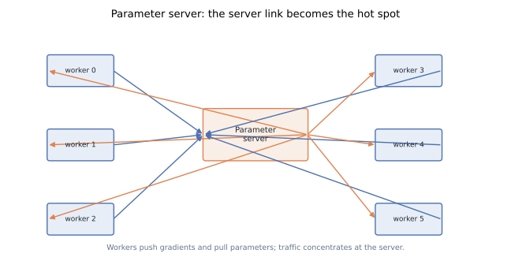
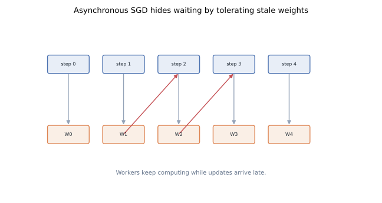
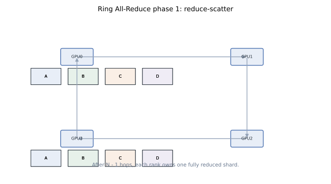
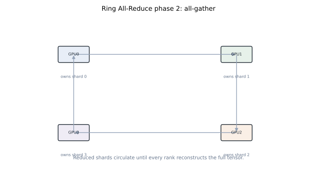
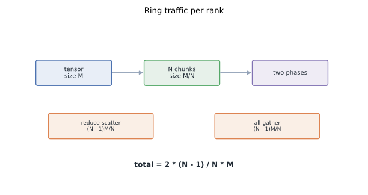

# Data Parallelism: From Parameter Server to Ring All-Reduce

Data parallelism is the default way to turn more GPUs into more training throughput. Every worker holds the same model, sees different examples, computes gradients, and participates in a collective update. The algorithmic idea is simple. The systems problem is not.

This post follows the path from parameter servers to PyTorch-style Distributed Data Parallel (DDP) with ring all-reduce. The key shift is load balance: stop sending all traffic through one server, and make every rank move the same amount of data at the same time.

## TL;DR

- In data parallel training, each rank owns a full model replica and a shard of the batch. Gradients are reduced so all replicas apply the same update.
- A parameter server is easy to understand: workers push gradients and pull updated parameters. It becomes bandwidth-limited because server links handle traffic from every worker.
- Asynchronous SGD hides communication wait, but introduces **stale gradients**. Staleness can improve hardware utilization while slowing or destabilizing optimization.
- DDP removes the central server for the common synchronous case. Gradients are reduced by collectives, usually implemented by NCCL over rings, trees, or topology-aware hybrids.
- Ring all-reduce decomposes all-reduce into **reduce-scatter** plus **all-gather**. For a tensor of size `M` across `N` ranks, each rank sends and receives `2 * (N - 1) / N * M`.
- For large payloads, ring all-reduce is bandwidth-efficient because every link can stay busy with predictable, contiguous transfers.
- Reproducible figures for this post: [`playground/llm_training_series_figures.py`](https://github.com/duoan/duoan.github.io/blob/main/playground/llm_training_series_figures.py).

## 1. What Data Parallelism Does

Suppose a model has parameters `W`, and the global batch is split across `N` workers. Worker `i` receives data shard `X_i`, runs forward and backward, and obtains local gradient `G_i`.

Synchronous data parallelism computes:

```text
G = sum_i G_i / N
W <- optimizer_step(W, G)
```

Every worker must apply the same update so replicas remain identical. That invariant is the core contract. The implementation can be centralized, decentralized, synchronous, asynchronous, eager, bucketed, or overlapped with backward; the contract remains the same.

Data parallelism is popular because it preserves the model code. The per-rank forward pass is almost the same as single-GPU training. The distributed part is concentrated around gradient synchronization and input sharding.

The limitation is equally clear: every rank stores a full copy of parameters, gradients, and optimizer state unless a sharding method such as ZeRO/FSDP is added. This post focuses on communication; the next post handles memory redundancy.

## 2. Parameter Server: The Straight Line Design

The parameter-server architecture separates workers from one or more servers that own parameters, gradients, or optimizer state.



A basic synchronous loop looks like this:

1. Each worker holds a model replica.
2. The input batch is split across workers.
3. Workers compute local gradients.
4. Workers push gradients to the server.
5. The server aggregates gradients and updates parameters.
6. Workers pull the new parameters, then start the next step.

This design is simple and flexible. It can support sparse updates, custom consistency models, and large CPU-backed parameter stores. It also maps well to early large-scale ML systems where models were not always dense Transformer blocks.

The bottleneck is load imbalance. If there is one server, that server's network interface carries traffic proportional to the number of workers. Workers mostly talk to the server, not to each other. At small scale this is fine. Across racks, it becomes the training step.

Multiple servers can shard parameters and reduce the hot spot. That moves the design closer to distributed collectives, but it still requires careful placement, routing, and consistency management.

## 3. Synchronous vs Asynchronous Updates

The synchronized loop has clean optimizer semantics, but it waits for communication. One response is asynchronous SGD.



In asynchronous training, a worker can start step `t + 1` before gradients from step `t` have fully updated the parameter version it sees. This hides communication behind computation and reduces idle time.

The cost is **staleness**. A gradient is computed from an older parameter vector and applied to a newer one. With bounded staleness, the system may require that every worker falls at most `s` steps behind. With unbounded staleness, fast workers can race ahead while slow workers contribute gradients from much older weights.

This is a throughput/optimization trade:

- Less waiting improves hardware utilization.
- Stale gradients add noise and delay to the optimizer.
- The effective behavior can resemble increasing batch size without the same statistical guarantees.
- Convergence tuning becomes system-dependent.

Modern LLM pretraining usually favors synchronous data parallelism because dense Transformer workloads have predictable compute, optimized collectives, and high sensitivity to reproducibility. Asynchrony remains useful in some recommender, sparse, or elastic settings, but it is not the default for dense LLM training.

## 4. DDP: Keep the Contract, Remove the Server

Distributed Data Parallel keeps the synchronous data-parallel contract but replaces the central server with collective communication.

In PyTorch DDP, each process owns one model replica. During backward, gradients are grouped into buckets. When a bucket becomes ready, DDP launches an all-reduce for that bucket. This overlaps communication for earlier layers with backward compute for later layers.

Conceptually:

```text
for each rank:
    loss_i = model(x_i)
    loss_i.backward()
    all_reduce(grad_bucket)
    optimizer.step()
```

The all-reduce is the important operation. It must produce the same reduced gradient tensor on every rank. A naive all-reduce could gather everything to one rank and broadcast it back, which recreates the parameter-server bottleneck. Ring all-reduce distributes the traffic.

## 5. Ring All-Reduce: Reduce-Scatter

Assume `N` ranks arranged in a logical ring, and a gradient tensor of size `M`. Split the tensor into `N` chunks, each of size `M/N`.

The first phase is reduce-scatter.



At each step, every rank sends one chunk to its neighbor and receives one chunk from the other neighbor. The received chunk is added to the local partial sum for that chunk. After `N - 1` steps, every rank owns one chunk of the fully reduced tensor.

For rank-local send volume in reduce-scatter:

```text
(N - 1) * M / N
```

No rank is special. Every rank sends and receives the same amount in each step. That is the load-balance improvement over a single parameter server.

## 6. Ring All-Reduce: All-Gather

After reduce-scatter, each rank has only one fully reduced chunk. The second phase distributes those chunks so every rank reconstructs the full reduced tensor.



The communication pattern is the same ring movement, but without summation. Each step forwards an already-reduced chunk. After another `N - 1` steps, every rank has all chunks.

All-gather send volume per rank is also:

```text
(N - 1) * M / N
```

Therefore total per-rank traffic for ring all-reduce is:

```text
2 * (N - 1) / N * M
```

For large `N`, this approaches `2M`. That is why practitioners often say a dense all-reduce costs about two tensor transfers per rank.



## 7. Why Ring Is Good for Large Payloads

Ring all-reduce is not always latency-optimal. It requires `2(N - 1)` communication steps, which can hurt small tensors. But for large gradient buckets, bandwidth dominates latency, and ring has excellent properties:

- Every rank sends and receives continuously.
- Transfers are large and contiguous.
- No central link carries all traffic.
- Per-rank traffic is close to the theoretical lower bound for bandwidth-dominated all-reduce.

This is why DDP buckets gradients instead of launching one collective per tiny tensor. Larger buckets amortize launch latency and make better use of bandwidth. The exact bucket size is a tuning knob: too small wastes latency; too large delays overlap with backward.

NCCL may choose rings, trees, CollNet, or topology-aware combinations depending on hardware and message size. The ring mental model remains useful because it explains the common bandwidth formula and why decentralized collectives scale better than a single server.

## 8. Comparing Parameter Server and Ring

A useful comparison is not total bytes in the abstract, but where those bytes flow.

With a single parameter server and dense gradients of size `M`:

- Workers push roughly `N * M`.
- Workers pull roughly `N * M`.
- The server handles traffic proportional to `2N * M`.

With ring all-reduce:

- Each rank handles `2 * (N - 1) / N * M`.
- All ranks participate symmetrically.
- The system uses more of the available bisection bandwidth.

Total cluster traffic can look similar, but time differs because bottleneck links differ. A truckload of bytes through one toll booth is not the same as the same truckload spread across every lane.

## 9. What DDP Still Does Not Solve

DDP solves the communication hot spot for synchronous dense data parallelism. It does not solve every scaling problem.

First, every rank still stores a full model replica. For Adam with mixed precision, parameters, gradients, master weights, and optimizer moments can require roughly 16 bytes per parameter before activations. A 70B parameter model cannot be trained by plain DDP on ordinary GPUs.

Second, all-reduce time grows with gradient size. If the model is very large and per-rank compute is small, communication can dominate. Overlap helps only when there is enough remaining backward compute to hide it.

Third, network topology matters. Rings that cross slow links can underperform. Production systems map process groups to NVLink islands, PCIe topology, and network fabric. The collective algorithm is only as good as the topology it runs on.

These limitations motivate ZeRO, tensor parallelism, pipeline parallelism, sequence parallelism, and communication overlap. Data parallelism remains the base layer because it gives the cleanest scaling path when the model replica fits.

## 10. Practical Checklist

When a DDP job underperforms, inspect these first:

- **Global batch math**: confirm each rank receives the intended local batch and gradients are averaged or loss-scaled consistently.
- **Gradient bucket size**: small buckets waste latency; huge buckets reduce overlap.
- **Unused parameters**: dynamic graphs can force DDP to search or synchronize awkwardly.
- **Stragglers**: one slow rank delays the synchronous step.
- **Topology**: cross-socket, cross-node, or mixed-generation links can dominate.
- **Overlap**: check whether all-reduce starts during backward or only after backward completes.

The right mental model is not "DDP is just an API." DDP is a carefully staged communication schedule wrapped around autograd.

## References

- Mu Li et al., [*Scaling Distributed Machine Learning with the Parameter Server*](https://www.usenix.org/conference/osdi14/technical-sessions/presentation/li_mu), OSDI 2014.
- Awni Hannun et al., [*Deep Speech: Scaling up end-to-end speech recognition*](https://arxiv.org/abs/1412.5567), 2014.
- Sixin Zhang et al., [*Poseidon: An Efficient Communication Architecture for Distributed Deep Learning on GPU Clusters*](https://arxiv.org/abs/1706.03292), 2017.
- Pitch Patarasuk and Xin Yuan, [*Bandwidth Optimal All-reduce Algorithms for Clusters of Workstations*](https://doi.org/10.1016/j.jpdc.2008.09.002), Journal of Parallel and Distributed Computing, 2009.
- Shen Li et al., [*PyTorch Distributed: Experiences on Accelerating Data Parallel Training*](https://arxiv.org/abs/2006.15704), VLDB 2020.
