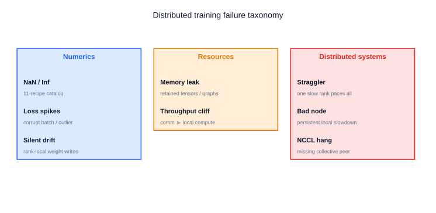
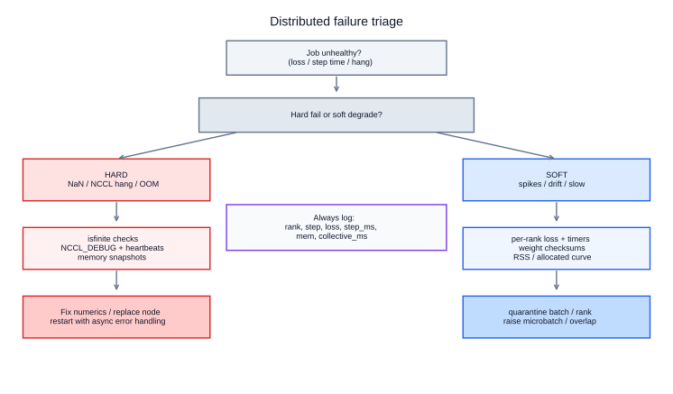
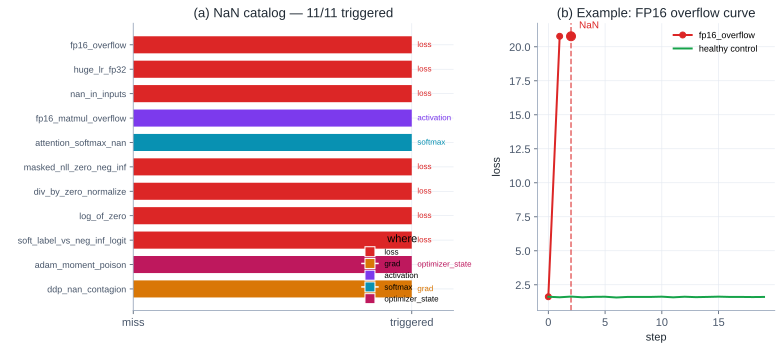
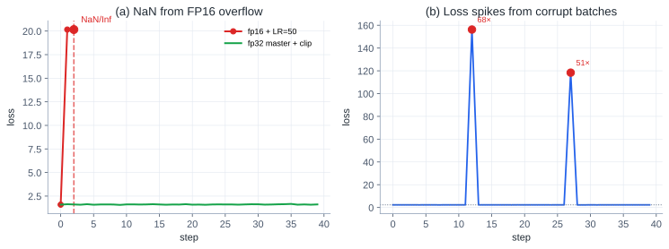
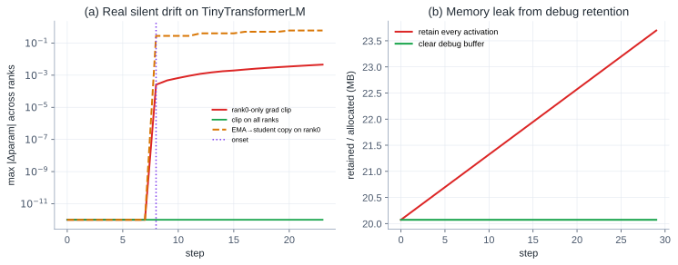
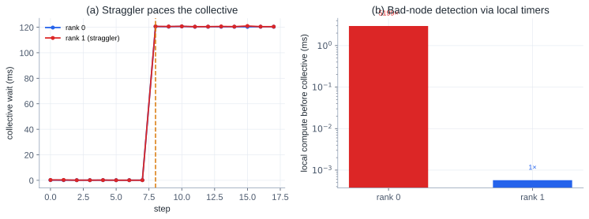
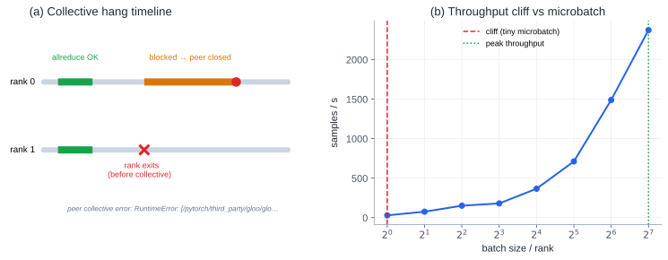

# Distributed Training Failure Runbook: Reproducing the Failures That Actually Bite

Eight reproducible failure modes — a **11-recipe NaN catalog**, loss spikes, silent drift, memory leaks, stragglers, bad nodes, collective hangs, and throughput cliffs — plus a triage runbook you can actually run.

## TL;DR

Distributed training rarely dies with a clean stack trace. More often it **looks almost fine** while wasting GPU-hours: loss spikes that recover, ranks that quietly desync, one slow node that paces everyone, or a collective that never returns.

I built a small lab that injects each failure on purpose and measures the debug signal you should look for:

| Failure | Injected bug | What we measured (Modal 2×A10G, NCCL) |
|---|---|---|
| NaN (11 recipes) | AMP overflow, bad LR, corrupt data, masks, Adam poison, DDP contagion, … | **11/11** triggered |
| Loss spike | corrupt batch ×`1e3` at steps 12, 27 | spikes **59–106×** median |
| Silent drift | rank0-only `clip_grad` after allreduce; BN `broadcast_buffers=False` | params **and** BN buffers diverge; loss stays finite |
| Memory leak | retain activations every step | +**5.1 MB** CUDA alloc (fixed path flat) |
| Straggler | rank 1 delays 120 ms before allreduce | collective wait **0.1 → 120 ms** (~**1377×**) |
| Bad node | rank 0 extra local matmuls | local timer **~2400×** vs fastest peer |
| Collective hang | rank 1 exits mid-job | rank 0 **blocked in NCCL** until watchdog kill |
| Throughput cliff | fixed 8 MB collective + tiny microbatch | bs=`1` ≈ **0.8%** of peak (~28k samples/s @ bs=128) |

Code: [`playground/dist_failure_modal.py`](https://github.com/duoan/duoan.github.io/blob/main/playground/dist_failure_modal.py)

```bash
# Modal (default: 2×A10G, NCCL) — this post's numbers:
uv run modal run playground/dist_failure_modal.py
uv run modal run playground/dist_failure_modal.py --case nan

# Local CPU/gloo fallback:
uv run python playground/dist_failure_modal.py

# Figures:
uv run python playground/dist_failure_figures.py \
  --results playground/dist_failure_results.json \
  --out content/posts/distributed-training-failure-runbook
```



## Why a Runbook Beats Folklore

Most distributed debugging advice is a pile of flags: `NCCL_DEBUG=INFO`, `CUDA_LAUNCH_BLOCKING=1`, “try lowering LR”. Those help *after* you know which class of failure you are in.

The missing piece is a **symptom → hypothesis → probe → fix** loop. This post is that loop, backed by minimal repros. Related earlier posts cover adjacent ground ([DDP performance on one GPU](/posts/learning-ddp-performance-tuning-on-one-gpu/), [variable-length throughput](/posts/why-variable-sequence-length-breaks-ddp-throughput/), [ARGUS-style fail-slow detection](/posts/argus-tracing-at-10000-gpu-scale/)); here the focus is **failure injection + triage**.

### Lab assumptions

- **Modal 2×A10G**, PyTorch `2.11+cu130`, backend **`nccl`**, `world_size=2` — committed numbers in this post.
- Same script falls back to **CPU/`gloo`** via `uv run python playground/dist_failure_modal.py` when you have no GPU.
- Tiny MLP + synthetic data. The bugs are real; the model is not.
- Results: [dist_failure_results.json](./dist_failure_results.json)

That is enough to practice the debug moves before you spend a 512-GPU night on folklore.

## Triage First



Before opening `nsys`, answer two questions:

1. **Hard fail or soft degrade?**  
   Hard: NaN/Inf, NCCL timeout, OOM, process death. Soft: spikes, drift, slow steps, low MFU.
2. **Per-rank or global?**  
   If only some ranks look sick, collect **rank-local** timers / losses / mem before you blame the network.

Always log a skinny heartbeat on every rank:

```python
print(
    f"rank={rank} step={step} loss={loss.item():.4g} "
    f"finite={torch.isfinite(loss).item()} "
    f"step_ms={step_ms:.1f} alloc_mb={alloc_mb:.1f}",
    flush=True,
)
```

If you cannot answer “which rank, which step, which signal”, you are not debugging yet — you are refreshing Grafana.

---

## 1. NaNs

**Symptom:** loss / grads / optimizer state become `nan`/`inf`. Sometimes only after many steps; sometimes only on one rank (then DDP spreads it).

NaN is not one bug. The lab runs an **11-recipe catalog** of the failures that show up most often in training code review and war rooms:

| Recipe | What we inject | Where it breaks | Fix sketch |
|---|---|---|---|
| `fp16_overflow` | FP16 weights + LR=`50`, no GradScaler | loss @ step 2 | FP32 master + GradScaler / lower LR |
| `huge_lr_fp32` | FP32 + LR=`1e3` | loss @ step 3 | warmup / sane LR — not an AMP-only problem |
| `nan_in_inputs` | `batch[0,0]=NaN` | loss immediately | `isfinite` in dataloader; quarantine shards |
| `fp16_matmul_overflow` | large FP16 GEMM | activations → Inf | loss scaling / BF16 / lower activation scale |
| `attention_softmax_nan` | fully-masked softmax row (and FP16 score path) | softmax | never fully-mask a row; scale `1/sqrt(d)` |
| `masked_nll_zero_neg_inf` | `0 * (-inf)` in hand-rolled NLL | loss | `ignore_index` / masked select; not `mask * log_p` |
| `div_by_zero_normalize` | `sum / count` with `count=0` | loss → ±Inf | clamp denominator; skip empty shards |
| `log_of_zero` | `log(prob)` with `prob=0` | loss → `-inf` | `log(clamp(p))` or logits APIs (`BCEWithLogits`) |
| `soft_label_vs_neg_inf_logit` | soft label mass on `-inf` logit | loss | forbid `-inf` under soft labels |
| `adam_moment_poison` | one NaN grad into Adam | optimizer state | skip `step` on non-finite grads; reset state |
| `ddp_nan_contagion` | rank-0 param NaN → allreduce | grads on **all** ranks | per-rank `isfinite` before step |



**Lab result:** **11/11** recipes triggered. Healthy control (FP32 + mild LR + grad clip) stays finite.



### Debug checklist

1. Assert `torch.isfinite(loss)` **and** grads **before** `optimizer.step()` (Adam will remember a single NaN forever).
2. `all_reduce` a per-rank `has_nan` flag — find the **first** offender before contagion.
3. Bisect class: data (`isfinite(batch)`) → logits/softmax → loss reduction → optimizer state → AMP/LR.
4. For attention / custom CE: look for **fully masked rows** and `0 * -inf` reductions.
5. After an incident, **reset Adam moments** (or restore from a clean checkpoint).

### Fix patterns

- Prefer **logits APIs** (`cross_entropy`, `BCEWithLogitsLoss`) over `log(softmax(…))`.
- Keep **FP32 master weights**; use autocast + GradScaler on CUDA.
- Clamp denominators; never reduce over an empty valid set.
- Grad clip is a seatbelt, not a root-cause fix.

---

## 2. Loss Spikes

**Symptom:** training mostly healthy, but rare steps explode then may recover. Easy to dismiss as “noise”.

**Inject:** multiply features by `1e3` on steps `{12, 27}` (stand-in for bad tokenization, unnormalized images, corrupted shards).

**Lab result:** median loss ≈ `2.31`; spikes **106×** and **59×**.

### Debug checklist

1. Log **per-step** loss on all ranks (not just rank 0 smoothed EMA).
2. On spike steps, dump batch stats: input L2, max abs, label histogram, sequence length.
3. Correlate with data source (shard id, worker id, augmentation branch).
4. Confirm grads were clipped — spikes with clipped grads still poison Adam moments.

### Fix patterns

- Quarantine / skip outlier batches above a norm threshold.
- Sanitize data pipeline (clip audio/image ranges, validate token ids).
- Spike-aware logging: keep a ring buffer of last N batch ids.

---

## 3. Silent Numerical Drift

**Symptom:** loss still decreases, checkpoints “train”, but ranks disagree on weights **or** BatchNorm running stats. Eval disagrees with train. Restarting from a checkpoint on a different world size changes results.

Toy `param.add_` mocks are not useful here. The lab injects two bugs that show up in real DDP code review:

| Recipe | Real pattern | What diverges |
|---|---|---|
| `rank0_only_grad_clip` | Single-GPU leftover: `if rank == 0: clip_grad_norm_(...)` **after** DDP already allreduced grads | **Parameters** — ranks take different `optimizer.step()` updates |
| `bn_broadcast_buffers_false` | `DistributedDataParallel(..., broadcast_buffers=False)` with ordinary `BatchNorm` and different per-rank batches | **BN `running_mean` / `running_var`** — affine weights stay synced via grad allreduce |



**Why the clip bug is real:** after `backward()`, DDP has already made every rank’s `.grad` identical. Clipping only on rank 0 then means rank 0 steps with a different grad tensor than ranks 1…N-1. No `add_` required — the optimizer does the divergence for you.

**Why the BN bug is real:** `broadcast_buffers=False` is a documented DDP knob people flip for speed or for “I sync manually”. With independent shards, each rank’s BN running stats walk away. Training loss can look healthy because the training path uses batch stats; eval / EMA / resume is where you notice.

**Lab result (Modal 2×A10G):** both recipes trigger; loss stays finite.
- `rank0_only_grad_clip`: max \|Δparam\| → **1.3×10⁻²** (all-rank clip control stays **0**)
- `bn_broadcast_buffers_false`: after eval forward, max \|Δbuffer\| → **7.4×10⁻²** while params stay synced; `broadcast_buffers=True` control → **0**

### Debug checklist

1. Periodically `all_gather` a **parameter** checksum *and* a **buffer** checksum (BN running stats are the usual landmine).
2. Diff rank-0 vs rank-k after N steps; param diffs ≫ `1e-5` in FP32 DDP means a rank-gated update (clip, WD, EMA copy-back, manual `step`).
3. Grep for `if rank == 0` / `if is_main` around `clip_grad`, `optimizer.step`, `load_state_dict`, EMA.
4. Confirm DDP `broadcast_buffers` and whether you meant `SyncBatchNorm`.

### Fix patterns

- Grad clip / AMP unscale / optimizer step: **same control flow on every rank**.
- Keep `broadcast_buffers=True` or use **SyncBatchNorm**; if you disable broadcast, you must sync BN stats yourself.
- Smoke test: after K steps, assert `max|Δparam|` and `max|Δbuffer|` across ranks are ~0.

---

## 4. Memory Leaks

**Symptom:** step time creeps up; CUDA alloc / RSS climbs; eventually OOM after hours.

**Inject:** append detached activations (+ inputs) to a list “for later visualization”.

**Lab result:** CUDA `memory_allocated` grows **+5.1 MB** over 40 steps; fixed path stays flat at ~18.9 MB.

### Debug checklist

1. Plot `torch.cuda.memory_allocated` / `max_memory_allocated` every N steps.
2. Host RSS (`psutil`) for CPU-side leaks (dataloader, logging, metrics).
3. `torch.cuda.memory._dump_snapshot()` around suspect regions.
4. Search for lists/dicts that capture tensors or `loss` histories with graphs attached.

### Fix patterns

- `.detach()` **and** bound retention (ring buffer / never grow unbounded).
- Do not store `loss` for logging without `.item()` / `.detach()`.
- Explicit `del` + `empty_cache` only after fixing the root retain; cache clearing is not a fix.

---

## 5. Stragglers

**Symptom:** iteration time jumps; MFU drops; NCCL looks “slow” even though links are fine — everyone is waiting on one late peer.

**Inject:** rank 1 sleeps **120 ms** before an explicit `all_reduce` probe (onset step 8).



**Lab result:** collective wait median **0.1 ms → 120 ms** (~**1377×**) on **both** ranks. The healthy rank is just as slow on the wall clock — that is the point.

### Debug checklist

1. Time **pre-collective local work** vs **collective wait** per rank.
2. If collective wait is huge but local compute is fine → straggler or sync bug.
3. If one rank’s local compute is huge → bad node / data skew / host stall ([ARGUS L1/L2](/posts/argus-tracing-at-10000-gpu-scale/)).
4. Check dataloader workers, GC, JIT compiles, rank-0 logging flushed under a barrier.

### Fix patterns

- Remove rank-asymmetric host work before collectives.
- Balance tokens/samples ([length bucketing](/posts/why-variable-sequence-length-breaks-ddp-throughput/)).
- Isolate and drain the slow rank; do not “tune NCCL” first.

---

## 6. Bad Nodes

**Symptom:** like a permanent straggler. Same GPU id keeps showing up across jobs. Thermal throttle, degraded HBM, PCIe link width drop, CPU interference.

**Inject:** rank 0 runs extra local matmul loops before the step; detect via all-gathered local timer ratios.

**Lab result:** flagged rank `[0]` at **~2400×** vs the fastest peer’s local timer.

### Debug checklist

1. Maintain a **per-rank local compute** metric that excludes collective wait.
2. Flag ranks ≥3–5× the fastest peer (or robust z-score over a longer window).
3. Cross-check with nvidia-smi / DCGM: clocks, Xid errors, ECC, link speed.
4. Reschedule the same rank onto another machine — if the problem moves with the job placement, it is the node.

### Fix patterns

- Quarantine the node; cordon in the scheduler.
- Do not keep retrying the same physical GPU and calling it “NCCL flakiness”.

---

## 7. NCCL / Collective Hangs

**Symptom:** ranks stuck in `ncclAllReduce` / `AllGather`; timeout after minutes; or immediate `Connection closed by peer` when a process dies.

**Inject:** healthy allreduce once, then rank 1 exits before the next collective. Rank 0 blocks inside NCCL until the lab watchdog kills it (production: NCCL timeout / async error handling).



**Lab result:** hang confirmed on Modal NCCL — timed out ranks `[0]` after rank 1 exited.

### Debug checklist

1. Enable async error handling: `TORCH_NCCL_ASYNC_ERROR_HANDLING=1` (or PyTorch NCCL watchdog settings for your version).
2. `NCCL_DEBUG=INFO` / `TRACE` on a **single** failing job reproduction — not always-on in prod.
3. Heartbeat logs: last completed step per rank. The rank that stops advancing first is the lead.
4. Confirm every rank takes the **same control-flow path** into every collective (no rank-branched `return` before `all_reduce`).
5. Check for desynced `barrier` / mismatched collective counts (classic PP + DP bug).

### Fix patterns

- Fail fast with watchdog timeouts; restart from last good checkpoint.
- Fix control-flow divergence; never “sometimes” skip a collective.
- On true fabric faults, drain the leaf switch / NIC — but prove it with collective counters, not vibes.

---

## 8. Throughput Cliffs

**Symptom:** scaling out or shrinking microbatch **collapses** samples/s. Looks like “DDP doesn’t scale” when the job is just **communication-bound**.

**Inject:** fixed **8 MB** extra allreduce each step; sweep per-rank batch size `1…128`.

**Lab result:** peak at bs=`128` (~**28.3k** samples/s); bs=`1` is ~**0.8%** of peak — a cliff, not a gentle slope.

### Debug checklist

1. Plot samples/s (or tokens/s) vs local batch / vs world size.
2. Break step time into compute vs collective (even crude CUDA events help).
3. Watch for related cliffs: activation checkpointing tipping memory into rematerialization storms; too-small buckets; sequence-length skew.

### Fix patterns

- Increase local work (microbatch, grad accum carefully).
- Overlap comm/compute; tune DDP bucket sizes.
- Avoid “world_size cosplay” with tiny per-rank batches.

---

## The Runbook (Cheat Sheet)

| If you see… | First probe | Likely class | First fix to try |
|---|---|---|---|
| `nan`/`inf` loss | which recipe class + first rank | Numerics catalog | scaler / data / mask / skip Adam step |
| rare loss explosions | batch stats on spike steps | Data | quarantine outliers |
| fine loss, bad eval / restart drift | checksum params **and** BN buffers | Silent drift | never rank-gate clip; broadcast BN / SyncBN |
| climbing RSS / CUDA alloc | memory curve per N steps | Leak | stop retaining tensors |
| all ranks slow after a collective | local vs wait timers | Straggler | remove asymmetric host work |
| same rank always slow | local timer vs peers + DCGM | Bad node | cordon node |
| stuck in NCCL | heartbeat + `NCCL_DEBUG` | Hang | fix collective control flow / watchdog |
| tiny batch, terrible scaling | samples/s vs bs curve | Cliff | enlarge local work / overlap |

### Minimal instrumentation you should keep always-on

Cheap enough for production; rich enough to triage:

1. **Loss + isfinite** per rank (or sampled ranks at large scale).
2. **Step time** + split: data wait / compute / collective.
3. **Memory:** allocated + RSS every N steps.
4. **Weight checksum** every K steps (or after checkpoint).
5. **Heartbeat** to a central log with rank id.

Heavier tools (`torch.profiler`, nsys, ARGUS-style CUPTI) come **after** classification — see [profiling end to end](/posts/profiling-pytorch-training-end-to-end/) and [ARGUS](/posts/argus-tracing-at-10000-gpu-scale/).

## Reproduce / Extend

```bash
# all eight cases → playground/dist_failure_results.json
uv run python playground/dist_failure_modal.py

# single case
uv run python playground/dist_failure_modal.py --case numerical_drift

# Modal
uv run modal run playground/dist_failure_modal.py --case straggler
```

Each case returns structured JSON (`primary` = rank-0 summary, `ranks` = per-rank detail). The figure script copies results into this page bundle.

Want a ninth case? The same harness is the right place: inject one bug, assert one detector, keep the model tiny.

## Takeaways

1. **Separate hard fails from soft degrades** before you touch NCCL flags.
2. **Loss alone lies** — silent drift and stragglers keep loss finite.
3. **Time local work and collectives separately** or you will mis-blame the network.
4. **Unbounded tensor retention** is still the most common slow OOM.
5. **Repro beats folklore** — if you cannot inject it in 100 lines, you do not understand it yet.

The committed numbers here are from **Modal 2×A10G + NCCL**. The same script still runs on CPU/`gloo` locally when you just want the failure shape without GPUs.
