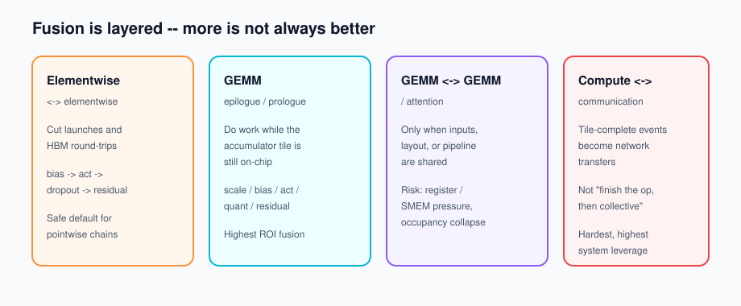
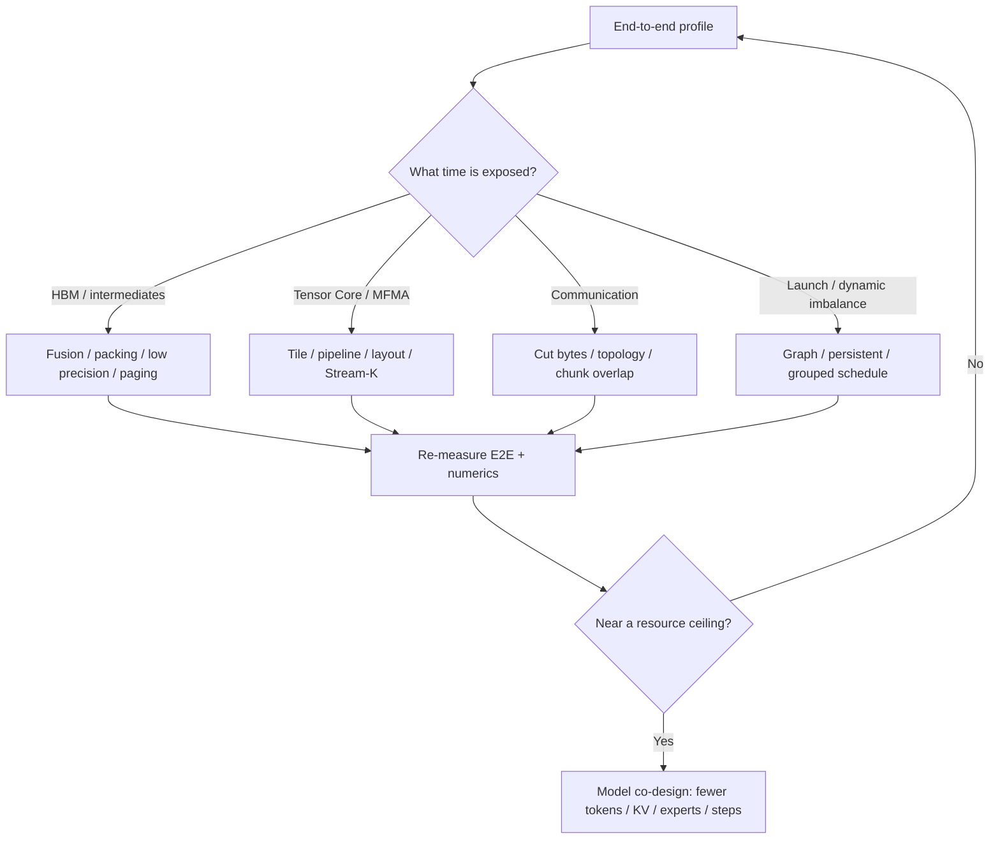

# Foundation Model Kernel Optimization in 2026: A Field Guide Across Dense, MoE, Multimodal, and Diffusion

Most “kernel optimization” conversations still start with FLOPs. In 2026 that is usually the wrong first question. Foundation-model runtime is dominated by **HBM traffic, KV cache, temporary tensors, collectives, dynamic permutation, and launch overhead**. FlashAttention, fused linear–cross-entropy, paged KV, MoE grouped GEMM, and DeepEP-style dispatch all share one essence: *do not materialize intermediates*, or *make each byte travel once*.

This post is a field guide to the kernel / fused-kernel / collective *families* that matter on critical paths — Dense Transformers, MoE, LLM train/serve, VLM / audio / video, contrastive multimodal training, Diffusion / DiT, and SSM / long convolution — plus the communication, memory, layer-structure, and model–kernel co-design moves that decide whether a fast op shows up in end-to-end tokens/s.

**Scope note.** “Every kernel” here means families on the critical path, not every CUDA symbol in a framework. Batch, sequence length, hidden size, GPU generation, and parallel strategy spawn different instances; symbol-level enumeration is unstable and rarely useful.

Related posts on this blog: [Roofline](../roofline-first-step-of-performance-optimization/), [GPU Optimization Playbook](../gpu-optimization-playbook/), [Large MoE Performance](../large-moe-from-sparsity-to-communication/), [torch.compile](../torch-compile-from-bytecode-to-triton/), [VLM one-GPU recipe](../optimizing-vlm-training-on-one-gpu/).

## TL;DR

1. **Optimize data movement first**, not peak FLOPs. Fusion, paging, packing, and low precision win by cutting bytes and launches.
2. **Fusion is layered.** Elementwise chains are cheap wins; GEMM epilogue fusion is the safe high-ROI boundary; GEMM↔GEMM and compute↔comm fusion need shared layout/pipeline and can hurt occupancy.
3. **Train ≠ prefill ≠ decode.** Prefill is large-GEMM heavy; decode is GEMV / small-GEMM + KV bandwidth; training adds backward, optimizer, and cross-rank sync.
4. **Attention co-design is hardware-asymmetric.** FA1 fixed IO; FA2 fixed work partition; FA3 used Hopper TMA/WGMMA; FA4 rebalances Blackwell Tensor Core / SFU / TMEM / 2-CTA ratios.
5. **MoE is a pipeline.** Router → top-k → histogram → permute → All-to-All → grouped GEMM → act → combine. Speeding only expert GEMM often amplifies communication.
6. **Overlap needs finer dependencies** than “another CUDA stream.” Chunk/tile/threadblock events beat whole-tensor collectives.
7. **Memory has six levers:** dematerialize, compress, pack/page/layout, recompute, shard/offload/prefetch, allocator lifetime. Peak GB alone is a bad KPI.
8. **Multimodal’s biggest lever is usually token budget** (native resolution, packing, temporal sparsity) — architecture–runtime co-design, not one vision kernel.
9. **Diffusion’s unique lever is cross-timestep redundancy** (cache, fewer steps, CFG parallel) — fewer full-network calls, not only faster ops.
10. **End-to-end KPIs win.** Kernel TFLOP/s without graph-break / layout / exposed-comm / p99 / quality checks is storytelling.

## 1. A practical performance model

For a kernel or path, a lower bound looks like:

\[
T \gtrsim \max\left(
\frac{F}{P_{\text{effective}}},
\frac{B_{\text{HBM}}}{BW_{\text{HBM}}},
\frac{B_{\text{net}}}{BW_{\text{net}}}
\right)
+T_{\text{launch}}+T_{\text{sync}}+T_{\text{imbalance}}
\]

- \(F\): useful FLOPs; \(P_{\text{effective}}\) is limited by Tensor Core use, tile choice, occupancy, dependency chains, SFU throughput.
- \(B_{\text{HBM}}\): bytes that actually cross HBM — materialization, cold KV, layout copies inflate this beyond logical tensor size.
- \(B_{\text{net}}\): NVLink / PCIe / IB bytes; topology, algorithm, message granularity, and congestion set effective bandwidth.
- Launch / sync / imbalance dominate small-batch, short-sequence, fine-grained MoE, and ragged workloads.

NVIDIA’s [Nsight Compute Profiling Guide](https://docs.nvidia.com/nsight-compute/ProfilingGuide/index.html) splits kernels into memory- vs compute-bound. Foundation models need two more axes: **network** and **launch / load imbalance**. For the arithmetic-intensity framing, see [Roofline on this blog](../roofline-first-step-of-performance-optimization/).

### 1.1 Symptom → direction

| Profiling symptom | Common root cause | Prefer | Easy trap |
|---|---|---|---|
| High DRAM, low Tensor Core | Bandwidth-bound; repeated intermediates | Fusion, in-place, low precision, reuse, packing | Oversized fusion → spill → more local-memory traffic |
| Low Tensor Core *and* low DRAM | Small shapes, launch-bound, SFU/deps, low occupancy | Persistent kernels, batch/group, Stream-K, CUDA Graph | Chasing occupancy alone |
| High Tensor Core but far from peak | Bad tiles, pipeline bubbles, wave quantization, tails | Autotune, split-K/Stream-K, warp specialization, async copy | Overfitting one benchmark shape |
| Many memcpy / layout kernels | Producer/consumer layout mismatch | Unified layout, prepack, transpose/quant in prologue/epilogue | Benchmarking only GEMM |
| Long NCCL, idle compute | Exposed collective | RS/AG split, chunk/tile overlap, topology, compression | Stream overlap with whole-tensor deps |
| NCCL and compute both slow | SM / L2 / HBM / NVLink contention | Cap comm CTAs, priority, double buffer, staged overlap | “More overlap is always better” |
| MoE expert GEMM long tail | Uneven tokens/experts; many tiny GEMMs | Grouped GEMM, block-sparse, persistent schedule, balancing | Capacity padding waste; sort becomes bottleneck |
| Decode slows linearly with context | KV bandwidth / capacity | GQA/MQA/MLA, paged/quantized KV, split-KV decode | Swapping only the prefill FlashAttention kernel |
| High peak memory, moderate HBM BW | Overlapping activation / logits / workspace lifetimes | Selective recompute, chunked loss, buffer reuse | Full checkpoint everywhere |

## 2. A dictionary of techniques

| Technique | Dataflow essence | Typical targets | When it pays |
|---|---|---|---|
| IO-aware tiling | Keep working set in register / SMEM / LDS / TMEM | Attention, GEMM, FFT conv | Arithmetic intensity available but materialization kills it |
| Multistage pipeline | Overlap async load / MMA / epilogue | GEMM, attention | Large stable tiles; `cp.async` / TMA available |
| Warp specialization | Split producer / consumer / softmax / epilogue | Hopper/Blackwell attention & GEMM | One warp juggling copy+compute creates bubbles |
| Vertical fusion | Merge consecutive ops | bias→act→dropout→residual→norm | Pointwise/reduction with large intermediates |
| GEMM epi/prologue fusion | Scale/bias/act/quant/residual while tile is on-chip | Linear, MLP, projectors, DiT | GEMM followed by low-intensity ops |
| Horizontal fusion | Share one input read across ops | QKV, gate+up, multi-LoRA | Shared HBM/L2 traffic |
| Persistent kernel | Resident CTAs pull tiles/tasks from a queue | Small/heterogeneous GEMM, decode, MoE | Launch / wave quantization / dynamic schedule dominate |
| Split-K / Stream-K | Partition K or iteration space, then reduce | Skinny GEMM, decode attention | Small M/N underfills SMs; pay partial reduction |
| Layout / prepack / swizzle | Coalesced global→shared→MMA path | INT4/FP8 GEMM, KV, MoE | Offline weight rearrange; amortize conversion |
| Lower precision | Fewer bytes + higher TC throughput | FP8/FP4/INT8/INT4, KV | Native scale/dequant kernels for the target shape |
| Sparsity | Skip zero / unimportant blocks | Local/sparse attention, MoE, video | Block-structured; index cost < savings |
| Packing / ragged | Kill padding via offsets / `cu_seqlens` | NLP / VLM / audio / video | Large length/resolution variance |
| Paging | Fixed pages + indirection | KV cache, LoRA adapters | Dynamic serving; unpredictable lengths |
| Recomputation | Drop cheap intermediates; recompute in bwd | Attention stats, activations | Capacity-bound and recompute FLOPs are cheap |
| Compute–comm overlap | Finer tile/chunk dependencies | TP / FSDP / EP / CP | Large enough comm with independent compute windows |
| Architecture co-design | Shrink state, tokens, branches, interaction range | GQA/MLA, NSA, SigLIP, TeaCache | Kernels near hardware limits; change the problem |

### 2.1 Different GPU generations want different “good” kernels

| Platform | Critical primitives | Kernel design focus |
|---|---|---|
| NVIDIA A100 / SM80 | Tensor Core, `cp.async`, shared memory | Warp-level MMA, multi-stage copy/compute, FA1/FA2 + classic CUTLASS |
| NVIDIA H100 / SM90 | TMA, WGMMA, clusters, warp-groups | Producer/consumer specialization, TMA descriptors, async WGMMA; FA3 / CUTLASS 3.x — see [Hopper Tuning Guide](https://docs.nvidia.com/cuda/hopper-tuning-guide/index.html) |
| NVIDIA B200/GB200 / SM100 | `tcgen05.mma`, TMEM, 2-CTA MMA, FP4/FP6/FP8 | Accumulators in TMEM, single-thread MMA issue, dual-CTA tiles; rebalance TC vs SFU/SMEM — [CUTLASS tcgen05](https://docs.nvidia.com/cutlass/4.6.0/media/docs/pythonDSL/mma_docs/tcgen05_programming.html), [FA4](https://arxiv.org/abs/2603.05451) |
| AMD MI300X/MI350 | MFMA, LDS, HBM, XCD/L2, hipBLASLt/CK/RCCL | Wavefront/LDS banks, MFMA tiles, XCD/NUMA + RCCL topology; Triton ports need re-autotune — [ROCm workload tuning](https://rocm.docs.amd.com/en/latest/how-to/rocm-for-ai/inference-optimization/workload.html) |

Do not copy H100 block sizes, warp counts, and stage counts onto B200 or MI300X. Tensor Core throughput often outruns SFU, register bandwidth, SMEM, and the network — the non-matmul and orchestration paths become the new Amdahl bottleneck.

## 3. Dense Transformer / LLM / sequence kernels

Notation: `B` batch, `S` sequence, `H` hidden, `V` vocab, `D` head dim. Covers train fwd/bwd, prefill, decode, loss, optimizer.

| ID | Kernel / path | Main bottleneck | How to optimize | Co-design & references |
|---|---|---|---|---|
| T01 | Linear / GEMM (fwd, dgrad, wgrad) | Large shapes compute-bound; skinny/tail under-utilized; epilogue BW | Hierarchical tiles; async global→SMEM; TC MMA; double buffer; warp specialization; CTA swizzle; Stream-K/split-K; bias/act/scale/quant/residual epilogue fusion; shape autotune | [CUTLASS efficient GEMM](https://github.com/NVIDIA/cutlass/blob/main/media/docs/cpp/efficient_gemm.md), [Stream-K](https://arxiv.org/abs/2301.03598), [Triton matmul](https://triton-lang.org/main/getting-started/tutorials/03-matrix-multiplication.html), [CODA](https://arxiv.org/abs/2605.19269) |
| T02 | Decode Linear / GEMV / small GEMM | Re-read weights every token; tiny M; launch-bound | Weight-only INT4/FP8; continuous batching; persistent tile scheduler; vectorized loads; L2 reuse of activations; dequant interleaved with MMA | [Marlin](https://github.com/IST-DASLab/marlin) (prepack + async load + dequant–MMA overlap) |
| T03 | QKV projection | Triple read of `X`; three launches; layout conversion | Fuse weights into one GEMM; shared `X`; fused bias; write packed/head layout attention wants; optional Q/K RoPE + KV quant/update in epilogue | Decode: fuse KV cache update; different Q/K/V dtypes or TP shards can make forced fusion worse |
| T04 | RoPE / M-RoPE | Elementwise; sin/cos traffic; extra transpose | Vectorized pair rotation; sin/cos cache; in-place; fuse into QKV epilogue or attention prologue; inverse rotate in bwd | [Liger Kernel](https://github.com/linkedin/Liger-Kernel); VLM M-RoPE in [Qwen2-VL](https://arxiv.org/abs/2409.12191) |
| T05 | Dense attention prefill fwd | `S²` score/prob materialization | Tile Q/K/V; online softmax; keep score/prob in register/SMEM; causal/local mask inside tile; store LSE only; TMA/WGMMA pipeline; FP8 block scale | [FA1](https://arxiv.org/abs/2205.14135) → [FA2](https://arxiv.org/abs/2307.08691) → [FA3](https://arxiv.org/abs/2407.08608) → [FA4](https://arxiv.org/abs/2603.05451) |
| T06 | Attention backward | Multi-pass dQ/dK/dV; recompute; atomics; imbalance | Recompute probs from saved LSE (not `S²`); retile; split dQ vs dK/dV; sequence/head parallel; deterministic mode costs extra buffers | Fastest forward is not always lowest fwd+bwd |
| T07 | Decode attention (`q_len`≈1) | Read full K/V; memory-bound; ragged batch | Page/block-aware loads; split-KV across CTAs + small reduce; GQA-aware; dynamic load balance; JIT page size/head dim/mask; fuse LSE | [FlashInfer](https://arxiv.org/abs/2501.01005), [flash-attention KV path](https://github.com/Dao-AILab/flash-attention) |
| T08 | KV append / gather / quant | Noncontiguous pages, metadata, capacity | Fuse append with RoPE/attention; compact page tables; vector gather; choose K/V interleave by access pattern; block-scaled FP8/INT8/INT4 KV; prefix page sharing | [PagedAttention / vLLM](https://arxiv.org/abs/2309.06180); [vAttention](https://arxiv.org/abs/2405.04437) on paging costs |
| T09 | GQA / MQA / MLA | KV bytes dominate decode | Share KV across Q heads; reuse KV tiles across CTA/warp; MLA compresses to low-rank latent | [MQA](https://arxiv.org/abs/1911.02150), [GQA](https://arxiv.org/abs/2305.13245), [DeepSeek-V2 MLA](https://arxiv.org/abs/2405.04434) — model cuts bytes first |
| T10 | Sparse / local / block attention | Irregular index; low occupancy | Block-sparse / fixed windows; tile indexes; skip empty tiles; compaction + grouped schedule; avoid token-level branches | [Native Sparse Attention](https://arxiv.org/abs/2502.11089), [Faster Neighborhood Attention](https://arxiv.org/abs/2403.04690) |
| T11 | Softmax / masked softmax | Exp/reduction + HBM; SFU limits | On-chip per row/tile; online max/sum; warp shuffle; fuse mask/bias/scale; two-stage for long rows; skip negligible blocks when safe | [Triton fused softmax](https://triton-lang.org/main/getting-started/tutorials/02-fused-softmax.html); [Skip Softmax in TensorRT-LLM](https://developer.nvidia.com/blog/accelerating-long-context-inference-with-skip-softmax-in-nvidia-tensorrt-llm/) |
| T12 | RMSNorm / LayerNorm | Two reductions + R/W; small-H launch-bound | Single-CTA / multi-warp row reduce; vector loads; Welford or sum-of-squares; fuse residual/cast/quant/linear prologue | [Triton LayerNorm](https://triton-lang.org/main/getting-started/tutorials/05-layer-norm.html), [Transformer Engine normalization](https://docs.nvidia.com/deeplearning/transformer-engine/user-guide/api/c/normalization.html), Liger |
| T13 | Bias + dropout + residual + stochastic depth | Pointwise HBM round-trips; mask memory | One load/store fuse; counter-based RNG; store seed/offset or recompute mask; merge with norm or GEMM epilogue | [Triton low-memory dropout](https://triton-lang.org/main/getting-started/tutorials/04-low-memory-dropout.html) |
| T14 | GELU / SiLU / SwiGLU / GeGLU | Large gate/up intermediates; SFU | Horizontal fuse gate+up GEMM; SiLU×up in epilogue; validate approximations; recompute in bwd | [Liger](https://arxiv.org/abs/2410.10989), [CODA](https://arxiv.org/abs/2605.19269) — megakernels can kill occupancy |
| T15 | Embedding gather / scatter bwd | Irregular reads; atomics on repeats | Vectorized gather; align vocab rows; fuse scale/position/type adds; sort/dedup or warp-local aggregate before atomic | Often small, but short sequences + huge vocab/optimizer matter |
| T16 | LM-head / logits GEMM | Huge `B·S × V` output; skinny decode GEMM | Vocab parallel; split/Stream-K; compute only needed tokens; low-precision weights; **do not materialize logits** — stream tiles into online LSE/loss | [Cut Cross Entropy](https://arxiv.org/abs/2411.09009), Liger fused linear CE |
| T17 | Cross-entropy / LSE bwd | `O(BSV)` logits/prob memory | Vocab chunk; online max/sum; fuse loss / z-loss / label smoothing / grad; save per-token LSE; recompute local logits in bwd | Cut Cross Entropy reports 24 GB→1 MB loss memory on one Gemma2-2B setup — shape-dependent |
| T18 | Sampling (temp / top-k / top-p / multinomial) | Large-V sort/scan; many launches | Fuse logits→softmax→filter→sample; rejection sampling vs full sort; CUB/warp scan; device-side RNG; speculative accept/reject fuse | [FlashInfer sampling post](https://flashinfer.ai/2025/03/10/sampling.html), [API](https://docs.flashinfer.ai/api/sampling.html) |
| T19 | LoRA `XAB` + base linear | Many small GEMM/GEMV per adapter | SGMV/BGMV by adapter segment; rank buckets; A/B prepack; fuse scale+add into base epilogue; page adapters with KV | [Punica](https://arxiv.org/abs/2310.18547), [S-LoRA](https://arxiv.org/abs/2311.03285) |
| T20 | Quant / dequant / scale / swizzle | Conversion eats low-precision wins | Quant in producer epilogue; dequant in consumer mainloop; align block/token/channel scales to MMA tiles; fuse amax reductions | [TE FP8 primer](https://docs.nvidia.com/deeplearning/transformer-engine/user-guide/examples/fp8_primer.html), [blockwise scaling](https://docs.nvidia.com/deeplearning/transformer-engine/user-guide/features/low_precision_training/fp8_blockwise_scaling/fp8_blockwise_scaling.html) |
| T21 | Grad accumulation / multi-tensor scale/norm/clip | Thousands of tiny tensors | Multi-tensor apply; merge scale/unscale/finite/norm/clip; accumulate FP32 wgrad buffers; bucket with communication | [TE advanced optimizations](https://docs.nvidia.com/deeplearning/transformer-engine/user-guide/examples/advanced_optimizations.html) |
| T22 | Adam / AdamW / SGD | Param/grad/m/v/master multi-pass HBM | Multi-tensor fused update; 8-bit blockwise state; stochastic rounding; shard/offload; lazy/step fusion | [Apex FusedAdam](https://github.com/nvidia/apex/blob/master/apex/optimizers/fused_adam.py), [8-bit optimizers](https://arxiv.org/abs/2110.02861), [FlashOptim](https://arxiv.org/abs/2602.23349) |
| T23 | SSM selective scan / Mamba | Recurrence; expanded state; small-op chains | Chunk/parallel scan; keep state on-chip; fuse proj/conv/gate/scan; recompute in bwd; Mamba-2/SSD rewrite chunks as matmul | [Mamba](https://arxiv.org/abs/2312.00752), [Mamba-2/SSD](https://arxiv.org/abs/2405.21060), [official impl](https://github.com/state-spaces/mamba) |
| T24 | Long / FFT convolution | FFT transpose/complex intermediates | Map FFT factors to TC matmul; fuse FFT×pointwise×iFFT; length buckets; packed masks; precompute kernel FFT | [FlashFFTConv](https://arxiv.org/abs/2311.05908), [RubiConv](https://arxiv.org/abs/2605.08451) |

### 3.1 What “fuse elementwise and GEMM” actually means

The safe high-ROI boundary is usually the **GEMM epilogue**. For `Y = act(XW + b) * gate + residual`:

1. Mainloop accumulates `XW` on Tensor Cores.
2. While the accumulator tile is still in register/TMEM, add bias/scale.
3. Apply activation, gate, residual, dtype convert / quant.
4. Write final `Y` to HBM once.

That avoids three-to-four large intermediates. On Blackwell, accumulators live in TMEM, so epilogue traffic and SFU scheduling differ from Hopper; [CODA](https://arxiv.org/abs/2605.19269) goes further and expresses many non-attention Transformer ops as GEMM + epilogue programs.

Do **not** fuse blindly when:

- Per-thread registers explode into spills;
- Ops want incompatible tiles / parallel axes;
- Reductions need cross-CTA sync;
- One producer fans out to many consumers (fusion duplicates work);
- Dynamic shapes explode JIT variants;
- Backward recompute turns a compute-bound path slower.

### 3.2 Four generations of FlashAttention

| Generation | Binding constraint | Core move | Notes |
|---|---|---|---|
| FlashAttention-1 | `S×S` HBM IO | Tiled Q/K/V + online softmax | Algorithmic IO-awareness; no full attention matrix |
| FlashAttention-2 | Non-matmul FLOPs, parallelism | Fewer rescales/bounds checks; better block/head parallel & warp partition | Paper reports ~50–73% of theoretical FLOPs on A100 |
| FlashAttention-3 | Underused Hopper async HW | TMA producer + WGMMA consumer; warp specialization; matmul/softmax interleave; FP8 | Pipeline movement, MMA, SFU |
| FlashAttention-4 | Blackwell TC ahead of SFU/SMEM; TMEM / 2-CTA | Fully async MMA; larger tiles; software exp / conditional rescale; TMEM; 2-CTA MMA | Author notes ~1.6 PFLOP/s BF16 (~71% peak) on specific configs — see [Tri Dao’s FA4 post](https://tridao.me/blog/2026/flash4/) |

**Lesson:** when one resource gets faster, the bottleneck moves. FA4 is not “FA3 ported to Blackwell”; it rewrites the schedule around new resource ratios.

## 4. MoE: optimize the whole token–expert pipeline

With `T` tokens, `E` experts, top-k=`K`, MoE cost is not “`K` expert MLPs.” It includes `T×E` router logits, top-k, counts/offsets, permute, cross-rank dispatch/combine, imbalance tails, and the backward inverse path. For the systems framing of memory / communication / compute walls, see [Large MoE Performance](../large-moe-from-sparsity-to-communication/) on this blog.

| ID | Kernel / path | Main bottleneck | How to optimize | Co-design & references |
|---|---|---|---|---|
| M01 | Router linear | Mid/small GEMM; large `T×E` | Low-precision GEMM carefully; fuse bias/temperature; keep only top-k stats; shard-aware outputs | Keep higher accumulation precision; [DeepSeek-V3](https://arxiv.org/abs/2412.19437) aux-loss-free balancing |
| M02 | Top-k / gate softmax | Per-token sort/reduction | Warp/block selection without full sort; specialize `k∈{1,2,8}`; fuse softmax+top-k+renorm | Small `E`: one CTA; large `E`: hierarchical top-k |
| M03 | Histogram / prefix-sum / capacity | Atomics; multi-pass; CPU sync | Warp-local hist → merge; fuse scan/offsets; device-side capacity/drop; persistent queues | Capacity padding simplifies GEMM, wastes FLOPs |
| M04 | Token permute / gather / scatter | Noncontiguous HBM; full copies | Blocked CSR/COO; vector gather; fuse gate/quant; emit grouped-GEMM-ready layout; reuse inverse map in bwd | [MegaBlocks](https://arxiv.org/abs/2211.15841), [ScatterMoE](https://arxiv.org/abs/2403.08245) |
| M05 | Expert dispatch All-to-All | Small messages; cross-node; sync | Locality-aware routing; FP8 dispatch+scale; NVLink/IB hierarchy; low-latency vs high-throughput kernels; async events; double buffer | [DeepEP](https://github.com/deepseek-ai/DeepEP) |
| M06 | Expert GEMM-1 (gate/up) | Heterogeneous small M; launches | Grouped GEMM; persistent CTAs; token-count buckets; horizontal gate+up; L2 reuse | [DeepGEMM](https://github.com/deepseek-ai/DeepGEMM), [TritonMoE](https://arxiv.org/abs/2605.23911), LigerExperts |
| M07 | Expert activation / gate | Large `T·K·ffn` intermediates | Fuse SiLU×up into GEMM-1 epilogue or GEMM-2 producer pipeline; recompute in bwd | TritonMoE reports ~35% related traffic cut on their fused path — paper-specific |
| M08 | Expert GEMM-2 + local combine | Uneven GEMM; scatter + gate mul | Grouped/persistent GEMM; epilogue×gate; scatter-add to token order; warp-local accumulate; on-chip merge of same-token top-k | ScatterMoE ParallelLinear; [SonicMoE](https://arxiv.org/abs/2512.14080) on IO-aware tiles |
| M09 | Combine All-to-All | Inverse permute + network + sum; waits on slow experts | Send as output tiles ready; fuse gate/reduce/scatter after recv; aggregate by source rank | Topology and token distribution often beat single-GPU kernels |
| M10 | Load balance / drop / shared expert | Slow expert sets step tail | Device-side counts; online routing bias; expert replication; shared+routed in parallel; global batch balance | DeepSeek-V3 + DualPipe are co-design outside the kernel |
| M11 | MoE backward | Inverse permute, grouped dX/dW, gate grad, two A2As | Compact route metadata; recompute acts; persistent/grouped wgrad; overlap dgrad with A2A | Forward-only benches mislead training ROI |
| M12 | MoE mega / fused kernel | Launch / writeback / sync at boundaries | Partial megakernels; SM/CTA specialization for comm vs compute; tile queues/barriers | [Comet](https://arxiv.org/abs/2502.19811), [FLUX](https://arxiv.org/abs/2406.06858), [UniEP](https://arxiv.org/abs/2604.19241) |

### 4.1 The right overlap granularity

Bad: `full dispatch → all expert GEMMs → full combine`.

Better:

1. Chunk tokens by destination / rank / expert.
2. Enqueue grouped-GEMM tasks as chunks arrive.
3. Push completed output tiles into the combine send queue immediately.
4. Specialize communication vs compute CTAs (or event-driven streams/communicators).
5. Cap communication CTAs so they do not steal all SM/L2/HBM.

[FLUX](https://arxiv.org/abs/2406.06858) decomposes then re-fuses communication and computation at fine tiles (paper: up to ~96% communication hidden in some settings). [Comet](https://arxiv.org/abs/2502.19811) uses threadblock specialization to balance resources. The KPI is **exposed communication on the critical path**, not “did the NCCL kernel overlap.”

### 4.2 Megatron-Core MoE map (flags change by version)

As of mid-2026, Megatron-Core 0.17 MoE is a *combinator* of routing, dispatcher, parallel map, precision, fusion, overlap, and memory strategies. Authoritative sources: [Megatron-Core 0.17 MoE docs](https://docs.nvidia.com/megatron-core/developer-guide/0.17.0/user-guide/features/moe.html) and NVIDIA’s [2026 MoE tech report](https://arxiv.org/abs/2603.07685).

| Layer | Choice / flag | What changes | When / caveats |
|---|---|---|---|
| Router topology | `--moe-router-topk`; group top-k via `--moe-router-num-groups`, `--moe-router-group-topk` | Group top-k aligns routing with node/rack/expert groups | Cuts cross-domain traffic; constrains expert choice — train with placement |
| Router probability | `--moe-router-score-function softmax/sigmoid`; `--moe-router-dtype fp32` | Gate normalization and numeric path | Docs recommend FP32/FP64 router logits at high expert counts |
| Load balance | `aux_loss`, `seq_aux_loss`, `global_aux_loss`, `sinkhorn`, aux-loss-free dynamic bias | Changes routing distribution and sync needs | Global balance needs cross-rank stats; aux-loss-free still updates bias state |
| Dropless / capacity | `--moe-expert-capacity-factor`, `--moe-pad-expert-input-to-capacity` | Dropless = dynamic shapes; capacity = fixed/pad/drop | Capacity helps CUDA Graph; dropless needs p99 expert-load awareness |
| AllGather dispatcher | `--moe-token-dispatcher-type allgather` | Gather then local select — no classic token A2A, lots of activation replication | TP-only / small EP / large top-k; blows up as EP grows |
| NCCL All-to-All | `--moe-token-dispatcher-type alltoall` | Tokens only to target expert ranks | Standard EP; small-message / cross-node / dynamic-count costs |
| Flex + DeepEP | `--moe-token-dispatcher-type flex --moe-flex-dispatcher-backend deepep` | Drop cross-node redundant tokens; fused overlap | Fine-grained cross-node MoE on H100/B200 |
| Flex + HybridEP | `--moe-flex-dispatcher-backend hybridep` | TMA / IBGDA; fewer SM for comm; MNNVL/NVL72 paths | Strongly bound to GB200 NVL72-class hardware |
| Expert compute | `--moe-grouped-gemm`; TE GroupedMLP; FP8/MXFP8 | One grouped/persistent schedule over heterogeneous M | Essential for fine-grained experts |
| Router / permute fusion | `--moe-router-fusion`, `--moe-permute-fusion` | Collapse router/top-k/aux stats and permute/unpermute/gate paths | Verify numeric modes and FP8 route maps end-to-end |
| Shared expert | `--moe-shared-expert-intermediate-size` (+ `--moe-shared-expert-overlap`) | Dense shared MLP per token; can overlap with routed A2A | Changes model FLOPs/params — not a free kernel win |
| EP A2A batch overlap | `--overlap-moe-expert-parallel-comm --delay-wgrad-compute` | Merge adjacent µbatch fwd/bwd; split dgrad/wgrad for longer hide windows | Schedule/dependency optimization, not a faster collective |
| MoE Parallel Folding | Attn `TP×CP×DP×PP` vs MoE `ETP×EP×EDP×PP` | Decouple process-group maps | [Parallel Folding](https://arxiv.org/abs/2504.14960) |
| FP8 / MXFP8 | Hopper blockwise FP8; Blackwell MXFP8; route-map padding flags | Cut activation/dispatch/param-AG bytes; pad route maps to MMA alignment | Router usually stays high precision |
| Fine-grained recompute / offload | `--recompute-modules …`, `--fine-grained-activation-offloading` | Drop/recompute or D2H specific submodules | Prefer cheap large `moe_act`; full MoE recompute repeats A2A |
| CUDA Graph | Fixed capacity or `--cuda-graph-scope attn` | Dropless shape instability vs launch savings | Do not pad huge token counts just for graphs |
| Dense→MoE upcycling | `--moe-use-upcycling`, granularity flags | Split/copy dense FFN into experts from a checkpoint | Training/init strategy — reshapes grouped GEMM and comm ratios |

**Recommended triage order:** model semantics → parallel mapping (keep `EP×ETP` on NVLink/MNNVL; fold Attn vs MoE) → dispatcher → GroupedGEMM + router/permute fusion + FP8 recipe → shared-expert / batch A2A overlap / CUDA Graph / recompute-offload (ablate — contention is common).

## 5. Cross-rank communication, parallelism, and scheduling

| ID | Path | Bottleneck | How to optimize | Systems / notes |
|---|---|---|---|---|
| C01 | AllReduce (TP/DP) | Large messages; sync; topology | Ring vs tree; NVLS/NVLSTree/CollNet; bucket; RS+AG decomposition; topology-aware ranks | [NCCL env / algorithms](https://docs.nvidia.com/deeplearning/nccl/user-guide/docs/env.html) |
| C02 | ReduceScatter | Grad / row-col parallel outputs | Chunk pipeline; RS as soon as compute tiles finish; low-precision comm + high-precision accumulate | Often more natural than full AR for TP/FSDP |
| C03 | AllGather | Next-layer params/acts; peak memory | Prefetch next FSDP unit; consume by chunk; double buffer; swizzle before consumer | [Megatron-FSDP](https://docs.nvidia.com/megatron-core/developer-guide/nightly/user-guide/features/megatron_fsdp.html): overlap often keeps two units resident |
| C04 | TP linear overlap | Coarse GEMM↔AG/RS deps | Slice sequence/batch/M/N; independent streams; overlap dgrad RS with wgrad GEMM | [Megatron TP config](https://docs.nvidia.com/megatron-core/developer-guide/0.18.1/apidocs/core/core.model_parallel_config.html) |
| C05 | FSDP/ZeRO AG + grad RS | Per-layer traffic vs capacity | Layer/unit prefetch; flat buffers; stream separation; optimizer shard/offload | [ZeRO](https://arxiv.org/abs/1910.02054), [ZeRO++](https://arxiv.org/abs/2306.10209) |
| C06 | Pipeline P2P | Bubble; activation bytes | 1F1B / interleaved; virtual stages; µbatch tune; overlap P2P; activation quant | [PTD-P](https://arxiv.org/abs/2104.04473) |
| C07 | Context / sequence parallel attention | Cross-rank KV/acts | Ulysses A2A head↔sequence; Ring Attention streaming KV; USP combinations; overlap ring with tiles | [Ulysses](https://arxiv.org/abs/2309.14509), [Ring Attention](https://arxiv.org/abs/2310.01889), [USP](https://arxiv.org/abs/2405.07719), [DistFlashAttn](https://arxiv.org/abs/2310.03294) |
| C08 | MoE All-to-All | See M05/M09 | Hierarchical A2A; node-limited routing; FP8; chunk overlap | EP scale-up is often sublinear once IB dominates |
| C09 | Fused compute + collective | Op-boundary HBM/sync | Tile-complete reduce/send inside GPU kernels; fused AllReduce–RMSNorm; persistent distributed queues | [Fused communication](https://arxiv.org/abs/2305.06942), [TokenWeave](https://arxiv.org/abs/2505.11329), [TileLink](https://arxiv.org/abs/2503.20313) |
| C10 | Graph launch / runtime | Hundreds of µkernels; CPU dispatch | CUDA Graph; `torch.compile` regions; persistent megakernels; shape buckets; device-side schedulers | [torch.compile](https://docs.pytorch.org/docs/stable/generated/torch.compile.html); FlashInfer load-balanced scheduler |
| C11 | Cross-op / multi-GPU persistent megakernel | Per-op barriers and HBM edges | Lower graph to SM-level tile graph; software pipeline across ops; in-kernel communication | [Mirage Persistent Kernel](https://arxiv.org/abs/2512.22219), [ParallelKittens](https://arxiv.org/abs/2511.13940) — high engineering cost |

### 5.1 Four levels of overlap

| Level | Practice | Can it hide communication? |
|---|---|---|
| L0 Sequential | Collective after GEMM finishes | No |
| L1 Stream overlap | Whole-tensor collective || independent op | Only with independent work; deps + contention limit it |
| L2 Chunk overlap | Slice tensor; communicate chunk `i` while computing `i+1` | Usually best ROI; Megatron / Domino-style |
| L3 Tile / CTA fusion | Communicate as tiles complete; specialize CTAs | Finest grain; hardest; most hardware/topology bound |

[Domino](https://arxiv.org/abs/2409.15241) splits tensors and batches into independently advancing pieces. Measure with Nsight Systems:

\[
T_{\text{exposed-comm}} = T_{\text{step}} - T_{\text{ideal-compute-only}} - T_{\text{other}}
\]

Do not sum stream durations. Contended NCCL kernels can look “longer” while the critical path shortens.

## 6. Multimodal: vision, audio, video, fusion

Three layers matter:

1. **Input pipeline** — decode, resize, crop, normalize, resample, STFT/mel: GPU/HW decode, async prefetch, fewer layout copies.
2. **Modality encoders** — mostly Transformer/conv kernels, but token count, window/spatiotemporal sparsity, and ragged packing dominate.
3. **Fusion & losses** — projectors/resamplers, cross/joint attention, contrastive similarity, generative LM loss: kill padding, avoid `B²`/`S²` materialization, reduce global sync.

| ID | Path | Bottleneck | How to optimize | Co-design & references |
|---|---|---|---|---|
| V01 | JPEG/PNG/video decode | CPU serial; host copies | GPU/NVJPEG / HW decoder; decode+crop; pinned + async prefetch; resolution buckets | [DALI image_crop decoder](https://docs.nvidia.com/deeplearning/dali/user-guide/docs/operations/nvidia.dali.fn.decoders.image_crop.html) |
| V02 | Resize / crop / color / normalize / HWC↔CHW | Many BW-bound passes | Fuse crop-resize-normalize-cast-layout; vectorized loads; emit model dtype/layout | Keep decoder output layout aligned with patch embed |
| V03 | Patchify / patch embedding | `unfold/im2col` materialization | Strided Conv2D / implicit GEMM; fuse normalize/cast; channels-last; CLS/pos in epilogue | [ViT](https://arxiv.org/abs/2010.11929); [cuDNN Graph API](https://docs.nvidia.com/deeplearning/cudnn/v1.23.0/developer/graph-api.html) |
| V04 | 2D/3D RoPE / vision PE | Coord gen + elementwise | Precompute/compress coords; vectorized rotations; fuse into QK / attention prologue | [Qwen2-VL M-RoPE](https://arxiv.org/abs/2409.12191) |
| V05 | Global vision attention | Many image tokens; ragged resolutions | FlashAttention varlen; packing + `cu_seqlens`; tile masks; fused QKV; CP for long images | [NaViT](https://arxiv.org/abs/2307.06304); [NeMo packed sequence](https://docs.nvidia.com/nemo-framework/user-guide/25.02/sft_peft/packed_sequence.html) |
| V06 | Window / neighborhood attention | Partition/reverse copies; small mats | No window materialization; address calc in-kernel; window BMM; fuse shift/mask | [Neighborhood Attention](https://arxiv.org/abs/2204.07143), [Faster NA](https://arxiv.org/abs/2403.04690) |
| V07 | Token prune / merge / pool | Selection/reindex overhead | Block/warp top-k; compaction + prefix sum; fixed budgets; consume compact layout next layer | Worth it only if later layers shrink — prune at layer ends |
| V08 | Dynamic resolution / multimodal packing | Padding to max image/video | Pack by token budget; varlen offsets; resolution buckets; packed attention isolation; joint loss/position metadata | [Qwen2-VL](https://arxiv.org/abs/2409.12191), [Qwen2.5-VL](https://arxiv.org/abs/2502.13923), [Open-Qwen2VL](https://arxiv.org/abs/2504.00595), [VeOmni](https://arxiv.org/abs/2508.02317) |
| V09 | Vision/audio projector | Ragged inputs; layout copies | Pack then one large GEMM; fuse gate+up/norm; write LLM embedding layout; FP8 | Layout/padding often cost more than the GEMM |
| V10 | Resampler / Q-Former / Perceiver | Cross-attn over many modality tokens | Fixed latent queries; IO-tiled cross-attn; cache K/V; fixed latent count for CUDA Graph | Pay one cross-attn to shrink every later LLM layer |
| V11 | Cross-modal / joint attention | Heterogeneous lengths; complex masks | Tile-local block masks; modality-specific RoPE/bias fused; cache static-modality K/V | Early fusion raises interaction and `S²`; late/cross-attn enables KV cache |
| V12 | CLIP-style similarity GEMM | Global embedding AllGather; `B_global²` | Fuse normalize+cast; overlap AG with local similarity tiles; 2D tiling; do not store full pairwise matrix | Global negatives couple objective and communication |
| V13 | Contrastive softmax / sigmoid loss | Row/col LSE; `B²` logits | Chunked online LSE; stream similarity tiles into loss; recompute tiles in bwd | [SigLIP](https://arxiv.org/abs/2303.15343) pairwise sigmoid changes global-norm needs — negatives still matter |
| V14 | Mixup / CutMix / random erase | Host/device round-trips | Fuse with decode/normalize; device RNG; in-place; sync label mix | Heavy aug can dominate step time |
| V15–V17 | Audio decode / STFT / mel / CMVN | Variable length; FFT plans; sparse mel | GPU decode; length buckets; batched cuFFT; fuse window→mag→mel→log; Welford CMVN | [DALI ops](https://docs.nvidia.com/deeplearning/dali/user-guide/docs/operations/nvidia.dali.fn.html), [spectrogram example](https://docs.nvidia.com/deeplearning/dali/archives/dali_1_52_0/user-guide/examples/audio_processing/spectrogram.html), [mel filter bank](https://docs.nvidia.com/deeplearning/dali/user-guide/docs/operations/nvidia.dali.fn.mel_filter_bank.html) |
| V18 | Audio subsample conv / encoder attn | Ragged padding; long audio attn | Packed/bucketed conv; channels-last; varlen FA; chunked/streaming KV | Streaming fixed chunks stabilize shapes, change receptive field |
| V19 | CTC / RNN-T DP loss | `T×U×V` state | Log-space scan; keep DP frontier only; chunk vocab projection; length buckets; recompute bwd | [NVIDIA CTC/WFST memory note](https://developer.nvidia.com/blog/changing-ctc-rules-to-reduce-memory-consumption-in-training-and-decoding/) |
| V20 | Video tubelet / 3D patch embed | 3D decode/resize; token explosion | Tubelet Conv3D implicit GEMM; temporal stride; packed tokens | Temporal/spatial stride is first-order token co-design |
| V21 | Video temporal/spatial attention | `(T·H·W)²`; cross-frame redundancy | Factorized / window / block sparse; KV/feature cache; FP8+structured sparsity tiles; CP; frame/patch prune | [FPSAttention](https://arxiv.org/abs/2506.04648), [video sparse attention](https://arxiv.org/abs/2505.13389) |

### 6.1 Multimodal priority is usually tokens, not patch kernels

Approx. VLM cost with visual tokens \(S_v\): per-layer linear ~\(O((S_t+S_v)H^2)\), global attention ~\(O((S_t+S_v)^2 H)\).

- 2× faster patch embedding touches one shallow op.
- 2× fewer \(S_v\) cuts linear, attention, activation, KV, and communication on **every** later layer.
- Removing 40% padding via packing compounds the same way without changing semantics.

That is why NaViT native-resolution packing, Qwen2-VL dynamic resolution, resampler latents, and video spatiotemporal sparsity so often beat an isolated CUDA micro-optimization. Practical one-GPU stacking notes: [Optimizing VLM Training on One GPU](../optimizing-vlm-training-on-one-gpu/).

## 7. Diffusion, DiT, U-Net, generative video

Diffusion’s distinctive structure is “the same denoiser, many times.” Optimize reuse across timesteps, solver step count, CFG branching, and cross-device patch/pipeline — not only per-step kernels.

| ID | Path | Bottleneck | How to optimize | Co-design & references |
|---|---|---|---|---|
| D01 | Text encoder / conditioning | Repeated across steps | FA / fused MLP; cache prompt embeddings/KV; batch prompts; cache negative prompts | Do not re-run text encoder every denoising step |
| D02 | U-Net Conv2D/Conv3D | Large feature-map BW; workspace | cuDNN/MIOpen autotune; NHWC; TC conv; implicit GEMM; conv+bias+act fuse; reuse skip buffers | [cuDNN Graph API](https://docs.nvidia.com/deeplearning/cudnn/v1.23.0/developer/graph-api.html) |
| D03 | GroupNorm + SiLU + scale/shift | Reduction + pointwise chatter | Single-CTA/warp group reduce; fuse norm+affine+SiLU + conditioning scale-shift | Many small ops; total share is large |
| D04 | ResBlock / skip concat | Feature copies; concat materialization | Fuse residual with norm/act; view/offset concat or dual-source next conv; careful in-place | Checkpoint high-res blocks first |
| D05 | U-Net self/cross attention | High-res tokens; repeated steps | FA/SDPA; fused QKV; cache prompt K/V; window/local; attention slicing only if capacity-bound | Conditioning cacheable; Q from changing features is not |
| D06 | DiT / MMDiT linear + attention | Many image/video tokens; multimodal weights | Reuse T01–T14; FA; gate+up; FP8/FP4; CP; joint attention masks; patch packing | [DiT](https://arxiv.org/abs/2212.09748), [SD3 / MMDiT](https://arxiv.org/abs/2403.03206) |
| D07 | AdaLN / modulation | Many elementwise passes from timestep/cond | Batch small modulation GEMMs; fuse norm+modulation+residual gate | High frequency in DiT — excellent vertical fusion target |
| D08 | Timestep / sinusoidal embedding | Tiny kernels; launch noise | Vectorize / table sin/cos; CUDA Graph embedding MLP; keep scheduler scalars on device | Rarely worth more engineering than the denoiser path |
| D09 | Classifier-free guidance | 2× denoiser | Batch as `2B`; CFG-parallel across devices; fuse `u + s(c-u)`; guidance distillation removes the second pass | [xDiT](https://arxiv.org/abs/2411.01738); `2B` raises peak memory |
| D10 | Scheduler / noise update | Many scalar pointwise kernels; host sync | Fuse scale/guidance/variance/clamp/`x_t→x_{t-1}`; device RNG; graph whole step | Fewer steps via [DPM-Solver](https://arxiv.org/abs/2206.00927) / [LCM](https://arxiv.org/abs/2310.04378) is algorithmic co-design |
| D11 | VAE encode/decode | High-res conv; peak activation | Tiled encode/decode with overlap blend; channels-last; fused QKV; pipeline decode with postprocess | [Diffusers AutoencoderKL](https://huggingface.co/docs/diffusers/api/models/autoencoderkl) |
| D12 | Cross-timestep feature cache | Adjacent-step redundancy | Cache stable high-level blocks; skip by change metric; layered intervals; keep consumer layouts | [DeepCache](https://arxiv.org/abs/2312.00858), [TeaCache](https://arxiv.org/abs/2411.19108) — validate quality across prompts/resolutions/steps |
| D13 | Diffusion quant | Activation outliers; conversion tax | Native W8A8/FP8/INT4 kernels; per-token/channel/block scales; dequant+bias in epilogue; keep sensitive layers high precision | [SVDQuant](https://arxiv.org/abs/2411.05007); [INT8 DiT fused GEMM](https://arxiv.org/abs/2606.14598) — unfused quant can be slower |
| D14 | Patch / pipeline parallel | Single-sample latency; per-step device traffic | Spatial patches; displaced/async boundaries from prior-step features; PipeFusion + sequence parallel + CFG parallel | [DistriFusion](https://arxiv.org/abs/2402.19481), [PipeFusion](https://arxiv.org/abs/2405.14430), [xDiT](https://arxiv.org/abs/2411.01738) |
| D15 | Video diffusion attention / temporal | Huge spatiotemporal tokens; multi-step | Spatiotemporal factorization, window/block sparsity, CP, FP8, cache, prune | Token/step reduction usually beats micro-tuning |

### 7.1 Do not mix three kinds of speedup

| Category | Examples | What changed | Risk |
|---|---|---|---|
| Kernel | Fused GroupNorm–SiLU, FA, FP8 GEMM | Op implementation | Usually semantics-preserving; watch numerics |
| Runtime / system | CUDA Graph, DistriFusion, PipeFusion, CFG parallel | Schedule, devices, communication | Topology/shape binding; peak memory; bubbles |
| Algorithm / model | Few-step solvers, LCM, DeepCache/TeaCache, sparse attn | Call count or compute graph | Quality / stability / generalization |

Report ablations separately. “8 steps instead of 50” is not a kernel win.

## 8. Memory system: six levers, not only checkpointing

| Lever | Typical moves | Saves | Costs | Best when |
|---|---|---|---|---|
| Dematerialize | FA, fused linear-CE, GEMM epilogue, implicit GEMM, view concat | Intermediate acts/logits/windows | Harder kernels; possible recompute | Almost always first |
| Low precision / compress | FP8/FP4, INT8/INT4, 8-bit optim, quantized KV | Params, KV, optimizer, comm bytes | Scales, conversion, accuracy | Decode, huge train, bandwidth-bound comm |
| Pack / page / layout | Varlen packing, PagedAttention, LoRA paging, prepack | Padding, fragmentation, copies | Indirection, metadata, variants | Dynamic serving, multimodal ragged |
| Recomputation | Selective activation CKPT; recompute attention probs | Forward activations | Backward FLOPs/latency | Capacity-bound + cheap recompute |
| Shard / offload / prefetch | FSDP/ZeRO, CPU/NVMe offload, layer prefetch | Resident params/grads/opt | PCIe/network, double buffers | Beyond single-GPU/node capacity |
| Lifetime / allocator | Static buffers, workspace pools, in-place, CUDA Graph pools | Fragmentation & overlapping peaks | Static address/shape constraints | Stable serving shapes; long training |

### 8.1 By object

**Parameters & optimizer.** BF16 weights + FP32 master + FP32 `m/v` can dwarf the weights. FSDP/ZeRO is the capacity lever; fused/8-bit optimizers are the bandwidth/state lever. INT4 weight-only becomes decode speed only with **prepacked layout + dequant-in-mainloop** (Marlin-class designs). FP8/MXFP8/NVFP4 scale granularity must match GEMM tiles; TE distinguishes communication-compact vs GEMM-ready layouts and swizzles between them.

**Activations.** Dematerialize first, checkpoint second. Prefer selective recompute on “large storage, cheap FLOPs” ops. [Reducing Activation Recomputation in Large Transformer Models](https://arxiv.org/abs/2205.05198) combines sequence parallel with selective recompute. PyTorch’s [activation checkpointing techniques](https://pytorch.org/blog/activation-checkpointing-techniques/) and compile min-cut partitions help — until graph breaks intervene.

**KV cache.** Capacity ≈ `layers × tokens × KV_heads × head_dim × 2 × bytes`. GQA/MQA cut heads; MLA uses low-rank latents; quant cuts bytes; paging cuts fragmentation; prefix sharing cuts duplicates. Smaller pages → less fragmentation, more indirection; larger pages reverse that. KV quant must include scale reads and dequant; decode is usually BW-bound, so a little extra arithmetic often still wins.

**Workspace & allocator.** Faster cuBLASLt/cuDNN/CUTLASS/collective algos may want large workspace — OOM is not always “model tensors.” Preallocate max workspace; avoid per-token `cudaMalloc`; CUDA Graph wants stable addresses. For dynamic serving, track allocated / reserved / payload / fragmentation / page metadata separately from `max_memory_allocated`.

### 8.2 Sequence packing boundaries

Packing kills padding only if attention knows segment edges:

- Describe segments with `cu_seqlens` / offsets;
- Reset causal masks inside each segment;
- Remap position ids, RoPE/M-RoPE, and loss masks together;
- Persist multimodal special tokens, image grids, audio time indexes with pack metadata;
- Honor boundaries in backward and context parallel.

Concat + vanilla causal attention leaks across samples. See also [Why Variable Sequence Length Breaks DDP Throughput](../why-variable-sequence-length-breaks-ddp-throughput/).

## 9. Compilers, DSLs, libraries, megakernels

| Layer | Best for | Strength | Limits |
|---|---|---|---|
| cuBLASLt / cuDNN / NCCL / hipBLASLt / MIOpen / RCCL | Standard GEMM/conv/collectives | Vendor-tuned, broad coverage | Pass real shape/layout/epilogue/workspace; library edges leave fusion gaps |
| CUTLASS / CuTe / Composable Kernel | HW-specific GEMM, attention, grouped GEMM, epilogues | Fine control of tile/pipeline/TMA/WGMMA/TMEM | High maintain cost; retune per GPU gen |
| Triton | Pointwise/reduction/fused norm/loss, custom GEMM, NVIDIA/AMD prototypes | Python DSL + autotune | Extreme async / newest ISA / lowest-bit kernels may still need CuTe/CUDA/HIP |
| `torch.compile` / TorchInductor | Graph-level horizontal/vertical/epilogue fusion, memory planning | No model rewrite; improving dynamic shapes | Graph breaks / data-dependent control / custom ops shrink regions — see [torch.compile mental model](../torch-compile-from-bytecode-to-triton/) |
| nvFuser / XLA / MLIR-class | Subgraph fusion + codegen | Automatic combination search | Needs good cost models; compile time / variant explosion |
| Specialized libs | FA/FlashInfer, TE, Liger, DeepGEMM/DeepEP, Marlin | Algorithm × hardware × shape co-designed | API/layout/version/HW constraints — A/B end-to-end |
| Persistent megakernel | Decode, small-op chains, cross-op/cross-GPU pipelines | Cuts launch/HBM boundaries | Registers/SMEM, debugging, preemption, portability |

Further reading: [TorchInductor design notes](https://dev-discuss.pytorch.org/t/torchinductor-a-pytorch-native-compiler-with-define-by-run-ir-and-symbolic-shapes/747), [torch.compile tutorial](https://docs.pytorch.org/tutorials/intermediate/torch_compile_tutorial.html), [Triton persistent matmul](https://triton-lang.org/main/getting-started/tutorials/09-persistent-matmul.html), [block-scaled matmul](https://triton-lang.org/main/getting-started/tutorials/10-block-scaled-matmul.html), [ThunderKittens](https://arxiv.org/abs/2410.20399).

**Division of labor that usually works:**

1. Compile away peripheral pointwise/reshape/simple reduction/epilogue; clear graph breaks.
2. Call specialized kernels for attention, linear-CE, MoE, low-bit GEMM, decode KV, sampling.
3. Unify layouts at those boundaries so transpose/cast/contiguous copies disappear.
4. AOT/autotune-cache hot shapes; robust fallbacks for the long tail.
5. Only write a megakernel when profiles prove the op boundary itself is top bottleneck and shapes are stable.

## 10. Model–kernel co-design that actually moves the needle

| Model / algorithm change | What happens in kernels | Main win | Cost / risk |
|---|---|---|---|
| MQA / GQA | Shared KV; one KV tile serves more Q heads | KV cache & bandwidth scale with KV heads | Quality/migration; kernels must actually reuse |
| MLA | Low-rank latent KV; absorb some projections | Much smaller KV; better long-context decode | Complex transforms; specialized RoPE/latent paths |
| Native / block sparse attention | Schedule only selected blocks | Avoid useless `S²` FLOPs/bytes | Indexing, training stability, utilization |
| FlashAttention | Online softmax + tiling (math-equivalent) | No `S²` materialization | HW-specific; mask/dropout/head-dim variants |
| SwiGLU + fused gate/up | Shared input read; epilogue multiply | One fewer `X` read; no gate/up writeback | Weight concat / TP shard / layout alignment |
| Fused linear CE | Logits GEMM tiles stream into online loss | Kill `BSV` logits | Bwd recompute; cover complex loss semantics |
| Dropless block-sparse MoE | Dynamic token→expert → grouped/block-sparse GEMM | Avoid capacity pad/drop | Imbalance + tiny experts; comm may dominate |
| Aux-loss-free / locality routing | Routing controls load and network destinations | Less tail / cross-node A2A / objective interference | Training algorithm change; long-run stability |
| Dynamic visual res + packing | Schedule only real visual tokens; varlen attn | Every later layer’s FLOPs/acts/KV/comm drop | Dynamic shapes; quality vs budget; metadata |
| Resampler / fixed latents | One cross-attn → fixed token count | Stable LLM path; graph-friendly | Information bottleneck; front-end cross-attn cost |
| Sigmoid contrastive loss | No global softmax norm; stream pairwise tiles | Easier chunking; weaker global-norm coupling | Negatives still designed/communicated |
| Mamba scan / SSD | Recurrence via scan or chunk matmul | Linear sequence cost; small state | Different expressivity/parallelism; custom kernels |
| Diffusion feature cache | Skip low-change blocks across steps | Fewer full layer calls | Approx error across prompts/steps |
| Few-step diffusion / distillation | Far fewer network invocations | Multiplicative E2E gain | Retrain / quality tradeoffs |
| Quant-aware architecture | Outlier redistribute / low-rank absorb / scale-friendly blocks | Makes INT4/INT8/FP8 native kernels usable | Calibration, training complexity, HW format binding |
| CP-friendly head layout | Head/sequence splits match collectives | Pipeline attention with communication | Topology binding; short sequences may lose |

### 10.1 Two judgment criteria

**A — Does the win compound across layers?** Fewer tokens / KV / denoising steps ride through tens or hundreds of layers. A 2× faster projector does not.

**B — Does the new structure map to regular tiles?** Block sparsity, fixed latents, small top-k experts, and block scaling tend to run well. Random token-level sparsity and arbitrary tiny ragged ops often look great on paper FLOPs and lose to dense on GPUs.

### 10.2 Parallel decoder / Parallel Transformer Block

Here “parallel” is **not** tensor or pipeline parallel. It rewrites one decoder block’s dependency graph.

Serial pre-norm:

\[
u=x+\operatorname{Attn}(\operatorname{Norm}_a(x)),\qquad
y=u+\operatorname{MLP}(\operatorname{Norm}_m(u))
\]

Parallel Transformer Block (PaLM / shared-norm form):

\[
z=\operatorname{Norm}(x),\qquad
y=x+\operatorname{Attn}(z)+\operatorname{MLP}(z)
\]

Falcon-style separate-norm variant:

\[
y=x+\operatorname{Attn}(\operatorname{Norm}_a(x))+\operatorname{MLP}(\operatorname{Norm}_m(x))
\]

Because MLP no longer depends on attention output, systems gain scheduling freedom: branch-level parallelism, shared input/norm reads, horizontal QKV vs gate/up scheduling, potential collective merge after local branch combine, and freer backward reordering. It does **not** magically cut major GEMM FLOPs, and concurrent branches can contend for Tensor Cores, HBM, L2, and SMs.

[PaLM](https://arxiv.org/abs/2204.02311) uses parallel layers. [MegaScale](https://arxiv.org/abs/2402.15627) applies PTB in Megatron-LM and pipelines SP/TP AllGather/ReduceScatter with FFN linears; on a 175B / 256-GPU ablation they report MFU 47.7%→52.3% (+4.6 pp), and 53.3% with sliding-window attention — workload-specific. NeMo’s [Megatron-Core customization docs](https://docs.nvidia.com/nemo-framework/user-guide/24.07/nemotoolkit/nlp/nemo_megatron/mcore_customization.html) list Falcon’s parallel-attention/MLP variant.

| Name | What changed | Changes model semantics? |
|---|---|---|
| Parallel Transformer Block | Attn ∥ MLP inside one block | **Yes** — needs train/continued-pretrain validation |
| Tensor Parallelism | Column/row shard weights & acts | Usually math-equivalent (reduction order) |
| Pipeline Parallelism | Layers across stages + µbatches | Usually math-equivalent; schedule/bubble change |
| Blockwise Parallel Transformer | Stream attention/FFN along sequence blocks | Can be math-equivalent IO algorithm — different idea ([BPT](https://proceedings.neurips.cc/paper_files/paper/2023/hash/1bfd87d2d92f0556819467dc08034f76-Abstract-Conference.html)) |

PTB is worth considering for full pretraining (or large continued-pretrain budget) when attention and MLP durations are comparable or one branch can cover the other’s collectives, TP/SP layouts allow clean merge, and schedulers can limit resource fights. It is usually **not** a lossless kernel swap onto an existing Llama-class checkpoint for short fine-tunes.

### 10.3 Algorithmic speedups to book separately

| Change | Graph change | Where systems win | Extra validation |
|---|---|---|---|
| PTB / parallel decoder | Attn ∥ MLP | Shorter deps; shared input; more collective overlap space | Checkpoint compat, convergence, branch contention |
| Sliding-window / local–global layers | `S²` → `S·W` (+ few global layers) | Sparse/local tiles; less KV/CP traffic | Receptive field; long-range quality |
| MQA/GQA/MLA | Fewer KV heads / latent KV | Decode KV bytes/cache/network | Quality; conversion |
| Multi-Token Prediction | Extra future-token heads | Amortize hidden state; aids speculative decoding | Extra train GEMM/loss; accept rates |
| Parallel Folding | Separate Attn vs MoE process groups | Attn high TP/CP; MoE low ETP/high EP | PP boundaries; shard maps |
| Shared + routed experts | Dense branch + top-k sparse | Shared compute can cover A2A | Extra FLOPs/replication; overlap contention |
| Group top-k / locality routing | Select group then expert | Less cross-node traffic | Quality vs load bias |
| Aux-loss-free routing | Dynamic expert bias | Stable grouped GEMM/A2A without aux-loss interference | Bias stability; early OOM |
| Dense→MoE granular upcycling | Split/copy dense FFN | Reuse checkpoint; new expert shapes | Collapse; fine-expert comm share |
| Attention–SSM hybrid | Some layers linear recurrence | Linear long-seq scan; few global attn layers | State/kernels; CP mapping; quality |
| Dynamic visual tokens / resampler | Compress modality tokens | Every later layer shrinks | Detail loss; dynamic shapes |
| Diffusion cache / few-step solvers | Skip layers or cut calls | Cross-timestep reuse multiplies | Quality/generalization/stability |
| Large-batch optimizer/schedule co-design | Bigger global batch / different µbatch–PP phase | Less pipeline bubble; better GEMM/comm amortization | Sample efficiency; final quality |

Book these as **algorithmic speedup**, then ablate against kernel, communication, and runtime gains — otherwise you cannot tell whether you won by computing less, rewriting the graph, hiding communication, or making one op faster.

## 11. Priority lists by scenario

### Dense LLM training

1. Confirm BF16/FP8 GEMM and FlashAttention are actually running; clear layout/cast fallbacks.
2. Fused RMSNorm/RoPE/SwiGLU and fused linear-CE to kill large intermediates/logits.
3. Sequence packing + selective recompute for padding and activation peaks.
4. Chunk-overlap TP/FSDP AG/RS with GEMM; then pipeline schedule.
5. Fused optimizer / multi-tensor grad norm; only then chase embeddings and tiny pointwise.

### LLM prefill / high-throughput serving

1. FlashAttention varlen + continuous batching for the right head dim / mask / precision.
2. Large-GEMM epilogue fusion, FP8, shape buckets, CUDA Graph.
3. Paged KV writes, prefix sharing, chunked prefill to protect decode.
4. TP collective overlap; jointly schedule TTFT, throughput, and decode p99 — not only prefill TFLOP/s.

### LLM decode / low-latency serving

1. Cut KV bytes first: MQA/GQA/MLA, KV dtype, context, page/prefix hits.
2. Paged / split-KV decode attention; JIT/autotune batch/head/page.
3. INT4 weight-only / FP8 GEMV–small GEMM; continuous batching; persistent kernels.
4. CUDA Graph, fused sampling, LoRA SGMV/BGMV; shrink CPU scheduler/launch.
5. Multi-GPU: account for per-token TP AllReduce — small batches can be network-latency dominated.

### MoE train / serve

1. Plot token→expert/rank histograms and stage times — is it GEMM, permute, A2A, or tail?
2. Grouped/persistent GEMM + fused gate/up/activation/combine.
3. DeepEP-class dispatch/combine; FP8; hierarchical topology; chunk overlap.
4. Routing locality, placement/replication, capacity/dropless policy.
5. Only then micro-optimize router/top-k or bet on a full-path megakernel.

### VLM / image / video / audio

1. Measure effective tokens vs padding; dynamic resolution, buckets, packing.
2. Async decode/resize/normalize/resample/STFT into target dtype/layout.
3. Varlen attention, conv fusion, local/spatiotemporal sparsity in encoders.
4. Align projector/resampler with LLM layouts; fixed latents buy backend shape stability.
5. Contrastive: chunk similarity/loss and analyze AllGather; generative VLMs reuse LLM loss tricks.

### Diffusion / DiT / video generation

1. Break down one step (conv/attn/GEMM, CFG, scheduler, VAE) × step count.
2. BF16/FP8, FA/SDPA, channels-last, compile, fused QKV/norm/act.
3. Prompt/KV cache, CUDA Graph, CFG batching/parallel, scheduler fusion.
4. DeepCache/TeaCache / few-step solvers — report quality separately.
5. Multi-GPU single-sample: DistriFusion / PipeFusion / xDiT; topology and resolution set break-even.

## 12. Reproducible benchmarking & profiling

### From end-to-end to kernel

1. **Freeze the workload:** model commit, dtype, batch/token budget, length/resolution distribution, train vs serve mode, hardware, topology, software versions, power/clocks.
2. **E2E baseline:** train → step time / tokens/s / MFU / peak memory; serve → TTFT, TPOT, tokens/s, p50/p95/p99, KV footprint; diffusion → latency + quality metrics.
3. **Nsight Systems / rocprof:** holes, CPU launch, copies, exposed collectives, stream overlap, tails.
4. **Nsight Compute / ROCm Compute Profiler:** roofline, TC/MFMA, HBM/L2, occupancy, spills, SMEM/LDS, warp stalls, branches, wave quantization on top kernels.
5. **Microbench real shapes** from histograms — not only tidy `4096³`. Include warmup, JIT/autotune, workspace, layout conversion.
6. **Return to E2E** after each swap: new copies, graph breaks, comm contention, allocator behavior, or quality loss can erase kernel wins.

### Fields worth reporting per kernel

| Category | Fields |
|---|---|
| Input | `B/S/H/V/D`, ragged distribution, dtype, layout, alignment, mask/sparsity, page size, top-k/expert histogram |
| Hardware | GPU SKU/count, SM/CU, HBM, interconnect/topology, power/clock, MIG/shared state |
| Software | Driver, CUDA/ROCm, PyTorch, compiler, kernel/library commit, flags, deterministic/TF32 |
| Performance | Latency distribution, GB/s, TFLOP/s, useful FLOPs, launches, workspace, peak memory, exposed comm |
| Resources | Registers/thread, SMEM/LDS/CTA, occupancy, active warps, L2 hit, spill, TC util |
| Correctness | Abs/rel error, ULP/distribution, grads, loss curves, convergence, task quality, seeds/dropout |
| End-to-end | Tokens/s, step time, TTFT/TPOT/p99, cost/energy; same batch/quality vs baseline |

### Common benchmark mistakes

- Mixing theoretical FLOPs (including skipped padding/sparse blocks) with executed FLOPs.
- Giving the new kernel prepacked inputs while charging the baseline for conversion.
- Only testing large steady batches when serving is dynamic small-batch + long-tail context.
- Forward-only numbers for training decisions.
- Comparing CUDA-Graph’d launches against a Python/CPU-scheduled baseline.
- Quant GEMM without calibration / dequant / scale / quality / unsupported-shape fallbacks.
- Summing overlapped stream durations instead of critical path / exposed communication.
- Average expert load instead of p99 expert/rank load.
- Diffusion latency without steps, resolution, CFG, seed, scheduler, and quality.
- Numeric checks on one random tensor — miss extremes, NaN/Inf, long sequences, masks, empty experts, tail pages, unaligned shapes.

For an end-to-end PyTorch profiling workflow, see [Profiling a PyTorch Training Job End to End](../profiling-pytorch-training-end-to-end/).

## 13. An executable decision tree

### If you only have a month of engineering time

- **Week 1:** Shape/time/bytes dashboard; clear graph breaks, fallbacks, explicit copies; freeze a correctness harness.
- **Week 2:** Integrate/upgrade mature specialized kernels (FA / TE / Liger / DeepGEMM / Marlin / FlashInfer, …) and unify layouts.
- **Week 3:** One or two fused kernels on the largest memory-bound path; chunk overlap on the largest communication path.
- **Week 4:** E2E tuning, long-tail shape/failure fallbacks, numerics/convergence, p99 / multi-node retest; lock a regression matrix.

Do not start by writing a megakernel. That investment pays when profiles show the op boundary itself is the top bottleneck and shapes/deployments are stable enough to amortize the cost.

## 14. Primary-source index

### Attention, KV, serving

- [FlashAttention](https://arxiv.org/abs/2205.14135), [FlashAttention-2](https://arxiv.org/abs/2307.08691), [FlashAttention-3](https://arxiv.org/abs/2407.08608), [FlashAttention-4](https://arxiv.org/abs/2603.05451), [FA4 author notes](https://tridao.me/blog/2026/flash4/)
- [FlashInfer](https://arxiv.org/abs/2501.01005), [FlashInfer sampling](https://flashinfer.ai/2025/03/10/sampling.html)
- [PagedAttention / vLLM](https://arxiv.org/abs/2309.06180), [vAttention](https://arxiv.org/abs/2405.04437)
- [MQA](https://arxiv.org/abs/1911.02150), [GQA](https://arxiv.org/abs/2305.13245), [DeepSeek-V2 / MLA](https://arxiv.org/abs/2405.04434), [Native Sparse Attention](https://arxiv.org/abs/2502.11089)

### GEMM, fusion, precision, training kernels

- [CUTLASS](https://github.com/nvidia/cutlass), [Triton tutorials](https://triton-lang.org/main/getting-started/tutorials/index.html), [Stream-K](https://arxiv.org/abs/2301.03598), [DeepGEMM](https://github.com/deepseek-ai/DeepGEMM)
- [Transformer Engine](https://docs.nvidia.com/deeplearning/transformer-engine/user-guide/), [SmoothQuant](https://arxiv.org/abs/2211.10438), [AWQ](https://arxiv.org/abs/2306.00978), [Marlin](https://github.com/IST-DASLab/marlin)
- [Liger Kernel](https://arxiv.org/abs/2410.10989), [Cut Cross Entropy](https://arxiv.org/abs/2411.09009), [CODA](https://arxiv.org/abs/2605.19269)
- [Apex FusedAdam](https://github.com/nvidia/apex/blob/master/apex/optimizers/fused_adam.py), [8-bit optimizers](https://arxiv.org/abs/2110.02861), [FlashOptim](https://arxiv.org/abs/2602.23349)

### MoE, distributed systems, communication

- [MegaBlocks](https://arxiv.org/abs/2211.15841), [ScatterMoE](https://arxiv.org/abs/2403.08245), [SonicMoE](https://arxiv.org/abs/2512.14080), [TritonMoE](https://arxiv.org/abs/2605.23911)
- [DeepEP](https://github.com/deepseek-ai/DeepEP), [FLUX](https://arxiv.org/abs/2406.06858), [Comet](https://arxiv.org/abs/2502.19811), [DeepSeek-V3](https://arxiv.org/abs/2412.19437)
- [Megatron-Core MoE 0.17](https://docs.nvidia.com/megatron-core/developer-guide/0.17.0/user-guide/features/moe.html), [NVIDIA Megatron-Core MoE report](https://arxiv.org/abs/2603.07685), [MoE Parallel Folding](https://arxiv.org/abs/2504.14960)
- [Megatron-LM](https://arxiv.org/abs/1909.08053), [PTD-P](https://arxiv.org/abs/2104.04473), [ZeRO](https://arxiv.org/abs/1910.02054), [ZeRO++](https://arxiv.org/abs/2306.10209), [Domino](https://arxiv.org/abs/2409.15241)
- [Ulysses](https://arxiv.org/abs/2309.14509), [Ring Attention](https://arxiv.org/abs/2310.01889), [USP](https://arxiv.org/abs/2405.07719), [NCCL docs](https://docs.nvidia.com/deeplearning/nccl/user-guide/docs/env.html)
- [PaLM parallel layers](https://arxiv.org/abs/2204.02311), [MegaScale PTB](https://arxiv.org/abs/2402.15627), [Blockwise Parallel Transformer](https://proceedings.neurips.cc/paper_files/paper/2023/hash/1bfd87d2d92f0556819467dc08034f76-Abstract-Conference.html)

### Multimodal, diffusion, other architectures

- [NaViT](https://arxiv.org/abs/2307.06304), [Qwen2-VL](https://arxiv.org/abs/2409.12191), [Qwen2.5-VL](https://arxiv.org/abs/2502.13923), [SigLIP](https://arxiv.org/abs/2303.15343), [VeOmni](https://arxiv.org/abs/2508.02317)
- [DiT](https://arxiv.org/abs/2212.09748), [Stable Diffusion 3](https://arxiv.org/abs/2403.03206), [DistriFusion](https://arxiv.org/abs/2402.19481), [PipeFusion](https://arxiv.org/abs/2405.14430), [xDiT](https://arxiv.org/abs/2411.01738)
- [DeepCache](https://arxiv.org/abs/2312.00858), [TeaCache](https://arxiv.org/abs/2411.19108), [SVDQuant](https://arxiv.org/abs/2411.05007), [FPSAttention](https://arxiv.org/abs/2506.04648)
- [Mamba](https://arxiv.org/abs/2312.00752), [Mamba-2 / SSD](https://arxiv.org/abs/2405.21060), [FlashFFTConv](https://arxiv.org/abs/2311.05908)

### Hardware / tooling docs cited inline

- [Nsight Compute Profiling Guide](https://docs.nvidia.com/nsight-compute/ProfilingGuide/index.html)
- [Hopper Tuning Guide](https://docs.nvidia.com/cuda/hopper-tuning-guide/index.html)
- [CUTLASS tcgen05 programming](https://docs.nvidia.com/cutlass/4.6.0/media/docs/pythonDSL/mma_docs/tcgen05_programming.html)
- [ROCm AI inference workload tuning](https://rocm.docs.amd.com/en/latest/how-to/rocm-for-ai/inference-optimization/workload.html)
- [Transformer Engine user guide](https://docs.nvidia.com/deeplearning/transformer-engine/user-guide/)
- [PyTorch activation checkpointing techniques](https://pytorch.org/blog/activation-checkpointing-techniques/)

## 15. Closing judgment

In 2026, foundation-model kernel work is four-layer co-design:

1. **On-chip dataflow** — tiles, async copy, warp specialization, TMEM/LDS, epilogues;
2. **Operator graph** — fusion, recompute, layout, paging, persistent scheduling;
3. **Multi-GPU dataflow** — collective decomposition, tile overlap, topology, expert/token scheduling;
4. **The model itself** — GQA/MLA, sparse attention, dynamic visual tokens, MoE routing, SSM, diffusion cache / fewer steps.

The strongest recipes usually move two or three layers at once:

- **MLA + paged/quantized KV + split-KV decode kernel**
- **Dropless MoE + grouped GEMM + DeepEP + tile-level overlap**
- **Dynamic resolution + multimodal packing + varlen FlashAttention**
- **DiT + FP8 fused GEMM/attention + temporal cache + patch parallel**
- **Parallel decoder block + TP/SP chunk overlap + fused branch output/collective**
- **MoE Parallel Folding + GroupedGEMM + Flex dispatcher + shared-expert/A2A overlap**

So the right question is not “which kernel is fastest?” It is: **under real shapes, real topologies, and real precision constraints, which model expression and data layout make critical bytes cross HBM/network as rarely as possible — and keep the remaining compute saturating the machine?**
