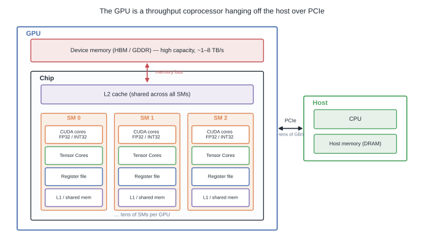
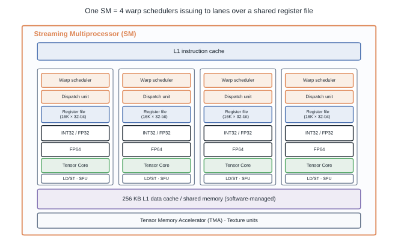
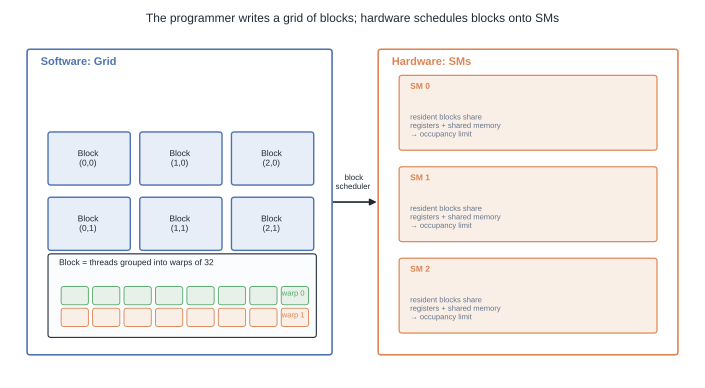
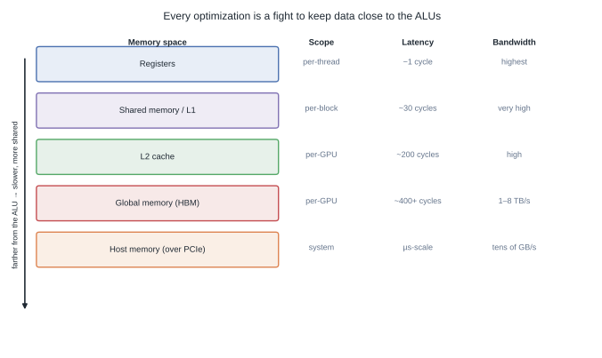
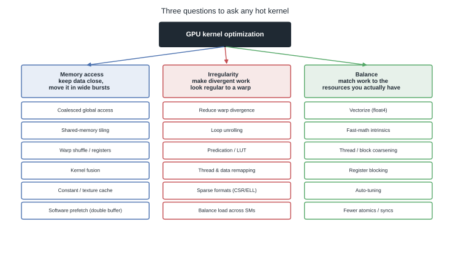
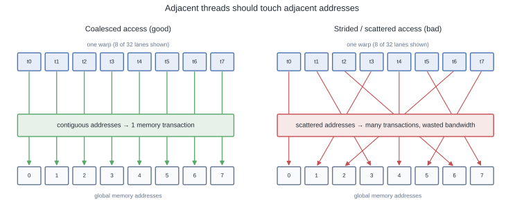
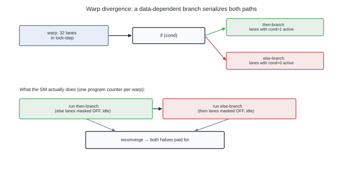

# The GPU Optimization Playbook: Architecture, Memory, and Balance

Most "GPU optimization" advice is a bag of tricks: coalesce here, unroll there, add `__restrict__` and pray. Tricks are the *output* of optimization, not the method. The method is smaller and more durable: understand the machine, find the resource that is actually saturated, and rebalance work toward the resources that are idle.

This post is organized around one claim: **almost every GPU kernel is limited by data movement, not arithmetic.** Once you internalize that, the whole catalog of techniques collapses into three questions.

## TL;DR

- A GPU is a **throughput coprocessor**: tens of SMs, each a SIMT engine running warps of 32 threads in lock-step, all hanging off the host over a narrow PCIe link.
- The programming model (grid → block → warp → thread) exists to expose *massive* parallelism so the hardware can hide memory latency by swapping warps — not to make threads fast individually.
- The memory hierarchy is the battlefield: registers → shared/L1 → L2 → HBM → host. Each step down is roughly an order of magnitude slower. **Optimization is the fight to keep data one level higher.**
- Three pillars cover the catalog: **memory access** (keep data close, move it in wide bursts), **irregularity** (make divergent work look regular to a warp), and **balance** (match work to the resources you have).
- Start with a profiler and the Roofline model, not intuition. For most teams, `torch.compile`, FlashAttention, and vendor libraries (cuBLAS, CUTLASS) beat hand-written PTX.
- Reproducible figures for this post: [`playground/gpu_optimization_figures.py`](https://github.com/duoan/duoan.github.io/blob/main/playground/gpu_optimization_figures.py).

## 1. The Machine You Are Actually Programming

You cannot optimize a machine you picture wrongly. The mental model that matters is not "thousands of tiny CPUs." It is a **latency-hiding throughput engine**.



At the top level there are two separate worlds connected by a straw:

- The **host** — your CPU and its DRAM. This is where the process lives, where kernels are launched, and where data starts.
- The **device** — the GPU, with its own high-bandwidth memory (HBM/GDDR delivering 1–8 TB/s) feeding a chip full of compute.
- The **PCIe link** between them moves only tens of GB/s. That asymmetry — TB/s on-device vs GB/s across PCIe — is the single most common source of "my GPU is idle" surprises.

Inside the chip: a large shared **L2 cache** in front of HBM, and an array of **Streaming Multiprocessors (SMs)**. The SM is the unit that actually executes your code.



An SM is partitioned into a handful of **processing blocks**, each with its own warp scheduler and dispatch unit, feeding lanes of INT32/FP32/FP64 units and **Tensor Cores**, all backed by a big **register file** and a slab of **L1 / shared memory**. The critical detail: the register file and shared memory are *finite and shared* among every warp resident on the SM. How many warps you can keep resident — the **occupancy** — is decided by how greedily each thread consumes registers and shared memory. This is why "use fewer registers" is a real optimization and not folklore: it buys you more concurrent warps to hide latency with.

## 2. The Execution Model Exists to Hide Latency

CUDA's hierarchy looks like bookkeeping. It is actually the mechanism that makes a memory-bound machine fast.



- You launch a **grid** of **blocks**. Each block is a group of threads that can share memory and synchronize with `__syncthreads()`.
- Hardware chops each block into **warps of 32 threads** that execute the *same instruction* in lock-step (SIMT).
- The block scheduler assigns whole blocks to SMs. A block stays resident until it finishes.

The point of oversubscribing an SM with many warps is **latency hiding**. When a warp issues a global-memory load and stalls for hundreds of cycles, the scheduler instantly switches to another ready warp. With enough warps in flight, the memory latency disappears behind useful work. A kernel with low occupancy has nothing to switch to, so the SM sits and waits on HBM.

This model has one sharp edge — **warp divergence** — which we return to in §5.

## 3. The Memory Hierarchy Is the Whole Game

If you remember one figure, remember this one.



Each level down is dramatically slower and more shared than the one above it. A register access is essentially free; an HBM miss can cost 400+ cycles. The entire optimization catalog is a set of strategies for **serving each byte from the highest level of this hierarchy that you can arrange.**

That reframing is what turns a pile of tricks into three questions you can ask any hot kernel:



1. **Memory access** — is data as close to the ALUs as it can be, and am I moving it in wide, contiguous bursts?
2. **Irregularity** — is divergent or scattered work forcing the warp to do redundant or serialized work?
3. **Balance** — am I matching the amount of work per thread to the registers, bandwidth, and parallelism I actually have?

This grouping follows Hijma et al.'s survey [*Optimization Techniques for GPU Programming*](https://dl.acm.org/doi/10.1145/3570638) (ACM Computing Surveys, 2023), which distilled 28 techniques from 450 papers and found them **highly interrelated** — which is exactly why auto-tuning matters and why no single trick is a silver bullet. The rest of the post walks these three pillars.

## 4. Pillar 1 — Memory Access

### Coalesce global loads

Global memory is delivered in aligned segments, not per-element. When the 32 threads of a warp read 32 contiguous addresses, the hardware fuses them into **one** transaction. Scatter those same accesses and you pay for many transactions, most of whose bytes you throw away.



The rule is simple to state and easy to violate: **make `threadIdx.x` map to the fastest-varying memory dimension.** Row-major matrices want threads striding across columns, not rows.

```cpp
// Coalesced: neighboring threads -> neighboring addresses.
int col = blockIdx.x * blockDim.x + threadIdx.x;
out[row * N + col] = in[row * N + col];  // one wide transaction per warp
```

### Reuse through shared memory (tiling)

If a value is read by many threads, read it from HBM *once* into shared memory, then let the block hammer it at ~L1 speed. Tiled GEMM is the canonical example: stage tiles of `A` and `B` into shared memory, and the arithmetic intensity of the kernel climbs from "memory-bound" to "compute-bound."

```cpp
__shared__ float As[TILE][TILE], Bs[TILE][TILE];
for (int t = 0; t < N / TILE; ++t) {
    As[ty][tx] = A[row * N + (t * TILE + tx)];
    Bs[ty][tx] = B[(t * TILE + ty) * N + col];
    __syncthreads();                 // tile is now resident for the whole block
    for (int k = 0; k < TILE; ++k)
        acc += As[ty][k] * Bs[k][tx];
    __syncthreads();
}
```

Two caveats that separate a working tiled kernel from a fast one:

- **Bank conflicts.** Shared memory is split into 32 banks. If lanes in a warp hit the same bank on different rows, accesses serialize. The classic fix is padding the leading dimension (`[TILE][TILE + 1]`) so the stride skips the conflict.
- **Warp-level reuse without shared memory.** For reductions and small exchanges, `__shfl_sync()` moves data directly between registers of a warp — no shared-memory round trip, no `__syncthreads()`.

```cpp
// Warp reduction entirely in registers.
for (int off = 16; off > 0; off >>= 1)
    val += __shfl_down_sync(0xffffffff, val, off);
```

### Fuse kernels to cut round-trips

Every separate kernel writes its output to HBM and the next kernel reads it back. A chain like `matmul → bias → GELU` as three kernels pays three HBM round-trips on the same tensor. Fusing them keeps the intermediate in registers and touches HBM once. This is exactly the win that `torch.compile` and FlashAttention monetize — fewer launches, less traffic.

### Prefetch and specialized caches

- **Software prefetch / double buffering:** while computing on the current tile, issue the loads for the next tile so transfer latency overlaps compute.
- **Constant memory:** small, read-only, broadcast data (coefficients, small weights) is cached and served to a whole warp in one shot.
- **Texture / read-only cache:** good for 2D spatial locality and irregular read-only access.

## 5. Pillar 2 — Irregularity

Regular, dense work maps beautifully onto SIMT. Real workloads are lumpy, and the lumps cost you.

### Warp divergence

Because a warp shares one program counter, a data-dependent branch forces the hardware to run **both** sides, masking off the inactive lanes on each pass. A balanced `if/else` inside a warp can halve throughput.



Mitigations, in rough order of preference:

- **Restructure so a branch aligns with warp boundaries** — if all 32 lanes take the same side, there is no divergence.
- **Predication** for tiny branches: compute both cheap results and select, avoiding a real branch.
- **Lookup tables** to replace branchy logic with a memory read.
- **Thread / data remapping** (e.g. sorting or compaction) so similar work lands in the same warp.

### Load imbalance and sparsity

If some blocks finish early while others grind on, SMs idle. Uneven work — sparse matrices, ragged batches, variable-length sequences — needs either **better data structures** (CSR/ELLPACK/COO for sparse matrices pack the nonzeros and regularize access) or **dynamic remapping** so each warp gets comparable work.

### Loop unrolling

Unrolling (`#pragma unroll`) cuts loop overhead and exposes independent instructions, improving instruction-level parallelism and giving the scheduler more to overlap. It trades registers for speed, so it interacts with occupancy — measure, don't assume.

## 6. Pillar 3 — Balance

Once data is close and warps are regular, the remaining game is matching the *amount* of work to the hardware.

### Balance the instruction stream

- **Vectorize.** Load and store `float4`/`int2` so one instruction moves 128 bits. Fewer, wider memory instructions raise effective bandwidth — when alignment allows it.
- **Fast-math intrinsics.** `__sinf`, `__expf`, `__fdividef` trade a few ULPs of accuracy for far higher throughput. Fine for many ML workloads, dangerous for numerics that need it.
- **Warp-centric programming.** Design around the warp as the unit (shuffles, ballots, warp-level primitives) rather than fighting the SIMT model thread-by-thread.

### Balance parallelism

- **Thread / block coarsening.** Sometimes *fewer* threads each doing *more* work wins: it amortizes launch and index overhead and improves register reuse. The naive "one thread per output element" is often not optimal.
- **Register blocking.** Have each thread compute a small tile of outputs held in registers, maximizing reuse of operands already loaded.
- **Auto-tuning.** Block size, tile size, and unroll factor interact non-linearly with occupancy. The right values are hardware- and shape-specific; sweep them (this is exactly what Triton's autotuner and CUTLASS do).

### Balance synchronization

- **Fewer `__syncthreads()`.** Barriers stall the whole block; hoist or eliminate the ones you can.
- **Fewer atomics.** Contended atomics serialize. Prefer hierarchical reductions (warp → block → grid) that atomically combine only partial results.
- **Cross-block coordination** via Cooperative Groups when you genuinely need grid-wide sync, instead of splitting into extra kernels.

## 7. Where to Actually Start

The catalog above is a menu, not an itinerary. Ordering matters more than completeness:

1. **Profile first.** Nsight Compute or the PyTorch profiler tells you whether you are compute-bound or memory-bound. The Roofline model turns that into a target. Optimizing in the wrong direction is the most expensive mistake in performance work — see [Roofline: The First Step of Any Performance Optimization](../roofline-first-step-of-performance-optimization/).
2. **Fix the binding constraint.** Memory-bound? Coalesce, tile, fuse. Compute-bound? Tensor Cores, lower precision, better tiling. Don't unroll a loop in a kernel that is waiting on HBM.
3. **Reach for libraries before PTX.** For the overwhelming majority of workloads, `torch.compile`, FlashAttention, cuBLAS, and CUTLASS already encode more of this playbook than you will hand-write. Custom kernels earn their keep only where a profiler proves a real, fusible gap.

The three questions — *is data close? is work regular? is it balanced?* — are enough to reason about almost any kernel without memorizing the trick list. The tricks are just the answers.

## References

- Hijma, Heldens, Sclocco, van Werkhoven, Bal, [Optimization Techniques for GPU Programming](https://dl.acm.org/doi/10.1145/3570638), ACM Computing Surveys 55(11), Article 239, 2023 — the 450-paper survey behind this post's three-pillar taxonomy.
- Williams, Waterman, Patterson, [Roofline](https://dl.acm.org/doi/10.1145/1498765.1498785), CACM 2009; NVIDIA [CUDA C++ Programming Guide](https://docs.nvidia.com/cuda/cuda-c-programming-guide/) and [DL Performance Guide](https://docs.nvidia.com/deeplearning/performance/index.html)
- Dao et al., [FlashAttention](https://arxiv.org/abs/2205.14135); Horace He, [Making Deep Learning Go Brrrr](https://horace.io/brrr_intro.html)

---

*Diagrams generated by [`playground/gpu_optimization_figures.py`](https://github.com/duoan/duoan.github.io/blob/main/playground/gpu_optimization_figures.py).*
