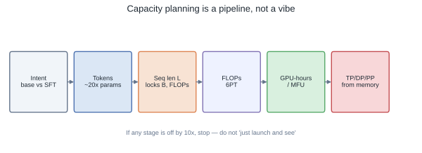
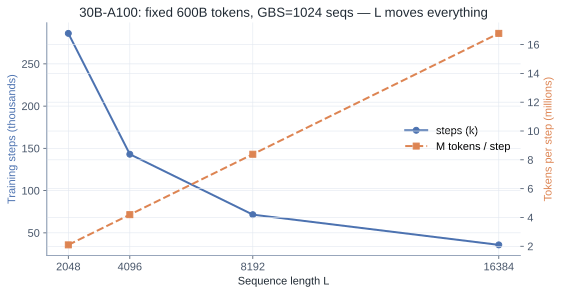
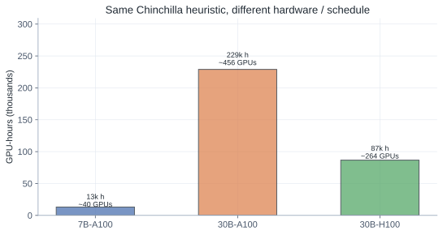
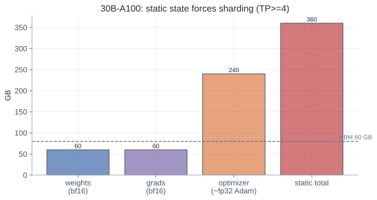
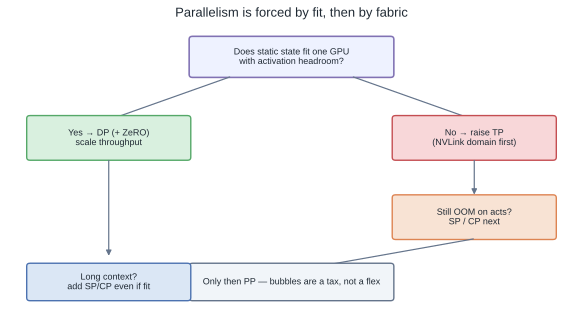

# From Scaling Laws to Cluster Size: Capacity Planning That Survives Contact With GPUs

Scaling laws tell you how loss *should* move with tokens and parameters. Clusters tell you what you can actually buy. Capacity planning is the bridge — and most teams skip it until the first failed launch burns a week of calendar time and a pile of GPU-hours.

This post is a **reproducible planning pipeline**: tokens → steps → FLOPs → GPU-hours → forced parallelism. The arithmetic lives in [`playground/capacity_plan.py`](https://github.com/duoan/duoan.github.io/blob/main/playground/capacity_plan.py); the figures below are generated from its JSON output. Not exact. Accurate enough to catch 10× fantasy plans.

## TL;DR

- Fix **intent** first (base vs SFT, context needs). Then `tokens ≈ 20 × params` as a Chinchilla-style *planning* heuristic — not a law of physics.
- Sequence length `L` dominates: it sets tokens/step, activation memory, and whether you need SP/CP.
- `FLOPs ≈ 6PT`, then `GPU-hours = FLOPs / (peak × MFU)`. Assume MFU **0.35–0.45**, not brochure peaks.
- Parallelism is forced: fit static state (weights + grads + optimizer) → TP/ZeRO → SP/CP for long context → PP last.
- Worked cases from the calculator (A100 BF16 planning): **7B ≈ 13k GPU-h**; **30B ≈ 229k GPU-h** (~$0.9M at $4/GPU-h) → ~**456 GPUs** for a 3-week wall-clock.



## Step 1 — Intent, Not Hardware

Scaling laws do not choose the product. Fix:

- Base pretrain vs instruction / reasoning SFT  
- Whether long context is a **requirement** or a résumé line  
- Multimodal extras (vision tokens inflate effective sequence length — see [SiQ curriculum](/posts/siq-vl-curriculum-under-compute-constraints/))

Those choices lock token budget, `L`, and which parallelism tax you will pay.

## Step 2 — Token Budget (Order of Magnitude)

```text
tokens ≈ tokens_per_param × params     # default tokens_per_param = 20
```

| Params | ~Token budget |
|---|---|
| 1B | 20B |
| 7B | 140B |
| 30B | 600B |

Production base models often **overtrain** past Chinchilla (Llama-class 1T+). For planning a resource-constrained run, 20× is the honest starting line. If you are off by 10×, stop.

## Step 3 — Sequence Length Locks Everything

Attention FLOPs scale ~quadratically with `L`; activation memory roughly linearly with large constants; longer `L` shrinks sequences-per-step for a fixed token batch.

| Use case | Typical L |
|---|---|
| Classic LM | 2K–4K |
| Instruction / light reasoning | 4K–8K |
| Long-context / heavy multimodal | 8K–32K |



## Step 4 — Tokens → Steps

```text
steps = tokens / (global_batch_seqs × L)
```

Example (30B case in the calculator): 600B tokens, `L=4096`, GBS=1024 sequences → **~143k steps**. If that number does not feel either “long” or “impossible,” recheck inputs.

## Step 5–6 — FLOPs → GPU-Hours

Decoder-only rule of thumb:

```text
FLOPs ≈ 6 × params × tokens
GPU-hours ≈ FLOPs / (peak_TFLOPS × MFU) / 1e12 / 3600
```

Use **sustained MFU**, not peak. The calculator defaults to ~0.40–0.42 on A100 BF16 and ~0.35 on a more communication-heavy H100 assumption.



| Case | Tokens | GPU-hours | Cluster for target | Est. $ @ listed rate |
|---|---|---|---|---|
| 7B · A100 · 14 days | 140B | ~13.1k | **40** GPUs (TP1×DP40, ZeRO-1) | ~$52k @ $4/h |
| 30B · A100 · 21 days | 600B | ~229k | **456** GPUs (TP4×DP114 w/ ZeRO-1) | ~$916k @ $4/h |
| 30B · H100 · 14 days | 600B | ~87k | **264** GPUs | ~$520k @ $6/h |

Raw JSON: [`capacity_plan_results.json`](capacity_plan_results.json). Re-run:

```bash
uv run python playground/capacity_plan.py
uv run python playground/capacity_plan_figures.py
```

## Step 7 — Memory Forces Parallelism

For 30B bf16 + AdamW-class state:

| Tensor | GB |
|---|---|
| Weights (bf16) | 60 |
| Grads (bf16) | 60 |
| Optimizer (~8 B/param) | 240 |
| **Static total** | **360** |

On 80 GB HBM that does **not** fit. TP (and/or ZeRO) is mandatory — preference is irrelevant.





**Order of attack:**

1. **Fit weights** → TP inside an NVLink domain (and ZeRO-1 to shard optimizer across DP).  
2. **Fit activations / long L** → sequence / context parallel.  
3. **Scale throughput** → DP.  
4. **Only then** pipeline parallel — bubbles are a tax.

For the 30B A100 case, naive static sharding wants high TP; **ZeRO-1** lets the planner prefer **TP=4** (two replicas per 8-GPU node) × **DP** across the cluster, PP=1. That matches the “keep TP on NVLink” instinct from MoE/MegaScale-style geometry: do not pay IB for matrix splits you can avoid.

## Step 8 — Cluster Size From Wall-Clock

```text
GPUs ≈ GPU-hours / (target_days × 24)
```

Round to node multiples. Then ask the non-FLOP questions: can the fabric absorb AllReduce at that DP? Can storage survive checkpoint storms? Async / sharded checkpointing is part of the plan, not an afterthought — at 30B, a full state is hundreds of GB.

## Step 9 — Staged Training Is Capacity Planning Too

Almost no serious run is one monolithic schedule:

- short `L` first, then extend  
- freeze towers / train projectors early (VLM)  
- offline distillation stages before RL  

Scaling laws set direction. Stages set whether you survive the first month.

## Closing

If you can estimate tokens, FLOPs, memory, and a forced TP/DP/PP map on paper, you are ahead of “launch and see.” The calculator will not replace a profiler — see [end-to-end profiling](/posts/profiling-pytorch-training-end-to-end/) and [Roofline](/posts/roofline-first-step-of-performance-optimization/) once the job exists — but it will stop you from renting the wrong cluster for the wrong token budget.

Code: [`playground/capacity_plan.py`](https://github.com/duoan/duoan.github.io/blob/main/playground/capacity_plan.py) · figures: [`playground/capacity_plan_figures.py`](https://github.com/duoan/duoan.github.io/blob/main/playground/capacity_plan_figures.py)
