# Large MoE Performance: The Three Walls After Sparsity

Sparsity made MoE cheap on paper. At production scale it made training *harder* than dense: total parameters grow with `E`, per-token FLOPs grow with `k`, and the gap between those two numbers is exactly where systems break.

The useful framing is not “optimize the MoE kernel.” It is the one NVIDIA’s Megatron-Core MoE report uses ([arXiv:2603.07685](https://arxiv.org/abs/2603.07685)): **Memory, Communication, and Compute Efficiency are three coupled walls.** Push on one and pressure shows up in another. ByteDance’s MegaScale-MoE ([arXiv:2505.11432](https://arxiv.org/abs/2505.11432)) proves the same thesis from the other direction — on 1,440 Hoppers, communication was ~44% of forward time before their redesign, and fixing parallelism + overlap delivered **1.88×** over Megatron-LM.

This post is a field guide through that co-design space, with a one-GPU Modal lab for the pieces you can still measure without a cluster.

## TL;DR

- Root cause is a **parameter–compute mismatch** (DeepSeek-V3: 685B total / 37B active ≈ 18×) plus a **dense–sparse mismatch** (attention and MoE want different parallel layouts).
- Same MoE layer ≈ **3k FLOP/B**: compute-bound on NVLink, heavily comm-bound on IB. Unoptimized cross-node A2A can eat **~60%** of step time (Megatron-Core).
- Two production stacks, concrete recipes: MegaScale = SP+EP (+13%) → inter/intra overlap (+9%/+6%) → SAR/compress; Megatron = Parallel Folding → DeepEP/HybridEP → 1F1B FWD↔BWD+W/D (EP time 30–40%→&lt;5%) → fine-grained memory + Grouped GEMM.
- Order of attack: geometry → memory headroom → dispatcher BW → hide latency → pack compute → compress. Modal A10 checks for the local walls: [`playground/moe_perf_modal.py`](https://github.com/duoan/duoan.github.io/blob/main/playground/moe_perf_modal.py).

## Why Dense Training Intuition Fails

In a dense transformer, parameters and per-token FLOPs scale together. Shard the model and you usually shard the work. MoE breaks that:

```text
P_active ≈ P_dense + k · P_expert
P_total  ≈ P_dense + E · P_expert + P_shared
```

`E` buys capacity. `k` buys compute. Communication fanout tracks **routing degree**, which wants to look like `k` machines unless you constrain it.

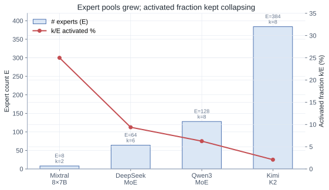

Megatron-Core names the resulting pain clearly:

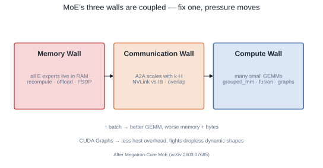

| Wall | What breaks | Typical “fix” that moves the pain |
|---|---|---|
| Memory | All `E` experts’ weights/opt states live even if `k` run | More EP → more A2A; recompute → more FLOPs; offload → PCIe |
| Communication | Dispatch/combine ≈ `T·k·H` each way; fabric drops NVLink→IB | Bigger batch → more bytes; more overlap → more scheduling complexity |
| Compute | Fine-grained experts → many small GEMMs; routing/permute tax; host sync | CUDA Graphs want static shapes; dropless MoE wants dynamic shapes |

Their measurements match what you feel in a profiler: GEMMs are ~70% of a dense Llama-405B step, but **under 50%** in DeepSeek-V3; routing/permute alone can be ~9% even after optimization. You are not “bad at CUDA.” The architecture moved the bottleneck off the Tensor Core.

## Arithmetic Intensity Still Decides the Fabric

Per-token EP traffic and expert FLOPs (SwiGLU ≈ three matmuls):

```text
bytes  ≈ 2 · k · H · sizeof(elem)      # dispatch + combine
FLOPs  ≈ k · 6 · H · I
AI     ≈ FLOPs / bytes
```

DeepSeek-V3-ish sizes (`H≈7K`, `I≈2K`, `k=8`, BF16) → **~3072 FLOP/B**.

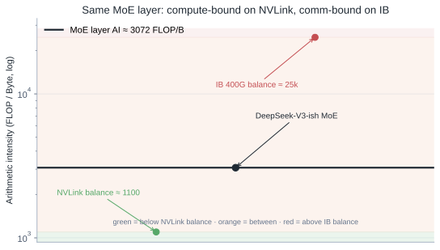

| Fabric | Balance point | MoE @ ~3k FLOP/B |
|---|---|---|
| NVLink (~900 GB/s) | ~1.1k FLOP/B | compute-bound — A2A can hide |
| IB 400G (~40 GB/s) | ~25k FLOP/B | comm-bound — A2A *is* the step |

MegaScale’s production number makes this concrete: before their rewrite, communication was **43.6% of forward** and **32% of the full step** on Hopper. Hardware got faster and precision got lower; relative communication only got worse. Extending TP across nodes pushed comm past 50% in some of their cases. That is the “sparsity stopped being free” chart in words.

## Two Production Philosophies

Once you accept the walls, you still have to choose a geometry. The two best public systems take opposite first moves — and both are coherent.

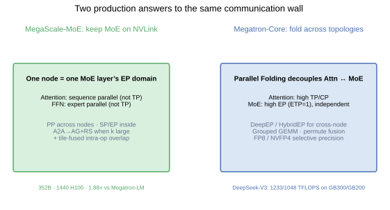

| | [MegaScale-MoE](https://arxiv.org/abs/2505.11432) | [Megatron-Core MoE](https://arxiv.org/abs/2603.07685) |
|---|---|---|
| First cut | Keep each MoE layer’s EP **inside one NVLink domain**; scale out with PP | **Parallel Folding**: Attn and MoE use independent TP/EP/DP maps |
| Cross-node EP | Avoid as the default | Embrace with DeepEP / HybridEP + overlap |
| Overlap style | Single-µbatch inter-op + **tile-fused** intra-op | **1F1B FWD↔BWD** (DualPipe-like) + W/D split |
| Published scale | 352B · 1440 H800 · **1.41M tok/s · 1.88×** vs Megatron-LM | DeepSeek-V3 **1233/1048 TFLOPS** on GB300/GB200 |

Neither is “more correct.” MegaScale wins when experts fit a node. Megatron wins when capacity forces EP across nodes — then you need a real dispatcher and a real schedule, not wishful NVLink.

## How They Actually Break Each Wall

This is the part most blog posts skip. Below is the concrete recipe book from both papers, organized by wall. The map is the section in one glance — MegaScale (green) vs Megatron-Core (blue) under each wall.

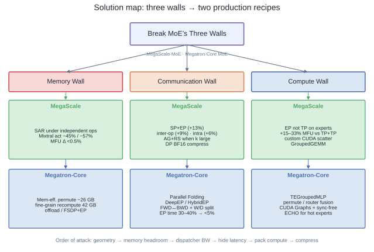

### Memory Wall — activations first, then optimizer

Megatron’s DeepSeek-V3 BF16 breakdown on 256 GPUs (`PP4×VPP4×EP64`) is the wake-up call: **131 GB activations vs 36 GB weights vs 32 GB optimizer** per GPU — 199 GB total before tricks, on an 80 GB H100. Activations dominate. Everything else is secondary.

**Zero-overhead trick (Megatron): Memory-Efficient Permutation.**  
Apply router scores *before* the expert’s second linear (`W₂(p · φ(W₁x))` instead of `p · W₂(φ(W₁x))`). Algebraically equivalent without bias. You stop saving full expert outputs for `∂L/∂p`; the fused bwd recomputes from pre-activations you already keep for SwiGLU. On their DS-V3 config: **~26 GB / GPU free, zero extra FLOPs.**

**Selective rematerialization (both).**  
Do *not* checkpoint the whole MoE layer (that re-triggers A2A). Recompute only cheap pieces and hide them under independent work.

| Target (Megatron, DS-V3) | Saved / GPU |
|---|---|
| MLA up-projection | 30.4 GB |
| LayerNorm | 8.2 GB |
| SwiGLU activation | 3.8 GB |
| **Total fine-grained recompute** | **42.4 GB** @ &lt;5% extra compute |

MegaScale’s **selective activation rematerialization** is the same idea with a scheduling twist: they rewrite the MoE layer as a macro of operators, keep expensive tensors, recompute/re-communicate cheap ones *under* independent GroupedGEMM / collectives. On Mixtral-8×7B / 8×22B: activation memory **−45% / −57%**, end-to-end memory **−21% / −35%**, MFU change **&lt;0.5%**.

**Fine-grained offload (Megatron).**  
Module-level D2H/H2D on dedicated copy engines, staggered reload in backward (one module type resident at a time). LayerNorm → recompute; big expert/attention inputs → offload. DeepSeek-V3: **−10.7% memory, −1.6% throughput**. On Qwen3-235B, the headroom lets them drop TP 2→1 and raise EP, netting **+15% throughput** at similar memory — memory work buying a better parallel geometry.

**Optimizer / FSDP (Megatron).**  
Precision-aware Adam: store moments in BF16/FP8, cast to FP32 inside FusedAdam → ~50% optimizer-state memory. Megatron-FSDP uses a **dual DeviceMesh** (dense DP mesh vs expert EDP mesh) so expert AllGather stays small; non-uniform flatten+shard + NCCL user-buffer registration for near zero-copy; overlap param gather / grad reduce on side streams.

### Communication Wall — shrink volume, then hide latency

MegaScale’s ablation on 352B / 240 GPUs is the cleanest public decomposition:

| Step | Change | Normalized throughput |
|---|---|---|
| 1 | Baseline (TP+TP, no MoE overlap) | 1.00 |
| 2 | **SP+EP** geometry | **1.13** (+13%) |
| 3 | + inter-operator overlap | **1.22** (+9%) |
| 4 | + intra-operator tile overlap | **1.28** (+6%) |

**Geometry (MegaScale, §3).**  
- Attention: Ulysses-style **SP**, not TP — critical-path bytes ≈ `2bsh(n−1)/n · (2+2/m)/n` vs TP’s `2bsh(n−1)/n` (~4× less with GQA on n=8).  
- Experts: **EP**, not TP — keeps full-width GEMMs; EP bytes ≈ `2(k/n)·bsh(n−1)/n`.  
- When `top-k ≳ EP size` (their Mixtral: **k≳6**), replace A2A with **AG + local scatter / gather + RS**. Ring collectives beat irregular A2A; custom CUDA scatter/gather replace `torch.scatter_add`.  
- Device-level balance: treat experts on one GPU as a group; aux loss + capacity at *device* granularity (DeepSeek-V2 style), not per-expert.

**Bandwidth (Megatron): DeepEP / HybridEP.**  
Token-based dispatch — **no separate permute that replicates tokens k×** before the collective. HybridEP path: route → shared mem → FIFO; inter-node first exchanges same-local-rank peers via RDMA, then fans out inside the node (intra/inter overlap). Combine **fuses reduction into the comm kernel** (no separate unpermute). On H100 EP=64 dispatch: HybridEP **4626 µs** vs NCCL A2A **9164 µs**; gaps are larger end-to-end once permute/host tax is counted. DeepEP/HybridEP still leave EP at **30–40%** of iteration if you stop here.

**Latency hide (Megatron): 1F1B FWD↔BWD + W/D split.**  
Merge neighboring microbatches so one µbatch’s forward overlaps another’s backward (DualPipe-shaped, standard 1F1B compatible). Split backward MLP into **W/mlp** (weight grad, independent of dispatch) and **D/mlp** (data grad, feeds B/dispatch) so W/mlp can fill holes when F/mlp alone is too short. With Interleaved PP + one extra warmup µbatch for dependency-free pairs: EP communication share **30–40% → &lt;5%**, **~93% overlap** on DeepSeek-V3/H100. Cost awareness: DeepEP carving ~20 SMs can cost ~20% GEMM efficiency — overlap is not free.

**Latency hide (MegaScale): two layers inside one µbatch.**  
1. *Inter-op:* custom MoE macro (not opaque `autograd`), streams + SM budgets, rematerialization under independent compute.  
2. *Intra-op:* device-memory barriers between tiles; fuse `A2A+GEMM` / `GEMM+A2A` for SP attention and `AG+scatter+GroupedGEMM` / `GroupedGEMM+gather+RS` for EP. Reorder tokens by expert then by source rank so each compute tile depends on few ranks. Across six models: combined comm+compute operators **1.2–4.7×** faster; iteration **−7–13%**. No second µbatch, no 2× activation spike.

**Compress the leftovers (MegaScale §5).**  
DP grads: keep local accumulate in FP32, cast once to BF16, **A2A shard + FP32 local reduce** (not ring-reduce in BF16) → **50% grad traffic**, loss-matched. FP8 path: FP8 A2A with per-token fwd / per-channel (group 128) bwd quant; move gate multiply after FC2 so SwiGLU does not explode ranges before quant.

### Compute Efficiency Wall — batch the small stuff, silence the host

Profiler truth from Megatron: fine-grained MoE leaves GEMMs **&lt;50%** of time (dense Llama ~70%). Routing/permute ~9% even after fusion. Host gaps from many launches + dropless shape sync.

**Grouped GEMM.** One launch, GPU-side offsets, TEGroupedMLP with FP8/FP4. Overlaps wave-tails of many small expert GEMMs. (Our Modal A10 numbers: up to **2.3×** vs naive `E` matmuls — same wall, smaller GPU.)

**Fusion stack (Megatron).** Permutation fusion (TE `--moe-permute-fusion`); router + aux-loss fusion; SwiGLU / score into GEMM epilogues. MegaScale’s experience note matches: after killing exposed comm, **attention+GroupedGEMM are only ~⅓ of a layer** — the rest is routing/scatter/gather stragglers.

**CUDA Graphs + sync-free dropless (Megatron).** Graphs kill launch tax but want static shapes; dropless routing wants dynamic counts. Sync-free paths keep shape logic on-device so the CPU leaves the critical path. **ECHO** clones hot experts onto idle ranks when load skew would otherwise stall the step.

**Why EP beats TP on experts (MegaScale).** TP shards `h_ffn` and destroys Tensor Core efficiency on already-thin experts; SP+EP beats TP+TP by **15–33% MFU** across their model zoo on one node. SP’s replicated attention params cost only **1–5%** memory and **&lt;3%** extra DP sync — asymmetry of MoE (experts dominate memory) makes SP cheap.

## Architecture Knobs That Are Actually Systems Knobs

### Group-limited routing

Cap fanout before the dispatcher. Score expert groups, pick `g` groups, then top-k inside. Cross-machine degree drops from `k` toward `g` if groups map to NVLink domains (DeepSeek-V3).

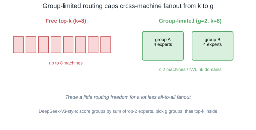

### Aux-loss-free bias vs device-group aux loss

DeepSeek-style bias separates selection from weighting (`TopK(s+b)`, weight with raw `s`), updated by `sign(mean−load)`. MegaScale still uses **aux loss + dropping at device granularity** inside a node — different layer of the same problem (soft global schedule vs hard local capacity).

### Which overlap to buy

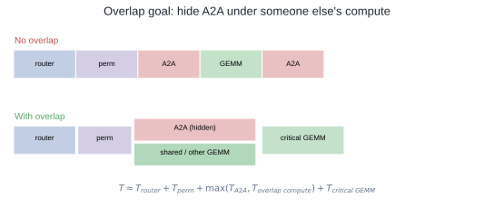

```text
T ≈ T_router + T_permute + max(T_A2A, T_overlap_compute) + T_critical_GEMM
```

| Situation | Prefer |
|---|---|
| EP ⊆ NVLink, forward has little independent work | MegaScale **tile-fused** intra-op |
| EP crosses nodes, A2A ≥30% after DeepEP | Megatron **FWD↔BWD + W/D split** |
| Memory already tight | Avoid FWD-FWD merge (2× acts); prefer FWD-BWD or tile fusion |

## One Layer → Map to Solutions

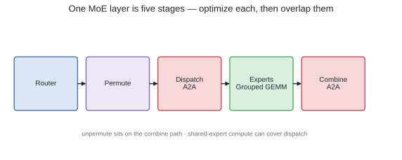

| Stage | MegaScale move | Megatron-Core move |
|---|---|---|
| Router | Tensor-only stats; fused path | Router/aux fusion; CUDA-graph friendly |
| Permute | Custom CUDA scatter/gather | Memory-efficient score placement; TE permute fusion; HybridEP fuses into send/reduce |
| Dispatch | AG+RS when k large; else A2A; stay on NVLink | Flex dispatcher: DeepEP / HybridEP |
| Experts | EP (not TP) + GroupedGEMM | TEGroupedMLP; align/pad; ECHO if skewed |
| Combine | Tile-fused gather+RS | HybridEP fused reduce; overlap under FWD/BWD |
| Around the layer | SAR under independent ops; DP BF16 compress | Fine-grained recompute/offload; FSDP+EP; 1F1B overlap |

## Modal Lab: Single-GPU Truth Checks

You cannot validate Parallel Folding or DeepEP on one Modal GPU. You *can* validate the compute and memory walls’ local symptoms.

```bash
uv run modal run playground/moe_perf_modal.py
uv run python playground/moe_perf_figures.py \
  --results playground/moe_perf_results.json \
  --out content/posts/large-moe-from-sparsity-to-communication
```

Measured on Modal A10G slot (`NVIDIA A10`), BF16, CUDA-event medians:

| Experiment | Result |
|---|---|
| Analytical MoE AI | **3072 FLOP/B** |
| Grouped GEMM `E=8` | 0.53 → 0.27 ms (**1.9×**) |
| Grouped GEMM `E=32` | 1.86 → 0.81 ms (**2.3×**) |
| Grouped GEMM large | 2.40 → 2.05 ms (**1.2×**) — math finally dominates launches |
| Permute `T=4K,H=4K,k=8` | 6.57 → 2.20 ms (**3.0×**), **268 MB** temps |
| Permute `T=8K,H=7K,k=8` | 23.1 → 7.75 ms (**3.0×**), **940 MB** temps |
| Load-balance CV | **1.53 → 0.005** with bias |

That is the Compute Wall and a slice of the Memory Wall in numbers: many experts punish launch-per-expert; permute intermediates are hundreds of megabytes per layer; bias balancing is almost too effective on a synthetic skew.

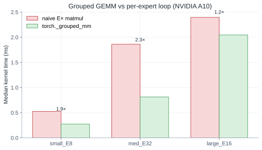

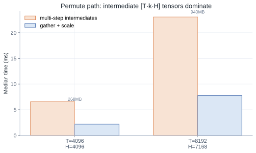

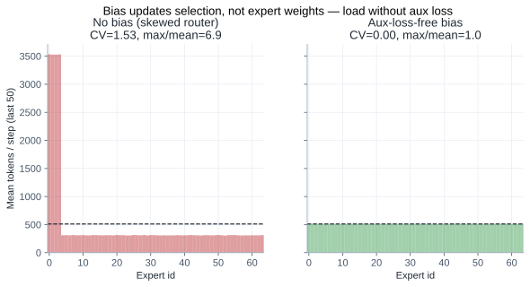

## A Practical Order of Attack

Copy the production order, not a random flag checklist:

1. **Geometry.** Can EP live on NVLink? If yes, MegaScale’s SP+EP (+13% alone in their ablation). If no, Parallel Folding + Flex dispatcher before micro-kernel work.
2. **Memory headroom.** Memory-efficient permutation → fine-grained recompute → offload only what must move. Headroom buys larger batches (more overlap fuel) and CUDA Graphs.
3. **Dispatcher bandwidth.** AG+RS when `k` large; DeepEP/HybridEP when EP leaves the node. Measure exposed A2A %, not just bus BW.
4. **Hide latency.** Tile-fused intra-op if single-µbatch; FWD↔BWD + W/D split if cross-node A2A still ≥30% after DeepEP.
5. **Compute packing.** Grouped GEMM, permute/router fusion, then Graphs/sync-free. Our Modal numbers are the cheap local proof for this step.
6. **Compress.** BF16/FP8 collective recipes *after* the schedule is honest — MegaScale’s DP BF16 path is the template.

MegaScale’s incremental stack on 352B is the mnemonic: **geometry +13% → inter-op +9% → intra-op +6%**. Megatron’s communication stack is the other mnemonic: **HybridEP cuts µs → overlap cuts 30–40% down to &lt;5%**.

## Closing

MoE training is co-design across three walls, and the two best public reports agree on the diagnosis while publishing complementary solution stacks:

- [MegaScale-MoE](https://arxiv.org/abs/2505.11432) — shrink the domain (NVLink EP), SP+EP, tile-fused overlap, SAR, DP compression → **1.88×** on 352B/1440 GPUs.
- [Megatron-Core MoE](https://arxiv.org/abs/2603.07685) — fold Attn/MoE maps, DeepEP/HybridEP, 1F1B FWD↔BWD + W/D split, fine-grained memory, Grouped GEMM/Graphs → **1233 TFLOPS/GPU** on DeepSeek-V3/GB300.

If your profiler still shows A2A at 30–50% after “enabling MoE optimizations,” you did not fail at fusion. You skipped a wall — usually geometry or dispatcher — and no epilogue flag will save you.
