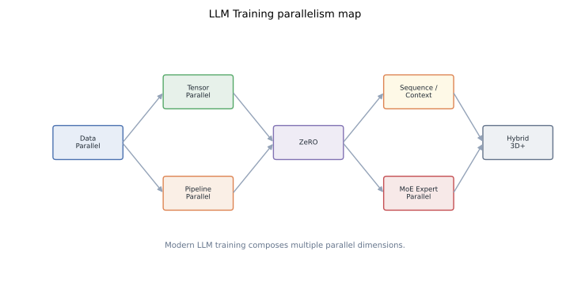

# LLM Training Series: A Systems Map for Distributed Transformers

Large language model training is a systems problem before it is a model problem. Once the model leaves one GPU, every design choice becomes a trade between memory, bandwidth, latency, scheduling complexity, and optimizer semantics.

This series builds the stack from first principles: data parallelism, tensor parallelism, pipeline parallelism, ZeRO, Megatron internals, sequence/context parallelism, ring attention, and MoE expert parallelism. The goal is not to memorize framework flags. The goal is to understand which bytes live where, which collectives move them, and why modern training systems compose several parallel dimensions at once.

## TL;DR

- **Data parallelism** scales throughput by replicating the model and splitting data. Its core problem is gradient synchronization.
- **Tensor parallelism** splits individual layers and communicates activation-sized tensors inside each Transformer block.
- **Pipeline parallelism** splits the layer stack and fights bubbles with micro-batches and scheduling.
- **ZeRO/FSDP-style sharding** keeps data-parallel semantics while partitioning optimizer state, gradients, and parameters.
- **Sequence/context parallelism** exists because long context turns activations and attention into the next bottleneck.
- **MoE parallelism** adds routing and expert placement: sparse compute saves FLOPs but creates load-balance and communication problems.
- The practical recipe is hybrid. Single-axis scaling rarely survives contact with model size, sequence length, and cluster topology.

## Reading Order

The series is designed to be read in order, but each post stands alone.

1. [Pipeline Parallelism from First Principles: Why GPipe Split the Batch](../pipeline-parallelism-gpipe/)
2. [Data Parallelism: From Parameter Server to Ring All-Reduce](../data-parallelism-ddp-ring-allreduce/)
3. [ZeRO: Partitioning Optimizer State, Gradients, and Parameters](../zero-redundancy-optimizer/)
4. [Tensor Parallelism in Megatron-LM: Splitting Layers, Not Stacks](../tensor-parallelism-megatron/)
5. [Megatron Distributed Initialization](../megatron-distributed-init/) (coming)
6. [Megatron Model Parallel Internals](../megatron-model-parallel-internals/) (coming)
7. [Megatron Mixed Precision Training](../megatron-mixed-precision-training/) (coming)
8. [MoE Expert Parallelism: Principles](../moe-expert-parallelism-principles/) (coming)
9. [DeepSpeed-Megatron MoE Internals](../moe-deepspeed-megatron-internals/) (coming)
10. [Sequence Parallelism in Megatron](../sequence-parallelism-megatron-sp/) (coming)
11. [Sequence Parallelism with Ulysses](../sequence-parallelism-ulysses/) (coming)
12. [Ring Attention](../ring-attention/) (coming)
13. [Megatron Context Parallelism](../megatron-context-parallel/) (coming)
14. [Megatron Tensor-Parallel Communication Overlap](../megatron-tp-comm-overlap/) (coming)
15. [ZeRO-3 Intra-Layer Partitioning](../zero3-intra-layer-partitioning/) (coming)

## How the Pieces Fit

A useful way to reason about distributed training is to ask what each technique partitions.

| Technique | What is partitioned? | Main communication | Main reason to use it |
|---|---|---|---|
| Data parallelism | Data batch | Gradient all-reduce | More throughput when the model replica fits |
| Tensor parallelism | Matrices, heads, vocab shards | Activation all-reduce/all-gather | Single layers are too large or too slow |
| Pipeline parallelism | Layer stack | Activation send/recv | The full stack does not fit cleanly |
| ZeRO | Optimizer state, gradients, parameters | Reduce-scatter/all-gather | Data-parallel replicas waste memory |
| Sequence parallelism | Sequence dimension activations | All-gather/reduce-scatter | Long context makes activations too large |
| Context/ring attention | Attention context blocks | Ring exchange of K/V blocks | Long-context attention exceeds memory |
| Expert parallelism | MoE experts and routed tokens | All-to-all | Sparse compute with many experts |

These axes are not substitutes. They compose.

A large dense Transformer might use tensor parallelism within each node, data parallelism across nodes, ZeRO for optimizer state, and pipeline parallelism only when the layer stack still does not fit. A long-context model may add sequence or context parallelism. A sparse MoE model adds expert parallelism and all-to-all routing.

The hard part is choosing the smallest composition that fits the model and keeps the expensive links busy.

## The Recurring Questions

Every post in the series returns to the same questions:

1. **What must be resident for this computation?** Parameters, optimizer state, gradients, activations, or temporary buffers?
2. **What can be sharded without changing semantics?** Some tensors are needed everywhere; others can be gathered just in time.
3. **What collective moves the bytes?** All-reduce, reduce-scatter, all-gather, all-to-all, send/recv, or a custom ring?
4. **Can communication overlap compute?** Raw byte count matters less when transfers are hidden.
5. **Which hardware link carries the hot path?** NVLink, PCIe, InfiniBand, Ethernet, CPU memory, and NVMe have very different roles.
6. **What new failure mode appears?** Bubbles, staleness, load imbalance, memory fragmentation, tiny collectives, or checkpoint complexity.

Answering these questions is more durable than memorizing a framework configuration.

## Suggested Path for Practitioners

If you are designing a training run, start with the simplest viable plan:

1. Estimate model-state memory and activation memory.
2. Use data parallelism if a replica fits.
3. Add ZeRO/FSDP when model states are the blocker.
4. Add tensor parallelism when individual layers or per-layer compute are the blocker.
5. Add sequence/context parallelism when context length dominates activation or attention memory.
6. Add pipeline parallelism when depth still does not fit or global scale needs another axis.
7. Add MoE/expert parallelism only when the model architecture itself is sparse.

This order is not universal, but it keeps complexity proportional to the constraint you are actually hitting.

## References

The posts cite papers in context. The core starting points are:

- Yanping Huang et al., [*GPipe: Efficient Training of Giant Neural Networks using Pipeline Parallelism*](https://arxiv.org/abs/1811.06965), NeurIPS 2019.
- Mohammad Shoeybi et al., [*Megatron-LM: Training Multi-Billion Parameter Language Models Using Model Parallelism*](https://arxiv.org/abs/1909.08053), 2019.
- Samyam Rajbhandari et al., [*ZeRO: Memory Optimizations Toward Training Trillion Parameter Models*](https://arxiv.org/abs/1910.02054), SC 2020.
- Deepak Narayanan et al., [*Efficient Large-Scale Language Model Training on GPU Clusters Using Megatron-LM*](https://arxiv.org/abs/2104.04473), SC 2021.
- William Fedus et al., [*Switch Transformers: Scaling to Trillion Parameter Models with Simple and Efficient Sparsity*](https://arxiv.org/abs/2101.03961), JMLR 2022.
