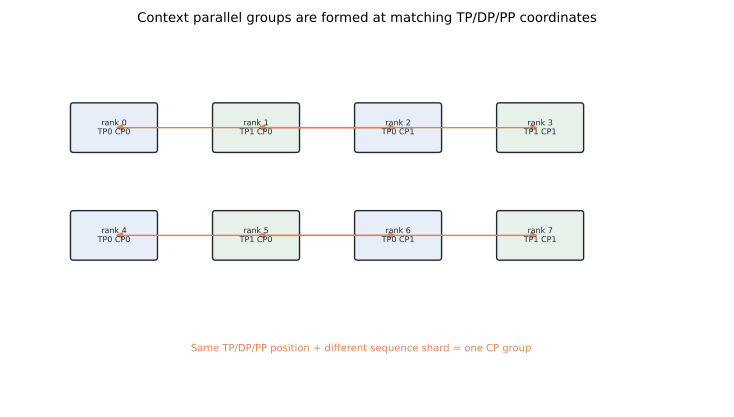
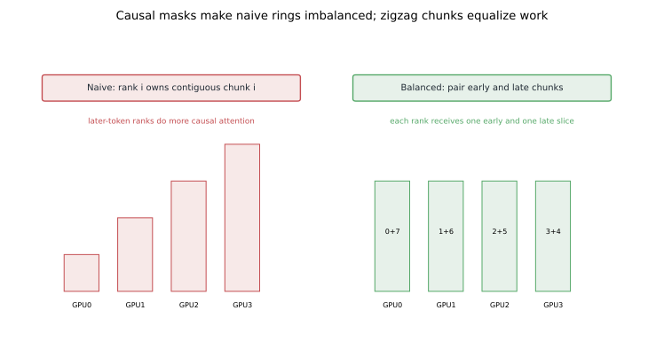
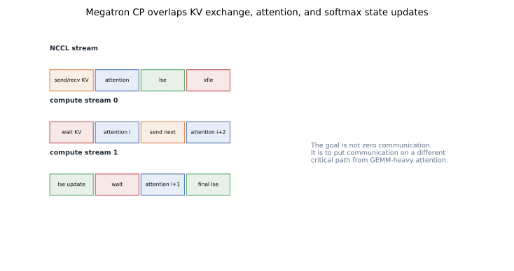

# Sequence Parallelism IV: Megatron Context Parallel and Load-Balanced Rings

Megatron Context Parallel, usually shortened to CP, brings long-context attention into Megatron's hybrid-parallel world.
It keeps the familiar tensor, pipeline, and data-parallel axes, then adds a context axis that shards the sequence.
Inside that context group, attention behaves like a ring.

The interesting part is not only that CP uses a ring.
The interesting part is that a naive ring is load-imbalanced for causal attention.
Megatron CP therefore changes how sequence chunks are assigned, so each rank receives a more even mix of early and late tokens.

This post closes the four-part sequence-parallelism set.
It builds on [Megatron SP](../sequence-parallelism-megatron-sp/), [DeepSpeed Ulysses](../sequence-parallelism-ulysses/), and [Ring Attention](../ring-attention/).
It also connects back to [Megatron tensor parallelism](../tensor-parallelism-megatron/) because CP is designed to live inside Megatron's existing process-group structure.

## TL;DR

- Context parallelism shards the sequence dimension across a CP group.
- A CP group is formed from ranks that share the same tensor, pipeline, and data-parallel coordinates but own different context chunks.
- Attention inside a CP group resembles Ring Attention: local Q chunks stay put while K/V chunks move.
- Causal masks make a contiguous naive ring imbalanced because early query chunks have less valid work than late query chunks.
- Megatron CP uses balanced or zigzag chunk placement, pairing early and late sequence slices on the same rank.
- The goal is to equalize useful attention work per ring iteration.
- CP overlaps K/V exchange with attention compute and overlaps softmax-state correction on separate CUDA streams.
- Reproducible figures for this post: [`playground/llm_training_series_figures.py`](https://github.com/duoan/duoan.github.io/blob/main/playground/llm_training_series_figures.py).

## 1. Why Megatron Needed Another Sequence Axis

Megatron SP is useful, but it is not full context parallelism.
SP reduces activation memory around tensor-parallel regions by sharding sequence-local activations.
It does not make a single attention head over a very long sequence fit by itself.

Ring Attention solves the long-context attention problem more directly.
But a production Megatron training stack already has tensor parallelism, pipeline parallelism, data parallelism, activation recomputation, mixed precision, and carefully chosen process groups.
CP is the integration point.

It says:

```text
keep Megatron's hybrid-parallel structure,
add a context dimension,
run distributed attention inside that dimension.
```

That sounds mechanical.
The details matter.

## 2. Process Groups

Assume a training job with tensor parallel size `tp`, context parallel size `cp`, data parallel size `dp`, and pipeline parallel size `pp`.
The world size is:

```text
tp * cp * dp * pp
```

Megatron builds process groups by slicing the global ranks along these axes.
For CP, the key rule is:

```text
same TP coordinate
same DP coordinate
same PP coordinate
different context coordinate
```

Those ranks own the same model shard and the same pipeline stage for the same data replica, but different sequence chunks.



This is why CP is more specific than "do Ring Attention across any ranks."
The ranks in a CP group must be compatible with the surrounding model-parallel layout.
If they are not, the attention result will not line up with tensor-parallel heads, pipeline-stage ownership, or data-parallel synchronization.

Process-group placement also has a performance implication.
Tensor-parallel and context-parallel collectives are frequent and bandwidth-hungry.
They should usually stay inside fast links when possible.
Pipeline and data-parallel groups can tolerate different topology tradeoffs depending on batch size and schedule.

## 3. Naive Ring Attention Is Imbalanced Under Causal Masks

In full bidirectional attention, every query block attends to every key block.
If each rank owns one contiguous query block, the work is evenly distributed.

Causal language-model attention is triangular.
Early query blocks attend to fewer key blocks.
Late query blocks attend to many key blocks.
If rank `0` owns the earliest tokens and rank `3` owns the latest tokens, rank `3` has much more useful work.

In a ring, ranks move in lockstep.
If one rank has little work and another rank has a lot of work, the idle rank still waits at synchronization points.
Average work does not determine performance.
Balanced per-iteration work does.



The common fix is to split the sequence into `2 * cp_size` chunks and pair early and late chunks.
For `cp_size = 4`, the assignment can look like:

```text
rank 0: chunks 0 and 7
rank 1: chunks 1 and 6
rank 2: chunks 2 and 5
rank 3: chunks 3 and 4
```

Each rank receives one early chunk and one late chunk.
The causal work is not perfectly uniform at every micro-detail, but the gross imbalance is much smaller.

This is the key idea behind the "load-balanced ring" description.
The ring schedule is not enough.
The chunk assignment must also respect the mask.

## 4. What Actually Moves

As in Ring Attention, Q stays logically local.
K/V blocks move through the CP group.
Each rank updates the output for its local query chunks using the arriving K/V chunks.
Online softmax state keeps the result exact across block updates.

The balanced placement adds bookkeeping.
A rank may own two non-contiguous chunks.
The attention mask must know which local query positions and remote key positions are valid.
Some sub-blocks are skipped because the causal mask makes them future tokens.

The implementation goal is to skip useless work without creating rank-level imbalance.
That is why chunk layout and mask logic are inseparable.

## 5. Overlap: More Than One Stream

The ring only performs well if communication overlaps with computation.
For each iteration, a rank should be able to:

1. compute attention using the current K/V block,
2. send the current or next K/V block to a neighbor,
3. receive the next K/V block from a neighbor,
4. update the online softmax state for earlier partial outputs.

Megatron CP uses separate streams to make this schedule possible.
One stream handles NCCL communication.
Compute streams handle attention and softmax-state correction.



The exact stream choreography is implementation-specific.
The principle is stable.
K/V transfer should not sit on the same critical path as the attention GEMM if the hardware can run them concurrently.
Softmax correction should also be arranged so it does not serialize every ring step.

This is similar in spirit to tensor-parallel collective overlap, discussed in [Hiding Tensor-Parallel Collectives](../megatron-tp-comm-overlap/).
The tensors differ, but the performance question is the same:
which dependencies are real, and which are artifacts of a naive schedule?

## 6. CP vs SP

Megatron SP and Megatron CP both shard sequence, but they do not solve the same bottleneck.

SP is an activation-memory optimization around tensor-parallel regions.
It shards sequence-local saved activations and uses AllGather/ReduceScatter at TP boundaries.
It does not fundamentally distribute the attention context for one head.

CP is an attention-context optimization.
It shards the sequence for attention itself and uses ring-style K/V exchange so long contexts can be processed without one rank holding the full K/V context.

In practice, they can coexist.
SP can still reduce memory around MLP and residual regions.
CP can handle the long-context attention middle.
The important thing is to distinguish which collectives belong to which ownership transition.

## 7. CP vs Ulysses

Ulysses performs an All-to-All transpose from sequence ownership to head ownership.
After the transpose, a rank has all tokens for a head slice.

CP keeps context ownership and streams K/V blocks through a ring.
A rank does not need to become the owner of all tokens for a head at once.

That difference changes scaling.
Ulysses is naturally bounded by head count unless extended.
CP is naturally tied to context chunking and ring scheduling.
Both approaches can appear in hybrid designs, but they put pressure on different parts of the network.

## 8. Debugging Mental Model

When CP is enabled, ask four questions.

First, are CP groups formed from ranks that are compatible along TP, DP, and PP axes?
If not, tensor shapes may line up accidentally while semantics are wrong.

Second, are sequence chunks assigned contiguously or in a balanced pattern?
For causal language models, contiguous assignment should raise suspicion.

Third, does the trace show neighbor K/V exchanges rather than giant global collectives?
CP should look ring-like in the attention region.

Fourth, is communication overlapped with attention compute?
If every ring step waits for receive, computes, then sends, the algorithm is correct but underperforming.

These questions catch many mistakes before diving into kernel details.

## 9. Where CP Fits in the Full Training Stack

Large Transformer training is rarely one parallelism technique.
A realistic job might use:

- tensor parallelism for per-layer GEMMs,
- pipeline parallelism for layers,
- data parallelism or ZeRO for replicas and model states,
- sequence parallelism for activation memory,
- context parallelism for long-context attention.

The challenge is not drawing five axes.
The challenge is maintaining a precise ownership story for every tensor as it crosses module boundaries.

Megatron CP is valuable because it does that for long-context attention inside Megatron's existing group structure.
It is Ring Attention adapted to a hybrid-parallel system, with causal-mask load balancing and stream overlap added because production training needs both.

## References

- NVIDIA Megatron Core context parallel documentation.
- Liu et al., [Ring Attention with Blockwise Transformers for Near-Infinite Context](https://arxiv.org/abs/2310.01889), 2023.
- Korthikanti et al., [Reducing Activation Recomputation in Large Transformer Models](https://arxiv.org/abs/2205.05198), 2022.
