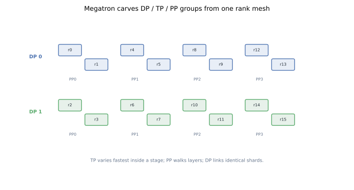
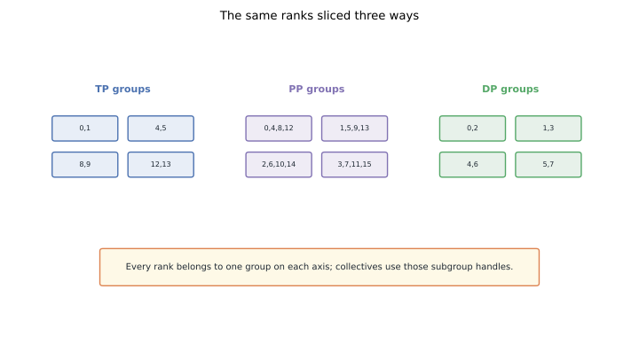
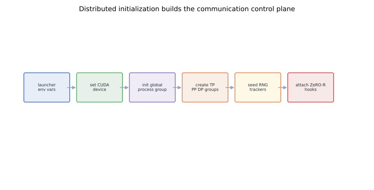

# Megatron Internals I: Building the DP / TP / PP Process Groups

Megatron-LM is often introduced through tensor parallel layers, but the first useful mental model is simpler: before a single layer runs, every process needs to know which other ranks form its data, tensor, and pipeline neighborhoods.
That is what initialization builds.
It starts one process per GPU, initializes the global `torch.distributed` group, and then carves smaller process groups out of a regular rank mesh.
Those groups become the control plane for the rest of training.

## TL;DR

- Megatron treats world ranks as a structured mesh with data parallel (DP), pipeline parallel (PP), and tensor parallel (TP) axes.
- `torch.distributed.init_process_group` creates the global rendezvous; Megatron then creates subgroup handles for DP, TP, PP, embedding, and model-parallel collectives.
- TP groups synchronize inside a layer; PP groups send activations between stages; DP groups all-reduce gradients for identical parameter shards.
- Correct seed handling matters because DP ranks must remain identical while TP and PP ranks often own different model slices.
- ZeRO-R style activation partitioning hooks into this topology after process groups exist; optimizer-state ZeRO is a data-parallel concern.
- This post is the first of three Megatron internals posts: model-parallel layers are next in [Part II](../megatron-model-parallel-internals/), mixed precision in [Part III](../megatron-mixed-precision-training/).

## 1. The question initialization answers

Distributed training code runs the same Python program on every rank.
The rank number is the only difference.
From that number, a rank must derive:

- which GPU it owns on the local node;
- which ranks jointly hold one tensor-parallel layer;
- which ranks form the pipeline path for one model replica;
- which ranks hold identical parameter shards and need DP gradient sync;
- which ranks should share random seeds and which should not.

Megatron initialization is mostly bookkeeping, but it is bookkeeping with consequences.
If a rank joins the wrong subgroup, a later collective may hang.
If a seed is shared on the wrong axis, parameter shards can repeat instead of forming one full tensor.
If DP and TP axes are swapped across slow links, the model may train correctly but waste most of its time in collectives.

## 2. Rank mesh first, process groups second

Think of `world_size` ranks as a 3D mesh:

```text
world_size = dp_size * pp_size * tp_size
rank      = f(dp_rank, pp_rank, tp_rank)
```

The precise flattening convention is implementation detail, but the invariant is not: every rank has one coordinate on each axis.



From this mesh, the subgroups are just slices.

- A **TP group** fixes `(dp, pp)` and varies `tp`.
- A **PP group** fixes `(dp, tp)` and varies `pp`.
- A **DP group** fixes `(pp, tp)` and varies `dp`.

The model-parallel group is the product of TP and PP for one data replica.
That is the set of ranks that together own one full model.

## 3. A concrete 16-rank example

Suppose:

```text
world_size = 16
tp_size    = 2
pp_size    = 4
dp_size    = 2
```

One model replica needs `tp_size * pp_size = 8` GPUs.
With 16 GPUs, we can host two data-parallel replicas.



The same physical ranks participate in multiple logical groups:

- TP: ranks with the same pipeline stage and DP replica, such as `[0, 1]`.
- PP: ranks with the same TP shard and DP replica, such as `[0, 4, 8, 12]`.
- DP: ranks with the same TP shard and PP stage across replicas, such as `[0, 2]`.

These are not extra processes.
They are subgroup handles over the same global process set.
That is why subgroup construction must happen deterministically on every rank.
Every process calls `new_group` with the same rank lists, then stores only the handles that include itself.

## 4. What `torch.distributed` does, and what it does not

PyTorch gives Megatron the global communication substrate:

```python
torch.cuda.set_device(local_rank)
torch.distributed.init_process_group(
    backend="nccl",
    init_method=f"tcp://{master_addr}:{master_port}",
    world_size=world_size,
    rank=rank,
)
```

That call creates one world group.
It does not know that rank 0 and rank 1 will all-reduce partial matrix products, or that rank 0 and rank 4 will exchange pipeline activations.
Megatron adds the semantic groups.
In pseudocode:

```python
for dp in range(dp_size):
    for pp in range(pp_size):
        ranks = [rank_of(dp, pp, tp) for tp in range(tp_size)]
        tp_group = dist.new_group(ranks)

for dp in range(dp_size):
    for tp in range(tp_size):
        ranks = [rank_of(dp, pp, tp) for pp in range(pp_size)]
        pp_group = dist.new_group(ranks)

for pp in range(pp_size):
    for tp in range(tp_size):
        ranks = [rank_of(dp, pp, tp) for dp in range(dp_size)]
        dp_group = dist.new_group(ranks)
```

Real Megatron has more groups than this.
It builds embedding groups for tied input/output embeddings, position-embedding groups, model-parallel groups, and sometimes sequence/context-parallel groups.
The shape is the same: rank lists first, handles second.

## 5. Communication meaning by axis

Each axis exists because a different tensor must move.

**Tensor parallelism** is intra-layer.

Column-parallel and row-parallel linear layers split matrix multiplication across ranks; they need all-gather or all-reduce collectives inside a transformer block.
Those mechanics are the subject of [Part II](../megatron-model-parallel-internals/).

**Pipeline parallelism** is inter-layer.

One stage owns early layers, another owns middle layers, another owns final layers.
The boundary tensor is an activation in the forward pass and an activation gradient in the backward pass.
PP is lower bandwidth than TP, but it is latency-sensitive because stages must be scheduled carefully.

**Data parallelism** is replica synchronization.

After backprop, ranks that own the same parameter shard average gradients.
The DP group is also where optimizer-state sharding methods such as ZeRO partition redundant state.
For ZeRO background and capacity planning, see [the cluster-size planning post](../large-model-capacity-plan/).

## 6. Why topology affects the mesh

The mesh is logical, but the fabric is physical.
TP usually wants the fastest links because layer collectives sit on the critical path.
A common rule is:

- keep TP inside one NVLink or high-bandwidth node;
- let DP span nodes when batch size and gradient accumulation make it tolerable;
- use PP when the model cannot fit without layer partitioning or when it reduces worse cross-node TP traffic.

This is not a law.
It is a cost model.
TP moves hidden states and partial outputs every layer.
DP moves gradients once per step or bucket.
PP moves activations between adjacent stages.
The higher-frequency collective deserves the better link.

## 7. Seeds are part of initialization

Randomness is not just a reproducibility concern.
It is a parallel-correctness concern.
DP ranks should initialize the same parameter shard, apply the same dropout mask where they are replicas, and then see different data samples.
TP ranks often need different parameter shards.
For example, a vocabulary embedding split by token id range should not initialize every shard identically.
Pipeline stages own different layers, so their parameter streams also differ.
Megatron uses model-parallel RNG trackers to separate these cases.
At a high level:

```python
data_seed = seed
model_seed = seed + model_parallel_rank_offset

set_data_parallel_rng(data_seed)
set_model_parallel_rng(model_seed)
```

The exact offsets are less important than the invariant:
DP replicas match; model-parallel shards do not accidentally collapse into copies.
This also matters for activation checkpointing.
If dropout is recomputed during backward, the recomputed forward pass must draw the same mask as the original forward pass.

## 8. Where ZeRO-R hooks in

The original ZeRO paper separates optimizer-state redundancy from activation and temporary-buffer redundancy.
Megatron integrations often use two ideas with similar names:

- **ZeRO optimizer sharding**: partition optimizer state, gradients, or parameters across DP ranks.
- **ZeRO-R style activation work**: partition or checkpoint activations so residual memory does not dominate.

The first is anchored in the DP group.
The second needs the model-parallel topology because activations may be produced by TP ranks and consumed across PP boundaries.
Initialization therefore needs to happen before those hooks can be installed.



The sequence is:

1. launch all ranks;
2. bind each rank to a local GPU;
3. initialize the global group;
4. build TP, PP, DP, and auxiliary groups;
5. initialize RNG trackers;
6. attach memory-optimization hooks that depend on those groups.

## 9. Failure modes worth recognizing

The bugs are usually boring, but expensive.

**Mismatched group creation order.** If different ranks call `new_group` with different rank lists or in different order, later collectives can hang.

**Wrong local device.** If two processes bind to the same GPU, everything else may look correct until memory explodes.

**Non-divisible world size.** `world_size` must be divisible by `tp_size * pp_size`; otherwise the mesh cannot tile.

**Topology-blind ranks.** A valid mesh can still be slow if TP crosses the network while DP stays local.

**Seed coupling.** Identical TP shards can train without crashing and still damage model capacity.

These are why mature training stacks log every group on startup.
For large jobs, the initialization log is not noise; it is the first correctness artifact.

## 10. The useful mental model

Megatron initialization does not make the model parallel.
It gives later modules the names of their neighbors.
Layer code can then say "all-reduce over the tensor-model-parallel group" without knowing the global rank layout.
Optimizer code can say "reduce over the data-parallel group" without knowing how the model is pipelined.
That separation is the point.
The next post uses this topology to explain how Megatron implements column-parallel linear, row-parallel linear, parallel attention, vocabulary-parallel embeddings, and cross entropy.

## References

- Shoeybi et al., [Megatron-LM: Training Multi-Billion Parameter Language Models Using Model Parallelism](https://arxiv.org/abs/1909.08053), 2019.
- Narayanan et al., [Efficient Large-Scale Language Model Training on GPU Clusters Using Megatron-LM](https://arxiv.org/abs/2104.04473), 2021.
- Rajbhandari et al., [ZeRO: Memory Optimizations Toward Training Trillion Parameter Models](https://arxiv.org/abs/1910.02054), SC 2020.
- Huang et al., [GPipe: Efficient Training of Giant Neural Networks using Pipeline Parallelism](https://arxiv.org/abs/1811.06965), NeurIPS 2019.
