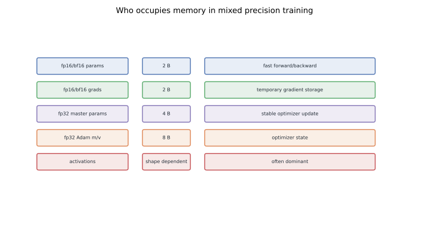
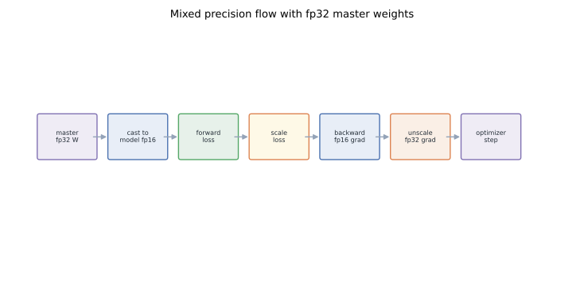
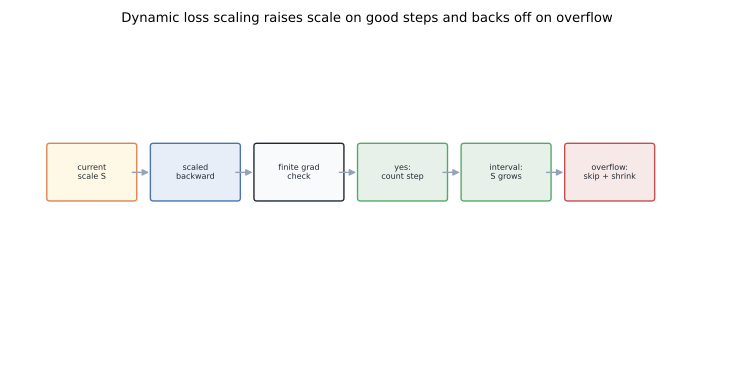
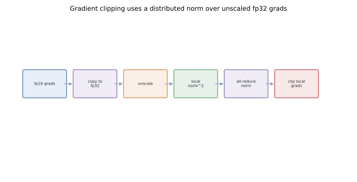

# Megatron Internals III: Mixed Precision, Loss Scaling, and Grad Clipping

Mixed precision training is not just "turn on fp16." It is a state machine: fast low-precision tensors do forward and backward, stable fp32 tensors receive optimizer updates, and every rank agrees whether the step is valid before any shard changes.

The classic recipe comes from Micikevicius et al., [Mixed Precision Training](https://arxiv.org/abs/1710.03740): use lower precision where hardware is fast, keep fp32 master weights for updates, and use loss scaling when fp16 gradients underflow.
Megatron wraps that recipe around tensor, pipeline, and data parallelism.

## TL;DR

- AMP chooses low-precision kernels for throughput, but the optimizer usually updates fp32 master parameters.
- fp16 often needs loss scaling because small gradients underflow; bf16 usually does not because it has fp32-like exponent range.
- Dynamic loss scaling is feedback control: increase scale after many clean steps, decrease and skip the step after overflow.
- Overflow is a distributed decision. One bad rank means every rank in the logical update must skip.
- Gradient clipping happens after unscale and fp32 gradient copy.
- The norm must cover model-parallel shards; local shard norm is not the global model norm.
- ZeRO changes where state lives, not the dtype invariants. For the optimizer-memory story, see [ZeRO Redundancy Optimizer](../zero-redundancy-optimizer/).
- This post builds on the DP / TP / PP groups from [Part I](../megatron-distributed-init/) and the tensor-parallel layers from [Part II](../megatron-model-parallel-internals/).

## 1. The memory inventory

A training step stores more than weights.
For Adam-style training, each parameter can imply:

- model-precision parameter used by forward and backward;
- model-precision gradient produced by backward;
- fp32 master parameter used by the optimizer;
- fp32 first moment;
- fp32 second moment;
- activation tensors saved for backward;
- temporary buffers for collectives and fused kernels.

The first five are model states. Activations and temporary buffers are residual states. That distinction matters because different techniques attack different buckets: mixed precision reduces compute and some stored tensors, activation checkpointing reduces saved activations, and ZeRO partitions redundant optimizer, gradient, and parameter state across data-parallel ranks as described in [ZeRO](https://arxiv.org/abs/1910.02054).



For simple fp16 Adam, static storage can look like:

```text
fp16 model param     2 bytes
fp16 grad            2 bytes
fp32 master param    4 bytes
fp32 Adam m          4 bytes
fp32 Adam v          4 bytes
----------------------------
total               16 bytes
```

That is before activations. Long sequence length, many microbatches in flight, or MoE routing buffers can dominate memory even when optimizer state is well managed. For a modern sparse-training example, see [Large MoE Performance](../large-moe-from-sparsity-to-communication/).

## 2. Why fp32 master weights exist

Tensor Cores make fp16 and bf16 fast. Optimizer updates are different: they accumulate small changes over many steps. If you apply those updates directly to fp16 parameters, small deltas can round to zero.

The standard contract is:

```text
model_param: fp16 or bf16, used by forward/backward
main_param:  fp32, used by optimizer math
```

At the start of an iteration, the model-precision parameter reflects the master parameter.
Forward and backward run mostly in model precision.
Before the optimizer step, gradients are copied or accumulated into fp32 buffers, unscaled, checked, clipped, and applied to the fp32 master weights.
Then master weights are copied back to model precision.



This is why mixed precision does not remove fp32 state. It moves fp32 to the update path, where stability matters most.

## 3. fp16 versus bf16

fp16 and bf16 are both 16-bit formats, but they fail differently:

- fp16 has more mantissa precision but a narrow exponent range.
- bf16 has fewer mantissa bits but keeps the fp32 exponent range.

Training usually cares more about exponent range than extra mantissa bits. That is why fp16 commonly needs loss scaling and bf16 usually does not. The rest of this post uses fp16 as the hard case; the same optimizer-state machine still applies to bf16, but the dynamic loss-scaling branch is usually disabled or less active.

## 4. Loss scaling in one equation

Backprop computes gradients proportional to the loss. If gradients are too small for fp16, they underflow to zero. Loss scaling multiplies the loss by a scale `S` before backward:

```text
scaled_loss = S * loss
scaled_grad = S * grad
grad        = scaled_grad / S
```

The math is unchanged if gradients are divided by `S` before the optimizer update. The representation during backward is better. That is the whole trick.

Static scaling uses one fixed `S`. Dynamic scaling adjusts `S` during training. PyTorch's [AMP documentation](https://pytorch.org/docs/stable/amp.html) exposes the same idea through autocast and `GradScaler`.

## 5. Dynamic loss scaling as feedback control

Dynamic loss scaling observes one signal: did any gradient overflow?



A minimal controller is:

```python
if found_inf:
    loss_scale = max(loss_scale / backoff_factor, min_loss_scale)
    growth_tracker = 0
    skip_optimizer_step = True
else:
    growth_tracker += 1
    if growth_tracker == growth_interval:
        loss_scale *= growth_factor
        growth_tracker = 0
```

The skipped step is essential. Once a gradient contains `inf` or `nan`, lowering the scale after the fact does not recover the true gradient. The only correct move is to discard that update and try the next iteration with a smaller scale.

## 6. Overflow must be global

On one GPU, overflow detection is local. In Megatron, one logical model update spans many ranks.

Consider a row-parallel layer. One TP rank can overflow while another rank sees finite partial gradients. If the finite rank updates and the overflowed rank skips, the sharded parameter no longer represents one coherent dense tensor.

The invariant is:

```python
found_inf_local = check_grads_for_inf_or_nan(local_grads)
found_inf = all_reduce_max(found_inf_local, relevant_parallel_groups)

if found_inf:
    skip_step_on_every_rank()
```

The exact group set depends on the optimizer and parallel layout. The rule does not: all ranks participating in one logical update must make the same step-or-skip decision.

## 7. The Megatron optimizer wrapper pattern

Megatron-style mixed precision wraps a base optimizer.
The wrapper owns dtype transitions and distributed checks.

```text
Float16Optimizer-like wrapper
  - tracks fp16/bf16 model parameters
  - builds fp32 main parameters
  - copies model grads to main grads
  - unscales by current loss scale
  - checks overflow
  - computes global grad norm
  - clips gradients
  - calls the inner optimizer step
  - copies fp32 main params back to model precision
```

The inner optimizer can still be Adam or a fused Adam variant.
The wrapper enforces the mixed-precision contract.

This separation is useful with tensor parallelism.
The optimizer does not need to know how `ColumnParallelLinear` computes its local shard.
It needs to know which parameters and gradients are local, which ones are sharded, and which groups define global checks.

## 8. Copying gradients is not just casting

Backward produces gradients attached to model-precision parameters.
Before the optimizer step, those gradients move into fp32 master-gradient buffers.
Three operations often happen together:

1. cast fp16 gradient to fp32;
2. divide by the current loss scale;
3. place the result in the flattened master-gradient buffer.

Conceptually:

```python
main_grad.copy_(model_grad.float())
main_grad.mul_(1.0 / loss_scale)
```

Real implementations fuse and flatten this path for bandwidth and launch overhead.
The visible invariant is simpler:
after this point, gradient clipping and optimizer math should see unscaled fp32 gradients.

## 9. Gradient clipping under model parallelism

Global-norm clipping computes:

```text
global_norm = sqrt(sum_i ||grad_i||^2)
clip_coef   = max_norm / (global_norm + eps)
```

In tensor parallelism, one rank owns only part of the model.
The local norm is incomplete.
Megatron computes local squared norms, reduces the sum over the needed model-parallel and data-parallel ownership, and then scales each local gradient by the same coefficient.



The order matters:

1. detect overflow;
2. copy gradients to fp32 main buffers;
3. unscale by loss scale;
4. compute distributed global norm;
5. clip local gradients with the global coefficient;
6. step fp32 master parameters;
7. copy master parameters back to model precision.

Clipping before unscale makes the threshold depend on `loss_scale`.
Clipping only local shards makes the threshold depend on TP size.
Both are wrong.

## 10. How ZeRO changes the picture

ZeRO changes ownership.
It does not change the numerical contract.

- ZeRO-1 partitions optimizer states across DP ranks.
- ZeRO-2 partitions optimizer states and gradients.
- ZeRO-3 partitions optimizer states, gradients, and parameters.

The mixed-precision wrapper still needs to know:

- where the fp32 master shard lives;
- where the model-precision shard is available for forward;
- where unscaled gradients should reduce, partition, or accumulate;
- which ranks must agree on overflow and clipping.

That is why process groups from [Megatron Internals I](../megatron-distributed-init/) are not startup trivia.
They define the boundary of every later optimizer decision.

## 11. The compact mental model

Mixed precision is stable when the state machine is clear:

```text
fast dtype computes
fp32 dtype updates
loss scale protects fp16 gradients
overflow check gates the whole update
global norm covers every model shard
```

If a job OOMs before backward, loss scaling is not the lever.
If gradients become zero, `inf`, or `nan`, activation checkpointing is not the lever.
Debug the state bucket that is actually failing.
That habit saves more time than memorizing AMP flags.

## Code

- Megatron optimizer wrappers: [`megatron/core/optimizer/optimizer.py`](https://github.com/NVIDIA/Megatron-LM/blob/main/megatron/core/optimizer/optimizer.py).
- Megatron dynamic loss-scaling logic: [`megatron/core/optimizer/grad_scaler.py`](https://github.com/NVIDIA/Megatron-LM/blob/main/megatron/core/optimizer/grad_scaler.py).
- Megatron global-norm clipping helpers: [`megatron/core/optimizer/clip_grads.py`](https://github.com/NVIDIA/Megatron-LM/blob/main/megatron/core/optimizer/clip_grads.py).
- Megatron distributed optimizer implementations: [`megatron/core/optimizer/`](https://github.com/NVIDIA/Megatron-LM/tree/main/megatron/core/optimizer).
- PyTorch AMP reference: [`torch.amp`](https://pytorch.org/docs/stable/amp.html).
- DeepSpeed ZeRO implementation for sharded optimizer state: [`deepspeed/runtime/zero/`](https://github.com/deepspeedai/DeepSpeed/tree/master/deepspeed/runtime/zero).

## References

- Micikevicius et al., [Mixed Precision Training](https://arxiv.org/abs/1710.03740), ICLR 2018.
- Shoeybi et al., [Megatron-LM: Training Multi-Billion Parameter Language Models Using Model Parallelism](https://arxiv.org/abs/1909.08053), 2019.
- Narayanan et al., [Efficient Large-Scale Language Model Training on GPU Clusters Using Megatron-LM](https://arxiv.org/abs/2104.04473), 2021.
- Rajbhandari et al., [ZeRO: Memory Optimizations Toward Training Trillion Parameter Models](https://arxiv.org/abs/1910.02054), SC 2020.
- IEEE, [754-2019 Standard for Floating-Point Arithmetic](https://ieeexplore.ieee.org/document/8766229), 2019.
