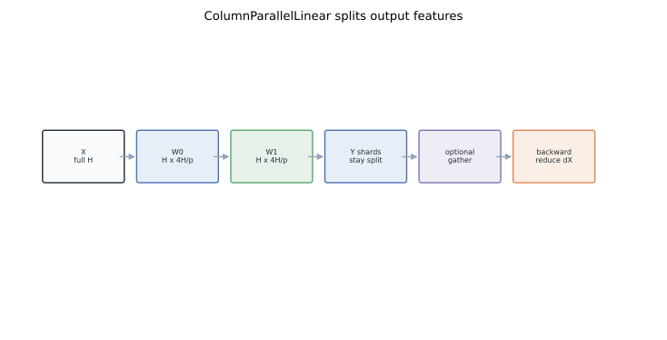
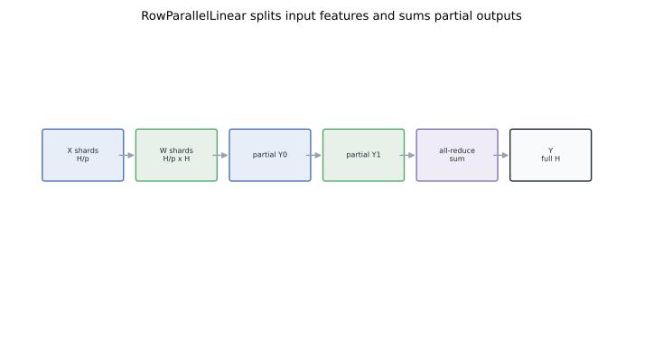
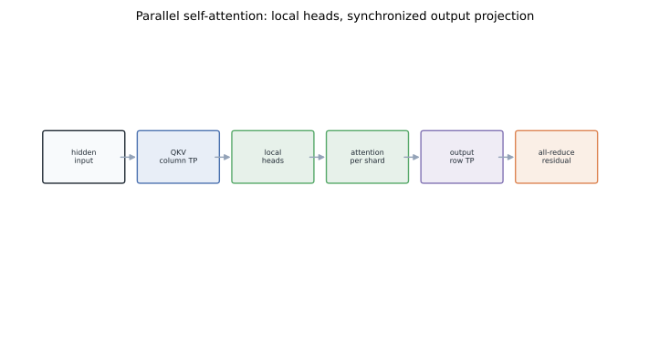
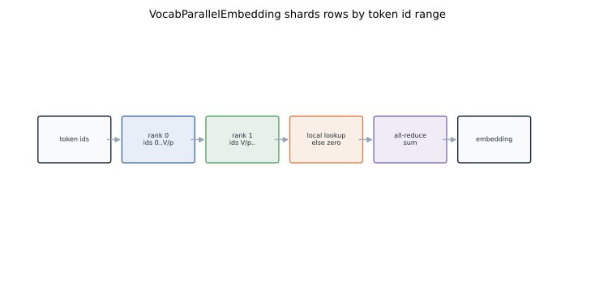
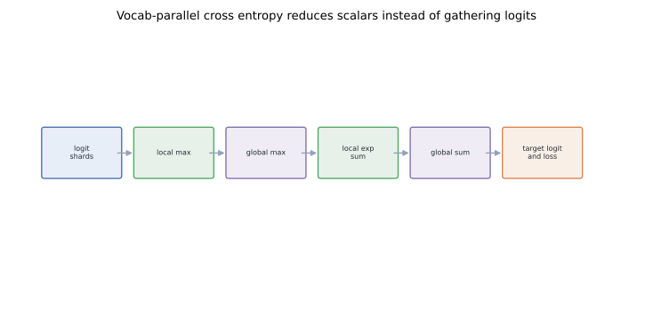

# Megatron Internals II: Column/Row Parallel Linear and Vocab Parallel Embedding

Tensor parallelism in Megatron is not a generic "split the model" switch.
It is a small set of layer contracts.
Each contract says which dimension of a tensor is local, which collective completes the math, and which gradient path must communicate.
Once those contracts are clear, `ParallelSelfAttention`, `ParallelMLP`, vocabulary-parallel embeddings, and vocabulary-parallel cross entropy are variations on the same theme.

## TL;DR

- Megatron's tensor parallel layers split weight matrices so each rank computes a valid slice of the dense operation.
- `ColumnParallelLinear` splits output features; forward can optionally all-gather output shards, while backward all-reduces input gradients.
- `RowParallelLinear` splits input features; forward all-reduces partial outputs, while backward can keep input-gradient shards local.
- The common `f` and `g` operators are identity in one direction and all-reduce in the other direction.
- Parallel attention uses column-parallel QKV projections, local attention heads, then a row-parallel output projection.
- Vocabulary-parallel embedding and cross entropy avoid materializing full vocabulary tensors on each rank.
- This post builds on [Part I](../megatron-distributed-init/) and sets up the optimizer discussion in [Part III](../megatron-mixed-precision-training/).

## 1. Why tensor parallelism is layer-specific

A transformer is mostly linear algebra.
That sounds easy to shard until you ask which tensor dimension is being summed.
For a linear layer:

```text
Y = X W
```

there are two obvious splits.
Split `W` by columns and each rank owns different output features.
Split `W` by rows and each rank owns different input features, so its matrix product is only a partial sum.
Megatron uses both.
The trick is arranging them so one layer's output layout is the next layer's input layout.
That is why tensor parallelism lives inside custom modules rather than outside as a wrapper.

## 2. Two autograd operators: `f` and `g`

Megatron papers describe two conceptual operators.
They are easier to remember by direction:

```text
f: forward identity, backward all-reduce
g: forward all-reduce, backward identity
```

In implementation, these are custom autograd functions over the tensor-model-parallel process group.
Their job is not to change math.
Their job is to put communication on the side of the graph where it is needed.
That lets adjacent layers avoid unnecessary gather-scatter cycles.

## 3. ColumnParallelLinear

Column parallelism splits the output dimension:

```text
W = [W_0, W_1, ..., W_{p-1}]
Y_i = X W_i
Y = concat(Y_i)
```

Each TP rank owns one column shard of `W`.
Given a full input `X`, each rank can compute its local output shard independently.



A minimal sketch:

```python
class ColumnParallelLinear(nn.Module):
    def forward(self, x):
        y_local = x @ self.weight_local
        if self.gather_output:
            return all_gather_last_dim(y_local, tp_group)
        return y_local
```

The forward pass has two modes.
If the next layer can consume sharded outputs, Megatron leaves `Y_i` local.
If a non-parallel consumer needs the full hidden dimension, it all-gathers.
The backward pass is where input gradients need care:

```text
dX = sum_i dY_i W_i^T
```

Every rank can compute a partial `dX`.
Those partials must be all-reduced across the TP group.
This is the backward side of `f`.

## 4. RowParallelLinear

Row parallelism splits the input dimension:

```text
X = [X_0, X_1, ..., X_{p-1}]
W = [W_0; W_1; ...; W_{p-1}]
Y = sum_i X_i W_i
```

Each rank receives or already owns one input shard.
It computes a partial output with the full output dimension.
Then ranks all-reduce those partial outputs.



Sketch:

```python
class RowParallelLinear(nn.Module):
    def forward(self, x):
        x_local = scatter_last_dim(x, tp_group) if self.input_is_parallel is False else x
        y_partial = x_local @ self.weight_local
        return all_reduce(y_partial, tp_group)
```

The communication moved from backward to forward.
That is `g`: forward all-reduce, backward identity.
The two layer types pair naturally.
In an MLP, the first projection expands `H -> 4H` and is column-parallel.
The second projection contracts `4H -> H` and is row-parallel.
The intermediate activation stays sharded, so the pair pays one all-reduce at the end instead of gather plus reduce.

## 5. Why the pair preserves dense semantics

For a dense MLP:

```text
Z = GELU(X W_up)
Y = Z W_down
```

Megatron computes:

```text
Z_i = GELU(X W_up_i)
Y_i = Z_i W_down_i
Y = all_reduce(sum partial Y_i)
```

This is exactly the dense result when the split dimensions line up.
No approximation is introduced.
The only difference is where the intermediate tensor lives.
That distinction matters for memory.
No TP rank stores the full `4H` activation unless a later operation explicitly gathers it.

## 6. Seeds under tensor parallelism

Part I introduced the seed invariant: DP replicas match, model-parallel shards do not accidentally duplicate.
Tensor-parallel layers make the reason concrete.
If column shards of `W_up` use the same random stream, then `W_0` and `W_1` can become identical.
That does not equal "initialize a dense matrix and split it."
Megatron solves this with model-parallel RNG streams and shard-aware initializers.
There are two common initialization modes:

- initialize the full tensor on CPU, then scatter shards;
- initialize each local shard directly on GPU with a model-parallel seed.

The second is faster and avoids large CPU tensors, but only if the seed logic preserves dense-equivalent statistics.
Dropout follows the same rule.
Where ranks hold different tensor slices, masks should represent the corresponding slice of the dense mask.
Where ranks hold replicated values after an all-reduce, dropout can use the same stream across DP replicas.

## 7. Parallel self-attention

Attention combines the layer contracts.
A transformer attention block usually computes:

```text
Q, K, V = X W_qkv
O       = attention(Q, K, V) W_o
```

Megatron makes `W_qkv` column-parallel.
Each rank owns a subset of attention heads.
Those heads can run softmax attention locally because each head is independent once Q, K, and V are formed.
The output projection `W_o` is row-parallel.
It sums the per-rank head contributions back into the full hidden dimension.



The resulting pattern is:

1. full hidden state enters the block;
2. QKV projection produces local head shards;
3. attention runs locally per shard;
4. output projection all-reduces partial hidden states.

That is why attention head count must be compatible with TP size.
If `num_heads % tp_size != 0`, local head assignment is not regular.
Modern variants such as grouped-query attention change the constants, but the sharding principle remains: split independent heads, reduce when hidden features are summed.

## 8. VocabParallelEmbedding

The embedding matrix can be enormous:

```text
E: vocab_size x hidden_size
```

Sharding by hidden dimension would make lookup awkward.
Megatron shards by vocabulary rows.
Each rank owns a contiguous token id range.
Every rank receives the same token ids, masks out ids outside its range, looks up local embeddings for ids it owns, and returns zeros for the rest.
An all-reduce sums the result.
Only the rank that owns a token id contributes a non-zero vector.



Sketch:

```python
def forward(input_ids):
    mask = (input_ids < vocab_start) | (input_ids >= vocab_end)
    local_ids = input_ids - vocab_start
    local_ids = local_ids.masked_fill(mask, 0)
    out = embedding_local(local_ids)
    out = out.masked_fill(mask[..., None], 0)
    return all_reduce(out, tp_group)
```

The all-reduce is cheap compared with gathering the full embedding table.
It also keeps optimizer state for embedding rows sharded across TP ranks.

## 9. Vocab-parallel logits

The output projection to vocabulary is the mirror image.
Instead of producing logits for every token over the full vocabulary on every rank, each rank produces logits for its vocabulary shard.
The naive next step would gather all logits and run cross entropy.
Megatron avoids that.
Cross entropy only needs:

- the global maximum logit for numerical stability;
- the global sum of exponentials;
- the target logit for the label token.

Those are scalar reductions over the vocabulary dimension.



The stable algorithm computes a local max, reduces the global max, exponentiates only local logits, reduces the denominator, and reduces the target logit from the shard that owns the label id.
The gradient is local except for the same target-token ownership test.
This design avoids a `batch * sequence * vocab` all-gather.
For large vocabularies, that is the difference between a scalable output layer and a memory wall.

## 10. Backward pass summary

A useful way to audit a tensor-parallel module is to write both directions:

| Module | Forward communication | Backward communication |
|---|---|---|
| ColumnParallelLinear | optional all-gather | all-reduce `dX` |
| RowParallelLinear | all-reduce output | usually none for sharded `dX` |
| VocabParallelEmbedding | all-reduce embeddings | gradients stay with vocab rows |
| VocabParallelCrossEntropy | max/sum reductions | local vocab gradients plus reductions |

This table also explains why activation checkpointing with TP must restore RNG and tensor layout exactly.
The recomputed forward pass must produce tensors with the same sharding as the original pass.
Otherwise backward collectives operate on the wrong shape.

## References

- Shoeybi et al., [Megatron-LM: Training Multi-Billion Parameter Language Models Using Model Parallelism](https://arxiv.org/abs/1909.08053), 2019.
- Narayanan et al., [Efficient Large-Scale Language Model Training on GPU Clusters Using Megatron-LM](https://arxiv.org/abs/2104.04473), 2021.
- Vaswani et al., [Attention Is All You Need](https://arxiv.org/abs/1706.03762), NeurIPS 2017.
- NVIDIA, [Megatron-LM](https://github.com/NVIDIA/Megatron-LM) and Megatron-Core documentation for tensor-parallel layers.
