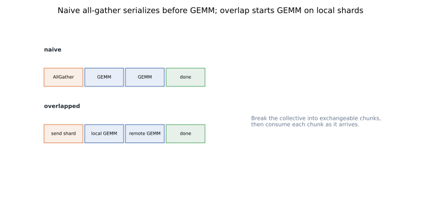
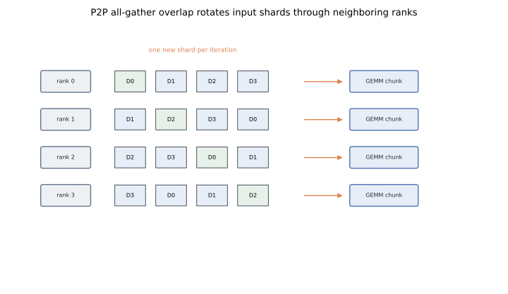
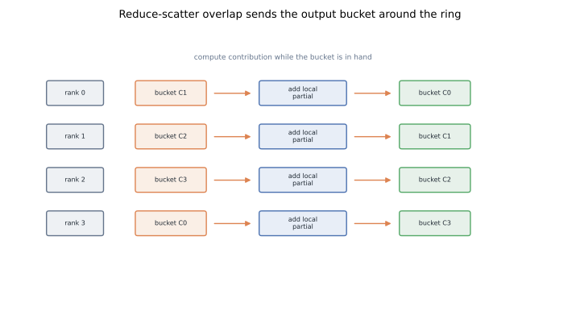
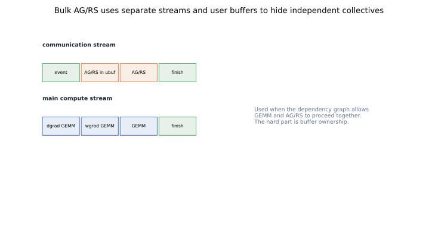

# Hiding Tensor-Parallel Collectives: AG/RS Overlap in Megatron

The misconception is that communication overlap is a flag you turn on after the real model design is done.
It is not.
Once Megatron SP changes tensor-parallel synchronization into AllGather and ReduceScatter boundaries, the step time depends on whether those boundaries are coarse waits or chunk-level dependencies.

The core idea is simple: start the GEMM when the chunk it needs is ready, and start the scatter when the output bucket it needs exists.
Transformer Engine userbuffers and Megatron communication-overlap flags implement versions of this schedule for tensor-parallel linears ([TE `initialize_ub`](https://github.com/NVIDIA/TransformerEngine/blob/main/transformer_engine/pytorch/module/base.py), [Megatron config](https://github.com/NVIDIA/Megatron-LM/blob/main/megatron/core/model_parallel_config.py)).
This post complements [Megatron SP](../sequence-parallelism-megatron-sp/) and [Megatron tensor parallelism](../tensor-parallelism-megatron/).

## TL;DR

- Sequence-parallel tensor parallelism introduces activation **AllGather** and **ReduceScatter** boundaries.
- Naive AllGather waits for the full activation before starting GEMM.
- P2P AllGather overlap rotates chunks and computes partial GEMMs as chunks arrive.
- Naive ReduceScatter waits for the full output before scattering.
- P2P ReduceScatter overlap moves output buckets and accumulates contributions while the bucket is in hand.
- Pipeline ReduceScatter overlap splits output so early chunks can scatter while later chunks compute.
- Bulk overlap hides collectives that are independent of the current critical-path GEMM.
- Overlap works only when buffer ownership, stream ordering, and kernel launch order do not serialize the schedule again.
- Reproducible figures for this post: [`playground/llm_training_series_figures.py`](https://github.com/duoan/duoan.github.io/blob/main/playground/llm_training_series_figures.py).

## 1. Why AG and RS Appear

Classic Megatron tensor parallelism is often explained with two conceptual operators.
One is identity in forward and AllReduce in backward.
The other is AllReduce in forward and identity in backward.
That explanation is clean for the original model-parallel paper.

Megatron SP changes the activation layout.
Instead of keeping full sequence activations replicated, ranks often hold sequence shards.
At tensor-parallel boundaries, the system must switch between sequence-sharded layout and the layout required by tensor-parallel GEMMs.

That is why AllGather and ReduceScatter appear.
AllGather reconstructs the needed activation layout.
ReduceScatter returns the result to sequence-sharded ownership.

The memory story is covered in [Sequence Parallelism I](../sequence-parallelism-megatron-sp/).
The performance story starts here:

```text
if AG/RS are inserted as blocking calls,
the memory win can turn into a communication bottleneck
```

## 2. Naive AllGather

Consider a tensor-parallel linear layer that needs an input activation assembled from sequence shards.
The naive schedule is:

1. AllGather all input shards.
2. Wait until the full input is available.
3. Run the GEMM.

That is correct and easy to implement.
It is also pessimistic.
The GEMM for a chunk does not always need to wait for every remote chunk.
If the input can be consumed chunk by chunk, communication and compute can be interleaved.



The dependency to respect is per chunk, not necessarily per full tensor.
This is the core idea behind AllGather overlap.

## 3. P2P AllGather Overlap

In a P2P ring-exchange version, each rank starts with its local input shard.
It immediately computes the partial GEMM for that shard.
At the same time, it sends the shard to one neighbor and receives another shard from the other neighbor.

On the next iteration, the rank computes with the received shard while forwarding it onward.
After enough iterations, every rank has computed the contribution for every input shard it needs.



This turns a blocking collective into a pipeline:

```text
receive chunk k
compute GEMM contribution for chunk k
send chunk k onward
```

The overlap succeeds only if the GEMM work per chunk is large enough to cover communication and scheduling overhead.
Too-small chunks create tiny messages and too many launches.
Too-large chunks delay the first useful remote chunk and weaken overlap.

The pattern resembles [Ring Attention](../ring-attention/), but the tensor differs.
Here the ring carries activation chunks for a tensor-parallel GEMM.
Ring Attention carries K/V blocks for blockwise attention.

## 4. Naive ReduceScatter

ReduceScatter appears after row-parallel work.
Each rank has computed partial outputs.
The final output shard for rank `i` is the sum of all ranks' contributions to that shard.

The naive schedule is:

1. Compute the full local partial output.
2. Run ReduceScatter.
3. Wait for the reduced output shard.

Again, this is correct.
Again, it leaves overlap on the table.

The useful observation is that output ownership is bucketed.
If a bucket is destined for rank `i`, every rank can add its local contribution to that bucket.
The bucket does not need to sit idle until the full local output is computed.

## 5. P2P ReduceScatter Overlap

The P2P ReduceScatter overlap is less intuitive than AllGather overlap.
A helpful model is: the bucket moves, and each rank pours in its contribution.

Each rank sends an output bucket around the ring.
When a rank receives bucket `C_i`, it computes or adds the part of its local contribution that belongs to `C_i`.
Then it forwards the bucket.
After the bucket has visited all ranks, it returns to its owner fully reduced.



This is a distributed accumulation pipeline.
The communication object is not just raw input data.
It is a partially reduced output bucket with an owner.

The implementation difficulty is ordering.
The rank must not overwrite a bucket before downstream consumers are done.
It must not read a contribution before the GEMM has produced it.
It must keep enough buffering to let communication progress without racing compute.

## 6. Pipeline-Chunk ReduceScatter

There is another ReduceScatter overlap pattern.
Instead of rotating buckets through a P2P ring, split the GEMM output into chunks.
As soon as chunk `0` is computed, begin ReduceScatter for chunk `0` while computing chunk `1`.
Then repeat.

This is pipeline chunking.
It is simpler to reason about than the moving-bucket schedule.
It can work well when the output can be partitioned into a small number of substantial chunks.

The chunk count is a tuning parameter.
Too few chunks expose communication.
Too many chunks reduce GEMM efficiency and increase scheduling overhead.
NVIDIA's Megatron Bridge tuning guide calls out split count and SM allocation as real tuning knobs for TP overlap ([performance guide](https://docs.nvidia.com/nemo/megatron-bridge/0.4.1/performance-guide.html)).

## 7. Bulk Overlap

Not every overlap opportunity is a direct dependency between this collective and this GEMM.
During backward, some communication is needed later but is independent of the next compute on the critical path.
For example, a data-gradient GEMM may not need an activation AllGather that is required later for a weight-gradient GEMM.
That AllGather can start on a communication stream while the data-gradient GEMM runs on the main stream.

This is the bulk overlap case.
It often involves pre-registered user buffers, a compute stream, a communication stream, and careful event synchronization.



Bulk overlap sounds straightforward until buffer ownership enters the picture.
The communication stream needs stable source and destination buffers.
The compute stream must not mutate those buffers too early.
The framework must coordinate stream waits without turning the schedule back into serialization.

## 8. Userbuffers and Flags

Transformer Engine exposes userbuffers through `initialize_ub()`.
The docstring describes a communication buffer shape typically collapsed as `(sequence_length * batch_size, hidden_size)` and a tensor-parallel size for the communicator.
The implementation creates overlap communicators such as P2P ring exchange and pipeline overlap paths in `transformer_engine/pytorch/module/base.py`.

Megatron and Megatron Bridge wire this through model config.
The relevant intent is `tp_comm_overlap=True`, with sub-options for AllGather, ReduceScatter, bulk, and pipeline behavior.
Megatron Bridge also checks prerequisites such as tensor-parallel size, sequence parallelism, and Transformer Engine availability before enabling TP overlap.

A flag only permits the schedule.
It does not guarantee useful concurrency.
Profiles decide whether the schedule is actually hiding communication.

## 9. Dependency Classes

A practical way to reason about TP overlap is to classify each collective.

The first class is **producer-before-consumer**.
The GEMM cannot consume a remote chunk until that chunk has arrived.
P2P AllGather overlap helps by making the dependency chunk-granular.

The second class is **consumer-before-reduction**.
ReduceScatter cannot reduce an output element until the local contribution exists.
P2P or pipeline ReduceScatter overlap helps by making the dependency bucket-granular.

The third class is **independent side work**.
The collective is needed later, but not by the GEMM currently on the critical path.
Bulk overlap helps by moving it to a communication stream.

Once you classify the dependency, the schedule becomes easier to reason about.

## 10. What to Look For in a Trace

A healthy overlapped AllGather should not look like one large communication block followed by one large GEMM block.
It should show smaller communication and GEMM regions interleaved or concurrent.

A healthy overlapped ReduceScatter should not wait for the entire output before any communication starts.
Early communication should begin before all compute in that region is complete.

Bulk overlap should show work on separate streams with meaningful concurrency.
If CUDA events force the communication stream to wait until compute finishes, the mode is nominally enabled but effectively serial.

Also watch for tiny kernels and tiny messages.
Overlap can reduce exposed communication while increasing launch overhead.
The final metric is step time, not colorful trace lanes.

## 11. Relationship to Other Parallelism

Tensor-parallel collective overlap is a local performance optimization.
It does not change mathematical partitioning.
It changes when communication happens relative to compute.

That makes it complementary to the rest of the training stack:

- [Megatron SP](../sequence-parallelism-megatron-sp/) reduces activation memory but introduces AG/RS boundaries that need scheduling.
- [Megatron Context Parallel](../megatron-context-parallel/) also relies on overlap, but for K/V exchange in long-context attention.
- [ZeRO-3](../zero3-intra-layer-partitioning/) has its own gather and scatter patterns for model states, with different ownership.
- [Tensor parallelism](../tensor-parallelism-megatron/) decides what each rank computes.

Collectives are not only bandwidth costs.
They are dependency edges.
Performance work is often replacing one coarse dependency edge with smaller ones the GPU and network can run around.

## Code

- Transformer Engine userbuffers setup: [`transformer_engine/pytorch/module/base.py`](https://github.com/NVIDIA/TransformerEngine/blob/main/transformer_engine/pytorch/module/base.py), especially `initialize_ub()` and TP overlap methods.
- Megatron-LM model-parallel config flags: [`megatron/core/model_parallel_config.py`](https://github.com/NVIDIA/Megatron-LM/blob/main/megatron/core/model_parallel_config.py), especially `tp_comm_overlap` and related options.
- Megatron Bridge overlap wiring: [`src/megatron/bridge/training/comm_overlap.py`](https://github.com/NVIDIA-NeMo/Megatron-Bridge/blob/main/src/megatron/bridge/training/comm_overlap.py).

## References

- NVIDIA, [Megatron Bridge Communication Overlap](https://docs.nvidia.com/nemo-framework/user-guide/latest/nemotoolkit/features/optimizations/communication_overlap.html).
- NVIDIA, [Megatron Bridge Performance Tuning Guide](https://docs.nvidia.com/nemo/megatron-bridge/0.4.1/performance-guide.html).
- Narayanan et al., [Efficient Large-Scale Language Model Training on GPU Clusters Using Megatron-LM](https://arxiv.org/abs/2104.04473), 2021.
- Korthikanti et al., [Reducing Activation Recomputation in Large Transformer Models](https://arxiv.org/abs/2205.05198), 2022.
