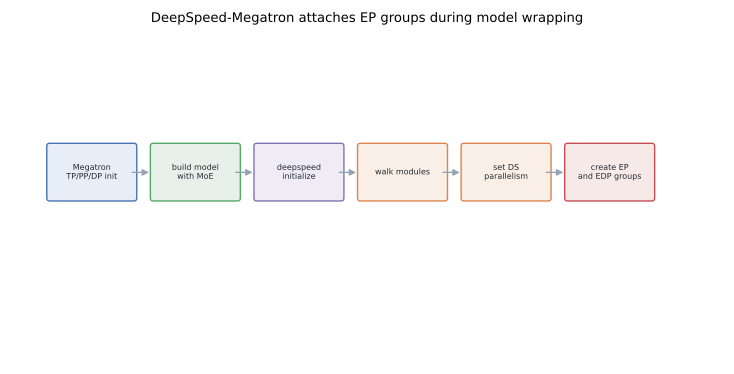
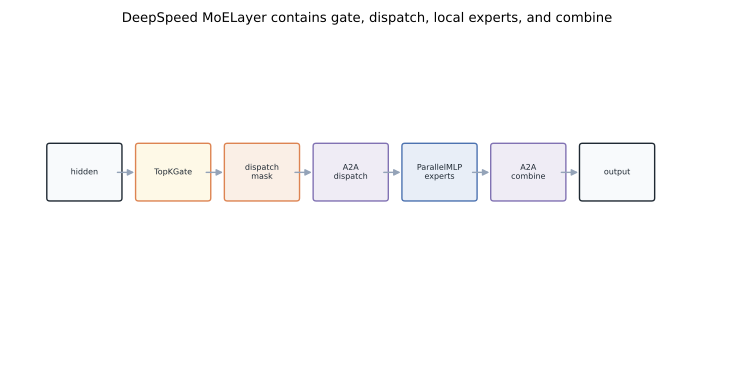
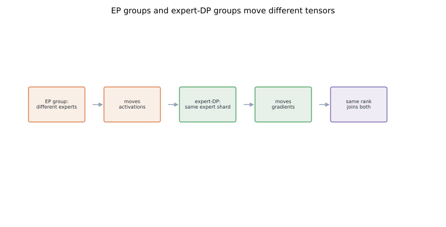

# MoE Internals: DeepSpeed-Megatron Expert Parallel Implementation

DeepSpeed-Megatron MoE is easy to misread if you only inspect one initialization function. Megatron builds the usual TP, PP, and DP topology. DeepSpeed then wraps the model, finds MoE modules, and gives those modules expert-parallel groups. The topology is split across the training framework and the MoE layer implementation.

This post connects the pieces: `deepspeed.initialize()`, EP groups, expert-DP groups, `MoELayer`, and the difference between a DeepSpeed MoE wrapper and a Megatron-integrated SwitchMLP-style module.
For routing, capacity, and All-to-All fundamentals, start with [MoE Parallelism Principles](../moe-expert-parallelism-principles/).

## TL;DR

- Base Megatron initialization creates dense-model topology: tensor parallel, pipeline parallel, data parallel, and helper groups.
- DeepSpeed-Megatron adds MoE topology during DeepSpeed model wrapping, not only in Megatron's base parallel-state setup.
- `deepspeed.initialize()` builds the DeepSpeed engine; MoE modules expose hooks such as `set_deepspeed_parallelism` so expert groups can be attached.
- An EP group owns different experts and runs All-to-All token dispatch.
- An expert-DP group owns equivalent expert shards across data replicas and synchronizes expert gradients.
- DeepSpeed `MoELayer` is GShard-like: gate, capacity, dispatch metadata, All-to-All, local experts, All-to-All back, combine.
- SwitchMLP-style integration keeps more MoE behavior inside Megatron model code and usually follows a simpler top-1 routing shape inspired by [Switch Transformer](https://arxiv.org/abs/2101.03961).
- For optimizer-state sharding around this stack, see [ZeRO Redundancy Optimizer](../zero-redundancy-optimizer/).

## 1. The implementation boundary

A normal Megatron training flow is:

1. initialize distributed process groups;
2. build the model for the current rank;
3. build optimizer and scheduler;
4. build data iterators;
5. run the training loop.

DeepSpeed-Megatron keeps that skeleton. The MoE difference is that transformer layer construction may insert MoE modules, and DeepSpeed wrapping may attach MoE-specific parallel metadata later.

That boundary matters. If you inspect only Megatron's distributed initialization, you may see TP, PP, and DP groups but no complete EP topology. That does not mean EP is absent; it means DeepSpeed owns part of the MoE setup.



## 2. Why EP setup is deferred

Dense TP, PP, and DP groups are global. Every transformer layer cares about them. Expert-parallel groups are needed only by MoE modules. DeepSpeed owns the MoE module implementation, so it can attach expert-parallel state when the model is wrapped:

```python
engine, optimizer, _, _ = deepspeed.initialize(
    model=model,
    model_parameters=model.parameters(),
    config=ds_config,
)

for module in model.modules():
    if hasattr(module, "set_deepspeed_parallelism"):
        module.set_deepspeed_parallelism(use_data_before_expert_parallel)
```

That loop is conceptual, not a promise about exact call-site shape. The point is the ownership boundary: Megatron creates the base model-parallel world, and DeepSpeed gives MoE modules the expert-parallel groups they need for routing and gradient synchronization. This modularity is useful, but it means you must read both Megatron-DeepSpeed and DeepSpeed MoE code to understand the full topology.

## 3. Launch knobs describe geometry

A MoE training launch usually includes dense-model knobs and sparse-model knobs:

```text
--tensor-model-parallel-size TP
--pipeline-model-parallel-size PP
--moe-expert-parallel-size EP
--num-experts E
--moe-train-capacity-factor C_train
--moe-eval-capacity-factor C_eval
--moe-min-capacity C_min
--moe-loss-coeff aux_coeff
--topk k
```

`TP` decides how dense matrix multiplies are split. `PP` decides which rank owns which transformer layers. `EP` decides how many ranks cooperate to host one expert set. `E` decides how many experts the MoE layer contains. Capacity and auxiliary-loss knobs decide how routing is regularized and bounded. These flags are not independent decorations; together they define tensor ownership and communication.

## 4. Base Megatron groups still matter

MoE adds an axis. It does not erase the others. The attention block still uses tensor-parallel collectives from [Megatron Internals II](../megatron-model-parallel-internals/). Pipeline stages still follow the rank mesh from [Megatron Internals I](../megatron-distributed-init/). Mixed precision still needs distributed overflow checks and clipping from [Megatron Internals III](../megatron-mixed-precision-training/).

The stack looks like:

```text
Megatron rank topology
  -> transformer layer construction
     -> DeepSpeed MoE module
        -> expert-parallel groups
        -> expert data-parallel groups
        -> all-to-all routing
```

If a bug appears in MoE training, first ask which layer of this stack owns the failed tensor: dense hidden state, expert-routed activation, expert gradient, or optimizer state.

## 5. Where the MoE layer appears

In a transformer layer, the dense MLP slot can be filled by:

- a normal dense `ParallelMLP`;
- a DeepSpeed MoE wrapper around expert MLPs;
- a Megatron-integrated SwitchMLP-style module in codebases that carry that path.

Conceptually:

```python
if num_experts <= 1:
    mlp = ParallelMLP(config)
elif use_switch_mlp:
    mlp = SwitchMLP(config)
else:
    expert = ParallelMLP(config, moe=True)
    mlp = deepspeed.moe.layer.MoE(
        hidden_size=config.hidden_size,
        expert=expert,
        num_experts=num_experts,
        ep_size=moe_expert_parallel_size,
        k=topk,
        capacity_factor=train_capacity_factor,
        eval_capacity_factor=eval_capacity_factor,
        min_capacity=min_capacity,
    )
```

The important detail is that the expert can itself be a Megatron-style parallel MLP. The sparse wrapper and dense tensor-parallel layer contracts compose, which is powerful but makes group ownership more subtle.

## 6. Inside DeepSpeed `MoELayer`

A GShard-like MoE layer needs four logical pieces:

1. a gate that computes expert scores and top-k assignments;
2. routing metadata that maps tokens to expert-capacity slots;
3. expert modules that run local FFNs;
4. dispatch and combine communication.



The flow is:

```text
hidden -> gate -> dispatch metadata
       -> All-to-All -> local experts
       -> All-to-All -> combine -> output
```

This follows the systems recipe from [GShard](https://arxiv.org/abs/2006.16668). Top-k routing, capacity, padding or dropping, and auxiliary loss are not side features; they make the sparse layer executable on a cluster. DeepSpeed-MoE expands this into a runtime system in [DeepSpeed-MoE](https://arxiv.org/abs/2201.05596).

## 7. EP group versus expert-DP group

Two groups are easy to confuse. An **EP group** contains ranks that own different experts for one MoE layer replica; it moves activations for token dispatch and combine. An **expert-DP group** contains ranks that own the same expert shard across data replicas; it moves gradients to synchronize expert parameters.



A compact phrasing:

```text
EP group:  route tokens across different experts.
EDP group: synchronize gradients for the same expert.
```

The same physical rank participates in both, but the groups answer different questions and run at different times.

## 8. The All-to-All path

The DeepSpeed MoE forward path is the standard sparse path:

1. flatten local sequence and batch dimensions into tokens;
2. run the gate and choose top-k experts;
3. compute capacity positions and dispatch metadata;
4. permute tokens into expert or destination order;
5. All-to-All tokens to expert-owning ranks;
6. run local expert FFNs;
7. All-to-All expert outputs back;
8. unpermute and combine outputs with gate weights.

The layout choices around permutation matter. Small experts can be dominated by pack and unpack overhead. Bad capacity choices can send mostly padding. Bad EP placement can push the hot path over the slowest network tier.

Those are the production walls covered in [Large MoE Performance](../large-moe-from-sparsity-to-communication/): memory, communication, and compute efficiency after sparsity.

## 9. Expert tensor parallelism

If expert tensor parallelism is enabled, an expert FFN is not necessarily local to one rank. It can use the same column-parallel and row-parallel layers as dense Megatron MLPs.

There are two levels of parallelism:

- EP chooses which rank group owns which experts and routes tokens there.
- TP splits matrix multiplies inside each expert.

That means the MoE wrapper must deliver expert inputs in the layout expected by the expert MLP. Around the expert, the wrapper runs All-to-All; inside the expert, tensor-parallel layers may all-reduce or all-gather. The network does not care whether a collective came from EP or TP. If both hit the same links at the wrong time, they interfere.

## 10. Capacity and auxiliary loss in implementation terms

The gate returns more than expert ids. Common outputs include:

- `l_aux`: auxiliary load-balancing loss;
- `combine_weights`: weights used to reconstruct token outputs;
- `dispatch_mask` or equivalent sparse routing metadata;
- expert counts and capacity positions.

The training loss becomes:

```text
loss_total = loss_lm + moe_loss_coeff * l_aux
```

Auxiliary loss is not just regularization. It protects the system from router collapse: a few experts overload, other experts idle, and All-to-All becomes imbalanced. Capacity is the hard guardrail; auxiliary loss teaches the model to avoid leaning on that guardrail every step.

## 11. `MoELayer` versus SwitchMLP-style integration

DeepSpeed `MoELayer` and Megatron SwitchMLP-style integration solve the same model problem with different ownership boundaries.

DeepSpeed `MoELayer`:

- wraps an expert module;
- owns routing, dispatch, and combine;
- attaches DeepSpeed EP and expert-DP groups;
- fits naturally into `deepspeed.initialize()` and engine-level runtime features.

SwitchMLP-style integration:

- is usually closer to Switch Transformer's top-1 routing;
- keeps more MoE logic in Megatron's transformer layer code;
- can share more directly with Megatron parallel-state conventions;
- has a smaller routing surface but less of DeepSpeed's MoE runtime machinery.

Neither shape is universally better. The DeepSpeed path is modular and easy to insert into a Megatron stack. The Megatron-integrated path can be easier to reason about once the training system standardizes on one parallel-state owner.

## 12. The compact mental model

DeepSpeed-Megatron MoE is layered:

```text
Megatron creates dense-model groups.
Megatron builds transformer layers.
DeepSpeed wraps the model.
MoE modules attach EP and expert-DP groups.
Forward routes tokens through gate -> dispatch -> experts -> combine.
Backward synchronizes expert gradients with the right replicated peers.
```

When reading code, ask one question per tensor:

```text
Is this dense transformer ownership,
expert ownership,
token movement,
or replicated-gradient synchronization?
```

That question cuts through most of the confusion.

## Code

- DeepSpeed public initialization entry point: [`deepspeed/__init__.py`](https://github.com/deepspeedai/DeepSpeed/blob/master/deepspeed/__init__.py).
- DeepSpeed engine created by `deepspeed.initialize()`: [`deepspeed/runtime/engine.py`](https://github.com/deepspeedai/DeepSpeed/blob/master/deepspeed/runtime/engine.py).
- DeepSpeed MoE layer wrapper: [`deepspeed/moe/layer.py`](https://github.com/deepspeedai/DeepSpeed/blob/master/deepspeed/moe/layer.py).
- DeepSpeed sharded MoE routing and dispatch: [`deepspeed/moe/sharded_moe.py`](https://github.com/deepspeedai/DeepSpeed/blob/master/deepspeed/moe/sharded_moe.py).
- DeepSpeed MoE package: [`deepspeed/moe/`](https://github.com/deepspeedai/DeepSpeed/tree/master/deepspeed/moe).
- Megatron-DeepSpeed transformer model integration: [`megatron/model/transformer.py`](https://github.com/microsoft/Megatron-DeepSpeed/blob/main/megatron/model/transformer.py).
- Megatron-DeepSpeed training loop context: [`megatron/training.py`](https://github.com/microsoft/Megatron-DeepSpeed/blob/main/megatron/training.py).

## References

- Rajbhandari et al., [DeepSpeed-MoE: Advancing Mixture-of-Experts Inference and Training to Power Next-Generation AI Scale](https://arxiv.org/abs/2201.05596), ICML 2022.
- Lepikhin et al., [GShard: Scaling Giant Models with Conditional Computation and Automatic Sharding](https://arxiv.org/abs/2006.16668), ICLR 2021.
- Fedus, Zoph, Shazeer, [Switch Transformers: Scaling to Trillion Parameter Models with Simple and Efficient Sparsity](https://arxiv.org/abs/2101.03961), JMLR 2022.
- Shazeer et al., [Outrageously Large Neural Networks: The Sparsely-Gated Mixture-of-Experts Layer](https://arxiv.org/abs/1701.06538), ICLR 2017.
- Shoeybi et al., [Megatron-LM: Training Multi-Billion Parameter Language Models Using Model Parallelism](https://arxiv.org/abs/1909.08053), 2019.
