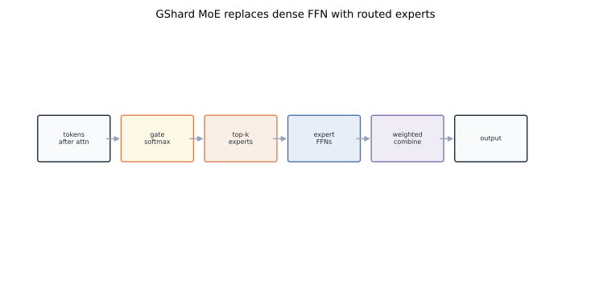
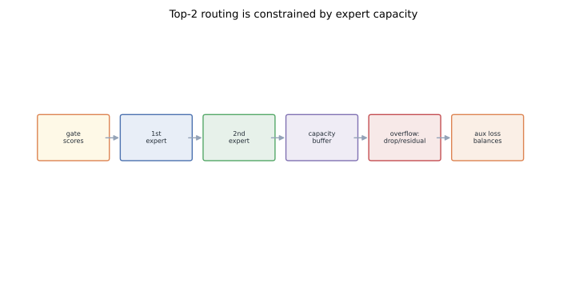
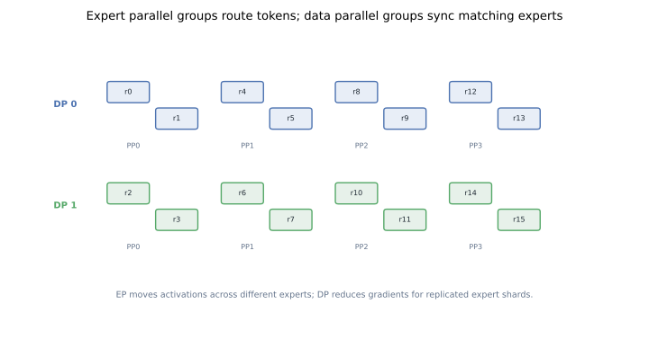
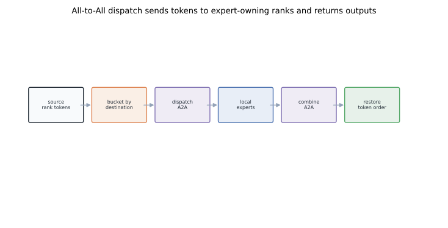
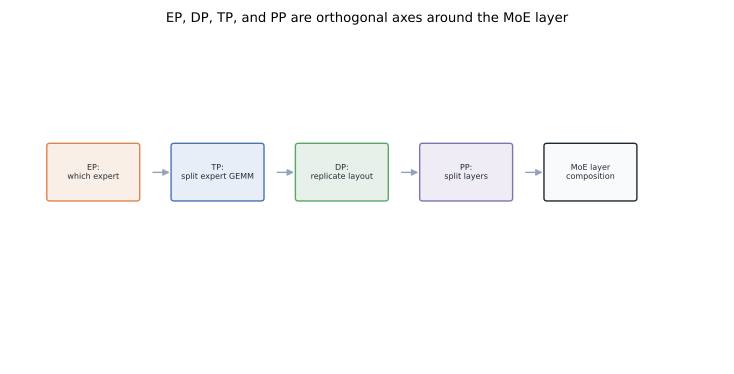

# MoE Parallelism Principles: GShard, Expert Parallel, and All-to-All

Mixture-of-Experts training sounds like a model idea: replace a dense feed-forward network with many experts and route each token to a few of them.
In practice it is also a distributed-systems idea.
The moment experts live on different GPUs, the router becomes a communication planner, capacity becomes a shape contract, and the MoE layer becomes an all-to-all machine.
This post is the foundational piece: GShard-style routing, expert capacity, expert parallelism, DP plus EP, and how TP and PP fit around them.
For modern production performance recipes, see [Large MoE Performance: The Three Walls After Sparsity](../large-moe-from-sparsity-to-communication/).

## TL;DR

- A classic MoE transformer replaces selected dense FFN layers with a gate plus many expert FFNs.
- The gate chooses top-k experts per token; GShard popularized top-2 routing, capacity limits, auxiliary balance loss, and all-to-all dispatch.
- Expert Parallelism (EP) shards experts across ranks; Data Parallelism (DP) replicates that sparse layout for more data throughput.
- All-to-All dispatch sends tokens from their source ranks to the ranks that own their selected experts, then a second All-to-All returns outputs.
- Capacity, token dropping, and padding turn irregular routing into regular tensors that hardware and collectives can execute.
- EP can compose with TP inside experts and PP across transformer layers, but each extra axis changes the communication geometry.

## 1. The MoE intuition

A dense transformer FFN applies the same parameters to every token.
MoE makes that FFN sparse:

```text
Dense FFN: token -> one shared FFN
MoE FFN:   token -> gate -> top-k expert FFNs -> weighted combine
```

The model can have many more total parameters because each token activates only a small subset.
If there are `E` experts and top-k routing uses `k`, then total expert capacity scales with `E`, while per-token expert compute scales with `k`.
That separation is the point.
It is also the source of the systems problem.
More experts mean more parameters to store, but not necessarily more compute per token.
The gap between total parameters and active parameters is exactly where memory and communication enter.

## 2. GShard-style MoE layer

The GShard formulation puts a MoE layer where a dense FFN would normally sit.
The attention block remains dense.
The MoE block contains:

- a **gate** or router, usually a linear projection from hidden size to expert logits;
- a set of **experts**, often FFNs with the same input/output hidden size;
- a **dispatch** operation that packs tokens by selected expert;
- a **combine** operation that weights expert outputs and restores token order.



In pseudocode:

```python
logits = gate(hidden)               # [tokens, experts]
scores = softmax(logits, dim=-1)
expert_ids, weights = topk(scores, k=2)
expert_inputs = dispatch(hidden, expert_ids, capacity)
expert_outputs = experts(expert_inputs)
hidden_out = combine(expert_outputs, expert_ids, weights)
```

That hides the hard part in `dispatch`.
The selected experts may be remote.
The token counts per expert may be uneven.
The tensors must still have shapes that kernels and collectives can handle.

## 3. Top-2 routing

GShard uses top-2 routing.
For each token, the gate chooses the most likely expert and a second expert.
The two expert outputs are weighted by normalized gate probabilities.
Top-1 routing is cheaper and appears in Switch Transformer.
Top-2 routing gives the model a second path, which can improve quality and reduce brittleness when the first choice is overloaded.
The communication cost scales with `k`.
For hidden size `H`, dtype size `b`, and `T` tokens, a rough dispatch plus combine byte count is:

```text
bytes ~= 2 * T * k * H * b
```

The factor 2 is dispatch and combine.
This simple formula explains why MoE communication grows quickly even when arithmetic stays sparse.

## 4. Capacity turns routing into tensor shapes

The gate is free to send many tokens to the same expert.
Hardware is not free to run arbitrary ragged tensors efficiently.
GShard introduces an expert capacity:

```text
capacity = max(tokens_per_group / num_experts * k * capacity_factor, min_capacity)
```

Each expert receives a fixed-size buffer.
If fewer tokens arrive, the buffer is padded.
If more tokens arrive, overflow policy decides what happens.



The tradeoff is direct:

- higher capacity reduces dropped tokens but increases padding and communication volume;
- lower capacity improves regularity and memory use but may lose routed tokens;
- auxiliary losses encourage the gate to spread traffic more evenly.

This is the first place where model quality and systems efficiency meet.

## 5. Drop, pad, or reroute

MoE implementations usually combine several mechanisms.

**Padding** fills unused expert buffer slots with zeros.

This keeps expert input shape `[num_experts, capacity, hidden]`.
It wastes compute when routing is imbalanced, but makes GEMM shapes static.

**Dropping** handles overflow.

If a token's selected expert is full, the implementation may drop that expert assignment.
For top-2, the token can still use the other expert.
If both assignments overflow, the layer may pass the token through a residual path.

**Randomized second expert selection** adds noise or sampling to avoid deterministic overload.

This does not guarantee balance.
It makes pathological concentration less likely.

**Auxiliary load-balancing loss** penalizes gates that overuse a small number of experts.

The loss is differentiable through probabilities even though exact expert counts involve top-k decisions.

## 6. Expert Parallelism

Expert Parallelism means different ranks own different experts.
If there are 64 experts and `ep_size = 8`, each EP rank may own 8 experts.
Tokens are initially distributed by data batch, not by expert.
So the MoE layer must move tokens to the ranks that own their selected experts.
That movement is the core EP collective.



In a pure dense data-parallel layer, every rank has the same parameters and processes different examples.
In an expert-parallel layer, ranks in an EP group have different expert parameters.
They are not replicas of the same sparse submodule.
This is why EP is not just DP with a different name.
DP answers: who has the same parameter and should average gradients?
EP answers: who owns different experts and should exchange tokens?

## 7. EP plus DP

Large jobs usually need both.
One EP group holds one full set of experts.
Multiple DP replicas of that EP group process different data.
For example:

```text
world_size = dp_size * ep_size
experts_per_ep_rank = num_experts / ep_size
```

Ranks with the same expert shard across DP replicas form an expert data-parallel group for gradient synchronization.
Ranks within one EP group form the all-to-all routing group.
This creates two orthogonal communication patterns:

- token dispatch and combine inside EP groups;
- gradient synchronization across DP replicas of the same expert shard.

The first happens during the MoE layer.
The second happens during backward or optimizer synchronization.

## 8. All-to-All dispatch

All-to-All is the natural EP collective.
Each source rank has tokens for many destination experts.
Each destination rank needs tokens from many source ranks.
So every rank sends a slice to every other rank.



A simplified step:

1. gate computes target expert ids for local tokens;
2. local tokens are permuted into per-destination buckets;
3. All-to-All sends buckets to expert-owning ranks;
4. experts run local FFNs on received tokens;
5. a second All-to-All returns outputs to source ranks;
6. outputs are unpermuted and combined by gate weights.

This double All-to-All is the defining cost of distributed MoE.
It is why modern systems invest heavily in dispatch kernels, token permutation, overlap, and topology-aware expert placement.
Those optimizations are covered in the production-focused MoE post: [Large MoE Performance](../large-moe-from-sparsity-to-communication/).

## 9. Why All-to-All is hard

All-to-All is not just a bandwidth number.
It has several practical costs:

- **small messages** when token counts per destination are tiny;
- **load imbalance** when a few experts receive more tokens;
- **permutation overhead** before and after communication;
- **cross-node latency** when EP spans nodes;
- **memory pressure** from duplicated top-k token buffers.

Capacity helps regularize message sizes, but padding sends zeros.
Dropless routing preserves information, but shapes become dynamic.
Top-k improves quality, but sends each token to more destinations.
These tradeoffs are why MoE training is a co-design problem rather than a single-layer trick.

## 10. EP plus TP

Experts are often FFNs.
An expert can itself be tensor-parallel.
That gives EP plus TP:

```text
EP: which expert belongs to this rank group?
TP: how is each expert's matrix split inside that group?
```



This is useful when an individual expert is too large or when dense parts of the transformer already use TP.
But it adds a nested communication pattern.
Within an expert, TP layers need all-reduce or all-gather collectives as described in [Megatron Internals II](../megatron-model-parallel-internals/).
Around the expert, EP needs All-to-All.
The schedule must avoid making those collectives fight for the same fabric at the same time.

## 11. Where pipeline parallelism sits

Pipeline parallelism splits layers across stages.
MoE does not remove that axis.
A pipeline stage may own several transformer layers, some dense and some MoE.
Within a stage, MoE layers use EP and possibly TP.
Between stages, PP sends activations forward and activation gradients backward.
PP can reduce memory per rank by splitting layers, and it can keep EP within a node if the cluster layout is chosen carefully.
But PP also introduces bubble and scheduling constraints.
In MoE systems, PP is often a topology lever as much as a memory lever.

## 12. The foundational mental model

MoE parallelism is sparse compute plus dense communication.
The gate decides sparse compute.
Capacity converts irregular routing into regular buffers.
EP maps experts to devices.
All-to-All moves tokens to those devices.
DP replicates the expert layout for data throughput.
TP can split large experts.
PP can split the layer stack.
Everything else is an optimization of this foundation.
When reading a MoE paper or codebase, ask five questions:

1. What is the routing rule: top-1, top-2, or another variant?
2. What happens when an expert exceeds capacity?
3. Which ranks form the EP group?
4. Is expert compute itself tensor-parallel?
5. Is the All-to-All local, cross-node, overlapped, or replaced?

Those questions make implementation details legible.
The next post applies them to DeepSpeed-Megatron's MoE implementation and contrasts that path with Megatron's SwitchMLP style.

## References

- Shazeer et al., [Outrageously Large Neural Networks: The Sparsely-Gated Mixture-of-Experts Layer](https://arxiv.org/abs/1701.06538), ICLR 2017.
- Lepikhin et al., [GShard: Scaling Giant Models with Conditional Computation and Automatic Sharding](https://arxiv.org/abs/2006.16668), ICLR 2021.
- Fedus, Zoph, Shazeer, [Switch Transformers: Scaling to Trillion Parameter Models with Simple and Efficient Sparsity](https://arxiv.org/abs/2101.03961), JMLR 2022.
- Du et al., [GLaM: Efficient Scaling of Language Models with Mixture-of-Experts](https://arxiv.org/abs/2112.06905), ICML 2022.
- Rajbhandari et al., [DeepSpeed-MoE: Advancing Mixture-of-Experts Inference and Training to Power Next-Generation AI Scale](https://arxiv.org/abs/2201.05596), ICML 2022.
