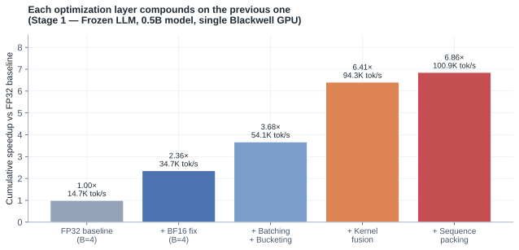
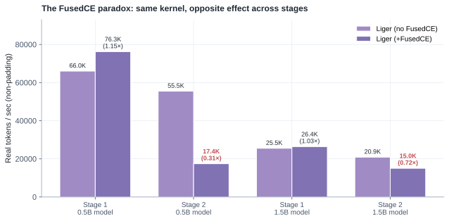
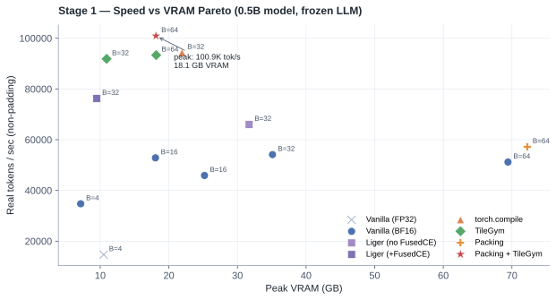
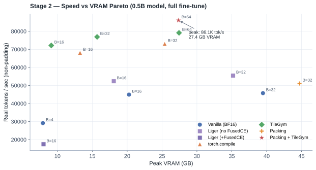

# Optimizing VLM Training on One GPU: A Five-Layer Recipe

How I got SiQ-VL from `14,713` to `100,923` real tokens per second on a single Blackwell GPU, and the four places that surprised me along the way.

## TL;DR

I trained a small vision-language model (SigLIP-2 vision tower + Qwen2.5 LLM, projector-aligned) on one NVIDIA RTX PRO 6000 Blackwell, ran a 48-configuration sweep across two model sizes and both training stages, and ended up with a recipe that compounds five optimization layers.

The headline numbers, all measured on the same dataset (`sharegpt4v/coco`, 50K real VQA samples), 20 timed steps after a 5-step warmup:

- **Stage 1, 0.5B model**: `14.7K → 100.9K` real tokens/s — `6.86×` speedup.
- **Stage 2, 0.5B model**: `29.2K → 86.1K` real tokens/s — `2.95×` speedup.
- **Stage 1, 1.5B model**: `4.6K → 31.1K` real tokens/s — `6.73×` speedup.
- **Stage 2, 1.5B model**: `11.6K → 24.2K` real tokens/s — `2.09×` speedup.



The five layers, in the order I would do them again:

1. **Precision** — make sure your model weights are actually in BF16, not just your config flags. (This was a `2.36×` win from one line.)
2. **Batching + bucketing** — scale to GPU saturation, group by length to keep padding low.
3. **Kernel fusion** — `torch.compile`, Liger-Kernel, or NVIDIA's TileGym. Pick one. They do not stack.
4. **Sequence packing** — only worth it after kernel fusion, and only if your kernels like fixed-length inputs.
5. **System tuning** — turn off gradient checkpointing if VRAM permits; it is a premature optimization on a 96 GB card.

The four findings that surprised me the most:

- A `bf16=True` flag in `TrainingArguments` does *not* mean your matmuls are running in BF16. Mine were silently dispatching FP32 CUTLASS kernels for half the step.
- Liger's fused linear cross-entropy gives a free `+15%` in Stage 1 and is **catastrophic** in Stage 2 — same kernel, opposite effect, different stage.
- "Cache the vision features to skip the encoder" lost throughput on Blackwell. The host-to-device transfer cost more than the SigLIP forward.
- TileGym's `cuTile` kernels need power-of-two head dimensions. The 1.5B SigLIP variant has `head_dim=72`. Game over for that path.

**Companion materials.** Training *curriculum* (freeze / stages / offline CoT): [SiQ-VL curriculum post](/posts/siq-vl-curriculum-under-compute-constraints/). Same sweep written up as a formal [technical report (PDF)](https://github.com/duoan/SiQ_VL/blob/master/docs/report/main.pdf) ([LaTeX source](https://github.com/duoan/SiQ_VL/blob/master/docs/report/main.tex)) with related-work context. Raw run-by-run data: [`benchmarks.csv`](./benchmarks.csv) (48 runs). Training code, profiler traces, and pre-trained checkpoints: [`duoan/SiQ_VL`](https://github.com/duoan/SiQ_VL). Live training curves: [W&B dashboard](https://wandb.ai/ReproduceAI/siq-vl).

## Why this post exists

Most "speed up your VLM training" guides I've seen do one of two things. They either pick one technique (FlashAttention 2, or Liger, or packing) and demonstrate it in isolation, or they hand you a bag of flags with no story about *why* this combination, *which order*, and *what breaks when*.

The piece I kept missing was the interaction. When I added Liger to a working bf16 + bucketing config, Stage 1 got faster and Stage 2 got slower. When I tried `torch.compile` on top of Liger, training crashed with "illegal memory access". When I cached SigLIP features to disk to skip the vision forward, throughput went down, not up.

So I ran the sweep myself. Same dataset, same GPU, same measurement protocol — vary one or two flags at a time and write down what happens. This post is that sweep, condensed into a recipe.

## Setup

| | Configuration |
|---|---|
| GPU | NVIDIA RTX PRO 6000 Blackwell, 96 GB GDDR7, 1.79 TB/s, sm_120 |
| Software | CUDA 13.0, Driver 580.126, PyTorch 2.9.1, transformers ≥ 4.57.3 |
| Small model (0.5B) | SigLIP-2 base patch16-224 (92.9M, frozen) + Qwen2.5-0.5B-Instruct (494M) + 2-layer MLP projector (2.8M) |
| Large model (1.9B) | SigLIP-2 so400m patch14-384 (400M, frozen) + Qwen2.5-1.5B-Instruct (1.54B) + projector (9.4M) |
| Dataset | HuggingFaceM4/FineVision (`sharegpt4v/coco` subset), 50K samples |
| Measurement | 5-step warmup, 20 timed steps, `torch.cuda.synchronize()` between |
| Primary metric | **Real tokens/s** = non-padding training tokens divided by wall time |

Stage 1 is projector alignment with everything else frozen. Stage 2 is full fine-tuning of the LLM (vision tower remains frozen). They look almost identical from the outside but have very different compute profiles, which turns out to matter a lot.

I used **real tokens/s** rather than steps/s or padded-tokens/s because steps hide batch-size effects and padded tokens reward you for over-padding. Real tok/s is the only single number that captures both hardware throughput and data-layout efficiency.

## The five-layer framework

Every optimization I tried fits into one of five buckets:

| Layer | Category | Techniques | Typical impact |
|---|---|---|---|
| 1 | Precision | BF16 model loading, autocast, vision under `no_grad` | `2–3×` |
| 2 | Batching | Batch size to saturation, gradient accumulation only when forced | `1.3–1.6×` |
| 3 | Data layout | Length bucketing, sequence packing | `1.1–1.5×` |
| 4 | Kernel fusion | `torch.compile`, Liger-Kernel, TileGym | `1.4–2.0×` |
| 5 | System tuning | Disable grad ckpt when VRAM permits, tune dataloader | `1.1–1.2×` |

The numbers are multiplicative: `2.5 × 1.4 × 1.2 × 1.7 × 1.15 ≈ 8.2×`, which is in the right ballpark of what I actually measured.

The principle that matters more than any single layer:

> Layers interact. The optimal configuration is a *composition*, not a sum, and some compositions are worse than the parts.

The rest of this post is mostly evidence for that one sentence.

## Four surprises

### 1. The "bf16" config flag was lying

This was the biggest single win, and the most embarrassing root cause. My config had `bf16=True`. The trainer reported BF16 mixed precision. The Hugging Face docs said this was correct. And yet, when I opened a `torch.profiler` trace on the baseline run, half the GPU time was in `cutlass_80_simt_sgemm_128x256` — a single-precision GEMM kernel.

The reason is that `from_pretrained()` loads model weights in FP32 by default. `bf16=True` in `TrainingArguments` only controls autocast on the *forward pass*. The frozen modules — vision tower, frozen LLM in Stage 1 — never get autocasted because autocast only wraps modules that are in the gradient path. So they sit in FP32, do FP32 matmul, and you pay 2× per matmul.

The fix is a one-line change at model load:

```python
text_model = AutoModel.from_pretrained(name, torch_dtype=torch.bfloat16)
vision_model = AutoModel.from_pretrained(siglip_name, torch_dtype=torch.bfloat16)
projector.to(torch.bfloat16)
```

While I was there, I also wrapped the (always-frozen) vision forward in `torch.no_grad()`:

```python
with torch.no_grad():
    vision_features = self.vision_model(pixel_values).last_hidden_state
```

`requires_grad_(False)` on the parameters does *not* stop autograd from building a graph through the forward — it only blocks the gradient at the parameter. The intermediate activations still pretend to need a backward pass, which costs memory and time.

The result of these two changes:

| Metric | Before | After | Delta |
|---|---|---|---|
| avg step time (ms) | 310.7 | 101.1 | `-67%` |
| real tokens / s | 4,674 | 14,366 | `+207%` |
| peak VRAM (GB) | 19.27 | 11.54 | `-40%` |

`3.07×` from two lines of code. The lesson I keep relearning is *check the actual kernel dispatches, not your config*. Configs lie.

### 2. The FusedCE paradox

Liger-Kernel ships a beautiful kernel called `LigerFusedLinearCrossEntropyLoss`. It computes `hidden @ lm_head.T → log_softmax → nll` in chunks without ever materializing the full `(B, L, V)` logits tensor. With Qwen2.5's vocabulary of 151,936 tokens, that tensor would be `~2–4 GB` of intermediate alone. Killing it sounds great.

In Stage 1, it is great. `+15%` real tok/s, `−70%` peak VRAM. In Stage 2, on the *same* model and *same* dataset, it is a `0.60×` regression. Same kernel. Opposite sign.



The two negative bars (small model Stage 2, large model Stage 2) are not noise. They reproduced across multiple runs and batch sizes. The root cause is that FusedCE's "chunked" forward becomes a chunked *backward* when the LM head is trainable. Each chunk launches its own Triton kernel, and on Blackwell the per-launch overhead plus the fact that small chunks undersaturate 188 SMs more than wipes out the FLOP and memory savings.

I confirmed this by component-isolating the rest of Liger:

| Liger components enabled | ms / step (Stage 2, B=16) | VRAM | Δ vs vanilla |
|---|---|---|---|
| Vanilla (none) | 133.6 | 13.4 GB | — |
| RoPE only | 132.7 | 13.4 GB | `-0.7%` |
| + RMSNorm | 119.6 | 13.4 GB | `-10.4%` |
| + SwiGLU | 109.0 | 13.4 GB | `-18.4%` |
| **+ FusedCE (all)** | **254.8** | **2.3 GB** | **`+90.8%`** |
| FusedCE only | 284.5 | 2.3 GB | `+113.0%` |

RMSNorm and SwiGLU are pure wins in both stages. RoPE is neutral. FusedCE is the one component that flips sign.

Practical takeaway: configure Liger *per stage*. Stage 1 wants `fused_linear_cross_entropy=True`. Stage 2 on a high-VRAM card wants `fused_linear_cross_entropy=False`. On a 24 GB card where Stage 2 can't fit without it, the slowdown becomes a forced tradeoff — but on a 96 GB card it is just a worse choice.

### 3. Vision feature caching made things slower

The plan was obvious. The vision encoder is frozen. It runs the same forward every epoch and produces the same outputs. Why not dump SigLIP features to disk once and load them at training time, skipping the vision pass entirely?

I implemented it. `scripts/extract_vision_features.py` to dump, `CachedVQADataset` and `CachedVisionDataCollator` to load, a `vision_features` kwarg in the model `forward` to bypass the encoder. Clean code. Worked on the first try. Threw away `~21ms` of vision compute per step.

Then it ran 0% faster.

| Approach | Tokens/sec | VRAM | Verdict |
|---|---|---|---|
| Stage 1 baseline (BF16, B=4) | 11,070 | 6.78 GB | — |
| + Vision feature caching (B=4) | 11,070 | 8.58 GB | Slower (H2D transfer ≥ compute) |
| + `torch.compile(vision)` (B=4) | 11,070 | 6.78 GB | `+0%` (40s compile overhead) |

The H2D transfer of `(num_tiles × 1024 patches × 1152 channels × 2 bytes)` per sample is bigger than the SigLIP forward at this size on Blackwell. The encoder, running BF16 with the SDPA flash backend, completes in `~5ms/tile`. By the time the cached tensor has been read from disk, page-cached, transferred to GPU, and unpacked, the original forward would have finished.

I kept the caching infrastructure in the codebase. It is the right choice on a slower GPU, on a CPU-bound machine, or for very-large-epoch training where the encoder cost compounds. On a single Blackwell GPU it is anti-optimization.

The general lesson: *check whether the thing you're trying to skip is actually expensive before you build infrastructure to skip it.* Five percent of a step time is not worth caching.

### 4. TileGym's silent incompatibility

NVIDIA's TileGym (cuTile DSL, CUTLASS 4.0) was the fastest single kernel I tested on the small model. Stage 1, `B=64`, `pad_to_multiple_of=64`: `93,344` real tok/s, `18.2 GB` VRAM — better Pareto than `torch.compile` and Liger.

I switched to the 1.5B model. TileGym refused to start.

The 1.5B-paired SigLIP variant is `siglip-so400m`, with hidden dim `1152` and 16 attention heads. That gives `head_dim = 72`. cuTile requires power-of-two tile dimensions. The fallback path triggered a 5× slowdown that made TileGym strictly worse than vanilla BF16 — to the point that the only safe choice was to drop the kernel entirely.

So on the 1.5B Pareto plot, you'll notice TileGym is missing:





The takeaway is mundane but important: read your model's `head_dim` before committing to a kernel strategy. If it is not a power of two, your options shrink to `torch.compile` and Liger (without FusedCE in Stage 2). If it is, TileGym wins both speed and VRAM.

## Cross-scale: small versus large

The 0.5B and 1.5B models tell a consistent Stage 1 story and a more interesting Stage 2 one:

| Metric | 0.5B | 1.5B | Ratio |
|---|---|---|---|
| Stage 1 baseline | 14,713 tok/s | 4,626 tok/s | `3.2×` |
| Stage 1 peak | 100,923 tok/s | 31,110 tok/s | `3.2×` |
| **Stage 1 speedup** | **`6.86×`** | **`6.73×`** | ≈ equal |
| Stage 2 baseline | 29,167 tok/s | 11,569 tok/s | `2.5×` |
| Stage 2 peak | 86,080 tok/s | 24,153 tok/s | `3.6×` |
| **Stage 2 speedup** | **`2.95×`** | **`2.09×`** | smaller for larger |

Stage 1 speedups are nearly identical because the frozen LLM is a fixed-cost forward pass; precision and batch scaling buy you proportional throughput regardless of model size. Stage 2 speedups are smaller for the bigger model because it is more compute-bound — there is less idle GPU time to claw back, and the same kernel-fusion trick removes a smaller fraction of the step.

The other thing the table tells me is the bigger model has more headroom *to* be optimized further. `2.09×` is not the ceiling. It is what I got with the techniques that survived all the constraints (no TileGym, no FusedCE in Stage 2). With FP8, MFU profiling, and a kernel I haven't written yet, it could be more.

## A practitioner's decision tree

If I were starting a new VLM project tomorrow, this is the order I would try things in:

```text
1. Fix precision.
   - Load weights as bf16/fp16 from the start.
   - Wrap frozen modules in torch.no_grad().
   - Verify with a profiler trace, not the config.
   Expected: 2–3× from one PR.

2. Scale batch to saturation.
   - Increase per-device batch until tok/s plateaus.
   - Add length bucketing once batch > 8 to keep pad % low.
   Expected: another 1.3–1.6×.

3. Pick exactly one kernel strategy.
   - head_dim is a power of 2  →  TileGym (best Pareto).
   - head_dim is not a power of 2 OR you want zero deps  →  torch.compile.
   - VRAM-constrained (24–48 GB)  →  Liger with FusedCE in Stage 1, no FusedCE in Stage 2.
   Do not stack. They fight.

4. Configure per stage.
   - Stage 1: FusedCE on, gradient checkpointing optional.
   - Stage 2: FusedCE off, gradient checkpointing off if VRAM permits.

5. Consider packing only when:
   - Bucketing alone leaves > 10% padding.
   - Your kernel of choice likes fixed-length inputs (TileGym very much does).
   - You can spare engineering time on a packed attention mask.

6. Stop and benchmark before adding anything else.
```

Two anti-patterns I would specifically warn against:

- **Stacking kernels.** `Liger + torch.compile` was the most natural-sounding combination and it crashed with CUDA illegal memory access. Liger monkey-patches module forward methods; `torch.compile` traces through patched code and generates incompatible graphs. Pick one.
- **Pre-emptive gradient checkpointing.** Standard fine-tuning recipes turn it on by default. On a 96 GB card running a 0.5B model with peak VRAM under 40 GB, it is `+15–21%` step time for nothing.

## Failed experiments

The negative results were as informative as the positive ones, so they're worth listing:

| # | What I tried | Outcome | Root cause |
|---|---|---|---|
| 1 | Vision feature caching | `+0%` throughput, `+1.8 GB` VRAM | Vision forward is `<5%` of step time on Blackwell; H2D transfer cost > compute saved. |
| 2 | Hand-written Triton flash attention | `2.3×` slower than SDPA | SDPA dispatches to vendor cuDNN; beating it from Triton requires deep hardware tuning. |
| 3 | FlexAttention with variable lengths | `51%` padding waste, slower than vanilla | Block-sparse approach is inefficient at small block sizes. |
| 4 | TileGym with non-aligned shapes | `5×` regression | `cuTile` requires `pad_to_multiple_of=64`; non-aligned shapes fall back hard. |
| 5 | Liger + `torch.compile` | CUDA illegal memory access | Liger monkey-patches forward; compile traces through patched code. |
| 6 | Gradient ckpt + FusedCE in Stage 2 | `+91%` step time despite `−83%` VRAM | Checkpointing recomputes the chunked forward, doubling Triton launch overhead. |

Three of the six (#1, #5, #6) are kernel-interaction failures — combinations that look obviously good and aren't. The other three are alignment / shape failures. Both categories share a single moral: **always verify with a profiler trace on a real step**, not with a microbenchmark and not with a docstring.

## Closing

The result that matters more than the `6.86×` is the *order*. Precision first, batching second, kernels third, packing last, system tuning continuously. That order is robust across model scales (0.5B and 1.5B agreed to within 2% on Stage 1 speedup) and almost certainly transfers to other VLMs that follow the LLaVA-style projector-alignment paradigm — InternVL, Qwen-VL, PaliGemma, LLaVA-NeXT.

What I would still want to know:

- How much of this falls apart on Ampere or Hopper? Some kernels (TileGym) are Blackwell-targeted. The framework should hold; the specific winners may shuffle.
- FP8 training. I haven't tried it yet. On Blackwell with E4M3, the precision-layer ROI could be another `1.5–2×` on top.
- Multi-GPU. The next post in this series is going to take this single-GPU recipe and feed it into FSDP + token-budget batching, which is where my [variable sequence length post](../why-variable-sequence-length-breaks-ddp-throughput/) becomes relevant again.

## Resources

This post is the short, narrative cut. The longer-form material lives in three places, depending on what you're after.

**Read it as a paper.** The same sweep is written up as a formal technical report with related-work context, full result tables for both model scales, and a six-item failed-experiments section.

- Tech report (PDF): <https://github.com/duoan/SiQ_VL/blob/master/docs/report/main.pdf>
- LaTeX source: <https://github.com/duoan/SiQ_VL/blob/master/docs/report/main.tex>

**Read it as an engineering journal.** Every iteration (success and failure), one entry, in `Hypothesis → Change → Measurement → Result → Decision → Lessons` form. This is what I actually wrote while doing the work.

- Iteration log: <https://github.com/duoan/SiQ_VL/blob/master/docs/training_efficiency_plan.md>

**Reproduce it.** Code, dataset wiring, benchmark scripts, and pre-trained checkpoints.

- Training & benchmark code: <https://github.com/duoan/SiQ_VL>
- Benchmark scripts: `scripts/benchmark_*.py` in that repo
- Stage 1 checkpoint (HF): <https://huggingface.co/classtag/siq-vl_siglip2-large-patch16-512_qwen2.5-1.5b-instruct_stage1>
- Stage 2 checkpoint (HF): <https://huggingface.co/classtag/siq-vl_siglip2-large-patch16-512_qwen2.5-1.5b-instruct_stage2>
- W&B dashboard (live curves, run metadata): <https://wandb.ai/ReproduceAI/siq-vl>

**The data behind this post specifically.**

- Consolidated 48-run table (CSV): [`benchmarks.csv`](./benchmarks.csv)
- Figure source: [`playground/vlm_efficiency_figures.py`](https://github.com/duoan/duoan.github.io/blob/main/playground/vlm_efficiency_figures.py)
- Per-run config JSONs: `docs/traces/benchmark_v3_20260522_001447/` (small) and `docs/traces/benchmark_v3_large/` (large) in the SiQ-VL repo
- Chrome traces (Git LFS): `docs/traces/iter_*.json`, open in <https://ui.perfetto.dev>
