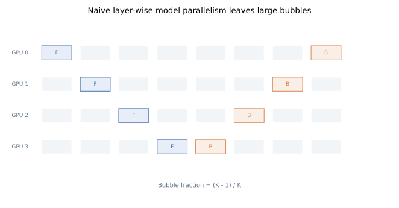
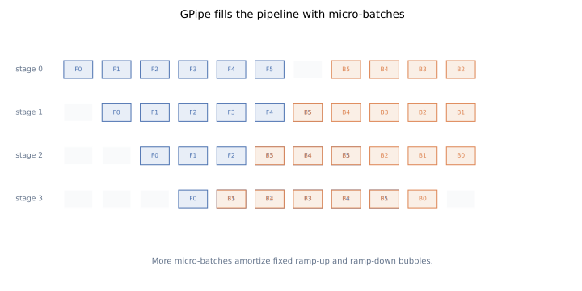
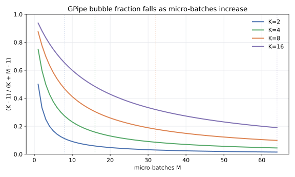
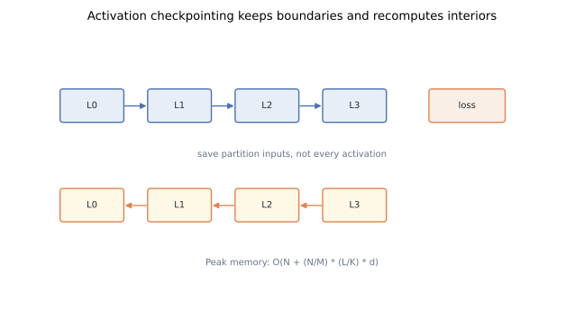

# Pipeline Parallelism from First Principles: Why GPipe Split the Batch

Pipeline parallelism starts from a simple observation: a Transformer stack is already a chain. If one device cannot hold the whole chain, put consecutive layers on different devices and pass activations forward. That solves the first problem, but it creates two new ones: most devices wait, and activations still dominate memory.

GPipe made the idea usable by splitting the batch into micro-batches and checkpointing activations. The result is not the final word in pipeline training, but it is the cleanest entry point for understanding why pipeline schedules exist at all.

## TL;DR

- Distributed training has two first-order goals: **fit larger models** and **finish training faster**. Memory capacity and interconnect bandwidth decide how close we get.
- Naive layer-wise model parallelism fits more layers, but its bubble fraction is `(K - 1) / K` for `K` pipeline stages. As `K` grows, the cluster spends most of its time waiting.
- Splitting a mini-batch into `M` micro-batches reduces the GPipe bubble fraction to `(K - 1) / (K + M - 1)`. A practical starting point is `M >= 4K`, then tune for memory and kernel efficiency.
- Activation memory without checkpointing scales like `O(N * (L/K) * d)` per stage. With rematerialization, peak activation memory becomes roughly `O(N + (N/M) * (L/K) * d)`.
- GPipe showed close-to-linear model-size scaling on Transformer models because they split evenly; AmoebaNet scaled less cleanly because stage balance was harder.
- Modern stacks often prefer 1F1B, interleaved schedules, and zero-bubble variants, but they inherit the same core trade: bubble, memory, and communication.
- Reproducible figures for this post: [`playground/llm_training_series_figures.py`](https://github.com/duoan/duoan.github.io/blob/main/playground/llm_training_series_figures.py).

## 1. The Optimization Target

Adding GPUs only helps if it changes one of two constraints:

1. **Capacity**: the model, optimizer state, gradients, activations, and temporary buffers fit somewhere.
2. **Throughput**: the added devices do enough useful work to reduce wall-clock time.

The ideal scaling story says: double the GPUs, double the trainable model size, and double the token throughput. Real systems lose that ideal to two taxes:

- **Memory pressure**. A bigger model means more parameters and more optimizer state. A larger batch or longer sequence means more activations. The backward pass needs intermediate values from the forward pass unless we recompute them.
- **Communication pressure**. Every stage boundary, gradient synchronization, and parameter exchange moves bytes over links that are slower than local HBM.

Pipeline parallelism attacks capacity first. It divides the layer stack into `K` partitions and places each partition on a different device. If the partitioning is balanced, each GPU holds roughly `L/K` layers for a model with `L` layers.

The technique becomes interesting only after we ask the throughput question.

## 2. Naive Model Parallelism: It Fits, Then Waits

The most direct strategy is to assign consecutive layers to consecutive GPUs:



For one mini-batch, the forward pass moves from stage `0` to stage `K - 1`. Then the backward pass moves in reverse. During most of that timeline, only one stage is active. The other stages are idle.

Assume each stage spends `t_f + t_b` on its portion of the work for a mini-batch. In a naive schedule:

```text
useful work area = K * (t_f + t_b)
timeline area    = K * K * (t_f + t_b)
bubble fraction  = (K - 1) / K
```

That expression is brutal. At `K = 2`, half the device-time is idle. At `K = 8`, the idle fraction is 87.5%. Increasing the number of stages makes the model fit, but it also makes the schedule worse.

Naive model parallelism also does not automatically solve activation memory. If the local partition has `L/K` layers, hidden width `d`, and mini-batch size `N`, the stored activations per stage scale as:

```text
O(N * (L/K) * d)
```

This is smaller than keeping all `L` layers on one GPU, but it may still be too large. Worse, teams often increase batch size when they add GPUs, which pushes `N` back up.

## 3. GPipe's Key Move: Split the Mini-Batch

GPipe's central idea is to keep the same model partitioning, but feed the pipeline with multiple micro-batches from one mini-batch.



Let:

- `K` be the number of pipeline stages.
- `M` be the number of micro-batches.
- `N` be the original mini-batch size.

Each micro-batch has size `N/M`. Stage `0` starts micro-batch `0`, then immediately starts micro-batch `1` while stage `1` works on micro-batch `0`. Once the pipe is full, all stages are busy. There is still a ramp-up bubble and a ramp-down bubble, but those fixed bubbles are amortized over more work.

For the GPipe flush schedule, the bubble fraction becomes:

```text
(K - 1) / (K + M - 1)
```

This is the whole reason micro-batches matter. For `K = 8`:

- `M = 1` gives `7/8 = 87.5%` bubble.
- `M = 8` gives `7/15 = 46.7%` bubble.
- `M = 32` gives `7/39 = 17.9%` bubble.

The GPipe paper recommends making `M` at least several times larger than `K`; `M >= 4K` is a useful first setting. After that, more micro-batches have diminishing returns and can make each micro-batch too small to use matrix-multiply kernels efficiently.



The phrase "pipeline parallelism" is literal here: micro-batches are the items moving through the production line.

## 4. Synchronous Updates and the Flush Schedule

GPipe accumulates gradients across the `M` micro-batches and applies one update for the original mini-batch. That makes it a **synchronous** pipeline method. Every stage uses the same parameter version for the mini-batch, and the optimizer step happens after all micro-batches finish backward.

The benefit is simple semantics:

- The training result matches ordinary mini-batch SGD, aside from numerical-order differences.
- There is no weight staleness within the mini-batch.
- Gradient accumulation is easy to reason about.

The cost is the flush bubble. The pipeline must drain before the update. Later systems explore alternatives:

- **1F1B** schedules perform one forward and one backward per stage once warm, reducing activation residency compared with GPipe's all-forward-then-all-backward pattern.
- **Interleaved pipeline parallelism** splits each device into multiple virtual stages, improving load balance and reducing bubbles when communication permits.
- **Zero-bubble schedules** try to overlap weight-gradient computation with otherwise idle slots.

Those methods are important in production, but GPipe is still the best first model because the math is visible.

## 5. Activation Checkpointing: Pay FLOPs to Buy Memory

Micro-batches reduce idle time. GPipe's second move, rematerialization, reduces activation memory.



During backward, a layer needs forward activations. The naive strategy stores every intermediate activation. GPipe instead keeps only the partition boundary inputs and recomputes internal activations when backward reaches that partition.

For each stage, the memory picture changes:

- Keep the input activation for each micro-batch at the partition boundary.
- During one micro-batch's backward, recompute the local forward activations for that stage.
- Release recomputed activations after their gradients are computed.

The approximate peak per-stage activation memory becomes:

```text
O(N + (N/M) * (L/K) * d)
```

The first term is the boundary checkpoint across the mini-batch. The second term is the temporary activation footprint for one micro-batch through the local `L/K` layers.

This is a trade, not free lunch. Backward now includes extra forward compute. In GPipe's experiments, rematerialization is often a large part of the non-matrix-multiply time. The trade is still attractive because it converts a hard memory limit into a softer throughput cost.

## 6. Batch Normalization Is a Historical Footnote for LLMs

GPipe was evaluated on image models and language models, so the original paper had to discuss BatchNorm. Splitting a mini-batch changes the statistics seen by each micro-batch. GPipe handled this by using micro-batch statistics during training while tracking moving averages at the mini-batch level for evaluation.

For modern Transformer LLM training, this is usually not the central issue. LayerNorm and RMSNorm normalize per token or per hidden vector and do not depend on cross-example batch statistics. The practical knobs are micro-batch size, activation checkpointing granularity, sequence length, and schedule.

## 7. What GPipe Proved Experimentally

The GPipe paper, *Efficient Training of Giant Neural Networks using Pipeline Parallelism* (Huang et al., 2019), evaluated both AmoebaNet and Transformer models.

The important lesson is not a single throughput number. It is that **partitionability controls scaling**.

For Transformer models, increasing pipeline stages allowed the authors to scale model size almost linearly. The stack is regular: each block is similar, activation shapes are predictable, and partition boundaries can be chosen evenly.

For AmoebaNet, scaling was less clean. The network structure is less uniform, so one stage can become the memory or compute bottleneck. Pipeline throughput is controlled by the slowest stage, not by the average stage.

The training-speed results tell the same story:

- With too few micro-batches, bubble dominates and scaling is poor.
- With enough micro-batches, Transformer throughput improves close to linearly over the tested range.
- Communication matters, but the schedule can still help even when fast links are disabled, because the baseline bubble is so large.

The lesson for LLM systems is direct: before choosing `K`, estimate per-layer memory and compute. A perfectly elegant pipeline schedule cannot save a bad partition.

## 8. How to Choose Pipeline Parallelism Today

Pipeline parallelism is usually not the first tool to reach for in decoder-only LLM training. A common order is:

1. Use data parallelism for throughput.
2. Use tensor parallelism when single-layer matrices are too large or when intra-node bandwidth is abundant.
3. Use ZeRO/FSDP to shard model states across data-parallel ranks.
4. Add sequence/context parallelism for long contexts.
5. Add pipeline parallelism when the layer stack still cannot fit or when global scale requires another dimension.

Pipeline parallelism is strongest when:

- The model has many similar layers.
- Stage boundaries move modest activation tensors.
- The batch can be split into enough micro-batches.
- The team can tolerate schedule complexity in checkpointing, logging, and failure recovery.

It is weakest when:

- Layers are irregular and hard to balance.
- The global batch is small, limiting `M`.
- Sequence length is so large that activation traffic dominates stage-boundary communication.
- The pipeline depth is high but per-stage compute is small.

## 9. A Minimal Mental Model

When evaluating a pipeline plan, keep four numbers on the whiteboard:

```text
K = pipeline stages
M = micro-batches
bubble ~= (K - 1) / (K + M - 1)
activation peak ~= O(N + (N/M) * (L/K) * d)
```

Then add the two constraints that do not fit neatly into the formula:

- **Balance**: the slowest stage sets the pipeline clock.
- **Communication**: stage-boundary activation transfers must fit under useful compute.

GPipe's contribution was to make those tradeoffs operational. Split the layer stack to fit. Split the batch to fill the stack. Recompute activations to keep memory below the cliff. The modern pipeline literature keeps improving the schedule, but this first-principles shape remains the same.

## References

- Yanping Huang et al., [*GPipe: Efficient Training of Giant Neural Networks using Pipeline Parallelism*](https://arxiv.org/abs/1811.06965), NeurIPS 2019.
- Aaron Harlap et al., [*PipeDream: Fast and Efficient Pipeline Parallel DNN Training*](https://arxiv.org/abs/1806.03377), SOSP 2019.
- Deepak Narayanan et al., [*Memory-Efficient Pipeline-Parallel DNN Training*](https://arxiv.org/abs/2006.09503), ICML 2021.
- Zhiquan Li et al., [*Chimera: Efficiently Training Large-Scale Neural Networks with Bidirectional Pipelines*](https://arxiv.org/abs/2107.06925), SC 2021.
