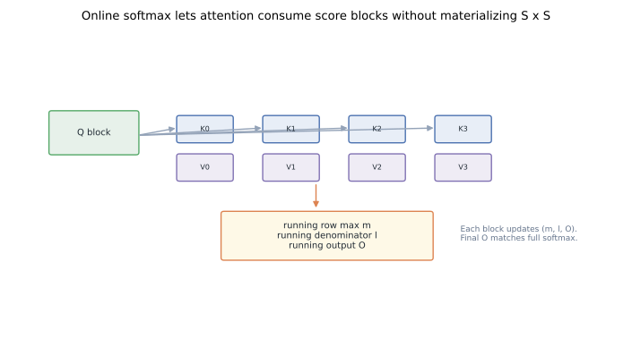
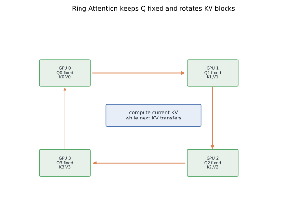
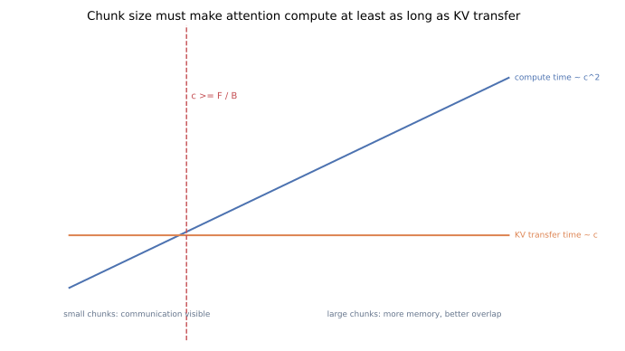

# Sequence Parallelism III: Ring Attention for Context That Does Not Fit

Megatron SP reduces replicated activation memory around tensor-parallel blocks.
DeepSpeed Ulysses uses All-to-All to turn sequence shards into head shards for attention.
Ring Attention changes the unit of work again.
It asks each rank to keep a block of queries fixed, then circulate key/value blocks around a ring until every query block has seen every key/value block it needs.
That is the core idea in *Ring Attention with Blockwise Transformers for Near-Infinite Context* ([arXiv:2310.01889](https://arxiv.org/abs/2310.01889)).

This is the design you reach for when the context itself is too large to fit comfortably on one device.
The mental model is distributed FlashAttention.
You still compute exact attention.
You just never materialize the full score matrix or the full K/V set on one rank at once.

This post follows [Megatron SP](../sequence-parallelism-megatron-sp/) and [Ulysses](../sequence-parallelism-ulysses/), and it sets up [Megatron Context Parallel](../megatron-context-parallel/).

## TL;DR

- Ring Attention splits Q, K, and V into sequence blocks.
- Each rank keeps its own Q block fixed.
- K/V blocks rotate around the ranks in a ring.
- Each rank updates its local output block as each K/V block arrives.
- Online softmax state makes the blockwise updates mathematically equivalent to full attention.
- Communication can be hidden if the K/V transfer for a chunk is no longer than the attention compute for that chunk.
- A simple rule of thumb is `chunk_size >= FLOP/s / Byte/s`, with constants depending on dtype and kernel details.
- Ring Attention and Ulysses both cut along sequence, but Ulysses transposes ownership while Ring Attention streams K/V ownership.
- Reproducible figures for this post: [`playground/llm_training_series_figures.py`](https://github.com/duoan/duoan.github.io/blob/main/playground/llm_training_series_figures.py).

## 1. The Single-GPU Problem First

Before adding a ring, recall why FlashAttention exists.
Naive attention forms:

```text
S = Q K^T
P = softmax(S)
O = P V
```

The score matrix `S` has shape `[sequence, sequence]`.
For long contexts, that matrix is too large to materialize as an activation.
FlashAttention avoids that by processing blocks and maintaining enough state to compute the same output.

Ring Attention relies on the same idea.
If a query block can consume K/V blocks one at a time on a single GPU, it can also consume K/V blocks that arrive from other GPUs one at a time.
The distributed part is the source of the next K/V block.
The numerical part is still online softmax.

## 2. Online Softmax Is the Enabler

Softmax is not additive in the obvious way.
If you compute attention for `K0,V0` and then attention for `K1,V1`, you cannot simply add the two outputs.
The normalization denominator must include both score blocks.
The row maximum used for numerical stability must also be global across all processed keys.

Online softmax keeps three pieces of state per query row:

1. the running maximum `m`,
2. the running normalization denominator `l`,
3. the running output vector `O`.

When a new score block arrives, the algorithm updates all three.
The previous output is rescaled if the running maximum changes.
The new block contribution is scaled into the same denominator.
After all K/V blocks have been processed, the output matches full attention.



This state is small compared with the full score matrix.
It is also local to the query block.
That locality is why Ring Attention can keep Q fixed and stream K/V.

## 3. The Ring

Assume four ranks.
Rank `0` owns `Q0`, `K0`, and `V0`.
Rank `1` owns `Q1`, `K1`, and `V1`.
The pattern continues.

At iteration `0`, each rank computes attention between its local Q block and its local K/V block.
At the same time, it sends its K/V block to the next rank and receives a K/V block from the previous rank.
At iteration `1`, it computes against the received K/V block.
After enough iterations, every Q block has seen every K/V block.



The ring has two useful properties.
Each rank only communicates with neighbors, which maps well to many high-bandwidth fabrics.
Each rank can overlap communication for the next K/V block with compute on the current K/V block.

The output block never leaves its owner during the forward pass.
Only K/V blocks rotate.
That is a major difference from Ulysses, where All-to-All reassigns ownership of Q/K/V by head.

## 4. Communication-Compute Overlap

The performance target is straightforward:

```text
time_to_transfer_next_KV <= time_to_compute_attention_on_current_KV
```

If this inequality holds, communication hides under compute.
If it does not, each ring step has a visible wait.

Let `c` be the sequence chunk size and `d` the head dimension.
For one query chunk against one K/V chunk, the two dominant matmuls are:

```text
Q K^T  : roughly 2 * d * c^2 FLOPs
P V    : roughly 2 * d * c^2 FLOPs
```

The total is roughly:

```text
4 * d * c^2 FLOPs
```

For fp16 or bf16, transferring K and V is roughly:

```text
4 * d * c bytes
```

If `F` is sustained FLOP/s and `B` is sustained Byte/s for the ring link, hiding transfer requires:

```text
4dc / B <= 4dc^2 / F
```

which simplifies to:

```text
c >= F / B
```



The constants move in real kernels.
Softmax work, masking, launch overhead, NVLink or InfiniBand topology, and compute efficiency all matter.
The direction does not change.
Tiny chunks increase scheduling overhead and expose communication.
Huge chunks improve overlap but raise memory pressure and may reduce parallelism.

## 5. Causal Masks Change Work Distribution

For bidirectional attention, every query block attends to every key block.
For causal attention, early query blocks do not attend to future key blocks.
If blocks are assigned contiguously, later ranks may do more useful work than earlier ranks.
That imbalance becomes visible in a ring because all ranks step together.
One slow rank can determine the iteration time.

Plain Ring Attention explains the mechanism.
Production context-parallel systems then add load balancing.
[Megatron Context Parallel](../megatron-context-parallel/) is the next post because it keeps the ring intuition but changes chunk placement to balance causal work.

## 6. Ring Attention vs Ulysses

Ulysses and Ring Attention are easy to conflate because both are sequence-parallel attention methods.
They solve different layout problems.

Ulysses starts with sequence shards and uses All-to-All to assemble full-sequence head shards.
After that transpose, each rank computes attention for one or more heads.
The head assignment bounds the parallel degree unless more hierarchy is added.

Ring Attention starts with sequence blocks and keeps each query block local.
It streams K/V blocks through the ring.
The per-rank attention output is a local sequence block, not a full-sequence head.

In one sentence:

```text
Ulysses moves Q/K/V ownership once; Ring Attention moves K/V ownership repeatedly.
```

That distinction affects memory, collectives, topology, and where overlap can happen.

## 7. Backward Pass Intuition

The backward pass follows the same blockwise logic.
Gradients for Q remain tied to the local query block.
Gradients for K and V must be accumulated as the corresponding K/V block participates in attention with different query blocks.
The ring schedule can be mirrored so that gradient contributions move and accumulate with the same ownership discipline.

The exact implementation is more involved than the forward explanation.
The important invariant is simpler:
every local gradient contribution must be reduced to the owner of the parameter or activation shard that will use it.
For Ring Attention, that means K/V-related gradient ownership is coupled to the same block circulation that made forward possible.

When debugging, do not look for a single giant attention collective.
Look for a sequence of neighbor exchanges and local block attention kernels.

## 8. Practical Failure Modes

Ring Attention is attractive but not magic.
Several things can erase the expected win.

First, chunk size can be wrong.
Too small and communication dominates.
Too large and memory pressure returns.

Second, overlap can fail.
If send/recv ordering, CUDA streams, or buffer dependencies serialize transfer and compute, the ring becomes a communication loop with compute between waits.

Third, causal imbalance can dominate.
If early chunks skip most work while late chunks do all work, average FLOPs per rank is not the performance metric.
The slowest useful rank per iteration is.

Fourth, the implementation must preserve numerical stability.
The online softmax update is not optional bookkeeping.
It is the reason blockwise attention remains exact.

## 9. Where Ring Attention Fits

Ring Attention belongs in the "context does not fit" part of the toolbox.
Megatron SP is about replicated activation memory around tensor-parallel regions.
Ulysses is about All-to-All head ownership.
Ring Attention is about streaming K/V so no rank needs the whole context resident for a head at once.

Those methods can compose.
A large training run might use tensor parallelism for GEMMs, ZeRO for model states, sequence or context parallelism for long contexts, and pipeline parallelism for layers.
The hard part is not naming the parallel dimensions.
The hard part is keeping the ownership transitions explicit enough that memory, compute, and communication can all be reasoned about.

Ring Attention is a clean example of that discipline.
Keep Q fixed.
Rotate K/V.
Update online softmax state.
Choose chunks so communication hides.

## Code

Useful code paths to read:

- [zhuzilin/ring-flash-attention](https://github.com/zhuzilin/ring-flash-attention): compact open implementation of ring-style FlashAttention.
- [lucidrains/ring-attention-pytorch](https://github.com/lucidrains/ring-attention-pytorch): readable PyTorch implementation useful for following tensor movement.
- [FlashAttention](https://github.com/Dao-AILab/flash-attention): baseline blockwise exact attention kernel family.

The implementation detail to watch is online softmax state.
Without the running max, running denominator, and output rescaling, the ring computes the wrong attention.

## References

- Liu et al., [Ring Attention with Blockwise Transformers for Near-Infinite Context](https://arxiv.org/abs/2310.01889), 2023.
- Dao et al., [FlashAttention: Fast and Memory-Efficient Exact Attention with IO-Awareness](https://arxiv.org/abs/2205.14135), 2022.
- Dao, [FlashAttention-2: Faster Attention with Better Parallelism and Work Partitioning](https://arxiv.org/abs/2307.08691), 2023.
- Code: [zhuzilin/ring-flash-attention](https://github.com/zhuzilin/ring-flash-attention), [lucidrains/ring-attention-pytorch](https://github.com/lucidrains/ring-attention-pytorch), [Dao-AILab/flash-attention](https://github.com/Dao-AILab/flash-attention).
