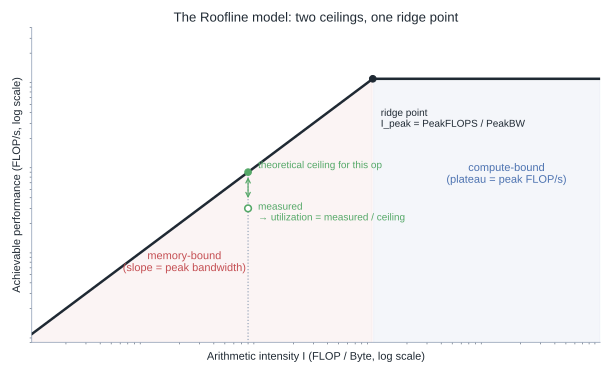
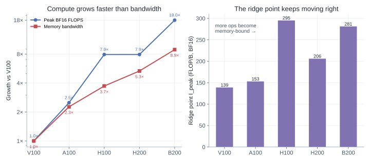
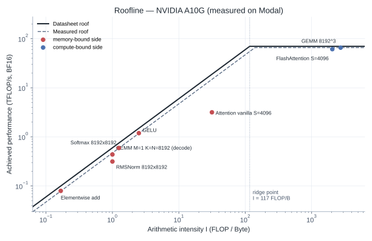
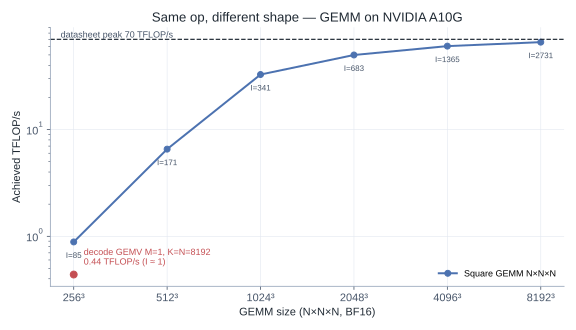
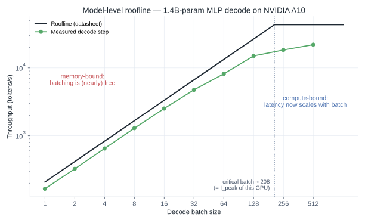
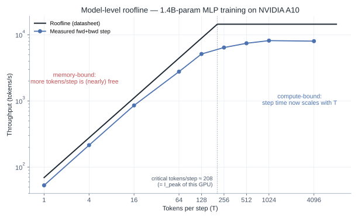
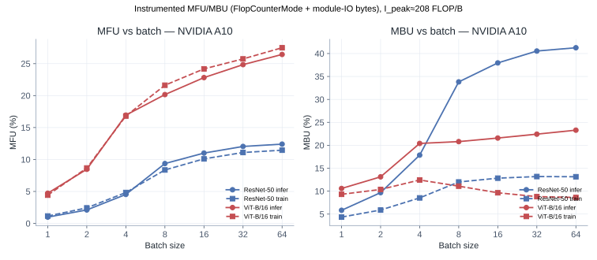
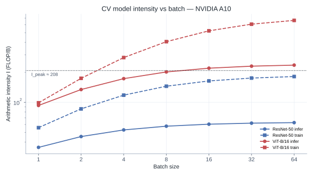
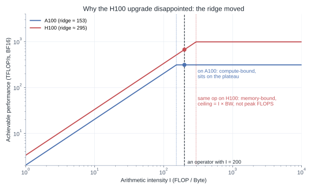

# Roofline: The First Step of Any Performance Optimization

When MFU sits at 20%, most people open a profiler and hunt for a slow kernel. That often starts at the wrong layer. The first question is not *which kernel is hot* — it is *which ceiling you are hitting*: compute or memory bandwidth.

## TL;DR

- Every GPU has two hard ceilings: peak FLOP/s and peak bandwidth. Arithmetic intensity `I = FLOPs / Bytes` decides which one binds first.
- MFU answers “are we compute-bound?” for training. MBU answers “are we bandwidth-bound?” for decode. Both are Roofline ratios, not vibes.
- Shape matters more than op name: the same `matmul` can be compute-bound at `M=N=K=8192` and memory-bound at `M=1`. That is why training and decode feel like different worlds.
- Count MFU/MBU by instrumentation (`FlopCounterMode` + bytes), not PaLM `6PT` — that formula is an LLM shortcut. ResNet / ViT work the same way as any other `nn.Module`.
- Model-level Roofline is useful when traffic is homogeneous (decode, dense training GEMMs). It is misleading when time is dominated by a mix of memory-bound and compute-bound ops — then go per-op, then profiler.
- Reproducible Modal measurements (ops, LLM decode/train sweeps, ResNet/ViT MFU·MBU) live in this page bundle; code in [`playground/roofline_modal.py`](https://github.com/duoan/duoan.github.io/blob/main/playground/roofline_modal.py).

## The Most Expensive Mistake

The costly failure mode in performance work is not missing the optimal kernel. It is optimizing in the wrong direction.

A recurring upgrade story:

> Dense training on A100 at ~45% MFU. Move to H100 expecting ~3× from peak BF16. Wall-clock improves ~1.5×; MFU *falls* to ~32%. The team blames NCCL, CUDA, or “bad kernels.” The real change: **the ridge point moved.** Ops that sat on the A100 plateau were pushed onto the H100 slope.

Hardware keeps rewriting the binding constraint. Roofline is the cheapest way to see that before you spend a week in Nsight.

## The Model in One Page

Roofline (Williams, Waterman, Patterson, CACM 2009) says:

> Achieved performance ≤ min(`I × PeakBW`, `PeakFLOPS`).

```text
I = FLOPs / Bytes_to_and_from_DRAM     [FLOP/B]
I_peak = PeakFLOPS / PeakBW
P(I) = min(I × PeakBW, PeakFLOPS)
```

- **`I` is mostly an algorithm/shape property** (and precision). Moving the same GEMM to a new GPU does not change `I`; it moves the roof around the point.
- Left of `I_peak`: memory-bound — raise reuse / fuse / cut traffic.
- Right of `I_peak`: compute-bound — Tensor Cores, lower precision, better tiling / shapes.
- Near `I_peak`: both matter; pick by ROI.



Utilization is simply measured rate ÷ the roof height at that `I`. A profiler reports milliseconds; Roofline asks whether those milliseconds were spent computing or waiting on DRAM.

Classic FP32 intensities:

| Operation | FLOPs | Bytes | I |
|---|---|---|---|
| SAXPY | 2N | 12N | 0.17 |
| Dot | 2N | 8N | 0.25 |
| Square GEMM N×N | 2N³ | 12N² | N/6 |

GEMM’s `I` scales with `N`. Large matmuls are *structurally* compute-bound; elementwise ops are *structurally* memory-bound. That is not a failed optimization — it is the algorithm.

## The Ridge Keeps Moving Right

Dense datasheet peaks (no sparsity):

| GPU | Peak BF16 | Bandwidth | I_peak (BF16) |
|---|---|---|---|
| V100 SXM2 | 125 TFLOPS | 900 GB/s | ~139 |
| A100 SXM 80GB | 312 TFLOPS | 2039 GB/s | ~153 |
| H100 SXM | 989 TFLOPS | 3.35 TB/s | ~295 |
| H200 SXM | 989 TFLOPS | 4.8 TB/s | ~206 |
| B200 | 2250 TFLOPS | 8 TB/s | ~281 |
| GB200 NVL72 | 2500 TFLOPS/GPU | 8 TB/s | ~312 |



Since V100, BF16 compute grew ~18× while bandwidth grew ~8.9×. The ridge moved from ~139 to ~295 on H100. More of the operator zoo sits on the slope every generation.

That is the shared story behind FlashAttention, aggressive fusion / `torch.compile`, and FP8 GEMMs: **raise effective `I` or stop pretending low-`I` work can drink peak FLOPS.**

FP8 makes the ridge *worse* for non-GEMM work: H100 FP8 peak ~1979 TFLOPS ⇒ `I_peak(FP8) ≈ 591` with the same HBM. Elementwise ops get shoved further left. FP8 is a GEMM/tooling bet, not a free lunch for the whole graph.

## How to Score: MFU and MBU

The definitions are model-agnostic. The *counting method* is what people get wrong.

```text
MFU = (measured FLOPs / wall_time) / PeakFLOPS
MBU = (measured Bytes / wall_time) / PeakBW
I   = measured FLOPs / measured Bytes
```

**Do not start from PaLM’s `6·P·T`.** That is a *shortcut for dense Transformer LLMs*, not a universal FLOP counter. ResNet, ViT, U-Net, diffusion backbones — none of them owe you a closed form. The portable method is instrumentation:

1. **FLOPs** — `torch.utils.flop_counter.FlopCounterMode` (or fvcore). Run the real forward, or forward+backward, under the same autocast you use in production.
2. **Bytes** — either DRAM bytes from Nsight Compute, or a *module-boundary* estimate: for every leaf module, charge parameter reads + input/output tensor sizes. The estimate over-counts when activations stay in cache / get fused, and under-counts workspace invisible at boundaries. It is still the right default when you do not have `ncu`.
3. **Time** — median CUDA events around the same region you counted.

```python
from torch.utils.flop_counter import FlopCounterMode

with FlopCounterMode(display=False) as fcm:
    with torch.autocast("cuda", dtype=torch.bfloat16):
        model(x)          # or: loss = model(x).sum(); loss.backward()
flops = fcm.get_total_flops()
# bytes: leaf-module hooks (see playground/roofline_modal.py::cv)
# time:  CUDA event median of the same callable
mfu = (flops / seconds) / peak_flops
mbu = (nbytes / seconds) / peak_bw
```

### LLM special case (optional shortcut)

For *dense* Transformer LLMs only, FLOPs/step ≈ `6·P·T` (Kaplan / Chinchilla): forward `2PT`, backward `4PT`. Long sequences need the attention term or you **understate FLOPs and inflate MFU**:

```text
FLOPs/step ≈ 6·P·T + 12·L·H·Q·T·S
```

Public LLM ballparks still use this shortcut: PaLM 540B ~46% on TPU v4; Llama-2 70B ~40–45% on A100. Below ~20% on a healthy dense LLM job, look for data / launch / communication first.

**MFU vs HFU:** HFU counts checkpoint recompute in the numerator. HFU = “is the GPU busy?”; MFU = “useful model work.” Ask whether a quoted “60% MFU” includes recompute.

### Decode → MBU (LLM serving)

Batch-1 BF16 decode is dominated by streaming weights. Llama-70B on H100:

```text
bytes/token ≈ 2·P = 140 GB
t_token ≥ 140 GB / 3.35 TB/s ≈ 41.8 ms  →  ≤ ~24 tok/s
```

That bound is physical. Speculative decoding, continuous batching, and quantization change the *bytes* or the *effective batch* — they do not violate Roofline. Good serving stacks often land in the 60–80% MBU band; below ~40% usually means launch / CPU / graph overhead.

## Operator Intensities (Keep This Table)

Horace He’s framing still stands: time splits into **compute, memory, overhead**. Roofline covers the first two. Overhead (eager launches, Python, host sync) is a third wall — high when both MFU and MBU are low.

| Operator | I (BF16, approx.) | On H100 | Lever |
|---|---|---|---|
| Elementwise | 0.5–1.5 | memory | fuse |
| RMSNorm / Softmax | ~1 | memory | fused kernels |
| Vanilla attention | tens | memory | FlashAttention |
| FlashAttention | hundreds–thousands* | near/on plateau | already the right direction |
| GEMM 4096³ | ~10³ | compute | TC alignment, FP8 |
| GEMM M=1 (decode) | ~1–2 | memory | batch, quantize |
| Embedding | ~0 | memory | cache / low-precision storage |

\*Depends on how you count SRAM-resident intermediates; the *point* is FA collapses HBM traffic from O(S²) to O(S) at nearly constant FLOPs — “raise `I`” and “cut memory traffic” are the same move.

The two GEMM rows are the root of “training feels compute-bound, decode feels memory-bound”: **same op family, different shapes, different `I`.**

## Experiments

All scripts: [`playground/roofline_modal.py`](https://github.com/duoan/duoan.github.io/blob/main/playground/roofline_modal.py), figures: [`playground/roofline_figures.py`](https://github.com/duoan/duoan.github.io/blob/main/playground/roofline_figures.py).

```bash
uv run modal run playground/roofline_modal.py            # per-op
uv run modal run playground/roofline_modal.py::decode    # model-level decode
uv run modal run playground/roofline_modal.py::train     # model-level fwd+bwd
uv run modal run playground/roofline_modal.py::cv        # ResNet-50 / ViT-B/16 MFU·MBU
```

**Setup.** Modal free tier here → **A10 / A10G-class** GPUs, not H100. Op sweep figures use an A10G datasheet roof (70 TFLOPS BF16, 600 GB/s, `I_peak ≈ 117`). Decode/train/CV sweeps landed on an A10 (125 TFLOPS BF16, same 600 GB/s, `I_peak ≈ 208`). The *shapes* transfer; only the ridge moves on H100. Timing is median CUDA-event walls. Per-op FLOPs/bytes are analytic; CV FLOPs come from `FlopCounterMode`; CV bytes from leaf-module IO (+ bwd weight/grad traffic for train). BF16 matmul uses FP32 accumulation where relevant.

Measurement idea (not the full harness):

```python
# Analytic I + measured time → point on the roof
s = time_op(lambda: a @ b)  # CUDA events, median
record(flops=2 * m * n * k, bytes=(m*k + k*n + m*n) * 2, seconds=s)
```

### Per-op: theory shows up on a stopwatch



| Op | I | Achieved | Read |
|---|---|---|---|
| memcpy ceiling | — | 472 GB/s | ~79% of 600 GB/s |
| GEMM 8192³ | 2731 | 65.9 TFLOP/s | ~94% of 70 TFLOPS |
| Elementwise add | 0.17 | 477 GB/s | on the slope |
| Decode GEMV M=1 | ~1 | 0.44 TFLOP/s, 438 GB/s | 73% MBU, not a “slow kernel” |
| Vanilla attn S=4096 | ~32 | 3.2 TFLOP/s | HBM-bound scores |
| FlashAttention S=4096 | ~2048 | 61.4 TFLOP/s | ~88% of peak; ~19× wall-clock |

Three takeaways:

1. **Memory-bound ops pin bandwidth and refuse FLOPS.** Tuning `add` is theater; fusion is the only lever.
2. **Decode GEMV vs square GEMM is ~150× in TFLOP/s for the same `matmul` API.** Shape, not kernel quality.
3. **FlashAttention moves the same FLOPs from the slope onto the plateau** by cutting bytes.



Even within “square GEMM,” 256³ is ~1% of peak; the roof only appears once tiles fill the machine. Whitepaper peaks assume shapes the library likes.

### Model-level: when averaging is honest

A whole-model “average `I`” is dangerous when GEMMs dominate FLOPs but norms/softmax dominate time. Then Roofline must be applied **per hot op**, and a profiler tells you *which* ops are hot.

It *is* honest when traffic is dominated by a single pattern:

**Decode.** One step reads weights once (~`2P` bytes BF16) and does ~`2P·B` FLOPs:

```text
I_decode ≈ B
```

Batch *is* intensity. Throughput should rise almost linearly until `B ≈ I_peak`, then flatten. That knee is the **critical batch** — a number a single profile cannot invent.



On A10 (critical batch ≈ 208), 1.4B MLP decode:

- Batch 1: 166 tok/s vs ~208 tok/s bandwidth ceiling (~80% MBU).
- 1→128: ~90× throughput; step time 6.0→8.5 ms — batching is nearly free.
- 128→512: 4× batch → ~1.5× throughput; latency climbs — past the ridge.

**Training (LLM-shaped stand-in).** For this MLP, the LLM shortcut `6P·T` is intentional — same accounting as a dense Transformer without attention. Weight traffic ≈ `6P` bytes BF16 (fwd read, bwd read, grad write):

```text
I_train ≈ T
```

Real LLM training uses huge `T`, so the *aggregate* step sits on the compute roof — which is why MFU is the right headline metric. Same model, same GPU, sweeping `T`:



- T=1: 53 tok/s — ~3× slower than decode batch=1; three weight traversals vs one.
- 1→128: ~97× throughput; step time barely moves — still on the slope.
- 1024→4096: plateau ~8k tok/s, ~70 TFLOP/s → **~56% MFU** on this A10. Production `T` is far larger; you live on the plateau and ask *how close*, not *which wall*.

Aggregate compute-bound does **not** mean every op is. Norms and softmax still sit on the slope; that is why fusion and FlashAttention still matter inside an “MFU-healthy” train job.

### CV models: MFU/MBU without a closed form

ResNet-50 and ViT-B/16 have no honest `6PT`. The CV sweep (`::cv`) uses the portable recipe above: `FlopCounterMode` for FLOPs, leaf-module IO (+ bwd weight/grad bytes for train) for traffic, CUDA-event medians for time. FP32 master weights, BF16 autocast — the same pattern most training stacks use.





At batch 64 on A10 (`I_peak ≈ 208`):

| Model | Phase | I | MFU | MBU | img/s |
|---|---|---|---|---|---|
| ResNet-50 | infer | 63 | 12% | 41% | 1896 |
| ResNet-50 | train | 182 | 12% | 13% | 589 |
| ViT-B/16 | infer | 236 | 26% | 23% | 941 |
| ViT-B/16 | train | 664 | 28% | 9% | 325 |

What to read:

1. **ResNet inference sits left of the ridge** (`I ≈ 63 < 208`). MBU rises with batch and tops out near 40%; MFU stays low. This is a bandwidth-leaning CNN: BN/ReLU/small convolutions keep average intensity modest. Fusing and channels-last / efficient BN matter more than “more Tensor Cores.”
2. **ViT training crosses the ridge** (`I ≈ 664`). MBU falls while MFU climbs — classic compute-side behavior as matmul-heavy blocks amortize weight traffic over larger batches.
3. **Both MFU and MBU are modest in absolute terms** on this eager torchvision path. That is Shape C contamination (Python / launch / unfused eager graph), not a claim that ResNet is “broken.” `torch.compile` or a fused training stack would move the points up without changing the *relative* ResNet-vs-ViT story.
4. **Same method, any model.** Swap in U-Net or a detector head; the counter does not care. LLM `6PT` is convenience, not a prerequisite for Roofline.

**Roofline vs profiler.** Roofline is forward-looking: ceilings, critical batch / critical `T`, whether an idea can help. A profiler is backward-looking: where time went in the run you already made. Order: napkin Roofline → instrumented MFU/MBU → per-op Roofline → profiler.

## A Playbook

```text
1. Measure rate (CUDA events / nsys / do_bench; synchronize around the region)
2. Count I:
     FLOPs  ← FlopCounterMode / fvcore  (prefer this)
             6PT / 2P only as an LLM napkin check
     Bytes  ← ncu DRAM, or leaf-module IO estimate
3. Look up I_peak for this GPU *and precision* (dense, not sparse)
4. Classify:
     I ≪ I_peak  → memory   → fuse / reuse / batch / quantize storage
     I ≫ I_peak  → compute  → TC / precision / shape / sparsity
     both MFU & MBU low → overhead → compile, CUDA Graphs, less Python
```

Canonical shapes:

| Shape | MFU | MBU | Typical fix |
|---|---|---|---|
| A | high | low | precision, TC, MoE/sparsity |
| B | low | high | fusion, FA, KV reuse, quant |
| C | low | low | compile, graphs, bigger work units |

Shape C looks like Horace He’s timeline: idle → burst → idle.

## Traps

1. **Maximizing MFU ≠ maximizing useful tokens/s.** Padding to a “fast” shape can raise MFU while lowering effective throughput.
2. **Two roofs is a teaching model.** Hierarchical Roofline (L2, shared memory, NVLink, IB) matters for multi-GPU.
3. **`I` independent of batch** is false for GEMM. Decode `M=1` collapses `I`.
4. **Whitepaper FLOPS are conditional.** Dense vs sparse (A100 312 vs 624; H100 989 vs ~1979), TC on, aligned shapes. The GEMM sweep above is the shape condition made visible.
5. **High MFU does not retire MBU.** Training headlines MFU; decode headlines MBU. Use both to avoid cargo-culting the wrong ratio.

## Closing the H100 Story



A100 `I_peak ≈ 153`, H100 ≈ 295. An op at `I = 200` sits on the A100 plateau and on the H100 slope. Compute rose ~3.2×; bandwidth only ~1.65×. The fix was not “find the NCCL bug” — it was raising effective `I` (FlashAttention, larger batches, FP8 GEMMs) to the right of the new ridge.

Roofline does not name the bug. It names the wrong hunt.

## What This Is Not

Roofline will not debug imbalance across ranks, dynamic-shape recompile storms, or PCIe/CPU feed issues in detail. Those need timelines. Use Roofline so you open the profiler with a hypothesis, not a panic.

## References

- Williams et al., [Roofline](https://dl.acm.org/doi/10.1145/1498765.1498785), CACM 2009; [LBNL Roofline](https://crd.lbl.gov/divisions/amcr/computer-science-amcr/par/research/roofline/); NVIDIA [DL Performance Guide](https://docs.nvidia.com/deeplearning/performance/index.html)
- Chowdhery et al., [PaLM](https://arxiv.org/abs/2204.02311); Kaplan et al., [Scaling Laws](https://arxiv.org/abs/2001.08361); Hoffmann et al., [Chinchilla](https://arxiv.org/abs/2203.15556)
- Databricks / MosaicML, [LLM Inference Performance Engineering](https://www.databricks.com/blog/llm-inference-performance-engineering-best-practices)
- Horace He, [Making Deep Learning Go Brrrr](https://horace.io/brrr_intro.html); Dao et al., [FlashAttention](https://arxiv.org/abs/2205.14135) / [FA-2](https://arxiv.org/abs/2307.08691)
