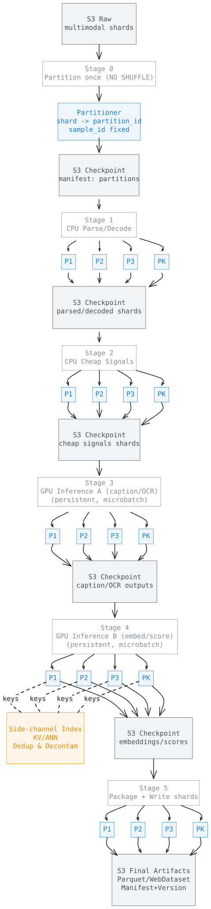

## Most “Scalable” Multimodal Pipelines Don’t Survive Foundation-Model Scale

A lot of multimodal pipelines *claim* to scale.

In practice, they often depend on at least one of the following:

- global shuffles (groupBy/join/repartition),
- materializing massive intermediate datasets,
- centralized coordination that becomes a bottleneck,
- or brittle recovery logic (rerun-the-world on failure).

That works for demos.
It breaks at foundation-model scale.

This series is about a different design point:

> **A streaming-first multimodal pipeline that scales linearly with data and hardware — with no global shuffle, and resumable at partition granularity.**

This post lays out the philosophy.  
Implementation details will follow in later posts.



---

## Principle 1: Training Is Streaming — Data Must Be Streaming Too

Large VLM training is inherently streaming:

- read samples,
- tokenize/encode,
- run forward/backward,
- move on.

There is no “global regrouping” step in training.

Yet many data pipelines insist on:

- dataset-wide joins,
- global grouping,
- repeated reshuffles across the cluster.

That mismatch is the root cause of poor scalability.

**If model training is streaming, the data pipeline must be streaming as well.**

---

## Principle 2: Shuffle Is the Enemy (and Recovery Makes It Worse)

Shuffle is the silent killer of scale.

It introduces:

- cluster-wide synchronization,
- network blow-ups,
- stragglers and tail latency,
- complex failure recovery.

For multimodal data it’s even worse:

- images/videos are huge,
- intermediate artifacts are expensive,
- retries amplify cost,
- recomputation becomes catastrophic.

A pipeline that *requires* global shuffle is, by definition, **not linearly scalable**.

So the design constraint is simple:

> **No global shuffle. Ever.**

---

## Principle 3: Partition Once, Then Stream Forever

A scalable multimodal pipeline is built around a single irreversible decision:

> **Partition once at ingestion time.**  
> After that, every stage runs per-partition, independently.

Once partitioned:

- each partition is processed end-to-end without cross-partition communication,
- operators stay local,
- scaling is just “add more workers, process more partitions”.

Every stage becomes:

```text
S3 input (partition shard) → local transform → S3 output (partition shard)
````

No rebalancing.
No coordination.
No dataset-wide barriers.

---

## Principle 4: Stage Boundaries Are Checkpoints (S3-First, Resume Anywhere)

This is the part most “pipelines” don’t model explicitly:

> **All stage-to-stage communication goes through durable storage (e.g., S3).**
> Every stage emits partition-scoped artifacts + a manifest.

That gives you a powerful property:

- if **partition 173** fails in **stage 4**,
- you restart **partition 173** from the **stage 3 checkpoint**,
- without touching any other partition,
- and without rebuilding global state.

At scale, failures are not exceptions — they are the steady state.
So recovery must be the default path, not an afterthought.

---

## The Unit of Computation Is a Sample (But the Unit of Scheduling Is a Partition)

The “thing” you transform is a **sample**:
text, image(s), video segment(s), audio, plus derived metadata.

But the “thing” you schedule and recover is a **partition**:

- partition = a stable subset of samples,
- processed independently,
- checkpointed independently,
- resumed independently.

This is how you get both:

- **fine-grained per-sample operators**, and
- **coarse-grained scalable execution**.

---

## Quality Is Computed as Signals, Not Decided by Global Rules

In a streaming system, early global filtering is dangerous:

- you’ll regret irreversible decisions,
- you’ll want different policies for different tasks,
- and “one filter to rule them all” doesn’t survive iteration.

Instead, compute **signals** and attach them to each sample:

- coherence score,
- OCR density,
- caption length,
- perceptual hashes,
- embedding fingerprints,
- safety flags,
- contamination indicators.

Those signals flow downstream with the sample.

Curation becomes a **policy applied later** (read-time / training-time / task-time),
not a pipeline-time bottleneck.

This keeps the system:

- streaming,
- composable,
- reusable across datasets and objectives.

---

## Deduplication Without Shuffle: Use a Side-Channel Index

Dedup is often used as an excuse for shuffle.

It isn’t.

A streaming system supports dedup by:

- computing deterministic keys (hashes, embedding IDs),
- writing keys to an external index / KV / ANN service,
- performing local lookups during streaming.

No partition needs the full dataset in memory.
No global join is required.

Dedup becomes:

- *eventually consistent* (which is fine for data engineering),
- continuously runnable,
- cheap enough to keep on.

---

## CPU–GPU Separation Is Non-Negotiable

Multimodal pipelines mix:

- heavy IO + decoding (CPU-bound),
- expensive model inference (GPU-bound).

A scalable design enforces a strict boundary:

- CPU stages produce compact, GPU-friendly representations,
- GPU stages run microbatches with model residency,
- GPUs never wait on IO/decoding.

GPU workers should be:

- long-lived,
- model-resident,
- stream-fed.

Anything else wastes the most expensive resource in the system.

---

## What This Series Will Cover Next

This post sets the philosophy.
The next posts will get concrete:

1. **Streaming ingestion for multimodal data (images, video, tar/webdataset, parquet)**
2. **Operator design: per-sample transforms that compose without shuffle**
3. **GPU stages: microbatching, model residency, throughput math**
4. **Dedup + decontamination as side-channels (indexes, manifests, consistency)**
5. **Dataset versioning: manifests, lineage, and reproducibility in a streaming world**
6. **Operational reality: monitoring, retries, backpressure, and cost control**

Everything follows the same constraint:

> **Linear scaling. No global shuffle. Partition-resumable by construction.**

---

## Closing

Scalability is not an optimization you add later.
It’s a property you either design for — or permanently lose.

For multimodal foundation models, a **streaming-first data pipeline** is not a convenience.
It’s the only viable option.

This series documents one such design.
