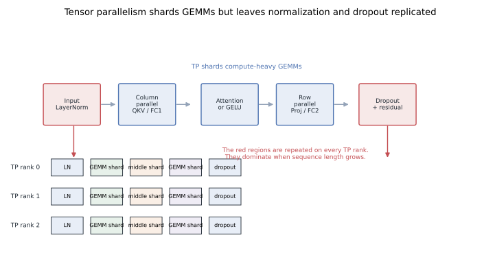
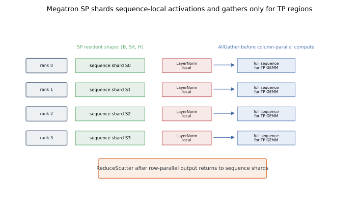
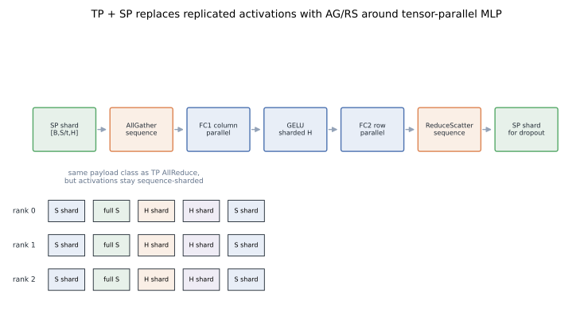
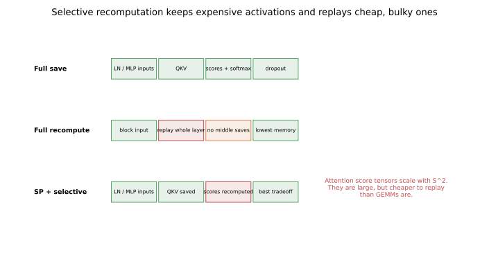

# Sequence Parallelism I: Megatron SP Cuts Activation Memory Along the Sequence

The common misconception is that tensor parallelism divides every memory term in a Transformer block.
It does not.
Megatron sequence parallelism is the small layout rule that removes the replicated, token-local activations tensor parallelism leaves behind.

The mechanism is precise.
Keep Megatron's tensor-parallel linear layers.
Shard LayerNorm, dropout, and residual-adjacent activations along sequence.
AllGather only when a tensor-parallel region needs the assembled activation, then ReduceScatter when the output can return to sequence ownership.
That is the core idea in *Reducing Activation Recomputation in Large Transformer Models* ([arXiv:2205.05198](https://arxiv.org/abs/2205.05198)).

This is the first post in the sequence-parallelism set.
It sits next to [Megatron tensor parallelism](../tensor-parallelism-megatron/) and leads into [DeepSpeed Ulysses](../sequence-parallelism-ulysses/), [Ring Attention](../ring-attention/), [Megatron Context Parallel](../megatron-context-parallel/), and [tensor-parallel collective overlap](../megatron-tp-comm-overlap/).

## TL;DR

- Tensor parallelism shards the expensive GEMMs, but it can leave `[batch, sequence, hidden]` activations replicated on every tensor-parallel rank.
- Megatron SP uses the tensor-parallel group as the sequence-parallel group and stores token-local activations as `[batch, sequence / tp_size, hidden]`.
- The boundary before tensor-parallel compute is an **AllGather** along the sequence dimension.
- The boundary after row-parallel output is a **ReduceScatter** back to sequence shards.
- SP saves the linear-in-sequence activation terms; it does not solve quadratic attention score memory by itself.
- Selective activation recomputation still matters, especially for attention state.
- In code, look for `gather_from_sequence_parallel_region()` and `reduce_scatter_to_sequence_parallel_region()` in Megatron-LM.
- Reproducible figures for this post: [`playground/llm_training_series_figures.py`](https://github.com/duoan/duoan.github.io/blob/main/playground/llm_training_series_figures.py).

## 1. What Tensor Parallelism Leaves Replicated

Start from a Megatron tensor-parallel Transformer block.
The QKV projection and the first MLP projection are column-parallel.
The attention output projection and the second MLP projection are row-parallel.
That split attacks the dominant GEMMs, which is why Megatron tensor parallelism works.

But backward needs more than GEMM outputs.
It needs inputs to LayerNorm, inputs to linears, residual values, dropout masks, and nonlinear intermediates.
Some of those tensors are naturally sharded by the operation that produced them.
Others are sequence-local operations that every tensor-parallel rank may still see in full.



LayerNorm, dropout, residual addition, and many pointwise operations do not mix tokens.
For token `i`, token `j` is irrelevant.
That makes the sequence dimension a valid partition axis for those regions.

The replicated activation shape is usually proportional to:

```text
batch * sequence * hidden
```

If every tensor-parallel rank saves that tensor, increasing TP degree does not reduce the footprint.
For short contexts this is tolerable.
For long contexts and many layers, it is exactly the kind of pressure that pushes teams into aggressive checkpointing.

## 2. The SP Ownership Rule

Megatron SP uses the tensor-parallel group as the sequence-parallel group.
If the tensor-parallel size is `t`, each rank owns about one `1/t` slice of the sequence for token-local regions.
The resident activation changes from:

```text
[batch, sequence, hidden]
```

to:

```text
[batch, sequence / t, hidden]
```

The qualifier matters: this is true only where the operation permits it.
Tensor-parallel GEMMs still have the layout requirements of Megatron's column-parallel and row-parallel layers.
SP is therefore an ownership contract with explicit boundary collectives.



LayerNorm is the clean example.
It normalizes hidden features independently for each token, so each rank can normalize its own sequence slice.
When the following tensor-parallel linear layer needs the assembled activation, ranks AllGather along sequence.
After the row-parallel result is ready, ranks ReduceScatter back to sequence shards.

That is all SP is.
It is not Ulysses head reassignment.
It is not Ring Attention.
It is not a new attention algorithm.
It is a disciplined placement of AllGather and ReduceScatter around existing Megatron tensor-parallel layers.

## 3. MLP: Where the AG and RS Land

The MLP shows the mechanism with minimal distraction.
Megatron's MLP has two large projections:

1. `FC1`, a column-parallel projection into the expanded hidden dimension.
2. `FC2`, a row-parallel projection back to the model hidden dimension.

With SP enabled, a rank enters the MLP holding only its sequence slice.
Before `FC1`, the ranks AllGather so the column-parallel layer sees the expected input.
After `FC2`, the ranks ReduceScatter so the following dropout and residual state return to sequence-sharded form.



This is why SP is often summarized as replacing a tensor-parallel AllReduce with an AllGather plus a ReduceScatter.
That summary is useful, but incomplete.
The important behavioral change is what is stored between those collectives.
The duplicated LayerNorm, dropout, and residual-adjacent activations are no longer saved in full on every tensor-parallel rank.

The invariant is:

```text
sequence-shard when the operation is token-local,
restore TP layout when the operation needs it.
```

That is safer than saying "sequence shards everywhere."
The layout changes, and those changes are the design.

## 4. Attention: Same Boundary Pattern, Different Memory Terms

Attention uses the same SP boundary idea around tensor-parallel projections.
The pre-attention LayerNorm can be sequence-sharded.
The QKV projection uses Megatron tensor parallelism.
The output projection returns through a row-parallel boundary.

The attention middle has a different memory profile.
Naive attention score state scales like `sequence^2`.
SP mainly divides tensors shaped like `batch * sequence * hidden`.
That distinction matters when you estimate whether SP is enough.

FlashAttention reduces the local attention-memory problem by avoiding materialized score matrices.
[Ring Attention](../ring-attention/) and [Megatron Context Parallel](../megatron-context-parallel/) distribute the context dimension itself.
Megatron SP does not do that.
It reduces the replicated linear-in-sequence activation terms around the tensor-parallel block.

That narrower scope is a strength.
SP is easy to reason about because it does not change attention semantics.
It changes when a full activation is resident.

## 5. Why the Memory Win Is Real

Activation memory is paid per layer, per microbatch, and often across a pipeline schedule.
A replicated tensor that looks small in one block can become large across the training step.
Longer context makes the term grow linearly.

SP attacks that replicated linear term.
That is different from full activation checkpointing.
Checkpointing saves memory by not storing activations, then rerunning forward compute during backward.
SP saves memory by changing ownership of activations that were already token-local.

The trade is communication.
AllGather and ReduceScatter must be scheduled.
If they are blocking and exposed, the memory win can become a throughput loss.
That is why [tensor-parallel collective overlap](../megatron-tp-comm-overlap/) matters in practical Megatron training.

## 6. Selective Activation Recomputation

SP and recomputation are complementary.
The right question is not whether to save everything or recompute everything.
The right question is which activation is large and cheap enough to replay.



Korthikanti et al. argue for selective activation recomputation because different tensors have different memory and compute costs ([arXiv:2205.05198](https://arxiv.org/abs/2205.05198)).
Two questions are enough for a first pass:

1. How much memory does this activation consume?
2. How expensive is it to recreate when backward reaches it?

Attention score and softmax-related state often scores high on memory and lower on recompute cost, especially with blockwise attention kernels.
GEMM inputs often score differently.
Replaying a large matrix multiplication is expensive, so those activations are more likely to be worth saving.

The practical stack is:

- tensor parallelism splits large linear computation,
- sequence parallelism removes replicated token-local activations,
- selective recomputation replays bulky intermediates whose recompute cost is acceptable.

Together, they turn a blunt memory switch into a set of local decisions.

## 7. How to Recognize Megatron SP in a Trace

In a trace, SP should line up with tensor-parallel layer boundaries.
Expect:

- AllGather before a column-parallel region that needs assembled activation.
- ReduceScatter after a row-parallel region that can return to sequence ownership.
- Saved token-local activations shaped like local sequence shards.
- No full `[B, S, H]` LayerNorm or dropout-adjacent tensor retained per TP rank unless there is a deliberate reason.

If AG/RS collectives appear but memory does not drop, look for a full-size save outside the obvious path.
Common culprits are residual handling, hooks, debug captures, fused-kernel boundaries, or a downstream consumer that silently requests the gathered tensor.
SP is an ownership contract.
One stray full-size activation can erase the expected win.

## 8. How SP Differs from the Sister Methods

All four sequence-related posts cut the sequence dimension somewhere, but the bottleneck differs.

[DeepSpeed Ulysses](../sequence-parallelism-ulysses/) starts with sequence shards, then uses All-to-All to turn them into head shards for attention.
[Ring Attention](../ring-attention/) keeps local query blocks and circulates key/value blocks through a ring.
[Megatron Context Parallel](../megatron-context-parallel/) adapts the ring-style long-context idea to Megatron's hybrid-parallel process groups and load-balances causal work.

Megatron SP is the conservative member of the family.
It assumes Megatron tensor parallelism is already present.
It reduces replicated activation memory without changing the attention algorithm.

## Code

- Megatron-LM sequence-parallel mappings: [`megatron/core/tensor_parallel/mappings.py`](https://github.com/NVIDIA/Megatron-LM/blob/main/megatron/core/tensor_parallel/mappings.py), especially `gather_from_sequence_parallel_region()`, `reduce_scatter_to_sequence_parallel_region()`, and `scatter_to_sequence_parallel_region()`.
- Megatron-LM tensor-parallel layers: [`megatron/core/tensor_parallel/layers.py`](https://github.com/NVIDIA/Megatron-LM/blob/main/megatron/core/tensor_parallel/layers.py), where `sequence_parallel` controls the gather/scatter behavior around linear layers.
- Megatron Core API docs for tensor-parallel mappings: [`core.tensor_parallel.mappings`](https://docs.nvidia.com/megatron-core/developer-guide/latest/apidocs/core/core.tensor_parallel.mappings.html).

## References

- Korthikanti et al., [Reducing Activation Recomputation in Large Transformer Models](https://arxiv.org/abs/2205.05198), 2022.
- Narayanan et al., [Efficient Large-Scale Language Model Training on GPU Clusters Using Megatron-LM](https://arxiv.org/abs/2104.04473), 2021.
- NVIDIA, [Megatron Core tensor-parallel mapping API](https://docs.nvidia.com/megatron-core/developer-guide/latest/apidocs/core/core.tensor_parallel.mappings.html).
