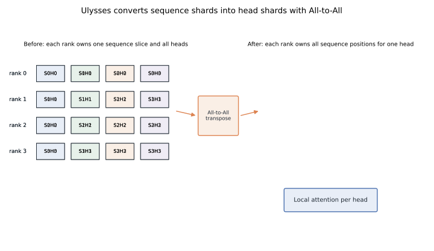
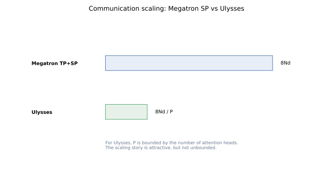
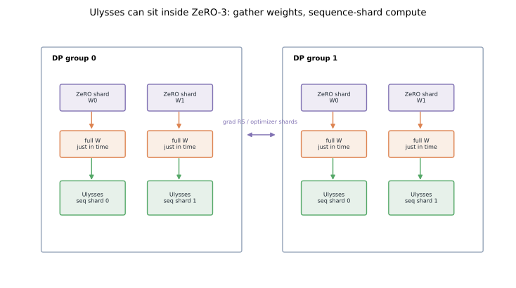

# Sequence Parallelism II: DeepSpeed Ulysses and All-to-All Attention

The common mistake is to describe Ulysses as "just sequence parallelism."
The useful part is the transpose.
DeepSpeed Ulysses keeps activations sequence-sharded most of the time, then uses All-to-All to turn those sequence shards into head shards exactly where attention needs full context.

The paper states the mechanism directly: partition the sequence across GPUs, project local Q/K/V, All-to-All so each GPU receives the full sequence for a subset of heads, run local attention, then All-to-All back ([arXiv:2309.14509](https://arxiv.org/abs/2309.14509)).
That is different from [Megatron SP](../sequence-parallelism-megatron-sp/), which is an activation-memory optimization around tensor-parallel linears.
It also differs from [Ring Attention](../ring-attention/), which streams K/V blocks instead of assigning full-sequence heads.

This is the second post in the sequence-parallelism set.
It points forward to [Megatron Context Parallel](../megatron-context-parallel/) and sideways to [ZeRO-3 intra-layer partitioning](../zero3-intra-layer-partitioning/), because Ulysses is often paired with ZeRO-style model-state sharding.

## TL;DR

- Ulysses partitions activations along sequence across a sequence-parallel group.
- Each rank computes Q, K, and V for its local sequence slice.
- An **All-to-All** changes ownership from "all heads for my tokens" to "all tokens for my heads."
- Attention runs locally after that transpose.
- A second **All-to-All** returns the output to sequence-sharded ownership.
- Plain Ulysses is naturally bounded by the number of attention heads and divisibility constraints.
- ZeRO-3 can shard model states while Ulysses handles activation layout; do not merge those mental models.
- Reproducible figures for this post: [`playground/llm_training_series_figures.py`](https://github.com/duoan/duoan.github.io/blob/main/playground/llm_training_series_figures.py).

## 1. The Layout Problem

Consider one attention layer with sequence length `N`, hidden size `d`, head count `H`, and sequence-parallel degree `P`.
Ulysses begins with the obvious long-context layout.
Rank `i` owns `N / P` tokens and all hidden features for those tokens.
The local activation is:

```text
[N / P, d]
```

That layout is good for token-local work.
LayerNorm, residual additions, MLPs, and dropout can run over the local token slice.
But attention for one head needs keys and values across the full sequence.
If a rank owns only local tokens, it cannot compute exact full-context attention for that head without seeing remote K/V.

Ulysses fixes this by changing ownership at the attention boundary.
Each local Q/K/V tensor is split by head.
All-to-All sends each head slice of every local sequence shard to the rank responsible for that head slice.



Before the collective, rank `0` might hold:

```text
S0H0, S0H1, S0H2, S0H3
```

After the collective, rank `0` holds:

```text
S0H0, S1H0, S2H0, S3H0
```

That is the whole trick.
It is a distributed transpose from sequence-major ownership to head-major ownership.

## 2. Forward Pass in Slow Motion

The forward pass has five conceptual steps.

First, split the input activation by sequence.
Each rank receives a chunk of tokens and keeps the full hidden dimension.

Second, run QKV projections for that local sequence chunk.
In plain Ulysses, each rank has the needed projection weights.
If ZeRO-3 is enabled, those weights may be gathered just in time, but the logical activation computation is still over a local token slice.

Third, All-to-All the Q, K, and V tensors.
The tensor changes from sequence-sharded ownership to head-sharded ownership.
The DeepSpeed Ulysses paper describes this exact all-to-all redistribution before attention ([arXiv:2309.14509](https://arxiv.org/abs/2309.14509)).

Fourth, run attention locally.
The rank now has the full sequence for its assigned head slice, so the attention math for those heads is local.

Fifth, All-to-All the attention output back.
The result returns from head-major ownership to sequence-major ownership, and the rest of the block can continue over local token chunks.

This avoids computing every head on every rank.
It also avoids storing a full attention matrix on every rank.
The rank temporarily becomes the owner of one or more heads across the full sequence.

## 3. Why All-to-All Is the Right Collective

AllGather would duplicate data.
ReduceScatter would sum data.
Attention needs neither duplication nor summation at this boundary.
It needs a permutation of ownership.

All-to-All is exactly that operation.
Every rank splits its local tensor into `P` destination pieces.
It keeps the piece addressed to itself and sends the other pieces to their owners.
After the collective, each rank has one piece from every rank.

For Q/K/V, those pieces are head slices.
For the attention output, the inverse pieces are sequence slices.

This is why an All-to-All arrow in a diagram is easy to underestimate.
It is not just "communication happens here."
It is a semantic transpose of the distributed tensor.

## 4. Communication Volume and the Head Bound

A simplified comparison is useful.
Ignore batch and constants, and write the activation size as `N * d`.
For one Ulysses All-to-All, a rank starts with `N * d / P` data and sends all but the part destined for itself.
The per-rank send volume is approximately:

```text
N * d / P
```

Across forward and backward, there are multiple collectives.
The selling point is that each one operates on a per-rank shard that shrinks with `P`.



The catch is the head assignment.
Plain Ulysses assigns head slices to ranks, so the degree is bounded by attention head count and divisibility.
If the model has 32 heads, a pure head-sharded Ulysses group cannot scale to 256 ranks without adding hierarchy or another parallel dimension.

That limitation is one reason long-context systems combine methods.
Ulysses can be used inside a larger design, while Ring Attention or context parallelism handles the part where a full-sequence head no longer fits comfortably on one device.

## 5. Ulysses and ZeRO-3

Ulysses is often discussed with ZeRO-3 because they attack different memory terms.
ZeRO-3 partitions model states across data-parallel ranks.
Ulysses partitions activations across sequence-parallel ranks and temporarily transposes them by head.

During compute, ZeRO-3 may AllGather a parameter for the module about to run.
Ulysses then runs that module over local sequence shards, with All-to-All only around attention.



Keep the ownership stories separate:

- ZeRO-3 decides which rank stores which parameter shard between compute regions.
- Ulysses decides which rank owns which activation tokens or heads during attention.
- ZeRO-3 communication is about weights, gradients, and optimizer state.
- Ulysses communication is about Q/K/V and attention outputs.

For the ZeRO side, see [The ZeRO-3 Diagram Most People Remember Is Wrong](../zero3-intra-layer-partitioning/).
That post explains why current DeepSpeed ZeRO-3 is an intra-layer flatten-and-partition design, not a layer-owner animation.

## 6. Backward Pass Intuition

Backward reverses the same layout changes.
When gradients reach the attention output, they must be All-to-Alled into the head-major layout used by local attention.
When gradients for Q, K, and V are produced, they must be All-to-Alled back to sequence-major layout.

Weight gradients are separate.
If parameters are replicated, their gradients need data-parallel reduction.
If ZeRO is enabled, gradients need ZeRO-style partitioning.
Neither is the same collective as the Ulysses activation transpose.

A useful debugging rule is this:

```text
activation rearranged between sequence and head ownership -> All-to-All
model state gathered or reduced for ZeRO ownership -> ZeRO collective
```

That rule prevents most trace-reading confusion.

## 7. Where Ulysses Shines

Ulysses is attractive when three conditions hold.

First, sequence length is large enough that sequence-sharding activations matters.
Second, attention head count supports the desired sequence-parallel degree.
Third, the hardware network handles All-to-All efficiently enough that the transpose does not dominate runtime.

It is also attractive from an integration point of view.
The module boundary is clear.
Replace the attention module with one that performs the layout transpose, local attention, and inverse transpose.
The rest of the Transformer can remain close to a sequence-sharded implementation.

That is different from Megatron SP.
Megatron SP is tightly coupled to tensor-parallel linear layers.
Ulysses can be easier to graft onto systems that already rely on ZeRO-style model-state sharding rather than Megatron tensor parallelism.

## 8. Where Ulysses Stops

Ulysses is not a universal long-context answer.
The head-count bound matters.
All-to-All performance can be sensitive to topology and message sizes.
For causal attention, local attention still has the usual triangular work pattern inside each head.
And if a single head over the full sequence is too large for one device, plain Ulysses does not fix that.

That last point motivates [Ring Attention](../ring-attention/).
Ring Attention keeps local query blocks and circulates key/value blocks instead of assigning a full-sequence head to one rank.
[Megatron Context Parallel](../megatron-context-parallel/) brings a similar long-context idea into Megatron's process-group structure.

In the sequence-parallelism family, Ulysses is the All-to-All transpose design.
It is compact, useful, and easiest to understand when you keep the ownership transition explicit.

## Code

- DeepSpeed Ulysses attention wrapper: [`deepspeed/sequence/layer.py`](https://github.com/deepspeedai/DeepSpeed/blob/master/deepspeed/sequence/layer.py), especially `DistributedAttention` and `_SeqAllToAll`.
- DeepSpeed Ulysses blog and integration example: [`blogs/deepspeed-ulysses/README.md`](https://github.com/microsoft/DeepSpeed/blob/master/blogs/deepspeed-ulysses/README.md).
- DeepSpeed sequence-parallel tutorial: [`docs/_tutorials/ds-sequence.md`](https://github.com/deepspeedai/DeepSpeed/blob/master/docs/_tutorials/ds-sequence.md).

## References

- Jacobs et al., [DeepSpeed Ulysses: System Optimizations for Enabling Training of Extreme Long Sequence Transformer Models](https://arxiv.org/abs/2309.14509), 2023.
- Rajbhandari et al., [ZeRO: Memory Optimizations Toward Training Trillion Parameter Models](https://arxiv.org/abs/1910.02054), 2020.
- DeepSpeed, [Getting Started with DeepSpeed-Ulysses](https://www.deepspeed.ai/tutorials/ds-sequence/).
