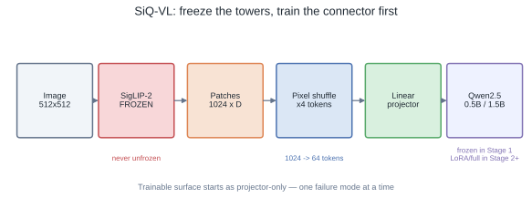
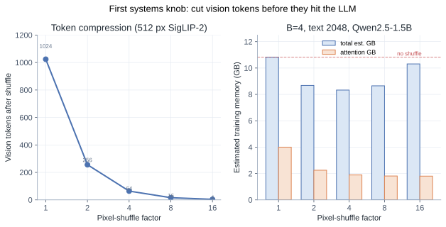
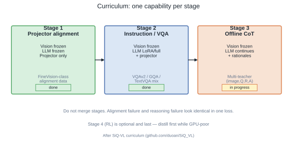
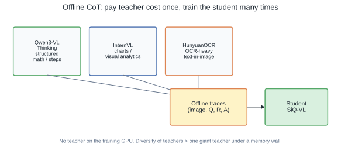

# SiQ-VL: A Curriculum for Small VLMs When Compute Is the Hard Constraint

Most VLM writeups assume a cluster. SiQ-VL started from the opposite constraint: **one (or few) GPUs**, and the question was which design choices still buy capability when you cannot buy FLOPs.

This post is the consolidated field guide for that project — architecture, token economics, staged training, and offline Chain-of-Thought (CoT) distillation — replacing three earlier notes that said the same thing three ways. Kernel-level throughput (how we pushed Stage-1 from ~15K to ~100K real tokens/s on Blackwell) lives in the companion post: [Optimizing VLM Training on One GPU](/posts/optimizing-vlm-training-on-one-gpu/).

Repo: [duoan/SiQ_VL](https://github.com/duoan/SiQ_VL) · [Tech report PDF](https://github.com/duoan/SiQ_VL/blob/master/SiQ_VL_Tech_Report.pdf) · [W&B](https://wandb.ai/ReproduceAI/siq-vl)

## TL;DR

- **Architecture:** frozen SigLIP-2 + linear projector with pixel shuffle + Qwen2.5 (0.5B / 1.5B). No perceiver, no giant MLP connector.
- **First systems knob:** cut vision tokens *before* the LLM. On SigLIP-2 @ 512px, factor-4 shuffle takes **1024 → 64** patches and drops estimated training memory ~**23%** (10.8 → 8.3 GB in our analytical breakdown).
- **Curriculum, not end-to-end:** Stage 1 = projector only · Stage 2 = instruction/VQA (LLM LoRA or full) · Stage 3 = offline multi-teacher CoT. Merge them and you cannot tell alignment failure from reasoning failure.
- **Reasoning is data, not magic.** Generate `(image, question, rationale, answer)` offline from complementary teachers; never park a teacher on the training GPU.
- **Throughput is a different article.** Once the curriculum is honest, go optimize kernels: [five-layer recipe](/posts/optimizing-vlm-training-on-one-gpu/) with measured tok/s.

## The Constraint Reframe

Under abundant compute, the default stack is: scale data, unfreeze everything, maybe RL. Under a hard GPU budget, each of those choices multiplies failure modes.

The useful reframe:

> Which **single** capability am I buying with this stage’s FLOPs?

SiQ-VL’s answer is a narrow trainable surface early, a short vision sequence always, and reasoning injected as supervised traces — not hoped for as emergence.

## Architecture: Connect the Dots Deliberately



| Component | Role | Trainable? |
|---|---|---|
| SigLIP-2 vision tower | Image → patch features | **Never** (all stages) |
| Pixel-shuffle + linear projector | Compress + map into LLM space | Always |
| Qwen2.5 0.5B / 1.5B | Language / answers | Frozen in Stage 1; LoRA or full from Stage 2 |

No exotic connector. The projector is the only moving part in Stage 1, which is exactly why Stage 1 is debuggable: if outputs are gibberish, you have an alignment problem, not a “model too small” story.

Checkpoints (1.5B path): [Stage 1](https://huggingface.co/classtag/siq-vl_siglip2-large-patch16-512_qwen2.5-1.5b-instruct_stage1) · [Stage 2](https://huggingface.co/classtag/siq-vl_siglip2-large-patch16-512_qwen2.5-1.5b-instruct_stage2)

## Vision Tokens Are the First Memory Wall

Vision encoders are expensive less because of parameter count and more because of **sequence length**. Attention memory is \(O(n^2)\) in the LLM once patches are concatenated with text.

For `siglip2-so400m-patch16-512`:

```text
patches = (512 / 16)² = 1024
```

Feed all 1024 into Qwen next to a 2K text budget and you have already bought a long multimodal sequence. Pixel shuffle merges spatial groups before the linear map:

```text
factor = 4  →  1024 / 16 = 64 vision tokens
factor = 2  →  256 tokens
factor = 8  →   16 tokens
```

Shape sketch (factor 2, 384-class SigLIP path from the README): `[B, 729, D] → [B, 182, 4D] → [B, 182, H_llm]`. Same idea at 512px with a larger patch grid.



Numbers above are from the project’s analytical breakdown ([`MEMORY_ANALYSIS.md`](https://github.com/duoan/SiQ_VL/blob/master/MEMORY_ANALYSIS.md)): B=4, text length 2048, Qwen2.5-1.5B, bf16. Factor **4** is the practical default (~8.3 GB est., 64 patches). Factor 32 is “valid” and disastrous — one patch of vision. Always set the factor explicitly.

## Curriculum: One Capability Per Stage



### Stage 1 — Projector alignment

- Frozen: vision + LLM  
- Trainable: projector  
- Data: multimodal instruction / caption-style alignment (FineVision-class)  
- Expected: fast convergence, often **unusable answers**. Alignment ≠ instruction following. That is a feature of the curriculum, not a bug.

### Stage 2 — Instruction / VQA

- Frozen: vision  
- Trainable: projector + LLM (LoRA on 4–5% of params was enough in our runs; full FT optional)  
- Data: VQAv2 / GQA / TextVQA-style mixes  
- Fixes: mixed-language junk, repetition, refusal-to-follow. Only after Stage 2 is the model a usable VLM.

### Stage 3 — Offline CoT distillation

- Same freeze pattern as Stage 2  
- Data: teacher-generated rationales, not online teacher–student  
- Goal: structure and length of reasoning, not leaderboard theater  

Stage 4 (RL) exists in the roadmap and stays **last**. Under GPU poverty, supervised CoT is the honest tool; RL is a tax you pay after the student already reasons.

**Do not train alignment, instruction, and reasoning in one soup.** The loss will go down either way. You will not know why.

## Offline CoT: Pay Teachers Once



Online distillation keeps a large teacher on the critical path of every step. That is memory you do not have and a scheduling headache you do not need.

Offline distillation:

1. Generate traces once from teachers with **different biases**  
   - Qwen3-VL-Thinking → structured multi-step  
   - InternVL → charts / visual analytics  
   - HunyuanOCR → text-heavy scenes  
2. Store `(image, question, rationale, answer)`  
3. Train the student many times without loading any teacher  

What we actually saw (qualitative + light metrics, not a full leaderboard claim):

- Rationales got **longer and more structured**  
- Hallucinations and brittle short answers dropped in inspection  
- Running accuracy felt more stable  
- **ROUGE-L barely moved** — surface n-gram overlap is a bad proxy for reasoning quality  

Also: a text-only student distilled from multimodal teachers still picked up visual priors. A chunk of “visual commonsense” is linguistic structure. Distillation transfers that structure; it does **not** invent fine-grained perception the encoder never saw.

### What offline CoT is not

- It does not fix teacher hallucinations  
- It inherits teacher bias  
- It does not replace representation learning  
- It amplifies what Stage 1–2 already aligned  

## Minimal Recipe (Operational Checklist)

1. **Freeze harder than feels comfortable.** Vision always; LLM until Stage 2 has a reason.  
2. **Cut vision tokens before fusion.** Factor 4 default on 512px SigLIP-2; measure memory, do not trust “auto max factor.”  
3. **One stage, one job.** Alignment → instruction → CoT.  
4. **Inject reasoning as data.** Offline multi-teacher traces beat hoping for emergence.  
5. **Optimize for stable runs, then peak tok/s.** Crashes waste more wall-clock than a 5% kernel miss.  
6. **Only then chase kernels.** BF16 truth, batching, fusion, packing — see the [efficiency post](/posts/optimizing-vlm-training-on-one-gpu/).

## How This Relates to the Throughput Work

Curriculum answers *what to train when*. The Blackwell sweep answers *how fast each stage can run*:

| Stage | 0.5B real tok/s | Speedup |
|---|---|---|
| Stage 1 | 14.7K → 100.9K | 6.86× |
| Stage 2 | 29.2K → 86.1K | 2.95× |

Same stack, different article. If you only read one systems follow-up, read that one.

## Closing

SiQ-VL is not a claim that small VLMs beat frontier models. It is a claim about **leverage under a memory wall**: freeze, compress tokens, separate stages, distill reasoning offline. Architecture novelty is optional. Curriculum discipline is not.

When the curriculum is honest, the remaining work is engineering — and that is where measured tok/s belong.
