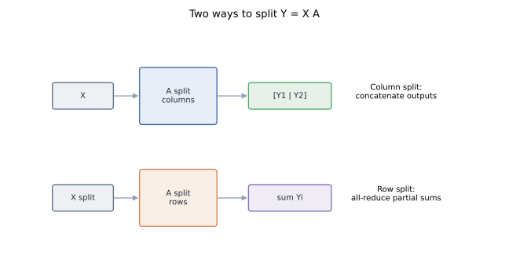
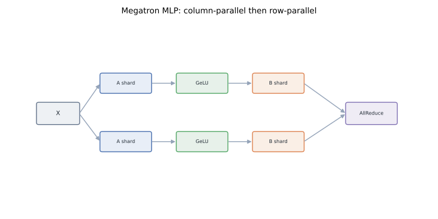
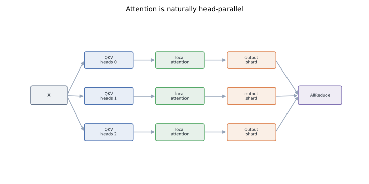
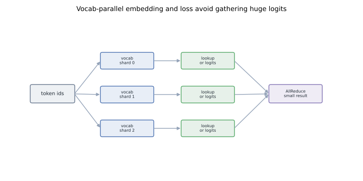
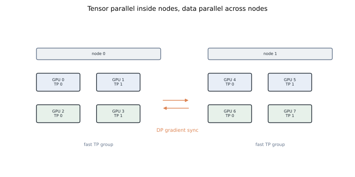

# Tensor Parallelism in Megatron-LM: Splitting Layers, Not Stacks

Pipeline parallelism splits a model by depth. Tensor parallelism splits the math inside one layer.

Megatron-LM made tensor parallelism practical for Transformers by choosing split points that preserve local GEMMs and put collectives only where the algebra requires them. The original Megatron paper introduced the core intra-layer pattern ([arXiv:1909.08053](https://arxiv.org/abs/1909.08053)). The later Megatron-LM systems paper showed how that TP axis composes with data and pipeline parallelism at cluster scale ([arXiv:2104.04473](https://arxiv.org/abs/2104.04473)).

The rule is short: **split before independent work, reduce only when partial sums must become one tensor.**

## TL;DR

- Tensor parallelism partitions matrices, attention heads, embeddings, and logits inside each Transformer block.
- TP communicates activation-sized tensors every layer, so it belongs on fast local links: NVLink or NVSwitch first.
- A column split of `Y = X A` creates output feature shards and needs no forward reduction.
- A row split creates partial sums and needs a reduction.
- Megatron's MLP uses column-parallel first projection, local GeLU, then row-parallel second projection. That avoids communicating before the nonlinearity.
- Attention splits heads. Each TP rank computes local heads, then the output projection reduces partial outputs.
- Vocab-parallel embedding and cross-entropy avoid materializing full `[batch, seq, vocab]` tensors on every rank.
- Reproducible figures for this post: [`playground/llm_training_series_figures.py`](https://github.com/duoan/duoan.github.io/blob/main/playground/llm_training_series_figures.py).

## 1. Why Tensor Parallelism Exists

Data parallelism is ideal while a full replica fits. ZeRO reduces replicated state, but a rank may still need to execute very large layers. Pipeline parallelism splits the layer stack, but it introduces bubbles and stage balance.

Tensor parallelism attacks a different limit: one Transformer block can be too wide or too expensive for one GPU.

The repeated expensive operations are structured:

- MLP projections `h -> 4h` and `4h -> h`.
- QKV projections.
- Attention heads.
- Attention output projection.
- Token embeddings.
- Output logits and cross-entropy.

These are not arbitrary tensors. Their algebra gives you natural split points. Megatron's contribution was to use those split points so each rank keeps large local GEMMs and communicates a small number of predictable activation tensors ([arXiv:1909.08053](https://arxiv.org/abs/1909.08053)).

## 2. Two Splits for `Y = X A`

Let:

```text
X: [b, s, h]
A: [h, h']
Y = X A
```

where `b` is local batch, `s` is sequence length, and `h` is hidden size.

There are two basic splits.



### Column split

Split `A` along its output dimension:

```text
A = [A_1 | A_2 | ... | A_p]
Y_i = X A_i
Y = [Y_1 | Y_2 | ... | Y_p]
```

Each rank receives the same `X` and produces a shard of output features. No reduction is needed for the linear operation. You may later gather or consume the shards locally.

Megatron's `ColumnParallelLinear` is this primitive.

### Row split

Split `A` along its input dimension:

```text
X = [X_1 | X_2 | ... | X_p]
A = [A_1; A_2; ...; A_p]
Y = sum_i X_i A_i
```

Each rank computes a partial output. The final `Y` requires summing partials across TP ranks, usually by all-reduce or reduce-scatter/all-gather variants depending on sequence parallelism.

Megatron's `RowParallelLinear` is this primitive.

The entire Transformer TP pattern is built from these two cases.

## 3. The MLP Block

A dense Transformer MLP is:

```text
Z = GeLU(X A)
Y = Z B
```

where `A` maps `h -> 4h` and `B` maps `4h -> h`.

Megatron chooses:

1. `A` is column-parallel.
2. GeLU runs locally on each rank's output shard.
3. `B` is row-parallel.
4. The row-parallel output is reduced.



The nonlinear point is the reason:

```text
GeLU(a + b) != GeLU(a) + GeLU(b)
```

If the first projection were row-parallel, ranks would create partial sums and need an all-reduce before GeLU. That would put a collective between the first GEMM and the nonlinearity. By making the first projection column-parallel, each rank owns complete intermediate channels for its shard and can apply GeLU locally.

The second projection consumes sharded intermediate channels. Its output is a sum across rank-local partial results, so one reduction is mathematically necessary.

The original Megatron paper describes the communication operators as `f` and `g`: identity in one pass, all-reduce in the other, placed around the two parallel linear layers ([arXiv:1909.08053](https://arxiv.org/abs/1909.08053)). The implementation can evolve, but the invariant remains: do not communicate before the local nonlinearity; reduce when partial linear outputs must be summed.

## 4. Attention: Split Heads

Multi-head attention is already partitioned into heads, so TP has a natural axis.



For `H` heads and TP size `p`, each rank owns roughly `H/p` heads. It holds Q, K, and V projection shards for those heads:

```text
Q_i = X W^Q_i
K_i = X W^K_i
V_i = X W^V_i
```

Then it computes local attention:

```text
O_i = softmax(Q_i K_i^T / sqrt(d_head)) V_i
```

No rank needs another rank's heads for this local attention computation. After local heads are produced, the output projection is row-parallel and reduces partial hidden outputs.

This is why clean TP configurations want:

- Number of attention heads divisible by TP size.
- Hidden size divisible by TP size.
- MLP intermediate size divisible by TP size.

Systems can handle edge cases, but divisibility avoids load imbalance, padding, and special kernels.

## 5. Communication per Transformer Block

In the simple Megatron block, forward has two major activation reductions:

1. Attention output projection.
2. MLP output projection.

Backward has corresponding reductions on the gradient path. If the activation tensor size is:

```text
Phi_TP = b * s * h
```

then TP communication is proportional to several collectives over `Phi_TP` per block.

This explains TP placement. TP is not a once-per-step gradient synchronization. It is every layer, with activation-sized payloads. Put TP ranks on the fastest links available. In practice, that means TP inside a node or NVSwitch island, then DP/ZeRO across slower network links.

The Megatron-LM systems paper reports high aggregate scaling by composing TP with pipeline and data parallelism rather than stretching one TP group across the whole cluster ([arXiv:2104.04473](https://arxiv.org/abs/2104.04473)).

## 6. Vocab-Parallel Embedding

The embedding table has shape `[vocab, h]`. Large vocabularies make it a substantial tensor. Megatron shards it by vocabulary range.



Each rank owns token IDs in one range:

```text
rank 0: [0, v/p)
rank 1: [v/p, 2v/p)
...
```

For lookup:

1. Each rank masks input token IDs outside its range.
2. It returns embeddings for tokens it owns and zeros elsewhere.
3. Ranks reduce the embedding outputs.

Because each token belongs to exactly one shard, the sum reconstructs the full embedding.

This same vocabulary partition matters at the output head. If embeddings are tied, input and output uses must accumulate gradients into the same sharded parameter. Pipeline boundaries and tensor-parallel groups make that bookkeeping easy to get wrong.

## 7. Vocab-Parallel Cross-Entropy

The naive loss all-gathers `[b, s, vocab/p]` logits into `[b, s, vocab]` on every rank before softmax. That is a bad trade when `vocab` is large.

Vocab-parallel cross-entropy keeps logits sharded. Each rank computes local max and denominator contributions; reductions over `[b, s]` values form the global softmax normalizer. The target logit comes from the rank that owns the target token and is reduced as a small tensor.

The communication moves from `O(b * s * vocab)` toward `O(b * s)` plus small target-logit exchanges. This is the Megatron pattern again: do not gather a large tensor when a few reductions reconstruct the quantity the math needs.

## 8. TP + DP + PP: The Practical Layout

Megatron's production recipe is hybrid parallelism.



A common dense layout:

- TP group inside a fast-link domain.
- Pipeline parallelism across layer stages when depth or global scale needs it.
- Data parallelism across replicas.
- ZeRO or a distributed optimizer across the DP dimension to reduce optimizer-state memory.

The reason is communication locality:

- TP communicates activations every layer.
- PP communicates activations across stage boundaries.
- DP communicates gradients once per backward bucket.
- ZeRO communicates model-state shards around optimizer or module boundaries.

Use fast links for the frequent activation collectives. Use the network for less frequent gradient/model-state collectives when possible.

## 9. Where TP Fails

More TP ranks do not automatically make training faster. The common failures are small GEMMs, activation collectives that dominate every layer, heads or hidden dimensions that do not divide cleanly, TP groups that cross slow links, sequence lengths that make `b * s * h` huge, and fused kernels that no longer see the shape they were built for.

Debug the boundaries first:

- Column-parallel layers should not gather too early.
- Row-parallel layers should reduce exactly once.
- Vocab-parallel targets must be masked and reduced correctly.
- Tied embeddings need gradients from every use before the optimizer step.
- Local GEMM shapes must remain Tensor-Core-friendly.

The right TP size is usually the smallest size that makes layers fit and keeps local GEMMs efficient. After that, scale with DP, ZeRO, PP, sequence/context parallelism, or expert parallelism depending on the actual blocker.

## 10. Code

Megatron's names are the right anchors:

- [NVIDIA Megatron-LM](https://github.com/NVIDIA/Megatron-LM): tensor, pipeline, data, sequence, and expert parallel training.
- [Megatron-Core tensor parallel package](https://github.com/NVIDIA/Megatron-LM/tree/main/megatron/core/tensor_parallel): current home for tensor-parallel layers and mappings.
- Conceptual paths to look for: `ColumnParallelLinear`, `RowParallelLinear`, `VocabParallelEmbedding`, and vocab-parallel cross entropy.
- [Megatron-LM legacy model layers](https://github.com/NVIDIA/Megatron-LM/tree/main/megatron/legacy/model): older lineage closer to the original paper.
- [PyTorch c10d](https://github.com/pytorch/pytorch/tree/main/torch/csrc/distributed/c10d): process-group and collective substrate.

Track whether each layer returns a sharded tensor or a gathered tensor. Most TP bugs are wrong assumptions about that boundary.

## 11. Minimal Pattern

```text
Column split before local nonlinear work.
Row split when partial sums must be reduced.
Split heads for attention.
Shard vocab; reduce only what the loss needs.
Keep TP on fast local links.
```

That pattern gives a Transformer block wider than one GPU while still presenting one layer abstraction to the rest of the training stack.

## References

- Mohammad Shoeybi et al., [*Megatron-LM: Training Multi-Billion Parameter Language Models Using Model Parallelism*](https://arxiv.org/abs/1909.08053), 2019.
- Deepak Narayanan et al., [*Efficient Large-Scale Language Model Training on GPU Clusters Using Megatron-LM*](https://arxiv.org/abs/2104.04473), SC 2021.
- Ashish Vaswani et al., [*Attention Is All You Need*](https://arxiv.org/abs/1706.03762), NeurIPS 2017.
- Samyam Rajbhandari et al., [*ZeRO: Memory Optimizations Toward Training Trillion Parameter Models*](https://arxiv.org/abs/1910.02054), SC 2020.
- Code: [NVIDIA Megatron-LM](https://github.com/NVIDIA/Megatron-LM), [Megatron-Core tensor parallel](https://github.com/NVIDIA/Megatron-LM/tree/main/megatron/core/tensor_parallel), [Megatron legacy model layers](https://github.com/NVIDIA/Megatron-LM/tree/main/megatron/legacy/model), [PyTorch c10d](https://github.com/pytorch/pytorch/tree/main/torch/csrc/distributed/c10d).
