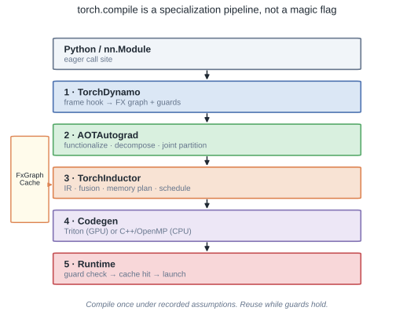
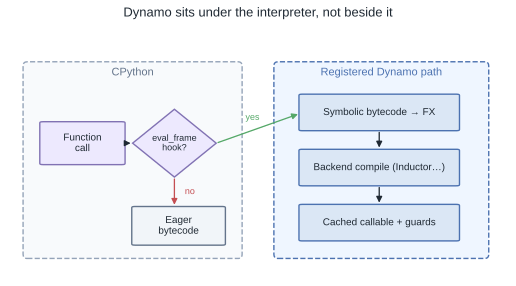
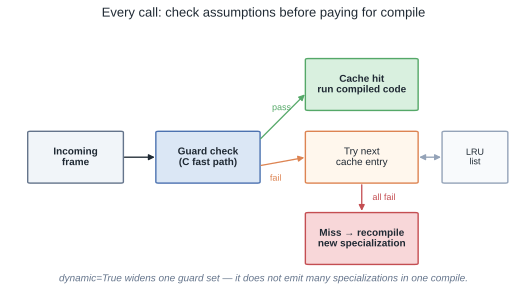
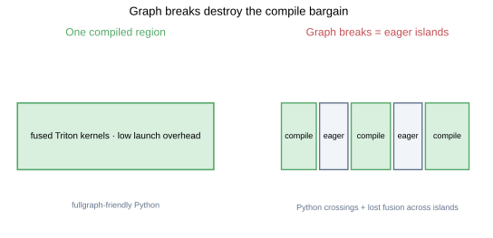
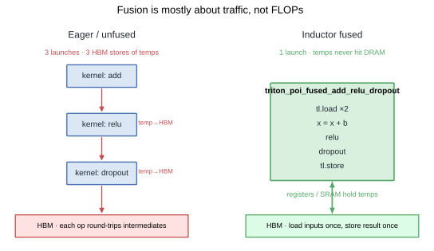
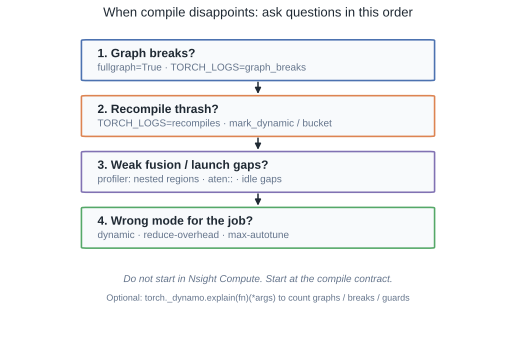

# torch.compile: The Mental Model That Actually Matters

Most writeups of `torch.compile` are either a flag cheat-sheet or a file-by-file museum tour. Neither helps when a training step is only 1.2× faster and you do not know whether to blame graph breaks, recompiles, or Inductor.

The useful model is simpler: **compile is specialization under recorded assumptions**. Dynamo captures a region, Inductor emits kernels tuned to that region, and guards decide whether the specialization still applies. Everything else — FX, AOTAutograd, Triton — is machinery in service of that contract.

## TL;DR

- `torch.compile(...)` mostly installs a CPython frame hook. Compilation happens on the first real call.
- Speedups come from **fewer launches + less HBM traffic**, not from inventing FLOPs. Graph breaks and weak fusion kill the bargain.
- Guards are the product. Cache hits are cheap; guard failures are a new specialization (or eager fallback).
- `dynamic=True` widens *one* guard set. Multiple specializations come from multiple compiles, chained as an LRU.
- Debug in order: breaks → recompiles → fusion/launch gaps → mode. Do not open Nsight first.
- Failure-mode lab (graph breaks, shape thrash, scalar guards): [`playground/torch_compile_failure_modes.py`](https://github.com/duoan/duoan.github.io/blob/main/playground/torch_compile_failure_modes.py). Toy capture→guard→cache: [`playground/torch_compile_mini.py`](https://github.com/duoan/duoan.github.io/blob/main/playground/torch_compile_mini.py). Figures: [`playground/torch_compile_figures.py`](https://github.com/duoan/duoan.github.io/blob/main/playground/torch_compile_figures.py).

## The Compile Bargain

Eager PyTorch won because the programming model is honest: Python runs, ops dispatch, you can `print` and breakpoint anywhere. That honesty costs you. A transformer block becomes hundreds of tiny kernels. The GPU spends time waiting on launches and round-tripping epilogue tensors through HBM.

`torch.compile` keeps the programming model and tries to recover the performance of a static graph system **only where it is safe**. The bargain is:

> Specialize what you can prove. Leave the rest eager. Reuse the specialization while the proof still holds.

If you remember one picture, make it this:



Five layers, one job each:

| Layer | Job | Failure mode you will actually see |
|---|---|---|
| Dynamo | Capture tensor regions from Python bytecode | Graph breaks → eager islands |
| AOTAutograd | Functionalize, decompose, joint fwd/bwd partition | Bad save/recompute → memory or recompute spikes |
| Inductor | Fuse, schedule, plan buffers | Weak fusion → many `aten::` kernels |
| Codegen | Triton / C++ | Bad autotune / first-run compile cost |
| Runtime | Guard → cache → launch | Recompile thrash |

Knobs you will actually touch:

| Parameter | What it really changes |
|---|---|
| `fullgraph=True` | Turn silent breaks into hard errors — a debugging tool |
| `dynamic=True` | Wider guards, fewer recompiles, less aggressive kernels |
| `mode="reduce-overhead"` | CUDA Graphs for launch-bound small batches |
| `mode="max-autotune"` | Pay warmup to search configs — serving, not every train step |

## Dynamo: Capture Is a Frame Hook

Dynamo does not sit next to the interpreter. It sits **under** it. Via PEP 523, `set_eval_frame` replaces CPython’s frame evaluation function. After that, every Python call can be intercepted before bytecode runs.



That design choice is why `torch.compile` can accept ordinary Python and still refuse to compile `print`, generators, or data-dependent control flow: the tracer walks bytecode symbolically, records tensor ops into an FX graph, and **graph-breaks** when it cannot continue. Broken regions stay eager. The compiled pieces become separate specializations.

```python
opt = torch.compile(model, backend="inductor")
# almost nothing happens yet

y = opt(x)  # first call: intercept → capture → compile → cache
y = opt(x)  # later calls: guard check → cache hit (µs path)
```

Fast filters keep the JIT from eating itself: no tensors in the frame → skip; print/logger/generators/`nn.Module` internals → skip; cache size limit → stop specializing a hot frame; re-entrancy guards → never compile the compiler.

The source of truth for this layer is `torch/_dynamo/eval_frame.py` and `convert_frame.py`. You rarely need to read them. You need to understand that **capture is opportunistic**, not whole-program.

## Guards: The Product Is the Assumption Set

An FX graph is not “the model.” It is “the model *under these assumptions*.” Dynamo records those assumptions as guards — shapes, dtypes, devices, `requires_grad`, scalars that affected branches, sometimes object identity.



Runtime order on every call:

1. Run the C-side guard check.
2. First matching cache entry → execute compiled code.
3. All entries fail → recompile a new specialization (or fall back).

```python
# conceptual — what a specialization remembers
check_tensor(L["x"], size=[32, 784], dtype=torch.float32)
```

Three misconceptions burn people:

1. **`dynamic=True` is not “compile once for all shapes.”** It emits one *looser* guard set. Many shapes still mean many compiles if you stay static — or one dynamic compile if the symbolic constraints cover them.
2. **Python scalars are specialized.** Optimizer `lr = 0.01` as a `float` will recompile when the schedule changes. Put values you intend to mutate into tensors if they sit inside compiled regions.
3. **Object-identity guards (`ID_MATCH`)** fire when you rebuild modules, closures, or containers every step. That looks like “compile is flaky.” It is Dynamo being correct.

```bash
TORCH_LOGS="recompiles,guards" python train.py
```

If you see the same frame recompile every few steps, you do not have a kernel problem. You have a specialization thrash problem.

## Graph Breaks Destroy the Bargain

Fusion and CUDA Graphs assume a contiguous compiled region. A graph break inserts an eager island: Python runs again, tensors cross the boundary, and Inductor cannot fuse across the cut.



Common break causes, in the order I see them:

- `print` / logging of tensor values
- Python `if` on a tensor-derived scalar
- accidental NumPy / Python list work in the hot path
- data-dependent ops (`nonzero`, boolean indexing patterns Dynamo cannot symbolize)

Debugging move:

```python
torch.compile(model, fullgraph=True)  # fail loudly
# TORCH_LOGS="graph_breaks"
# backend="eager"  → validate capture without Inductor
```

If `fullgraph=True` is impossible for the whole module, compile the hot submodule. Partial compile of a clean region beats whole-model compile of a broken one.

## AOTAutograd: Training Needs a Joint World

For inference, Dynamo → Inductor is enough. For training, AOTAutograd rewrites the graph before Inductor sees it:

1. **Functionalize** in-place / view ops so reordering is safe.
2. **Decompose** high-level ATen into primitives (`layer_norm` → mean/var/… ) so fusion can see the epilogue.
3. **Joint forward+backward**, then **min-cut partition** to choose save vs recompute.

The joint graph is the point. Only then can the partitioner ask globally: is this activation cheaper to store or to rematerialize in backward?

AOTAutograd optimizes the compile-time world. If your real run keeps changing shapes or control flow, the partition you paid for may not match the run you get. That is another reason recompile metrics matter.

## Inductor: Fusion Is a Bandwidth Decision

Inductor lowers FX into its own IR (pointwise, reduction, extern/GEMM), schedules fusion, plans buffers, and emits Triton on GPU (or C++/OpenMP on CPU).

The fusion scheduler is not mysticism. It scores candidates by **shared memory traffic**, checks legality (devices, deps, cycles, index match), and often **benchmarks** fused vs unfused before accepting. Names like `triton_poi_fused_*` in a profiler are the receipt.



```python
@triton.jit
def triton_poi_fused_add_relu_dropout_0(...):
    x = tl.load(in_ptr0 + offsets)
    b = tl.load(in_ptr1 + offsets)
    x = x + b
    x = tl.maximum(x, 0.0)
    keep = tl.rand(seed, offsets) > 0.1
    x = tl.where(keep, x / 0.9, 0.0)
    tl.store(out_ptr0 + offsets, x)
```

Three launches become one. Temps stay in registers. That is the entire economic argument for compile on memory-bound epilogues.

GEMMs still go through extern kernels (cuBLAS / vendor libs). Compile shines on the glue around them — and on making sure that glue does not become the critical path.

## What To Look at When It Is Slow



**1. Graph breaks.** Nested “Torch-Compiled Region” events, or `fullgraph=True` failures.

**2. Recompiles.** `TORCH_LOGS=recompiles`. Fix shapes with bucketing / `mark_dynamic`, fix scalar/ID thrash, move data-dependent branches out.

**3. Fusion and launches.** Profiler: mostly `triton_*` is healthy; dense `aten::` and wide idle gaps are not. Small-batch inference often wants `mode="reduce-overhead"`.

**4. Mode / dynamic tradeoffs.** Static specialization is faster when shapes are stable. Dynamic is correct when they are not. `max-autotune` is a serving tax, not free training speed.

Useful companion tools:

```bash
TORCH_LOGS="graph_breaks,recompiles,guards,fusion" python train.py
TORCH_TRACE=/tmp/tracedir python train.py && tlparse /tmp/tracedir
```

```python
# count graphs / breaks / guards without guessing
print(torch._dynamo.explain(fn)(x))
```

Observability reference: [PyTorch compile programming model](https://docs.pytorch.org/docs/stable/compile/programming_model.observability.html).

## Failure Modes Lab

Abstract advice is cheap. [`playground/torch_compile_failure_modes.py`](https://github.com/duoan/duoan.github.io/blob/main/playground/torch_compile_failure_modes.py) reproduces four failure modes on CPU with `backend="eager"` / `CompileCounter` — no GPU required:

```bash
uv run python playground/torch_compile_failure_modes.py
```

What you should see on a current PyTorch (measured here on 2.12):

**1. Data-dependent Python `if`.** `if x.sum().item() > 0` → `explain` reports 2 graphs / 1 break; `fullgraph=True` errors. `torch.where(...)` → 1 graph / 0 breaks and passes `fullgraph=True`.

**2. `print` in the hot path.** Without `fullgraph`, the call still “works” — Dynamo breaks, runs the side effect eager, continues. With `fullgraph=True`, it fails loudly. Silent success is why breaks are easy to miss.

**3. Shape thrash.** With `automatic_dynamic_shapes=False`, shapes `32 → 64 → 128` cost **3** compiles. Default automatic-dynamic recompiles once then widens (`32 → 64 → 128` → **2** compiles). `dynamic=True` stays at **1**. Automatic dynamic helps; it is not a substitute for intentional bucketing / `mark_dynamic` in production shape noise.

**4. Python scalar guards.** `fn(x, lr=0.01)` then `lr=0.02` → recompile. The same values as `torch.tensor` → one compile. Optimizers that mutate a Python `float` inside a compiled region pay this tax every schedule step.

These four cover most “compile did nothing / got slower” reports I see. Fusion quality still needs a profiler; capture and specialization do not.

## Custom Backends (Only If You Need Them)

A backend is a function from FX graph → callable:

```python
def my_backend(gm: torch.fx.GraphModule, example_inputs: list[torch.Tensor]):
    return gm.forward  # passthrough for capture debugging

torch.compile(fn, backend=my_backend)
```

This is how you separate “Dynamo cannot capture” from “Inductor generated a bad kernel.” Most performance work never needs a custom backend. Capture debugging does.

## A Minimal Contract in Code

The real stack is large. The contract fits on a napkin: capture → compile → guard → reuse or recompile. [`playground/torch_compile_mini.py`](https://github.com/duoan/duoan.github.io/blob/main/playground/torch_compile_mini.py) implements that loop for `relu(x + y)` without Dynamo:

```bash
uv run python playground/torch_compile_mini.py
```

Use the failure-mode lab above for real `torch.compile` behavior; use the mini demo to internalize the cache/guard contract.

## Closing

`torch.compile` is not a turbo button. It is a **selective specializing JIT** with an explicit fallback to Eager.

- Dynamo decides *what* can be specialized.
- Guards decide *when* a specialization is still valid.
- Inductor decides *how* to turn a region into fewer, fatter kernels.
- You decide whether your Python is honest enough for that pipeline to fire.

When the speedup is disappointing, the question is almost never “which Triton flag.” It is “which part of the specialization contract broke first.”
