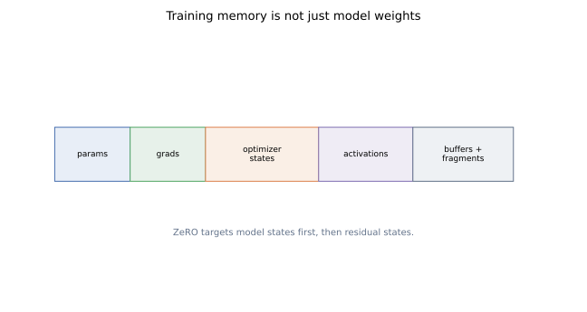
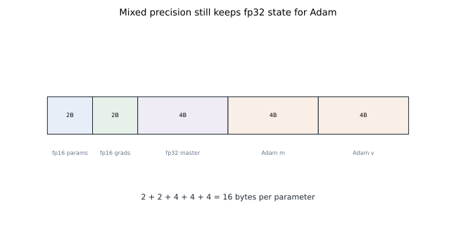
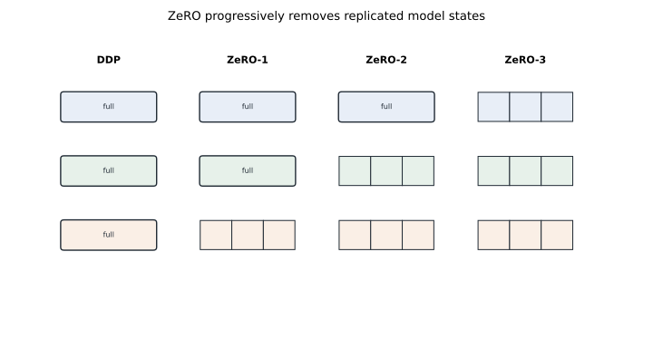
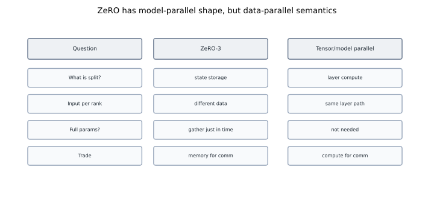
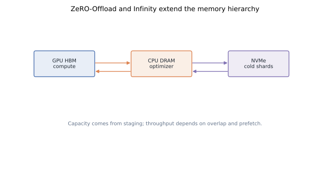

# ZeRO: Partitioning Optimizer State, Gradients, and Parameters

Plain data parallelism is communication-efficient enough to be useful, but memory-wasteful enough to break at large model sizes. Every rank stores the same parameters, gradients, and optimizer state. For Adam, the optimizer state alone can be several times larger than the model weights used in forward.

ZeRO, short for Zero Redundancy Optimizer, keeps the data-parallel training semantics but partitions redundant state across ranks. The idea is direct: if every rank does not need every byte at the same time, stop storing every byte everywhere.

## TL;DR

- Training memory splits into **model states** (parameters, gradients, optimizer state) and **residual states** (activations, temporary buffers, fragmentation).
- Mixed precision does not remove fp32 state. With Adam plus fp16/bf16 compute, static model-state memory is roughly `16 * Psi` bytes for `Psi` parameters before activations.
- ZeRO-1 partitions optimizer state. ZeRO-2 partitions optimizer state and gradients. ZeRO-3 partitions optimizer state, gradients, and parameters.
- ZeRO has model-parallel shape but data-parallel semantics: each rank processes different data, and parameters are gathered only when needed.
- Communication cost rises because shards must be reduced, gathered, or prefetched. The trade is often favorable because memory is the hard limit.
- ZeRO-R extends the idea to residual states: partitioned activation checkpointing, constant-size buffers, and memory defragmentation.
- ZeRO-Offload and ZeRO-Infinity add CPU DRAM and NVMe to the memory hierarchy, relying on overlap and prefetching to keep GPUs busy.
- Reproducible figures for this post: [`playground/llm_training_series_figures.py`](https://github.com/duoan/duoan.github.io/blob/main/playground/llm_training_series_figures.py).

## 1. Memory Taxonomy

Before optimizing memory, name what is consuming it.



**Model states** are tied directly to the parameters:

- Parameters used by forward and backward.
- Gradients produced by backward.
- Optimizer state such as Adam's first and second moments.
- Often fp32 master parameters for mixed precision.

**Residual states** are produced by the training process:

- Activations needed for backward.
- Temporary communication buffers.
- Workspaces used by kernels and libraries.
- Fragmented memory that is technically free but not usable as one contiguous block.

ZeRO first targets model states because they scale directly with parameter count and are heavily redundant in data parallelism. Activation techniques matter too, but the cleanest first win is to stop replicating Adam state everywhere.

## 2. Mixed Precision Memory Math

Let `Psi` be the number of parameters. In mixed precision training with Adam, a common memory layout is:

- fp16/bf16 parameters for forward/backward: `2 * Psi` bytes.
- fp16/bf16 gradients: `2 * Psi` bytes.
- fp32 master parameters: `4 * Psi` bytes.
- Adam first moment: `4 * Psi` bytes.
- Adam second moment: `4 * Psi` bytes.

That totals:

```text
2 Psi + 2 Psi + 4 Psi + 4 Psi + 4 Psi = 16 Psi bytes
```



This estimate excludes activations. It also excludes temporary buffers and fragmentation. For a 10B parameter model, `16 * Psi` is about 160 GB of model-state memory. Plain DDP puts that on every data-parallel rank.

The exact number varies with optimizer and implementation. SGD has less state. Adafactor can reduce state. bf16 may avoid loss scaling complexity. But the shape remains: optimizer state dominates, and ordinary data parallelism duplicates it.

## 3. The ZeRO Principle

The key observation is that not every model state is needed everywhere at every moment.

During forward for a layer, a rank needs that layer's parameters. It does not need all optimizer moments. During gradient reduction, a rank needs to contribute gradients, but it does not need to keep the complete reduced gradient forever. During the optimizer step, a rank only needs the optimizer state for the parameters it updates.

ZeRO partitions state across the data-parallel group:

```text
rank 0 owns shard 0
rank 1 owns shard 1
...
rank N-1 owns shard N-1
```

When a full tensor is needed, ranks communicate. When it is no longer needed, non-owned pieces can be released. ZeRO trades bandwidth and scheduling complexity for memory capacity.



## 4. ZeRO-1: Partition Optimizer State

ZeRO-1 partitions optimizer state across data-parallel ranks. Each rank still keeps:

- Full fp16/bf16 parameters.
- Full gradients, or at least full gradient buckets during reduction.
- Only `1/N` of optimizer state.

After backward, gradients are reduced. Each rank updates the parameter shard for which it owns optimizer state. Updated parameter shards are then gathered so every rank once again has a full parameter replica for the next forward pass.

The memory reduction can be large because Adam state is large. In the 16 bytes-per-parameter estimate, optimizer-related fp32 state accounts for 12 bytes if master weights are grouped with optimizer state. Partitioning that over `N` ranks changes the largest block from replicated to sharded.

Communication can be described in two ways:

- In the conceptual ZeRO paper accounting, ZeRO-1 may be shown with a full gradient all-reduce plus parameter all-gather.
- In practical implementations, a reduce-scatter of gradients followed by an all-gather of updated parameters can avoid materializing unnecessary full gradients.

The important point is the trade: ZeRO-1 is a memory win with modest communication changes, and it preserves familiar data-parallel execution.

## 5. ZeRO-2: Partition Gradients Too

ZeRO-2 partitions optimizer state and gradients. Each rank still has full parameters during forward/backward, but after backward it keeps only the reduced gradient shard it owns.

The gradient communication naturally becomes reduce-scatter:

```text
local gradients on all ranks
    -> reduce-scatter
reduced gradient shard per rank
    -> local optimizer update for owned shard
    -> all-gather updated parameter shards
```

This removes another large replicated tensor. For Adam mixed precision, ZeRO-2 often brings model-state memory down enough to train models that plain DDP cannot fit, while keeping communication close to the baseline all-reduce volume.

Why close to baseline? A ring all-reduce is reduce-scatter plus all-gather. ZeRO-2 uses reduce-scatter for gradients and all-gather for updated parameters. The shape is familiar; the placement of materialized tensors changes.

## 6. ZeRO-3: Partition Parameters

ZeRO-3 partitions optimizer state, gradients, and parameters. No rank permanently stores a full parameter replica.

During execution:

1. Before a layer's forward, ranks all-gather that layer's parameter shards.
2. The layer computes using the full parameter for that layer.
3. Non-owned parameter shards can be released after use.
4. Backward gathers parameters again as needed.
5. Gradients are reduce-scattered to owning ranks.
6. Each rank updates only its own parameter shard.

This is the most aggressive memory reduction. It is also the most communication-sensitive. A naive ZeRO-3 implementation can drown in small gathers. A good implementation prefetches upcoming parameters, overlaps communication with compute, and uses bucketed transfers.

ZeRO-3 is especially powerful because it breaks the "full model replica per data-parallel rank" assumption. But it does not turn the computation into tensor parallelism. Each rank still processes a different data shard and computes the same layer once the needed parameters are gathered.

## 7. ZeRO vs Model Parallelism

The distinction matters for mental models and performance debugging.



In tensor or model parallelism, ranks split the layer computation itself. A rank owns a slice of a matrix multiply, attention head, or layer stack. The input activations are routed through a distributed computation graph.

In ZeRO-3, ranks split persistent storage. When a layer executes, the needed full parameter is reconstructed, used, and then discarded. The data-parallel contract remains: each rank has different examples and contributes gradients to a shared update.

This is why ZeRO combines naturally with tensor parallelism. Tensor parallelism reduces per-rank compute and parameter size within a layer; ZeRO reduces redundant model-state storage across data-parallel replicas.

## 8. Communication Costs and Overlap

ZeRO's communication cost depends on stage and implementation:

- ZeRO-1 communicates gradients and updated parameter shards.
- ZeRO-2 uses gradient reduce-scatter and parameter all-gather.
- ZeRO-3 adds parameter all-gathers around forward and backward.

The raw byte count is only part of the story. Performance depends on whether communication is overlapped with useful compute.

Good ZeRO implementations rely on:

- **Bucketing**: group many small tensors into large transfers.
- **Prefetching**: gather parameters for upcoming layers before they are needed.
- **Release discipline**: free non-owned shards as soon as their lifetime ends.
- **Topology-aware process groups**: avoid slow links where possible.
- **Gradient accumulation**: amortize synchronization over multiple micro-steps when memory allows.

When overlap works, the visible cost of extra communication is much smaller than the byte count suggests. When overlap fails, ZeRO-3 can look like a sequence of tiny blocking all-gathers.

## 9. ZeRO-R: Residual State Optimizations

The original ZeRO work also discusses residual states under the ZeRO-R umbrella.

**Partitioned activation checkpointing** shards activation checkpoints across model-parallel ranks and gathers them when needed for recomputation. This is useful when activation memory rivals or exceeds parameter memory, especially for long sequences.

**Constant-size buffers** control temporary communication memory. As the number of ranks grows, individual shards get smaller. Tiny messages waste bandwidth, so implementations accumulate data into buffers of predictable size before communicating.

**Memory defragmentation** addresses allocator reality. A job can fail allocation even when total free memory looks sufficient, because the requested block needs contiguous space. Defragmentation and careful buffer reuse reduce this failure mode.

These techniques are less famous than ZeRO-1/2/3, but they matter in large jobs. Once model states are sharded, activations and buffers often become the next bottleneck.

## 10. Offload and Infinity

ZeRO-Offload and ZeRO-Infinity extend the same principle beyond GPU HBM.



The memory hierarchy becomes:

```text
GPU HBM  -> fastest, smallest, used for compute-critical tensors
CPU DRAM -> larger, slower, useful for optimizer state and staging
NVMe     -> much larger, much slower, useful with prefetch and streaming
```

ZeRO-Offload moves optimizer computation and state to CPU for some configurations. ZeRO-Infinity generalizes offload with a runtime that can stage parameter, gradient, and optimizer shards across GPU, CPU, and NVMe.

The engineering challenge is overlap. If a GPU waits on PCIe or NVMe for every layer, the memory win is not useful. The runtime must prefetch enough data ahead, evict cold shards, and keep transfers large. Offload is not a magic capacity button; it is a scheduling system.

## 11. Practical Guidance

Use the lowest ZeRO stage that solves the memory problem:

- Start with DDP or ZeRO-1 if the model mostly fits and optimizer state is the issue.
- Use ZeRO-2 when gradients are a major memory consumer and you want a strong default for dense training.
- Use ZeRO-3 when full parameters cannot remain resident or when model scale forces it.
- Add activation checkpointing independently; ZeRO does not remove activation memory by itself.
- Consider offload when HBM is the blocker and the throughput target can tolerate careful staging.

The failure mode is choosing the most aggressive stage by default. ZeRO-3 can unlock capacity, but it also adds more places for communication, prefetching, and checkpointing to go wrong. The best system is the simplest one that fits and keeps GPUs busy.

## References

- Samyam Rajbhandari et al., [*ZeRO: Memory Optimizations Toward Training Trillion Parameter Models*](https://arxiv.org/abs/1910.02054), SC 2020.
- Jie Ren et al., [*ZeRO-Offload: Democratizing Billion-Scale Model Training*](https://arxiv.org/abs/2101.06840), USENIX ATC 2021.
- Samyam Rajbhandari et al., [*ZeRO-Infinity: Breaking the GPU Memory Wall for Extreme Scale Deep Learning*](https://arxiv.org/abs/2104.07857), SC 2021.
- Yanping Huang et al., [*GPipe: Efficient Training of Giant Neural Networks using Pipeline Parallelism*](https://arxiv.org/abs/1811.06965), NeurIPS 2019.
