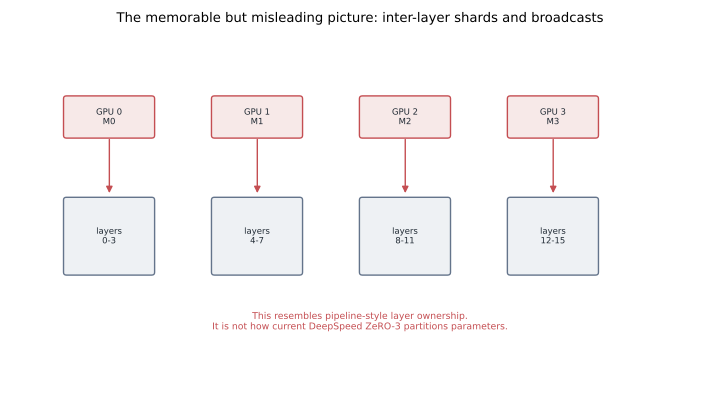
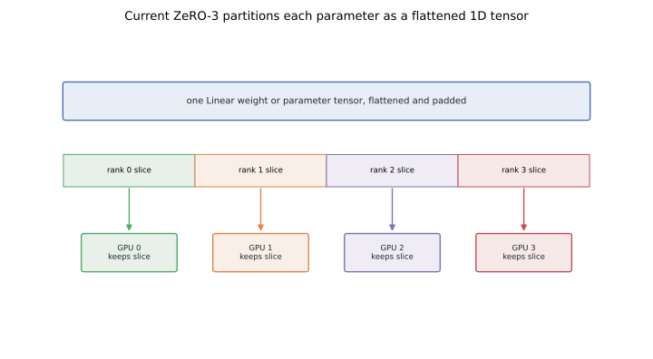
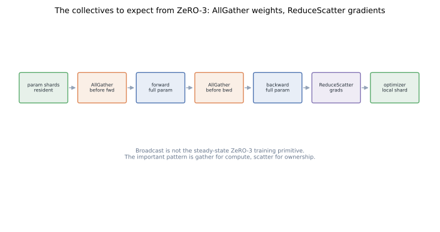

# The ZeRO-3 Diagram Most People Remember Is Wrong

Many engineers first learned ZeRO-3 from an animation that looked like pipeline parallelism.
One GPU owned early layers, another GPU owned later layers, and the active layer block appeared to be broadcast to all other GPUs when needed.
That picture is memorable.
It is also not the right mental model for current DeepSpeed ZeRO-3 training.

The current steady-state model is intra-layer partitioning.
Each parameter is flattened, padded if necessary, and split across data-parallel ranks.
Before forward or backward compute needs that parameter, ranks AllGather the full parameter.
After gradients are produced, ranks ReduceScatter gradients back to the owning shards.

This post is a correction, not a complaint.
The wrong diagram spread because early explanations, papers, videos, and later code evolution did not line up cleanly.
If you are debugging ZeRO-3 today, the collectives to expect are AllGather and ReduceScatter, not layer-wise broadcasts.

For background on ZeRO stages, see [Zero Redundancy Optimizer](../zero-redundancy-optimizer/).
For contrast with computation-splitting model parallelism, see [Megatron tensor parallelism](../tensor-parallelism-megatron/).

## TL;DR

- The popular ZeRO-3 animation suggests an inter-layer partition: rank `0` owns some layers, rank `1` owns other layers, and layers are broadcast when needed.
- Current DeepSpeed ZeRO-3 partitions parameters intra-layer as flattened 1D tensor shards across ranks.
- Forward compute AllGathers the full parameter for the module that is about to run.
- Backward compute AllGathers the full parameter again when gradient computation needs it.
- Parameter gradients are ReduceScattered so each rank receives the gradient shard matching its parameter shard.
- ZeRO-3 has model-parallel storage shape but data-parallel training semantics.
- The misconception spread because early material was produced before or during implementation evolution, while the code later settled on a different operational pattern.
- Reproducible figures for this post: [`playground/llm_training_series_figures.py`](https://github.com/duoan/duoan.github.io/blob/main/playground/llm_training_series_figures.py).

## 1. The Diagram People Remember

The memorable diagram looks roughly like this.
Suppose a model has sixteen layers and four GPUs.
GPU `0` owns layers `0-3`.
GPU `1` owns layers `4-7`.
GPU `2` owns layers `8-11`.
GPU `3` owns layers `12-15`.
When the forward pass reaches a layer group, the owner broadcasts that group to the other ranks.



That picture resembles pipeline parallelism without the pipeline schedule.
It is natural to remember because layers are intuitive objects.
Humans think in layers.
Animations also look cleaner when each GPU owns a neat stack of layers.

But this picture leads to wrong expectations.
You would expect communication to be layer-group broadcast.
You might expect ownership to align with module boundaries.
You might expect memory pressure to depend on which layers a rank owns.
Those expectations do not match current DeepSpeed ZeRO-3 behavior.

## 2. The Actual Parameter Partition

Current ZeRO-3 treats each parameter tensor as something that can be flattened and partitioned.
For a linear layer weight, the process is conceptually:

1. take the parameter tensor,
2. flatten it into a 1D buffer,
3. pad it if the element count does not divide evenly across the data-parallel group,
4. assign each rank a contiguous slice,
5. free or mark non-owned slices as not resident between compute regions.



This is intra-layer partitioning.
Every rank owns a slice of every large parameter, not an exclusive set of layers.
The slice may cut across rows, columns, or arbitrary positions in the flattened tensor.
It is not tensor parallelism because the computation is not rewritten to operate permanently on those slices.
It is state partitioning.

That distinction is the heart of ZeRO-3.
Storage is sharded.
Compute is mostly performed as if each rank temporarily has the full parameter.

## 3. The Collectives You Should Expect

For each parameter needed by a module, ZeRO-3 gathers the full parameter before compute.
During forward, that AllGather makes the module's parameter available.
During backward, the parameter may be gathered again because gradient computation needs the same full tensor.
After gradients are computed, ZeRO-3 ReduceScatters or otherwise partitions gradients back to the owning ranks.



The steady-state training loop is therefore closer to:

```text
resident: parameter shards
forward:  AllGather parameter -> compute -> release or keep briefly
backward: AllGather parameter -> compute gradients -> ReduceScatter gradients
update:   optimizer updates local shard
```

This is not the same as:

```text
rank owns layers -> broadcast layer group -> compute everywhere
```

Broadcast can appear in initialization or other auxiliary paths.
The important steady-state training pattern is gather for full-parameter compute and scatter for shard ownership.

## 4. Why This Is Still ZeRO, Not Tensor Parallelism

ZeRO-3 often confuses people because it has a model-parallel storage shape.
At rest, no rank has the full model state.
That looks like model parallelism.

But the semantics are data-parallel.
Each rank processes a different data shard.
When a module runs, it reconstructs the parameter needed for that module.
The module computation is not split the way Megatron tensor parallelism splits a matrix multiplication.

Compare the two:

- Tensor parallelism changes the computation graph so each rank computes a slice of a layer.
- ZeRO-3 changes state residency so each rank stores only a slice between compute regions.
- Tensor parallelism requires model code or parallel layers that understand the split.
- ZeRO-3 aims to wrap ordinary modules by gathering parameters just in time.

This is why ZeRO-3 pairs naturally with other parallel dimensions.
You can use ZeRO-3 for model-state memory while using [Ulysses](../sequence-parallelism-ulysses/) or [Megatron Context Parallel](../megatron-context-parallel/) for long-sequence activations.
The ownership questions are different.

## 5. Why the Wrong Mental Model Spread

There are three reasons the older picture persisted.

First, early ZeRO material emphasized the idea of partitioning model states, and layer-wise diagrams were easy to understand.
They communicated "the whole model is no longer replicated" very effectively.

Second, some public explanations were produced close to the time when ZeRO-3 was still evolving.
The implementation details that matter today were not always reflected in early diagrams.

Third, later readers reused the memorable picture because it made intuitive sense.
Layer ownership is easier to draw than flattened parameter shards, gather lifetimes, and release hooks.
As a result, a diagram that was useful pedagogically became a misleading operational model.

The lesson is not that diagrams are bad.
The lesson is that storage ownership and compute ownership must be shown separately.
When a system shards storage but reconstructs tensors for compute, a layer-placement diagram hides the most important behavior.

## 6. How to Read ZeRO-3 Traces

If your mental model is inter-layer broadcast, a real ZeRO-3 trace looks surprising.
You may see many parameter AllGathers around module execution.
You may see parameter prefetching for upcoming modules.
You may see parameters released after use.
You may see gradient ReduceScatter during backward.

Those are expected.
The trace is not showing a broken implementation of the layer-broadcast diagram.
It is showing a different design.

When debugging memory, ask:

- Which parameter shards are resident at rest?
- Which full parameters are currently gathered for compute?
- Are prefetched parameters overlapping with the current module?
- Are old full parameters released soon enough?
- Are gradients reduced back to shards instead of accumulating full copies?

These questions are more useful than asking which rank owns which layer group.

## 7. Memory Implications

ZeRO-3 targets model states: parameters, gradients, and optimizer states.
It reduces the persistent memory footprint by partitioning those states across ranks.
With Adam and mixed precision, optimizer state is often the largest static piece.
Partitioning it matters.

But ZeRO-3 does not automatically make every activation fit.
If a single layer's activation memory exceeds a GPU's capacity, adding ZeRO-3 ranks may not fix the problem.
That is where tensor parallelism, sequence parallelism, context parallelism, activation checkpointing, or kernel-level attention optimizations enter.

This is a common source of disappointment.
ZeRO-3 makes the model states smaller per rank.
It does not turn every large compute tensor into a sharded compute tensor.

For long-context training, pair the mental models:

- ZeRO-3: shard model-state storage.
- Megatron SP: shard sequence-local activation storage around TP regions.
- Ulysses: transpose sequence shards into head shards for attention.
- Ring Attention or CP: stream K/V blocks so a full context does not sit on one rank.

Each one attacks a different memory term.

## 8. Communication Implications

The corrected model also changes communication expectations.
AllGather cost scales with parameter size and the timing of module execution.
ReduceScatter cost scales with gradient size.
Prefetch and overlap determine how much of that cost is visible.

If you expected broadcasts of layer groups, you may tune the wrong thing.
For current ZeRO-3, focus on:

- parameter bucket sizes,
- prefetch distance,
- persistence thresholds,
- overlap of communication with forward or backward compute,
- release timing for gathered parameters,
- interaction with activation checkpointing.

The communication is not free.
ZeRO-3 buys memory by increasing parameter communication.
That trade can be excellent when the alternative is not fitting the model at all.
It can be poor for small models or slow interconnects.

## 9. The Practical Takeaway

If you only need a slogan, use this one:

```text
ZeRO-3 shards storage inside layers; it does not assign whole layers to ranks.
```

That slogan prevents three common mistakes.
It keeps ZeRO-3 distinct from pipeline parallelism.
It keeps ZeRO-3 distinct from tensor parallelism.
It makes AllGather and ReduceScatter feel expected rather than surprising.

Once that is clear, ZeRO-3 becomes easier to combine with the rest of the LLM training toolbox.
Use it to reduce persistent model-state memory.
Use tensor, sequence, or context parallelism when the compute tensors themselves need to be partitioned.
Use profiling to decide whether the extra gathers and scatters are hidden well enough by real compute.

The memorable layer-broadcast diagram did its job as an introduction.
For engineering work, replace it with intra-layer 1D partitioning and the AG/RS timeline.

## References

- Rajbhandari et al., [ZeRO: Memory Optimizations Toward Training Trillion Parameter Models](https://arxiv.org/abs/1910.02054), 2020.
- Rajbhandari et al., [ZeRO-Infinity: Breaking the GPU Memory Wall for Extreme Scale Deep Learning](https://arxiv.org/abs/2104.07857), 2021.
- DeepSpeed runtime code and documentation for ZeRO-3 parameter partitioning, prefetch, and gradient partitioning.
